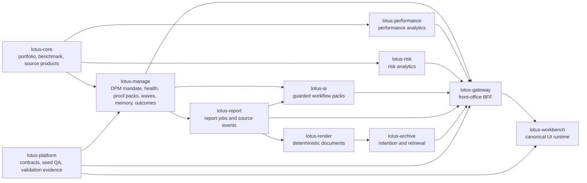
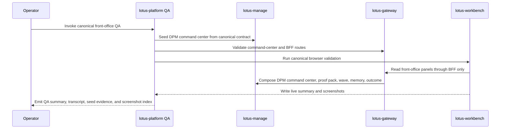

# Canonical DPM Demo Story

## Purpose

This page defines the implementation-backed demo story for the canonical discretionary portfolio
management stack. It is written for sales, pre-sales, client demos, business users, operations, and
engineering. It is not a target-state brochure: every supported claim below is tied to the governed
canonical portfolio, platform contracts, Workbench panel registry, runtime validation, and owning
application evidence.

Use this page when preparing a demo around `PB_SG_GLOBAL_BAL_001` or when explaining what the
current Lotus front-office stack can truthfully show.

## Canonical Identity

| Field | Governed value |
| --- | --- |
| Portfolio | `PB_SG_GLOBAL_BAL_001` |
| Portfolio display name | Private Banking Singapore Global Balanced |
| Booking center | Singapore |
| Base currency | USD |
| Benchmark | `BMK_PB_GLOBAL_BALANCED_60_40` |
| DPM mandate | `MANDATE_PB_SG_GLOBAL_BAL_001` |
| Portfolio manager | `PM_SG_DPM_001` |
| PM book | `BOOK_SG_BALANCED_DPM` |
| Model portfolio | `MODEL_PB_SG_GLOBAL_BAL_DPM` |
| Policy pack | `POLICY_DPM_SG_BALANCED_V1` |
| DPM command-center as-of date | `2026-05-03` |
| RFC-0041 multi-portfolio wave scenario | `RFC41_MULTI_PORTFOLIO_EXPLICIT_LIST_CANONICAL` |

Source of truth:

- `context/contracts/canonical-front-office-demo-data-contract.json`
- `context/contracts/canonical-front-office-demo-data-invariants.json`
- `context/contracts/workbench-panel-registry.json`

## Business Story

The demo presents Lotus as a governed private-banking operating system for discretionary portfolio
management:

1. A portfolio manager opens a canonical Singapore global balanced mandate.
2. The command center shows mandate health, attention posture, source readiness, and recommended
   follow-up without hiding degraded or empty states.
3. The PM reviews portfolio memory to see the decision trail across mandate health, monitoring,
   proof packs, rebalance waves, internal handoffs, outcome reviews, report lineage, and AI
   workflow evidence where implemented.
4. Construction, proof-pack, wave, report, archive, and AI surfaces are presented as governed
   product capabilities only when their owning repositories have merged implementation proof.
5. Unsupported areas remain explicit: external OMS execution, PM scoring, client-communication
   events, richer source-owner methodology depth, and unimplemented degraded/blocked command-center
   seed fixtures are not demo claims.

## Current Supported Demo Capabilities

| Capability | Current implementation-backed claim | Primary owner | Demo proof anchor |
| --- | --- | --- | --- |
| Canonical portfolio seed | Governed portfolio identity, benchmark, holdings, transactions, reference data, derived state, and DPM mandate seed are contract-backed. | `lotus-core`, `lotus-manage`, `lotus-platform` | RFC-0076 contracts and canonical QA summary |
| DPM command center | Populated ready command-center state is seeded, validated through Manage and Gateway, and rendered by Workbench. Partial and empty posture checks are covered; degraded and blocked fixtures remain future source-owner scope. | `lotus-manage`, `lotus-gateway`, `lotus-workbench`, `lotus-platform` | `dpm-command-center-live.png`, seed summary, panel registry |
| Construction alternatives | Manage owns alternative generation/read/selection; Gateway and Workbench render the first-wave construction lab without local optimization. | `lotus-manage`, `lotus-gateway`, `lotus-workbench` | Workbench construction proof and manage supported-feature truth |
| Proof-pack review | Manage owns proof-pack evidence; Gateway composes it; Workbench renders identity, sections, source hashes, report posture, and AI evidence posture without browser-side synthesis. | `lotus-manage`, `lotus-gateway`, `lotus-workbench` | `dpm-proof-pack-live.png` |
| Rebalance waves | Explicit portfolio-list waves now include governed single-portfolio and multi-portfolio preview proof. First-wave PM-book/CIO model-change source-owned cohort foundations are implementation-backed; broader source-owner cohort depth remains separate product scope. Workbench renders Gateway/manage wave truth, including source-owned selection-basis evidence when the canonical campaign seed supplies it. | `lotus-manage`, `lotus-core`, `lotus-gateway`, `lotus-workbench`, `lotus-platform` | `dpm-wave-command-center-live.png`, RFC-0041 multi-portfolio preview evidence |
| Portfolio memory | Manage/Gateway/Workbench first-wave timeline is implementation-backed; report and AI source-event families are partially implemented in owning apps. | `lotus-manage`, `lotus-report`, `lotus-ai`, `lotus-gateway`, `lotus-workbench` | `dpm-portfolio-memory-live.png` |
| Outcome review | Manage outcome authority, Gateway composition, Workbench product surface, report/archive materialization, and governed AI narrative request are implemented for first-wave scope. | `lotus-manage`, `lotus-report`, `lotus-render`, `lotus-archive`, `lotus-ai`, `lotus-gateway`, `lotus-workbench` | `dpm-outcome-review-live.png` |
| Performance and risk panels | Portfolio performance, contribution, selected attribution, risk summary, drawdown, concentration, rolling risk, and historical attribution render from owning analytics surfaces with supportability truth. | `lotus-performance`, `lotus-risk`, `lotus-gateway`, `lotus-workbench` | performance and risk live screenshots |
| Advisory proposal, policy, and cockpit evidence | RFC-0023 advisor-review narrative, RFC-0024 advisor-use memo evidence, RFC-0025 suitability policy review, and RFC-0026 `advisory.advisor_cockpit` proof use governed canonical advisory scenarios, including `RFC26_ADVISOR_COCKPIT_POLICY_ACTION_CANONICAL`. The policy leg creates a Singapore structured-note `PENDING_REVIEW` evaluation through Gateway and proves queue, workflow, sign-off package, blocked client-ready posture, and bounded request-more-evidence behavior before advisory screenshots are accepted. The cockpit leg proves source-owned action list, snapshot, supportability, and idempotent acknowledgement without clearing blockers or claiming client-ready release. | `lotus-advise`, `lotus-gateway`, `lotus-workbench`, `lotus-platform` | `proposal-narrative-posture-live.png`, `proposal-memo-evidence-pack-live.png`, `advisory-suitability-review-live.png`, `advisory-advisor-cockpit-live.png`, `POLICY_EVALUATION_PENDING_REVIEW_CREATED`, `ADVISOR_COCKPIT_ACTION_ACKNOWLEDGED` |
| Reports, render, and archive | Proof-pack, wave, and outcome report flows are materialized by report/render/archive owners from bounded DPM report input contracts. | `lotus-report`, `lotus-render`, `lotus-archive` | owning PR evidence and wiki truth |
| Governed AI assistance | PM memo, wave memo, and outcome narrative workflows are owned by `lotus-ai`; Workbench and Gateway expose guarded request posture without prompt construction. | `lotus-ai`, `lotus-gateway`, `lotus-workbench` | owning AI PR evidence and Workbench action proof |

## Non-Functional Demo Capabilities

| Non-functional area | Current support posture |
| --- | --- |
| Source authority | Domain facts stay with owning services. Gateway and Workbench compose and present truth without recomputing source-owned methods. |
| Supportability | Panels expose ready, partial, empty, loading, error, degraded, or blocked posture according to the registry and owning-service response. |
| Evidence and lineage | Demo surfaces carry source refs, content hashes, artifact refs, report refs, AI refs, or reason codes where implemented by the owner. |
| Redaction and data boundaries | Demo documentation must not expose raw prompts, generated AI output, raw source payloads, or client-confidential identifiers beyond the canonical fixture. |
| Runtime proof | Demo-ready screenshots are valid only after canonical API, calculation, panel, and browser validation pass. |
| Operations | Platform QA writes summaries, transcripts, seed evidence, source-backed DPM campaign definition/discovery posture, source-owned selection-basis evidence, screenshot paths, and contract provenance under `output/front-office-qa/`. |
| Governance | Wiki truth is authored in repo-local `wiki/`, checked before merge, and published only after merge to `main`. |

## Integration Flow



## Demo Flow



## Demo Preparation Checklist

1. Confirm all participating repositories are on the intended branch or `main` for the demo.
2. Run the platform canonical front-office QA wrapper:

   ```powershell
   powershell -ExecutionPolicy Bypass -File automation\Invoke-Canonical-FrontOffice-QA.ps1 -BringUp -LotusAiEnvFile .env.example -SeedWaitSeconds 1200
   ```

3. Use `-ScreenshotDirectory <path>` when a caller-directed screenshot pack is required.
4. Confirm the QA summary references:
   - `canonical-front-office-demo-data-contract`
   - `PB_SG_GLOBAL_BAL_001`
   - `dpm.command_center`
   - `dpm.portfolio_memory`
   - `dpm.proof_pack`
   - `dpm.wave_command_center`
   - `dpm.outcome_review`
5. Use screenshots only after validation passes.
6. Keep any diagnostic pre-validation screenshots separate and named with a `diagnostic-` prefix.

## Audience Notes

| Audience | What to emphasize | What to avoid |
| --- | --- | --- |
| Business users | PM workflow, attention queue, evidence trail, report and AI assistance posture. | Deep implementation details or unsupported execution claims. |
| Operations | Runtime proof, seed provenance, validation summary, supportability states, failure categories, and escalation owner. | Manual wiki edits outside repo source. |
| Engineering | Contract files, panel registry, source-owner boundaries, route ownership, tests, and PR evidence. | Local UI synthesis of source-owned facts. |
| Sales and pre-sales | Bank operating model value: governed evidence, transparent supportability, integrated workflow, and demo-ready canonical proof. | Market-size statistics, pricing claims, competitor assertions, or claims not backed by merged implementation. |
| Client demos | Current supported flow and explicit roadmap boundaries. | PM scoring, external OMS execution, client-communication event lineage, or automated investment decisions. |

## Known Boundaries

The current demo must not claim:

1. external OMS execution or acknowledgements,
2. PM quality scoring or behavioral analytics,
3. client-communication source-event lineage,
4. unimplemented degraded or blocked command-center seed fixtures,
5. local Workbench recomputation of manage, risk, performance, report, archive, or AI truth,
6. autonomous AI decisioning, AI-generated investment decisions, autonomous advice, or raw
   prompt/output exposure,
7. unsupported source-owner methodology depth beyond the owning apps' merged contracts.

## Evidence Links

| Evidence | Path |
| --- | --- |
| Canonical data contract | `context/contracts/canonical-front-office-demo-data-contract.json` |
| Canonical invariants contract | `context/contracts/canonical-front-office-demo-data-invariants.json` |
| Workbench panel registry | `context/contracts/workbench-panel-registry.json` |
| Platform QA wrapper | `automation/Invoke-Canonical-FrontOffice-QA.ps1` |
| DPM seed automation | `automation/Invoke-DpmCommandCenterSeed.ps1` |
| Runtime output root | `output/front-office-qa/` |
| Workbench validation output | `lotus-workbench/output/playwright/live-canonical/` |
| Platform wiki landing page | `wiki/Canonical-DPM-Demo-Story.md` |
