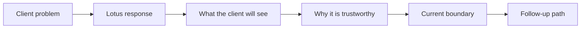

# Lotus Client Demo Brief Template

Use this template when preparing a client-facing Lotus demo pack. It turns internal certification
evidence into a concise business brief that helps clients understand what Lotus is doing, why it
matters, which controls are visible, and which claims are implementation-backed today.

This template is governed by the
[Lotus Client Demo Certification Standard](../standards/Lotus%20Client%20Demo%20Certification%20Standard.md)
and the [Lotus Client Demo Operating Process](client-demo-operating-process.md). Use
[Lotus Client Demo Pack Template](client-demo-pack-template.md) when the one-page brief needs to
sit inside a complete claim, evidence, boundary, rehearsal, and follow-up pack. Do not use either
artifact to promote planned, diagnostic, or unsupported functionality as current product capability.

## Brief Flow

## One-Page Brief

| Section | Client-facing content | Evidence anchor |
| --- | --- | --- |
| Client problem | Describe the private-banking workflow, decision risk, operating friction, or control weakness the session addresses. | Intake note, buying question, audience profile. |
| Lotus response | Explain the current Lotus capability in business language: portfolio data, mandate oversight, risk, performance, advisory, reporting, archive, data mesh, or AI-assisted workflow. | Owning app, supported-feature entry, capability registry, or certified demo scope. |
| What the client will see | List the exact sequence of screens, APIs, reports, workflows, dashboards, or evidence packs. | Demo sequence, screenshot pack, Workbench panel registry, or runbook. |
| Why it is trustworthy | State how the demo is tied to deterministic data, real APIs, expected-value checks, observability, and reviewed evidence. | Command, run ID, evidence manifest, data contract, invariant contract, logs, screenshots. |
| Current boundary | Separate implementation-backed capability from bounded preview, roadmap, diagnostic-only, and unsupported items. | Claim-state table and visible "do not claim" list. |
| Follow-up path | Name owners for commercial, product, engineering, operations, security, and marketing follow-up. | Follow-up register, issue, RFC, or account-team action log. |

## Client-Safe Lotus Explanation

Use this short explanation when opening a client conversation:

> Lotus connects private-banking workflows across portfolio data, mandate oversight, performance,
> risk, advisory review, reporting, archive, and governed AI assistance. Each capability keeps its
> domain facts with the owning service, publishes evidence for supported claims, and presents the
> workflow through a governed Workbench and Gateway. The demo shows the business workflow, the
> implementation evidence behind it, and the current boundaries without hiding lineage, controls, or
> supportability posture.

## Claim Table

Every brief should include a short claim table. Keep it business-readable, but preserve the owner
and proof anchor so engineering, operations, and security can answer detailed questions.

| Claim | State | Owner | Proof anchor | Client wording |
| --- | --- | --- | --- | --- |
| Example: governed front-office portfolio review | Implementation-backed | `lotus-workbench`, `lotus-gateway`, source services | Canonical QA run, screenshot pack, data contract | "The review uses validated portfolio, performance, and risk data through the governed Workbench path." |
| Example: AI-assisted opportunity explanation | Bounded preview | `lotus-idea`, `lotus-ai` | RFC proof, lineage store proof, runtime boundary | "The explanation layer is governed and evidence-aware; live AI runtime execution is shown only when certified for this demo scope." |

## Do Not Include

Do not include:

1. real client data, account data, secrets, credentials, raw prompts, raw AI output, or raw source
   payloads,
2. internal ticket history, stack traces, unredacted logs, or CI log dumps,
3. screenshots captured before API, calculation, panel, and browser validation pass,
4. unsupported autonomy, execution, client-publication, or source-completeness claims,
5. market, competitor, or adoption statistics that have not been freshly verified for the demo
   date.

## Acceptance Checklist

| Check | Pass condition |
| --- | --- |
| Business clarity | A non-technical client can explain what Lotus is doing and why it matters. |
| Claim discipline | Every claim is classified as implementation-backed, bounded preview, planned, diagnostic, or unsupported. |
| Evidence tie-out | Every implementation-backed claim links to an owner, command, run ID, and evidence artifact. |
| Data safety | The brief contains only synthetic or approved demo data and no sensitive identifiers. |
| Boundary visibility | The brief has a visible "do not claim" list. |
| Follow-up ownership | Commercial, product, engineering, operations, security, and marketing owners are named. |

If any checklist item fails, the brief remains internal until the source issue is fixed, validation
is rerun where needed, and the brief is updated.

## Related References

- [Lotus Client Demo Certification Standard](../standards/Lotus%20Client%20Demo%20Certification%20Standard.md)
- [Lotus Client Demo Operating Process](client-demo-operating-process.md)
- [Lotus Client Demo Pack Template](client-demo-pack-template.md)
