# Lotus Client Demo Operating Process

## Purpose

This process explains how Lotus prepares and runs client-facing demonstrations so the audience can
understand what Lotus is doing, why the capability matters, and which claims are implementation
backed today.

Use this document with the [Lotus Client Demo Certification Standard](../standards/Lotus%20Client%20Demo%20Certification%20Standard.md).
The standard defines the certification rules. This process defines the operating model for sales,
pre-sales, product, engineering, operations, marketing, and client-facing teams.

## Operating Principle

Every demo must be both client-understandable and evidence-backed.

Lotus should tell a clear private-banking story first, then use implementation evidence to support
the story. The client should understand the business value, the decision workflow, the controls, and
the current boundaries without needing to read internal engineering artifacts.

## Demo Lifecycle

```mermaid
flowchart LR
    Intake[Client context<br/>audience, use case, objective]
    Scope[Demo scope<br/>claims, surfaces, boundaries]
    Certify[Certification<br/>data, APIs, UI, evidence]
    Pack[Demo pack<br/>story, screenshots, proof links]
    Rehearse[Rehearsal<br/>talk track and fallback paths]
    Deliver[Client demo<br/>business story and live proof]
    FollowUp[Follow-up<br/>questions, evidence, next actions]

    Intake --> Scope
    Scope --> Certify
    Certify --> Pack
    Pack --> Rehearse
    Rehearse --> Deliver
    Deliver --> FollowUp
```



## Phase 1: Client And Use-Case Intake

Capture the demo intent before choosing screens or claims.

| Field | Required decision |
| --- | --- |
| Audience | Client executives, investment office, relationship managers, portfolio managers, operations, technology, risk, compliance, or mixed audience. |
| Primary use case | DPM oversight, advisory review, performance and risk explainability, client reporting, data-mesh governance, AI-assisted workflow, or platform operating model. |
| Buying question | What does the client need to believe by the end of the demo? |
| Sensitivity level | External client, internal stakeholder, investor, partner, regulator-facing, or diagnostic only. |
| Time box | Executive walkthrough, full product flow, technical deep dive, or operator runbook review. |

## Phase 2: Scope And Claim Classification

Define exactly what can be shown.

| Claim state | How to present it |
| --- | --- |
| Implementation-backed | Present as current Lotus capability with evidence and owner. |
| Bounded preview | Present as real but limited, with scope and supportability boundaries stated clearly. |
| Planned | Present only as roadmap or direction, never as current product. |
| Diagnostic | Keep out of the client pack. Use only for internal troubleshooting. |
| Unsupported | Do not claim or imply. |

The demo owner must maintain a short "do not claim" list for the session. This list is part of the
demo pack and should be reviewed before rehearsal.

## Phase 3: Certification And Evidence

Run the relevant app-owned or platform-owned certification command before creating a client demo
pack.

For the canonical front-office demo:

```powershell
powershell -ExecutionPolicy Bypass -File automation\Invoke-Canonical-FrontOffice-QA.ps1 -BringUp -LotusAiEnvFile .env.example -SeedWaitSeconds 1200
```

For platform demo-readiness certification:

```powershell
powershell -ExecutionPolicy Bypass -File automation\Invoke-PlatformDemoReadinessCertification.ps1 -ScenarioMode fresh_seed
```

Evidence must prove more than screen availability:

| Evidence | Client-safe meaning |
| --- | --- |
| Demo data contract | The shown portfolio or entity is deterministic and governed. |
| API and calculation proof | The displayed figures come from owning services and expected-value checks. |
| UI validation | The Workbench or app surface renders through the governed product path. |
| Supported-feature truth | The claim is published by the owning app as implemented or bounded preview. |
| Observability | The demo can be supported through correlation IDs, logs, health, and degraded-state signals. |
| Security review | The pack excludes real client data, secrets, raw prompts, raw payloads, and sensitive telemetry. |

## Phase 4: Client Demo Pack

A client demo pack should be concise and polished. It should help non-engineering audiences follow
the story while preserving proof for technical and operational review.

| Section | Purpose |
| --- | --- |
| Audience and objective | States who the session is for and the decision it supports. |
| Business story | Explains the private-banking workflow in client language. |
| Demo sequence | Lists the screens, APIs, reports, or workflows in order. |
| Implementation-backed claims | Maps each claim to owner, status, and evidence anchor. |
| Boundaries | Lists roadmap, unsupported, and diagnostic-only items. |
| Evidence manifest | Links to command, run ID, screenshot pack, and machine-readable proof. |
| Follow-up plan | Captures expected questions, owners, and next actions. |

### One-Page Client Brief Template

Every external demo should include a short client-facing brief before detailed evidence links. The
brief is written for the buying audience, not for internal implementation review.

Use [Lotus Client Demo Brief Template](client-demo-brief-template.md) as the reusable authored
template for the one-page brief. The brief should be concise enough for a client sponsor to read
before the meeting, while retaining proof anchors for technical, operational, security, and
commercial follow-up.

| Brief section | Required content |
| --- | --- |
| Client problem | The private-banking workflow, risk, operational friction, or control weakness the demo addresses. |
| Lotus response | The current Lotus capability being shown, in business language. |
| What the client will see | The exact sequence of screens, reports, workflows, or operating evidence. |
| Why it is trustworthy | The implementation-backed proof anchor: owning apps, data contract, validation run, and evidence pack. |
| Current boundary | Any preview, roadmap, unsupported, or diagnostic-only item that must not be mistaken for current support. |
| Follow-up path | Named owner for commercial, product, engineering, operations, and security questions. |

Use concise, current-state language. Do not include stack traces, raw payloads, internal ticket
history, CI log dumps, raw prompts, raw AI output, sensitive telemetry paths, credentials, or real
client identifiers in the client brief.

### Client-Ready Acceptance Checklist

Before a demo pack is marked client-ready, the demo owner must confirm:

| Acceptance item | Pass condition |
| --- | --- |
| Story clarity | A non-technical client can explain what Lotus is doing and why it matters after the opening narrative. |
| Claim discipline | Every claim is classified as implementation-backed, bounded preview, planned, diagnostic, or unsupported. |
| Evidence tie-out | Each implementation-backed claim links to an owning app, command, run ID, and evidence artifact. |
| Data safety | The pack contains only synthetic or approved demo data and excludes secrets, raw payloads, raw prompts, and sensitive identifiers. |
| Runtime proof | Screenshots or live paths were captured only after the relevant API, calculation, panel, and evidence checks passed. |
| Boundary language | The pack has a visible "do not claim" list for unsupported autonomy, execution, publication, or source-completeness claims. |
| Follow-up ownership | Product, engineering, operations, security, commercial, and marketing follow-ups have named owners. |

If any acceptance item fails, the pack remains internal. Fix the source issue, rerun validation
where needed, and update the pack before sending it to a client or using it in an external session.

## Phase 5: Rehearsal

Before the client session, rehearse the story and the failure paths.

| Rehearsal check | Required outcome |
| --- | --- |
| Talk track | Uses private-banking and enterprise operating-model language, not internal implementation jargon. |
| Evidence links | Open and point to the correct run, screenshots, contracts, and supported-feature truth. |
| Boundary language | Clearly states preview or roadmap scope without weakening the story. |
| Runtime fallback | Defines whether to use live runtime, recorded screenshots, or a prepared narrative if a dependency is unavailable. |
| Q&A owners | Assigns owners for product, engineering, data, security, operations, and commercial follow-up. |

## Phase 6: Client Delivery

During the demo:

1. start with the client business problem,
2. show the governed workflow,
3. call out evidence and controls only when they clarify trust,
4. avoid unsupported autonomy, execution, or data-completeness claims,
5. state bounded-preview items explicitly,
6. capture questions and follow-up evidence requests.

## Phase 7: Follow-Up

After the demo:

| Follow-up item | Owner |
| --- | --- |
| Client questions and objections | Sales or pre-sales owner |
| Product capability gaps | Product owner |
| Evidence requests | Engineering or operations owner |
| Security, data, or compliance questions | Security and governance owner |
| Roadmap commitments | Product and commercial owner |
| Demo defects or weak proof | Owning app engineer, tracked as issue or RFC follow-up |

Any defect discovered during demo preparation should be fixed at source when it affects the claimed
capability. If it is unrelated to the current demo scope, create a durable GitHub issue with the
evidence path and owner.

Follow-up material should stay audience-aware:

1. send clients a concise recap, agreed next actions, and approved evidence references,
2. keep internal validation transcripts, raw logs, and detailed defect analysis out of client
   follow-up unless they have been reviewed and intentionally redacted,
3. convert repeated client questions into improved talk tracks, demo briefs, supported-claim
   language, documentation, or product backlog items,
4. capture new implementation gaps as GitHub issues or RFC follow-ups with repository owner,
   evidence path, severity, and demo impact.

## Client-Friendly Explanation Of Lotus

Use this framing when a client asks what Lotus is doing:

> Lotus connects private-banking workflows across portfolio data, mandate oversight, risk,
> performance, advisory review, reporting, archive, and governed AI assistance. Each product owns
> its domain facts, publishes data and capability evidence, and exposes supportable surfaces through
> a governed Workbench and Gateway. The demo shows how those parts work together without hiding
> data lineage, operational controls, or current implementation boundaries.

## Roles

| Role | Responsibility |
| --- | --- |
| Demo owner | Owns scope, pack, rehearsal, and final claim discipline. |
| Product owner | Confirms business story, roadmap language, and capability boundaries. |
| Engineering owner | Confirms implementation evidence, commands, runtime posture, and technical Q&A. |
| Operations owner | Confirms runbook, observability, degraded states, and escalation. |
| Sales or pre-sales owner | Shapes client narrative, buying question, and follow-up plan. |
| Marketing owner | Reuses only implementation-backed language in external material. |

## Related References

- [Lotus Client Demo Certification Standard](../standards/Lotus%20Client%20Demo%20Certification%20Standard.md)
- [Lotus Client Demo Brief Template](client-demo-brief-template.md)
- [Canonical DPM Demo Story](canonical-dpm-demo-story.md)
- [Lotus Data Mesh Standard](../standards/Lotus%20Data%20Mesh%20Standard.md)
- [Lotus Bank-Buyable Engineering Contract](../../platform-standards/LOTUS_BANK_BUYABLE_ENGINEERING_CONTRACT.md)
