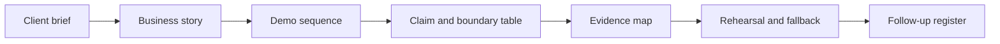

# Lotus Client Demo Pack Template

Use this template when preparing a complete Lotus client-demo pack. The pack translates
implementation evidence into a polished audience-ready story while preserving the proof, owners,
boundaries, and follow-up path needed by sales, pre-sales, business, engineering, operations,
security, marketing, and client stakeholders.

This template complements the [Lotus Client Demo Brief Template](client-demo-brief-template.md).
The brief is the one-page client opener. The pack is the full governed demo artifact.

## Pack Flow

## Client-Safe Opening

Use this framing when a client asks what Lotus is doing:

> Lotus connects private-banking workflows across portfolio data, mandate oversight, performance,
> risk, advisory review, reporting, archive, opportunity intelligence, and governed AI assistance.
> Domain facts stay with the owning Lotus services, while the Workbench and Gateway present a
> governed operating experience with visible evidence, lineage, controls, and current boundaries.

## Pack Sections

| Section | Primary audience | Required content | Evidence anchor |
| --- | --- | --- | --- |
| One-page client brief | Client sponsor, sales, pre-sales | Client problem, Lotus response, what the client will see, why it is trustworthy, current boundary, follow-up path. | `docs/demo/client-demo-brief-template.md` |
| Business story | Client, product, marketing | The private-banking workflow, decision context, operating-control value, and expected outcome. | Demo intake and product owner sign-off |
| Demo sequence | Client, pre-sales, engineering | Ordered screens, APIs, workflows, reports, evidence packs, and expected talking points. | Workbench panel registry, API routes, screenshot pack |
| Claim table | Everyone | Each claim, state, owner, proof anchor, and client wording. | Supported-feature truth, capability registry, evidence manifest |
| Evidence map | Engineering, operations, security | Validation command, run id, data contract, invariant checks, API/calculation proof, logs, screenshots, and redaction status. | Generated evidence directory and manifest |
| Boundary register | Client, sales, product | Implementation-backed, bounded-preview, planned, diagnostic-only, and unsupported items separated clearly. | Certification standard claim states |
| Rehearsal plan | Sales, pre-sales, operations | Talk track, live-runtime decision, fallback route, known risks, Q&A owners. | Rehearsal notes and runtime health |
| Follow-up register | Client team, product, engineering | Questions, owner, due date, evidence requested, issue/RFC link, and external-response status. | CRM/account action log or GitHub issue |

## Claim Table Template

| Claim | State | Owning app | Proof anchor | Client-safe wording | Do not claim |
| --- | --- | --- | --- | --- | --- |
| Example: governed DPM portfolio review | Implementation-backed | `lotus-workbench`, `lotus-gateway`, source services | Canonical QA run, data contract, screenshot pack | "The portfolio review is backed by governed portfolio, performance, and risk services through the Workbench path." | Do not imply autonomous trading or external OMS execution. |
| Example: opportunity explanation | Bounded preview | `lotus-idea`, `lotus-ai` | RFC proof, lineage proof, workflow-pack certification when available | "The opportunity explanation is evidence-aware and governed; live AI runtime use is shown only when certified for this demo scope." | Do not claim autonomous suitability approval or client-ready publication. |

## Evidence Map Template

| Evidence family | Artifact or command | Owner | Client-safe summary | Redaction status |
| --- | --- | --- | --- | --- |
| Scope and claims | Demo intake and claim table | Demo owner | Defines what the session proves and what it does not prove. | Client-safe |
| Demo data | Data contract, seed command, invariants | Owning app or platform | Confirms shown portfolios/entities are deterministic and approved for demo. | Client-safe summary only |
| API and calculations | Repo-native or platform certification command | Engineering owner | Confirms figures and workflows come from owning services and expected-value checks. | Redacted |
| UI evidence | Validated screenshot pack or browser transcript | Product/engineering owner | Shows the governed product path after validation passes. | Client-safe screenshots only |
| Observability | Logs, metrics, health, supportability proof | Operations owner | Shows the demo can be supported and investigated safely. | Internal unless redacted |
| Security review | Pack review checklist | Security/governance owner | Confirms no real client data, secrets, raw prompts, raw payloads, or sensitive telemetry. | Client-safe result only |

## Rehearsal Checklist

| Check | Pass condition |
| --- | --- |
| Story clarity | The first five minutes explain the client problem, Lotus response, and value without internal jargon. |
| Runtime posture | Live path, recorded path, and fallback path are agreed before the session. |
| Evidence links | Proof anchors open to the correct run id, data contract, screenshots, and supported-feature source. |
| Boundary language | Preview, planned, diagnostic-only, and unsupported claims are stated plainly. |
| Q&A ownership | Product, engineering, operations, security, commercial, and marketing owners are named. |
| Sensitive-content review | The pack excludes real client data, credentials, secrets, raw prompts, raw outputs, stack traces, and unredacted logs. |

## Follow-Up Register Template

| Question or request | Audience | Owner | Response type | Due date | Evidence or issue link | External status |
| --- | --- | --- | --- | --- | --- | --- |
| Example: "Can this run against our mandate taxonomy?" | Client investment office | Product owner | Product fit assessment | TBD | RFC or issue link | Open |
| Example: "Can compliance review the evidence model?" | Client compliance | Security/governance owner | Redacted evidence pack | TBD | Evidence-pack manifest | Open |

## Client-Ready Exit Criteria

Do not use the pack externally until:

1. every claim has a state, owner, proof anchor, and client-safe wording,
2. implementation-backed claims cite a validation command, run id, and evidence artifact,
3. screenshots or live paths were captured only after relevant validation passed,
4. unsupported autonomy, execution, publication, and source-completeness claims are explicitly
   blocked,
5. the one-page brief is readable by a non-technical client sponsor,
6. security review confirms the pack contains no sensitive material,
7. follow-up owners are assigned before the client session.

## Related References

- [Lotus Client Demo Certification Standard](../standards/Lotus%20Client%20Demo%20Certification%20Standard.md)
- [Lotus Client Demo Operating Process](client-demo-operating-process.md)
- [Lotus Client Demo Brief Template](client-demo-brief-template.md)
- [Canonical DPM Demo Story](canonical-dpm-demo-story.md)
- [Lotus Data Mesh Standard](../standards/Lotus%20Data%20Mesh%20Standard.md)
