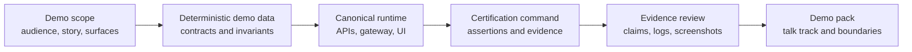

# Lotus Client Demo Certification Standard

Lotus demos must be polished, client-understandable, and evidence-backed. A demo is not certified
because the UI opens or screenshots exist; it is certified when the demonstrated story is tied to
supported features, deterministic data, real APIs, correct calculations, safe observability, and
reviewed evidence.

This standard gives product, engineering, sales, marketing, operations, and client-facing teams a
shared process for preparing demos without overstating current implementation.

Use [Lotus Client Demo Operating Process](../demo/client-demo-operating-process.md) when a demo
needs a client-facing operating model, pack structure, rehearsal process, delivery guidance, and
follow-up discipline. This standard remains the certification rulebook; the operating process is the
client-demo workflow.

## Demo Certification Principle

Every client-facing claim must be traceable to one of these states:

| Claim state | Meaning | Demo handling |
| --- | --- | --- |
| Implementation-backed | Code, tests, runtime/API proof, docs, and evidence exist. | Can be shown as supported current capability. |
| Bounded preview | A real implementation exists but scope, data, integration, or operating history is limited. | Can be shown with explicit boundaries. |
| Diagnostic | Evidence was captured to investigate a failure or incomplete surface. | Do not use in client demos. |
| Planned | RFC, roadmap, scaffold, or design exists but runtime proof is missing. | Mention only as roadmap, not as current product. |
| Unsupported | No governed implementation or owner exists. | Do not claim. |

## Certification Flow



## Required Inputs

Before a demo is certified, identify:

1. demo audience and objective,
2. supported surfaces, APIs, panels, workflows, and calculations,
3. canonical data set or deterministic seed data,
4. owning repositories for each claim,
5. supported-feature or capability publication source,
6. validation command and generated evidence location,
7. residual boundaries that must be stated during the demo.

## Evidence Requirements

| Evidence family | Required proof |
| --- | --- |
| Data | Synthetic or approved demo data, deterministic seed, contract identity, governed as-of date, and invariant checks. |
| API | Real service, Gateway, or BFF calls with expected-value assertions, not only HTTP 200 checks. |
| UI | Browser evidence after API, calculation, and panel validation pass. Screenshots before validation are diagnostic only. |
| Calculations | Domain figures tied to expected values, source references, or reconciliation evidence. |
| Supported features | Capability registry or supported-feature publication matches implemented surfaces. |
| Observability | Correlation, structured logs, metrics, safe operator diagnostics, and degraded/error posture where relevant. |
| Security | No real client data, secrets, raw prompts, raw source payloads, unrestricted telemetry paths, or sensitive identifiers in evidence. |
| Documentation | Demo story, wiki summary, talk track, and explicit "do not claim" boundaries. |
| CI posture | Repo-native validation and GitHub checks are green for the relevant demo scope. |

## Canonical Front-Office Demo

The governed front-office demo uses:

1. `PB_SG_GLOBAL_BAL_001` as the canonical reference portfolio,
2. `context/contracts/canonical-front-office-demo-data-contract.json`,
3. `context/contracts/canonical-front-office-demo-data-invariants.json`,
4. `context/contracts/workbench-panel-registry.json`,
5. `lotus-workbench` live runtime validation,
6. `automation/Invoke-Canonical-FrontOffice-QA.ps1` for platform-owned evidence,
7. `docs/demo/canonical-dpm-demo-story.md` and `wiki/Canonical-DPM-Demo-Story.md` as the current
   client-demo narrative.

Demo-ready screenshots are valid only after the canonical API, calculation, panel, and browser
validation path passes. Pre-validation screenshots must use a diagnostic prefix and must not enter a
client-facing pack.

## Audience Guidance

| Audience | What they need |
| --- | --- |
| Clients | A clear business story, current capabilities, visible controls, and honest boundaries. |
| Sales and pre-sales | A repeatable talk track that avoids unsupported roadmap claims. |
| Marketing | Implementation-backed value propositions and approved language. |
| Business users | Workflow behavior, decision points, and what the system proves. |
| Operations | Validation commands, evidence locations, degraded-state handling, and escalation paths. |
| Engineering | API, contract, seed, observability, and test evidence needed to maintain the demo. |

## Demo Pack Structure

A certified demo pack should contain:

1. audience and scope,
2. story sequence,
3. implementation-backed claims,
4. current boundaries and "do not claim" list,
5. validation command and run id,
6. evidence manifest links,
7. screenshot pack location,
8. owner and escalation contact for each critical surface.

## Certification Commands

Use app-owned commands first. For the canonical front-office flow, use:

```powershell
powershell -ExecutionPolicy Bypass -File automation\Invoke-Canonical-FrontOffice-QA.ps1 -BringUp -LotusAiEnvFile .env.example -SeedWaitSeconds 1200
```

For platform demo-readiness certification, use:

```powershell
powershell -ExecutionPolicy Bypass -File automation\Invoke-PlatformDemoReadinessCertification.ps1 -ScenarioMode fresh_seed
```

Promote a demo certification command to blocking CI only after it is deterministic, low-noise,
bounded to supported scope, and backed by clear remediation guidance.

## Anti-Patterns

Do not:

1. claim demo readiness from screenshots alone,
2. show empty panels as product proof,
3. hide failed, stale, degraded, unavailable, or permission-blocked states,
4. use real client data or confidential account data,
5. present roadmap or RFC intent as current product,
6. bypass Gateway/BFF when the governed product path requires it,
7. reuse stale containers after code, route, seed, or contract changes,
8. publish client-facing packs without reviewing logs, evidence, and screenshots for sensitive data.

## Related References

- [Canonical DPM Demo Story](../demo/canonical-dpm-demo-story.md)
- [Lotus Client Demo Operating Process](../demo/client-demo-operating-process.md)
- [Lotus Data Mesh Standard](Lotus%20Data%20Mesh%20Standard.md)
- [Platform Observability Standards](Platform%20Observability%20Standards.md)
- [Enterprise Readiness Standard](Enterprise%20Readiness%20Standard.md)
- [Lotus Bank-Buyable Engineering Contract](../../platform-standards/LOTUS_BANK_BUYABLE_ENGINEERING_CONTRACT.md)
