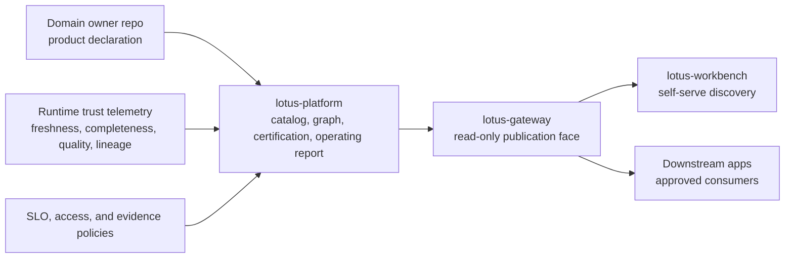

# Lotus Data Mesh Standard

Lotus uses a governed data mesh to make private-banking data products discoverable, trustworthy,
auditable, and usable across applications without moving domain authority into the platform,
gateway, or UI layer.

This standard explains what data mesh means in Lotus, how it is implemented across the ecosystem,
and what a Lotus app must prove before a product can be called mesh certified.

## Executive Summary

In Lotus, a data mesh is not a reporting catalog and not a copy of source data. It is the operating
model where each domain service owns its data products, the platform certifies the control plane,
Gateway publishes governed read contracts, and Workbench or downstream services consume those
products with visible trust posture.

The platform standard is:

1. product truth stays with the domain owner,
2. declarations are repo-native and versioned,
3. generated platform artifacts are derived evidence, not hand-authored truth,
4. certification requires runtime trust, policy, publication, discovery, and evidence proof,
5. catalog inclusion alone is never certification.

## Operating Model

## Ecosystem Roles

| Repository | Data mesh role | Current posture |
| --- | --- | --- |
| `lotus-platform` | Control plane for contracts, catalog generation, certification, maturity matrix, operating report, CI workflow, standards, and wiki/context truth. | Platform authority. |
| `lotus-core` | Authoritative producer for portfolio, booking, account, holding, mandate, transaction, and DPM source-readiness products. | First-wave producer. |
| `lotus-performance` | Authoritative producer for performance and returns products. | First-wave producer. |
| `lotus-risk` | Authoritative producer for risk, drawdown, attribution, exposure, and concentration products. | First-wave producer. |
| `lotus-advise` | Authoritative producer for advisory proposal lifecycle and decision-support products. | First-wave producer. |
| `lotus-report` | Producer and consumer for report evidence products and client-report evidence packs. | Enterprise maturity participant. |
| `lotus-manage` | Producer and consumer for discretionary portfolio action and action-register products. | Enterprise maturity participant. |
| `lotus-idea` | Opportunity-intelligence product owner for proposed opportunity, idea evidence, and conversion-orchestration products. | `IdeaCandidate:v1` is a governed certification candidate with platform SLO, access, and evidence-policy coverage; it is not mesh certified or supported-feature promoted until runtime records, durable repository proof, Gateway/Workbench discovery, and promotion evidence pass. RFC-0002 proof consumption is bounded: `lotus-idea.outbox-broker-runtime-execution.v1` may satisfy only the external broker runtime dependency and cannot certify downstream delivery, platform mesh publication, Gateway/Workbench live journeys, data-product certification, supported-feature promotion, or production posture. Other Idea products remain future-wave. |
| `lotus-gateway` | Publishes catalog, detail, graph, and trust APIs from platform-generated artifacts. | API publication face, not product authority. |
| `lotus-workbench` | Presents self-serve product discovery, dependency, lifecycle, and trust posture through Gateway/BFF. | Discovery UI, not product authority. |
| `lotus-ai` | Shared AI capability used behind governed product flows. | Not a mesh participant until it owns a governed product or catalog-consuming capability. |
| `lotus-render` | Deterministic rendering capability for governed reporting flows. | Support capability, not current product authority. |
| `lotus-archive` | Archive, retrieval, retention, legal hold, and access-audit capability for generated documents. | Support capability unless a future archive data product is declared and certified. |

## Certification Requirements

A product is mesh certified only when all required evidence is present and current.

| Control family | Required proof |
| --- | --- |
| Product identity | Repo-native producer or consumer declaration with stable product id, version, owner, lifecycle, semantics, and source path. |
| Platform inclusion | `domain-product-source-manifest.v1.json` includes the repository, generated catalog and graph are up to date, and no generated artifact is hand-edited. |
| Runtime trust | Trust telemetry proves freshness, completeness, quality, reconciliation, and lineage for the product. |
| Live certification | `generate_live_trust_certification.py` can derive a valid certification artifact from telemetry. |
| SLO policy | Mesh SLO policy exists and evaluates current telemetry without drift. |
| Access policy | Mesh access policy defines tenant scope, allowed roles, approved use cases, denial posture, audit owner, and Gateway-only publication. |
| Evidence policy | Mesh evidence policy defines audience filtering and prevents restricted paths, source payloads, or sensitive telemetry from leaking to customer-authorized evidence. |
| Gateway publication | Gateway publishes generated platform evidence through read-only APIs without becoming a registry or source of product truth. |
| Workbench discovery | Workbench consumes Gateway/BFF only and shows product lifecycle, certification, dependency, trust, unavailable, stale, and error states truthfully. |
| Supported-feature promotion | Product capability is promoted only after code, tests, runtime proof, documentation, and CI evidence exist. |

## Platform Automation

The platform control plane is implementation-backed through these files and commands:

| Surface | Purpose |
| --- | --- |
| `platform-contracts/domain-data-products/domain-product-source-manifest.v1.json` | Governed list of repo-native declaration sources included in catalog generation. |
| `generated/domain-product-catalog.json` and `.md` | Derived product catalog. |
| `generated/domain-product-dependency-graph.json` | Derived producer-consumer graph. |
| `generated/domain-product-certification-report.json` and `.md` | Derived trust-certification report. |
| `generated/enterprise-mesh-maturity-matrix.json` and `.md` | Ecosystem participation and maturity-wave status. |
| `automation/generate_domain_product_discovery.py` | Catalog and graph generation with source-manifest validation. |
| `automation/generate_domain_product_certification.py` | Derived certification report generation. |
| `automation/generate_enterprise_mesh_maturity_matrix.py` | Repository/product maturity classification. |
| `automation/mesh_certification_gate.py` | Advisory or blocking mesh certification gate. |
| `automation/collect_trust_telemetry.py` | Runtime-preferred trust telemetry collection with explicit fixture fallback. |
| `automation/generate_live_trust_certification.py` | Live trust certification generation. |
| `automation/validate_mesh_slo_policies.py` | Mesh SLO policy validation. |
| `automation/validate_mesh_access_policies.py` | Mesh access policy validation. |
| `automation/generate_mesh_evidence_pack.py` | Audience-filtered mesh evidence packs. |
| `.github/workflows/mesh-certification-gate.yml` | Cross-repo GitHub certification workflow. |

## Product Onboarding Workflow

Use this workflow for a new or expanded mesh product:

1. Identify the domain owner and product boundary.
2. Generate or write repo-native declarations with stable product ids and vocabulary.
3. Add source-data API, ingestion, OpenAPI, observability, and evidence checklists before
   implementation starts.
4. Add the repository to the platform source manifest only when the repo-native declaration exists.
5. Regenerate and check catalog, graph, certification report, and maturity matrix.
6. Implement serving APIs, runtime trust telemetry, policies, tests, and operational runbooks.
7. Prove Gateway publication and Workbench discovery through the governed paths.
8. Run the mesh certification gate locally and in GitHub.
9. Promote supported features only after all blockers are cleared.
10. Update README, docs, wiki, repo context, central context, and any skill or scaffold guidance
    whose truth changed.

## Client And Operator Narrative

For client demos and executive briefings, say:

Lotus treats important cross-domain datasets as governed products. Each product has an owner,
contract, lineage, runtime trust posture, access policy, evidence policy, and discovery path. The
platform shows what is certified, what is catalog-visible but not certified, and what is only
planned. That distinction is deliberate: it prevents attractive but unsupported demos from becoming
uncontrolled claims.

## Anti-Patterns

Do not:

1. hand-edit generated catalog, graph, certification, or maturity artifacts,
2. treat Gateway or Workbench as a product authority,
3. promote catalog-visible onboarding as certification,
4. ship UI discovery without Gateway-backed product and trust evidence,
5. expose source payloads, raw telemetry paths, portfolio/client identifiers, or restricted evidence
   in customer-authorized packs,
6. invent local product ids, lifecycle statuses, temporal semantics, or trust fields outside the
   platform vocabulary,
7. claim data mesh readiness from documentation without passing automation.

## Related References

- [Domain Data Product Contracts](../../platform-contracts/domain-data-products/README.md)
- [Mesh Certification Gate Runbook](../operations/mesh-certification-gate-runbook.md)
- [Enterprise Mesh Completion Handoff](../operations/enterprise-mesh-completion-handoff.md)
- [Enterprise Readiness Standard](Enterprise%20Readiness%20Standard.md)
- [Lotus Bank-Buyable Engineering Contract](../../platform-standards/LOTUS_BANK_BUYABLE_ENGINEERING_CONTRACT.md)
