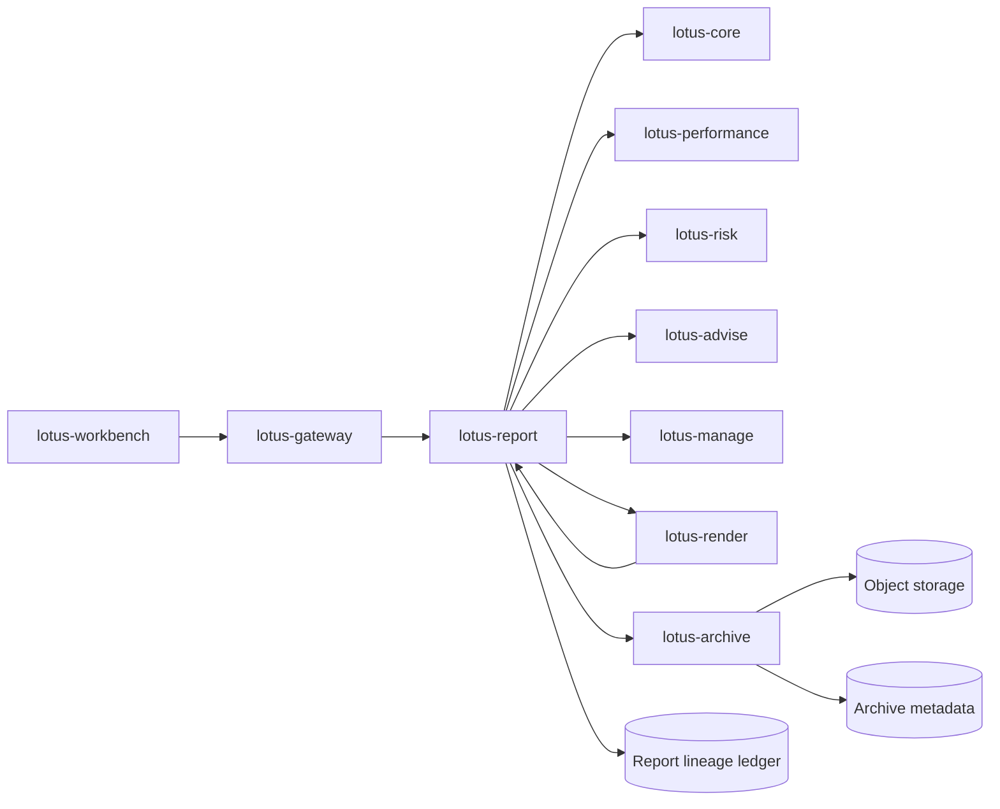

# RFC-0099: Enterprise Reporting And Document Archive Target Architecture

- Status: Proposed
- Date: 2026-04-23
- Owners:
  - lotus-platform architecture
  - `lotus-report` owners
  - `lotus-gateway` owners
  - future `lotus-render` owners
  - future `lotus-archive` owners
- Target repositories:
  - `lotus-platform`
  - `lotus-report`
  - `lotus-gateway`
  - `lotus-workbench`
  - future `lotus-render`
  - future `lotus-archive`
  - upstream data authorities: `lotus-core`, `lotus-performance`, `lotus-risk`,
    `lotus-advise`, `lotus-manage`
- Depends on:
  - `RFC-0010-reporting-and-document-generation-service.md`
  - `RFC-0026-synchronous-vs-asynchronous-integration-patterns.md`
  - `RFC-0027-reporting-and-analytics-separation-strategy.md`
  - `RFC-0050-core-data-analytics-and-reporting-service-boundaries.md`
  - `RFC-0052-reporting-and-aggregation-service-v1-bootstrap.md`
  - `RFC-0054-ras-reporting-endpoint-ownership-cutover.md`
  - `RFC-0071-centralized-environment-scoped-service-addressing-and-ingress-governance.md`
  - `RFC-0072-platform-wide-multi-lane-ci-validation-and-release-governance.md`
  - `RFC-0084-mesh-governance.md`
  - `RFC-0091-enterprise-data-mesh-maturity-and-production-readiness.md`
  - `lotus-report/rfcs/RFC-0002-first-class-portfolio-review-report-endpoint.md`

## Summary

Lotus reporting must evolve from report-data endpoints and document-generation utilities into an
enterprise reporting and document archive platform. Private-banking reporting is a regulated,
audited, operationally sensitive workflow: the system must explain who requested a report, which
portfolios and data snapshots were used, which template version rendered the document, where the
document is archived, whether it was regenerated or superseded, and why any report failed.

This RFC defines the target-state architecture, service names, service boundaries, technology
choices, asynchronous interaction model, lineage model, rendering model, document archive model,
batch-production model, security posture, observability posture, and the ordered follow-up RFC
sequence. It is intentionally documentation-first. No implementation should begin until this
target architecture and sequence are accepted.

## Problem

Current Lotus reporting is improving as a first-class reporting API capability, especially through
the portfolio review report endpoint in `lotus-report`. That is necessary, but not sufficient for a
banking-grade reporting platform.

The current architecture does not yet define a complete target state for:

1. front-office ad hoc report initiation through governed gateway boundaries,
2. long-running and scheduled batch reporting,
3. durable report request, job, lineage, render, and archive records,
4. deterministic PDF rendering and template governance,
5. document archival, retention, legal hold, re-download, and reissue,
6. full distributed tracing across reporting and upstream data services,
7. operator tooling for replay, rerender, failure diagnosis, and SLA monitoring,
8. clear regeneration and supersession semantics,
9. enterprise-grade security and document access entitlements,
10. the correct names and ownership boundaries for new services.

Without a target architecture, implementation will naturally drift toward one large `lotus-report`
service that performs orchestration, data assembly, rendering, batch execution, PDF storage,
archival, retention, audit, and operator workflows. That would be hard to scale, certify, secure,
and operate.

## Current Reality

| Area | Current state | Target implication |
| --- | --- | --- |
| `lotus-report` | Owns reporting and aggregation APIs, including first-class portfolio review JSON | Should remain report orchestration and report-data authority, not become a permanent document vault |
| `lotus-gateway` | Governs product-facing access for Workbench | UI report initiation and document retrieval should go through gateway |
| `lotus-workbench` | Product UI consumes gateway/BFF contracts | Should not call `lotus-report`, render, or archive services directly |
| `lotus-core` | Portfolio, transaction, reference, and portfolio-management source truth | Must provide source-backed snapshots and identifiers consumed by reporting lineage |
| `lotus-performance` | Performance and contribution analytics source truth | Must provide certifiable return, benchmark, and contribution inputs |
| `lotus-risk` | Risk, concentration, and risk-metric source truth | Must provide certifiable risk inputs, including source-backed rate and benchmark posture when available |
| `lotus-advise` / `lotus-manage` | Advisory and management workflow authorities | Future sources for suitability, mandate checks, review approvals, and advisor workflows |
| Document storage | Not yet first-class as an enterprise archive capability | Requires an archive service boundary with metadata, binary storage, retention, legal hold, and access audit |
| Rendering | Not yet defined as a governed scalable capability | Requires deterministic render package, template versioning, and render diagnostics |
| Batch production | Not yet first-class | Requires durable orchestration, concurrency, retries, resumability, progress, and idempotency |

## Goals

1. Define the enterprise reporting target-state architecture for Lotus.
2. Choose durable service names and boundaries for new capabilities.
3. Define the canonical invocation model for ad hoc and batch report generation.
4. Define the internal separation of concerns inside `lotus-report`.
5. Define the rendering, template-governance, and output-format strategy.
6. Define the generated-document archive target state.
7. Define lineage, audit, supportability, tracing, metrics, and operator tooling requirements.
8. Define security, entitlement, retention, region, tenant, and legal-hold expectations.
9. Define performance, scalability, back-pressure, and cost-control expectations.
10. Define versioning, rerender, regenerate, correction, and supersession semantics.
11. Define the follow-up RFC sequence in the correct implementation order.

## Non-Goals

1. Implementing the architecture in this RFC.
2. Selecting every final infrastructure product for all deployments.
3. Replacing existing `lotus-report` portfolio review JSON behavior.
4. Moving domain calculation ownership into reporting.
5. Allowing Workbench to bypass `lotus-gateway` for product-facing report flows.
6. Building a generic document-management system unrelated to Lotus-generated documents.
7. Defining customer-facing document design and visual layout details.

## Naming Decisions

The target-state service names are:

| Name | Type | Ownership |
| --- | --- | --- |
| `lotus-report` | Existing application/service | Report request APIs, orchestration, report-data assembly, lineage ledger ownership, batch reporting control plane |
| `lotus-render` | New application/service | Deterministic rendering from governed render packages into PDF and future human-readable formats |
| `lotus-archive` | New application/service | Generated-document archival, metadata, retention, retrieval, reissue, legal hold, purge, and document-access audit |
| `report-orchestrator` | `lotus-report` module/component | Ad hoc job lifecycle, idempotency, orchestration, upstream fan-out coordination |
| `report-data-assembler` | `lotus-report` module/component | Machine-readable report payload assembly from authoritative upstream services |
| `report-batch-orchestrator` | `lotus-report` module/component | Batch selection, scheduling, chunking, concurrency, retry, resume, and progress |
| `report-lineage-ledger` | `lotus-report` module/component | Durable request, job, data snapshot, upstream call, render attempt, archive, and status-event records |
| `report-template-registry` | `lotus-render` component | Template manifest, version, allowed report types, locale/brand variants, and compatibility |
| `document-archive-ledger` | `lotus-archive` component | Document metadata, retention policy, access audit, legal hold, and supersession graph |

Names intentionally use the existing Lotus repository convention: `lotus-*` for applications and
plain descriptive module names inside services. `lotus-render` reads as a product capability rather
than a worker implementation, and it is not PDF-specific. `lotus-archive` is simple,
enterprise-neutral, and broad enough for generated PDFs, statements, evidence packs, signed JSON,
and future client communications while still owning retention, legal hold, reissue, retrieval, and
access audit.

## Target Service Boundaries

### `lotus-report`

`lotus-report` is the enterprise reporting orchestrator and report-data authority.

Responsibilities:

1. expose report request, job, batch, status, and report-data APIs,
2. validate report request contracts,
3. enforce service-level authorization in addition to gateway authorization,
4. own idempotency keys and request hashes for report generation,
5. orchestrate upstream data collection through service APIs,
6. assemble machine-readable report data,
7. persist durable report lineage and supportability records,
8. submit render packages to `lotus-render`,
9. submit generated documents and metadata to `lotus-archive`,
10. own batch reporting schedules, selection, chunking, concurrency, retry, resume, and progress,
11. expose operator-facing job and batch diagnostic APIs.

Non-responsibilities:

1. owning portfolio, performance, risk, advisory, or management domain truth,
2. rendering final PDFs directly in the long-term target state,
3. owning legal archive retention and legal hold,
4. exposing product-facing UI contracts directly to Workbench,
5. allowing templates to fetch business data.

### `lotus-render`

`lotus-render` is the deterministic document rendering service.

Responsibilities:

1. accept complete render packages from `lotus-report`,
2. validate report data contract version, template ID, template version, locale, and brand variant,
3. render PDF from structured report data,
4. record render diagnostics, duration, template version, render service version, and failure reason,
5. support controlled template registry and template compatibility checks,
6. support visual regression and golden-sample rendering tests,
7. prepare for future human-readable output formats such as HTML preview or DOCX.

Non-responsibilities:

1. fetching business data from domain services,
2. making portfolio, performance, risk, suitability, or compliance decisions,
3. archiving documents or enforcing retention policy,
4. exposing product-facing report-generation APIs directly to Workbench.

### `lotus-archive`

`lotus-archive` is the Lotus-generated document archive and retrieval service.

Responsibilities:

1. store generated document binaries,
2. store document metadata and document lineage references,
3. enforce document retrieval entitlements,
4. record every document access,
5. manage retention policy, purge eligibility, and housekeeping,
6. manage legal hold,
7. manage superseded, corrected, reissued, and duplicate document relationships,
8. provide short-lived controlled download URLs or streamed document retrieval,
9. expose metadata and retrieval APIs through `lotus-gateway` for product surfaces.

Non-responsibilities:

1. calculating or assembling report data,
2. rendering PDFs,
3. accepting arbitrary unmanaged file uploads outside the governed Lotus-generated document scope,
4. deciding report business suitability.

### `lotus-gateway`

`lotus-gateway` remains the canonical front-office access boundary.

Responsibilities:

1. expose Workbench-facing report initiation, status, and document retrieval APIs,
2. enforce user/session entitlement before forwarding report requests,
3. pass caller, role, tenant, region, correlation, and trace context,
4. shield Workbench from internal report, render, and archive service topology,
5. expose only supported product-facing status and download metadata.

`lotus-workbench` must not call `lotus-report`, `lotus-render`, or `lotus-archive` directly for
front-office flows.

## Canonical Interaction Model

### Target Architecture Diagram



This is target-state architecture, not current runtime proof. `lotus-render` and `lotus-archive`
remain proposed services until their implementation RFCs create them.

## Platform Governance And Mesh Requirements

The enterprise reporting architecture must comply with Lotus platform governance before any
implementation RFC can be considered complete:

1. RFC-0071 service addressing and ingress governance for every new service boundary.
2. RFC-0072 multi-lane CI, PR merge-gate evidence, and truthful validation reporting for every
   touched repository.
3. RFC-0084 domain-data-product ownership rules when report lineage, archive metadata, or evidence
   products are declared or consumed.
4. RFC-0091 enterprise mesh maturity requirements for telemetry, SLO, access, lifecycle, evidence,
   and production-readiness posture.
5. Gateway-only Workbench consumption for product-facing report initiation and document retrieval.
6. API certification-pattern checks for every new or changed API in report, gateway, render,
   archive, and operator surfaces.
7. Supported-features material must remain implementation-backed and must not describe proposed
   services as available.

### Ad Hoc Report Generation

Front-office report generation must follow this path:

```text
lotus-workbench
  -> lotus-gateway
  -> lotus-report
  -> upstream domain services
  -> lotus-render
  -> lotus-archive
```

For portfolio review:

1. Workbench submits a report generation request to gateway.
2. Gateway authorizes the user for the portfolio and report type.
3. Gateway forwards the request to `lotus-report` with identity, entitlement context,
   idempotency key, correlation ID, and trace context.
4. `lotus-report` creates or returns the durable report job.
5. `lotus-report` assembles report data and lineage.
6. For PDF output, `lotus-report` submits a render package to `lotus-render`.
7. `lotus-render` returns a render artifact and diagnostics.
8. `lotus-report` archives the document through `lotus-archive`.
9. Gateway exposes status and retrieval to Workbench.

Machine-readable JSON report data may remain synchronous when it can meet front-office latency
targets and does not require durable archival. PDF generation should be asynchronous by default.

### Batch Reporting

Batch reporting must be controlled by `lotus-report` and may be triggered by:

1. an operator,
2. a system schedule,
3. a downstream workflow,
4. a governed replay/recovery operation.

Batch selection modes:

1. all active portfolios,
2. selected subsets by region, booking center, advisor, client segment, mandate type, or custom
   governed selector,
3. explicit portfolio ID lists,
4. imported governed batch manifests.

Batch frequencies:

1. monthly,
2. quarterly,
3. semi-annual,
4. yearly,
5. explicit ad hoc cycle.

Batch execution must support:

1. configurable batch size,
2. configurable per-report-type and per-lane concurrency,
3. durable schedules,
4. resumability from the last known durable item state,
5. retry policy with bounded attempts and backoff,
6. failure classification and failure tracking,
7. partial completion,
8. retry-failed-only,
9. idempotent reruns,
10. long-running execution without UI session coupling,
11. operational progress visibility.

## Asynchronous Boundaries

The target state uses a hybrid sync/async pattern:

| Boundary | Pattern | Rationale |
| --- | --- | --- |
| Workbench to gateway report initiation | Synchronous submit returning job handle | UI gets immediate acknowledgement without waiting for generation |
| Gateway to `lotus-report` | Synchronous command that creates or resolves job | Gateway remains API facade; job lifecycle lives in `lotus-report` |
| Report data assembly | Async for PDF, batch, and heavy reports; sync allowed for fast JSON previews | Avoids front-office latency and supports retry/recovery |
| Upstream data collection | Bounded parallel async fan-out | Reduces latency while preserving back-pressure |
| Rendering | Async worker/service boundary | Rendering can be CPU-heavy and failure-prone |
| Archival | Async step in job lifecycle | Storage failure must be distinguished from render failure |
| Notification/callback | Async event/callback after completion | Avoids coupling downstream workflows to report processing time |

Canonical job states:

1. `accepted`,
2. `queued`,
3. `collecting_data`,
4. `data_ready`,
5. `rendering`,
6. `rendered`,
7. `archiving`,
8. `completed`,
9. `completed_with_warnings`,
10. `failed`,
11. `cancelled`,
12. `superseded`.

Failure categories:

1. `entitlement_failed`,
2. `validation_failed`,
3. `upstream_data_failed`,
4. `data_incomplete`,
5. `render_failed`,
6. `archive_failed`,
7. `timeout`,
8. `cancelled`,
9. `operator_intervention_required`.

## Durable Data Model

`lotus-report` must own a durable reporting ledger. The minimum target entities are:

1. `report_request`
   The submitted request, trigger identity, request hash, idempotency key, and scope.
2. `report_job`
   The lifecycle record for one generated report or one report-data assembly run.
3. `report_batch`
   A batch-production cycle and its schedule/selector/configuration.
4. `report_batch_item`
   One portfolio/report instance inside a batch.
5. `report_input_snapshot`
   The structured report data snapshot or reference to immutable captured input evidence.
6. `report_upstream_call`
   Upstream service, endpoint, request hash, response hash/reference, status, latency, and trace.
7. `report_render_attempt`
   Render request, template version, render service version, output hash, status, duration, diagnostics.
8. `report_archive_attempt`
   Archive request, document ID, storage metadata, status, duration, diagnostics.
9. `report_document_ref`
   Link from report job to archived document metadata.
10. `report_status_event`
    Append-only job and batch lifecycle events.
11. `report_supersession`
    Relationship between original, reissued, corrected, and superseded documents.

PostgreSQL is the default target database for these durable records.

## Lineage And Audit Requirements

Every report, whether ad hoc or batch, must answer:

1. who or what triggered the request,
2. when it was triggered,
3. which portfolios were in scope,
4. which report type and output format were requested,
5. which as-of date, period, frequency, locale, and region were used,
6. which template ID and template version were used,
7. which render service version was used,
8. which report-data contract version was used,
9. which upstream services, endpoints, request hashes, response hashes, and snapshot references were
   used,
10. what output was generated,
11. which document ID was archived,
12. whether the report was regenerated, rerendered, reissued, corrected, or superseded,
13. who downloaded or accessed the document,
14. which trace/correlation IDs connect the full processing chain.

The PDF alone is not the report record. The report record is the lineage ledger, data snapshot,
render artifact, archived document metadata, status timeline, and access audit.

## Rendering Architecture

The render service must consume a complete render package. It must not fetch business data.

Target render package:

```json
{
  "report_type": "portfolio_review",
  "report_data_contract_version": "portfolio_review.v1",
  "template_id": "portfolio_review_private_banking",
  "template_version": "2026.04.1",
  "locale": "en-SG",
  "brand_variant": "lotus_private_bank",
  "output_format": "pdf",
  "render_context": {
    "requested_by": "user_or_service",
    "correlation_id": "correlation-id"
  },
  "report_data": {}
}
```

Recommended rendering technology:

1. Typst for PDF-first deterministic report rendering.
2. Versioned template source controlled through Git and CI.
3. Golden sample rendering tests for key report types.
4. Visual regression evidence for material template changes.
5. Template manifest declaring report types, supported data-contract versions, locales, brand
   variants, and output formats.

Typst is preferred over generic browser-based HTML-to-PDF as the target-state engine because
regulated reporting benefits from deterministic, print-oriented layout and governed template source.
HTML preview can still be supported later as a separate output format.

Business-owned content changes should be handled through governed configuration fragments, such as
approved disclosure text, localized labels, and branding metadata. Business users should not edit
production templates directly without repository review, test rendering, and approval evidence.

## Document Archive Architecture

`lotus-archive` should own Lotus-generated document archival and retrieval.

Target storage:

1. PostgreSQL for document metadata, retention, access audit, legal hold, and supersession graph.
2. S3-compatible object storage for PDF binaries and future generated document binaries.
3. Local development can use MinIO or filesystem-backed object-store adapter only behind the same
   storage interface.

Document metadata must include:

1. `document_id`,
2. `report_type`,
3. portfolio scope,
4. client/account identifiers when allowed by classification,
5. as-of date,
6. frequency,
7. generation timestamp,
8. template ID/version,
9. render service version,
10. report-data contract version,
11. lineage references,
12. object storage URI or opaque storage key,
13. checksum/hash,
14. MIME type,
15. size,
16. classification,
17. retention policy,
18. legal-hold status,
19. supersession/correction references,
20. access-control metadata.

Archive APIs should support:

1. create/archive generated document,
2. get document metadata,
3. retrieve document through stream or short-lived signed URL,
4. search/list documents by governed filters,
5. mark legal hold,
6. release legal hold,
7. mark superseded,
8. record corrected/reissued document,
9. purge eligible documents through governed housekeeping,
10. retrieve access-audit history for support/compliance.

`lotus-archive` must enforce encryption at rest, encryption in transit, per-document access audit,
retention, purge, legal hold, and tenant/region segregation where required.

## API Pattern

The target product-facing APIs should be gateway-first.

Gateway-facing product APIs:

```text
POST /api/v1/reports/portfolio-reviews
GET  /api/v1/report-jobs/{job_id}
GET  /api/v1/report-batches/{batch_id}
GET  /api/v1/documents/{document_id}/metadata
GET  /api/v1/documents/{document_id}/download
```

Internal `lotus-report` APIs:

```text
POST /reports/portfolio-reviews
POST /reports/batches
GET  /reports/jobs/{job_id}
POST /reports/jobs/{job_id}/cancel
POST /reports/jobs/{job_id}/rerender
POST /reports/jobs/{job_id}/regenerate
POST /reports/batches/{batch_id}/pause
POST /reports/batches/{batch_id}/resume
POST /reports/batches/{batch_id}/retry-failed
```

Internal render APIs:

```text
POST /render-jobs
GET  /render-jobs/{render_job_id}
```

Internal archive APIs:

```text
POST /documents
GET  /documents/{document_id}
GET  /documents/{document_id}/download
POST /documents/{document_id}/legal-hold
POST /documents/{document_id}/supersede
POST /documents/{document_id}/reissue
```

All job-creating APIs must support idempotency keys, correlation IDs, trace propagation, and
deterministic status resources.

## Security And Entitlements

The target state must enforce authorization at multiple layers:

1. Gateway enforces product-facing user/session entitlement.
2. `lotus-report` enforces service-level authorization and portfolio/report-type scope.
3. `lotus-render` accepts only authorized service-to-service render packages.
4. `lotus-archive` enforces document-level retrieval entitlement and access audit.

Security requirements:

1. role-based access for advisor, assistant, supervisor, operations, compliance, and system batch
   callers,
2. portfolio-level entitlement checks,
3. tenant, region, booking-center, and environment segregation,
4. encryption in transit,
5. encryption at rest for metadata and binaries,
6. no direct bucket exposure to users,
7. short-lived download URLs or streamed retrieval through authorized service path,
8. audit trail for report generation and every document access,
9. legal hold and purge restricted to privileged roles and governed automation,
10. no PII leakage in logs, metrics, or public evidence artifacts.

## Observability And Operations

The reporting platform must be observable across gateway, report, upstream services, render, and
archive services.

Required trace identifiers:

1. `correlation_id`,
2. `trace_id`,
3. `request_id`,
4. `report_request_id`,
5. `report_job_id`,
6. `batch_id`,
7. `batch_item_id`,
8. `render_job_id`,
9. `document_id`,
10. `portfolio_id` where permitted.

Required metrics:

1. report requests by type, status, trigger, and output format,
2. report jobs in progress,
3. report failures by category and upstream service,
4. report generation duration,
5. upstream call duration and failure rate,
6. render duration and failure rate,
7. archive duration and failure rate,
8. batch item completed/failed/retried counts,
9. queue depth and worker saturation,
10. document storage bytes,
11. document download counts,
12. SLA breach counts.

Operator tooling must support:

1. inspect request, job, batch, render, archive, and document status,
2. trace failed reports end to end,
3. distinguish data, render, archive, entitlement, and timeout failures,
4. rerender from existing report data snapshot,
5. regenerate from latest upstream data,
6. retry failed batch items,
7. resume interrupted batches,
8. identify duplicate/idempotent requests,
9. manage stuck or partial jobs,
10. monitor SLA breaches and batch progress.

OpenTelemetry should be the target tracing standard. Structured JSON logs should include stable
identifiers and failure categories without leaking sensitive document content.

## Versioning And Regeneration Semantics

The target state must distinguish:

1. `rerender`
   Use the existing report data snapshot and render again, possibly with the same or a newer
   template version. Numbers should remain unchanged.
2. `regenerate`
   Recollect upstream data and rebuild the report data snapshot. Numbers may change.
3. `reissue`
   Publish a new document intended to replace a prior document for client or advisor use.
4. `correction`
   Publish a corrected document due to a data, calculation, template, disclosure, or archival
   defect.
5. `supersede`
   Mark an older document as no longer current while retaining it under retention/legal-hold rules.
6. `idempotent_duplicate`
   Return the existing job/document for the same request hash and idempotency key unless the caller
   explicitly requests rerender or regenerate.

Every generated document must answer whether it was reproduced from the original data snapshot or
rebuilt from latest upstream data.

## Performance, Scale, And Cost Model

Target performance classes:

| Flow | Target behavior |
| --- | --- |
| Machine-readable ad hoc JSON | Prefer synchronous response when it can meet front-office latency target |
| Ad hoc PDF | Asynchronous by default; UI gets job handle immediately |
| Small batch | Durable async execution with progress and retry |
| Large production batch | Chunked durable execution with configurable concurrency, back-pressure, and resumability |

The target platform must support:

1. per-report-type concurrency controls,
2. per-upstream-service fan-out limits,
3. render worker pool scaling,
4. archive upload and download throttling,
5. batch back-pressure,
6. cost-aware render scheduling,
7. object storage lifecycle policies,
8. scale-down when batch cycles complete.

Non-functional evidence required before production enablement:

1. ad hoc latency tests,
2. batch throughput tests,
3. concurrency/back-pressure tests,
4. render saturation tests,
5. archive failure/recovery tests,
6. idempotency and duplicate-request tests,
7. rerender/regenerate/supersession tests,
8. security entitlement and download audit tests,
9. distributed trace completeness tests,
10. retention, purge, and legal-hold tests.

## Technology Choices

Target technology choices:

| Concern | Recommendation | Rationale |
| --- | --- | --- |
| Report APIs | FastAPI | Existing Lotus backend standard |
| Durable metadata | PostgreSQL | Strong transactional fit for job, lineage, archive metadata |
| Document binaries | S3-compatible object storage | Cloud/on-prem compatible, lifecycle policies, large binary support |
| Local object-store development | MinIO or adapter-backed filesystem | Keeps local parity behind object-store abstraction |
| Workflow orchestration | Temporal as target; Celery/RQ acceptable for phase-one if Temporal is deferred | Temporal is stronger for long-running durable workflow, retries, resume, and visibility |
| Queue/back-pressure | Workflow engine plus DB-backed admission state | Durable control and operational visibility |
| PDF rendering | Typst | Deterministic print-oriented rendering with governed template source |
| Tracing | OpenTelemetry | Cross-service trace propagation standard |
| Metrics | Prometheus-compatible metrics | Existing ecosystem-friendly operational model |
| Logs | Structured JSON logs | Searchable, supportable, trace-correlated diagnostics |

If Temporal is deferred, the phase-one queue must still provide durable job state, retry,
idempotency, resumability, and operator visibility. In-memory queues are not acceptable for
production report generation.

## Design Trade-Offs

### Keep rendering inside `lotus-report` vs create `lotus-render`

Keeping rendering inside `lotus-report` is faster initially, but it mixes API orchestration,
business data assembly, template governance, PDF runtime dependencies, and CPU-heavy rendering in
one service. The target state should separate rendering as `lotus-render`. A temporary internal
module is acceptable only if its API and data model are designed for extraction.

### Keep document archive inside `lotus-report` vs create `lotus-archive`

Archival has different security, retention, legal, housekeeping, access-audit, and storage
requirements from report assembly. `lotus-archive` should be a separate target service. A
temporary module inside `lotus-report` is acceptable only for early bootstrapping and must not own
long-term document governance.

### Synchronous PDF vs asynchronous PDF

Synchronous PDF generation is attractive for demos but creates poor front-office latency and bad
failure behavior. PDF should be asynchronous by default. Synchronous machine-readable JSON can
remain supported when it is fast, bounded, and not an archival operation.

### Regenerate from latest data vs rerender from stored snapshot

Both are required. Audit and support teams need rerender for template/render defects without
changing numbers. Business correction workflows need regenerate when upstream data or calculations
changed.

## Risks And Mitigations

| Risk | Mitigation |
| --- | --- |
| `lotus-report` becomes a monolith | Hard target service boundaries and extraction-ready modules |
| PDF exists without lineage | Make ledger write mandatory before render/archive completion |
| Render service fetches business data | Render service accepts only complete render packages |
| Duplicate batch documents | DB-backed idempotency and document supersession model |
| Weak document access control | Gateway, report, and archive layered authorization plus access audit |
| Template changes break production reports | Template manifest, golden renders, visual regression evidence, PR review |
| Batch overloads upstream services | Per-upstream concurrency, back-pressure, schedules, and retry policy |
| Reports are unreproducible | Store report data snapshots or immutable snapshot references and hashes |
| Legal hold conflicts with purge | Archive legal-hold state overrides lifecycle purge |
| Operators cannot diagnose failures | Standard failure categories, status events, traces, metrics, and support APIs |

## Ordered RFC Sequence

Implementation should proceed only after RFC-0099 is accepted. Follow-up RFCs should be created in
this order:

1. `RFC-0100-reporting-gateway-invocation-and-job-ledger-foundation`
   Define gateway-first initiation, report request/job APIs, idempotency, status vocabulary, DB
   schema, and the first durable `report-lineage-ledger` foundation in `lotus-report`.
2. `RFC-0101-report-data-snapshot-and-lineage-contracts`
   Define report data snapshot contracts, upstream call evidence, hash/reference semantics,
   supportability fields, and replay-safe data capture for portfolio review and future reports.
3. `RFC-0102-render-package-template-registry-and-render-service`
   Define `lotus-render`, Typst adoption, render package schema, template manifest, template
   versioning, render diagnostics, and golden/visual regression test evidence.
4. `RFC-0103-document-archive-retrieval-retention-and-legal-hold`
   Define `lotus-archive`, document metadata, object storage, retrieval APIs, access audit,
   retention, purge, legal hold, reissue, and supersession.
5. `RFC-0104-batch-reporting-scheduler-concurrency-and-recovery`
   Define batch selectors, schedules, frequencies, chunking, concurrency, retry, resume,
   retry-failed-only, failure tracking, progress APIs, and long-running workflow orchestration.
6. `RFC-0105-reporting-observability-operations-and-replay-tooling`
   Define OpenTelemetry propagation, metrics, dashboards, alerting, operator APIs, replay/rerender
   workflows, stuck-job handling, SLA monitoring, and support diagnostics.
7. `RFC-0106-reporting-security-entitlements-and-region-tenant-segregation`
   Define report and document entitlement model, role matrix, tenant/region segregation, download
   authorization, audit obligations, sensitive logging policy, and certification tests.
8. `RFC-0107-enterprise-reporting-production-certification`
   Define end-to-end certification across gateway, report, render, archive, upstream services,
   Workbench, batch, failure recovery, non-functional tests, docs, wiki, context, and branch hygiene.

## Mandatory Delivery Model For Follow-Up RFCs

Each implementation-bearing follow-up RFC must be delivered slice by slice. Do not move to the next
slice until the current slice has been implemented, locally validated, reviewed for unnecessary
complexity, and committed with a meaningful scope. Every slice must leave the touched repositories
cleaner, more modular, and easier to support than they were before the slice.

The implementation RFCs must not use broad "platform work" wording. Each must name:

1. owning repository or repositories,
2. target branch,
3. exact APIs, contracts, modules, migrations, docs, wiki pages, and context files in scope,
4. explicitly out-of-scope repositories and surfaces,
5. acceptance criteria,
6. validation commands and expected CI lanes,
7. supported-features updates required only after implementation-backed behavior exists,
8. residual risks and follow-up RFC dependencies.

### Required Slice 0: Cleanup And Structure

Every implementation RFC in the RFC-0100 through RFC-0107 sequence must start with a dedicated
cleanup and structure slice.

Required activities:

1. remove dead code made obsolete by the slice,
2. remove duplicate or stale documentation that conflicts with the new architecture,
3. improve repository structure where the current layout would make the new feature hard to
   maintain,
4. split large monolithic files only where it materially improves ownership, testing, or future
   extension,
5. improve document structure and reduce sprawl,
6. move the right long-lived operator or architecture material into repo-local `wiki/` source,
7. avoid duplicate long-lived documentation across repo docs and wiki,
8. document explicitly when no wiki change is needed and why,
9. run the applicable wiki check before merge,
10. after merge, publish the wiki if repo-local wiki source changed.

Acceptance criteria:

1. cleanup changes are specific and justified by the implementation path,
2. no unrelated aesthetic refactor is bundled into the slice,
3. docs and wiki have a clear source-of-truth split,
4. duplicate documentation is removed or converted into links,
5. repo-local wiki source is publishable.

### Required Slice 1-N: Capability Delivery Slices

Each capability slice must implement one coherent increment, such as job ledger foundation, report
snapshot lineage, render package contract, archive metadata, batch scheduling, or operator replay.

Required activities:

1. implement the narrow capability,
2. add meaningful tests around real risks and failure modes,
3. update OpenAPI/Swagger where API surfaces change,
4. update contracts and vocabulary references where domain terms change,
5. update docs only where behavior or operator truth changes,
6. add migration tests or smoke checks where durable storage changes,
7. validate downstream consumers when a public or gateway-facing contract changes,
8. record supported features only when the behavior is implemented and validated.

Acceptance criteria:

1. capability works through the intended boundary,
2. tests prove behavior, failure handling, idempotency, and governance requirements relevant to the
   slice,
3. no unsupported product wording appears in README, wiki, Swagger, or supported-features lists,
4. branch is pushed so GitHub checks can run asynchronously,
5. failed checks are investigated and fixed promptly.

### Required Second-Last Slice: Hardening, Review, And Certification

Every implementation RFC must include a second-last hardening and review slice before closure.

Required activities:

1. perform a proper code review of the full implementation,
2. tighten loose ends and remove temporary scaffolding,
3. verify API certification pattern compliance for every new or changed API,
4. verify OpenAPI/Swagger examples, request/response models, errors, and examples are production
   quality,
5. verify platform governance requirements from RFC-0071, RFC-0072, RFC-0084, RFC-0091, and
   repo-local standards,
6. verify data mesh enterprise standards where report, lineage, archive, or evidence products are
   declared or consumed,
7. verify security, entitlement, observability, idempotency, and failure semantics,
8. validate upstream and downstream integration posture,
9. make final quality improvements before closure.

Acceptance criteria:

1. code review findings are either fixed or explicitly deferred with rationale,
2. API certification evidence is current and specific,
3. platform governance and data mesh checks are satisfied or governed as explicit deviations,
4. CI health is green or failures are explained with active fix-forward ownership,
5. implementation is ready for final documentation and closure.

### Required Final Slice: Closure, Documentation, And Branch Hygiene

Every implementation RFC must end with a closure slice.

Required activities:

1. update implementation-backed documentation,
2. update repo-local wiki source and publish it after merge when wiki truth changed,
3. update supported-features lists with only delivered behavior,
4. update agent context and repository engineering context where operating truth changed,
5. consciously review whether skills, guidance, documentation, or agent context should be improved
   to support better future work, faster ramp-up, and stronger agent effectiveness,
6. explicitly state what should be added, removed, tightened, or clarified,
7. if no skills, guidance, documentation, or context changes are needed, state that as a deliberate
   outcome with rationale,
8. ensure branch hygiene: no untracked implementation artifacts, no stale generated files, no
   accidental output commits, no unrelated changes,
9. ensure PR summary and evidence match actual implementation,
10. complete merge-readiness checks before requesting merge or enabling auto-merge.

Acceptance criteria:

1. docs, wiki, supported-features, context, and agent guidance are aligned with implementation
   truth,
2. wiki source has been checked before merge and published after merge if changed,
3. branch is clean except intentionally untracked local evidence that is not part of the PR,
4. PR evidence lists real commands and GitHub check posture,
5. no implementation-backed feature is missing from supported-features material,
6. no aspirational feature appears as if it is already supported.

## Branching, PR, And CI Expectations

The implementation RFCs must use GitHub intentionally:

1. create a remote feature branch if one does not already exist,
2. continue on an existing active branch for the same work if one exists,
3. keep commits small, meaningful, and well-scoped,
4. push after each validated slice so GitHub checks run asynchronously,
5. monitor PR checks at regular intervals while continuing non-conflicting local work,
6. fix failures promptly,
7. do not allow CI health or branch quality to drift,
8. keep PR descriptions aligned with the actual slices delivered,
9. do not merge with unresolved failing checks unless a platform owner explicitly records a
   governed deviation,
10. publish wiki source after merge when required by the wiki publication rule.

## Supported-Features Discipline

RFC-0099 itself does not add implementation-backed product features. Follow-up RFCs must maintain a
clear supported-features list in the owning repository and, when the feature is product-facing, in
the relevant wiki or product material.

Supported-features entries must:

1. describe only behavior that has been implemented and validated,
2. name the API, job, document, render, archive, batch, or operator capability that backs it,
3. name the validation evidence or PR that delivered it,
4. distinguish `ready`, `partial`, `unavailable`, and `not_supported` behavior where relevant,
5. avoid roadmap, aspiration, or planned-service wording.

If an implementation slice creates infrastructure that is not yet product-supported, the
supported-features list must say that explicitly rather than presenting it as a customer feature.

## Acceptance Criteria For This RFC

1. Target service names and boundaries are explicit.
2. Ad hoc and batch invocation patterns are explicit.
3. Gateway-first front-office access is explicit.
4. `lotus-report`, `lotus-render`, and `lotus-archive` responsibilities and
   non-responsibilities are explicit.
5. Rendering technology direction and template-governance expectations are explicit.
6. Durable lineage, audit, and data model expectations are explicit.
7. Archive storage, metadata, retrieval, retention, purge, legal hold, and access-control
   expectations are explicit.
8. Async boundaries and status/failure vocabulary are explicit.
9. Security, observability, operator tooling, performance, scale, and cost expectations are
   explicit.
10. Versioning, rerender, regenerate, reissue, correction, supersession, and idempotent rerun
    semantics are explicit.
11. Ordered follow-up RFC sequence is explicit and implementation has not started.
12. Mandatory cleanup/structure, capability, hardening/review/certification, and final closure
    slices are explicit for follow-up implementation RFCs.
13. Branch, PR, CI, wiki publication, and supported-features delivery expectations are explicit.
14. The RFC distinguishes proposed target architecture from current implementation-backed runtime
    truth.
15. The RFC is sharp enough for a follow-up RFC author to produce implementation RFCs with minimal
    ambiguity.

## Supported Features

This RFC is an architecture proposal. It does not add implementation-backed product features.

Current implementation-backed reporting capability remains governed by `lotus-report` RFCs and
supported-features lists, especially the first-class portfolio review report endpoint. Future
supported features must be added only by implementation RFCs after the relevant code, tests,
documentation, and validation evidence exist.

## Wiki And Context Impact

This RFC changes target architecture direction, not current runtime truth. Platform RFC index and
wiki RFC index should link to it. Central context should be updated only after the architecture is
accepted or implementation begins, so agents do not treat proposed `lotus-render` or
`lotus-archive` services as already available.

## Open Questions

1. Should Temporal be adopted immediately for reporting workflows, or should phase one use a
   simpler DB-backed worker while preserving Temporal-compatible lifecycle semantics?
2. Should `lotus-render` be created as a separate repository from the first rendering slice, or
   should it begin as an extraction-ready module inside `lotus-report`?
3. Should `lotus-archive` be created before the first PDF archive flow, or should early archive
   metadata begin in `lotus-report` and migrate before production use?
4. Which jurisdictions and retention classes are in first-wave scope for private-banking reports?
5. Which non-PDF output formats should be first-class after PDF: HTML preview, DOCX, XLSX, or
   machine-readable signed JSON?
