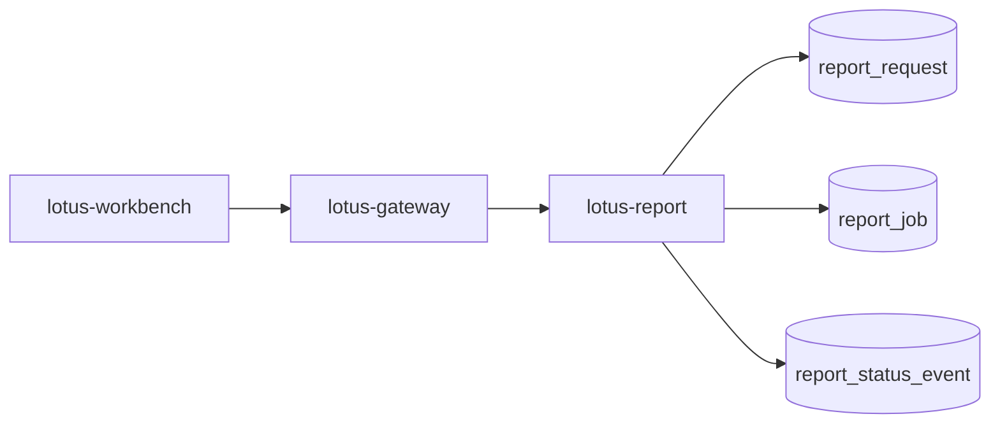

# RFC-0100: Reporting Gateway Invocation And Job Ledger Foundation

- Status: Proposed
- Date: 2026-04-23
- Owners:
  - `lotus-report` owners
  - `lotus-gateway` owners
  - `lotus-workbench` owners for product-surface adoption
  - lotus-platform governance
- Target repositories:
  - `lotus-report`
  - `lotus-gateway`
  - `lotus-workbench`
  - `lotus-platform`
- Depends on:
  - `RFC-0099-enterprise-reporting-and-document-archive-target-architecture.md`
  - `RFC-0026-synchronous-vs-asynchronous-integration-patterns.md`
  - `RFC-0071-centralized-environment-scoped-service-addressing-and-ingress-governance.md`
  - `RFC-0072-platform-wide-multi-lane-ci-validation-and-release-governance.md`
  - `lotus-report/rfcs/RFC-0002-first-class-portfolio-review-report-endpoint.md`

## Summary

This RFC defines the first implementation step toward the RFC-0099 target architecture: gateway-first
report initiation and a durable report request/job ledger in `lotus-report`.

The goal is to make report generation a governed workflow with durable request identity,
idempotency, status, failure categorization, traceability, and product-facing gateway posture before
rendering, archive, and batch production are added.

This RFC is implementation-bearing once accepted. It must be delivered slice by slice and must not
start PDF rendering, archive storage, or batch execution work.

## Problem

`lotus-report` currently exposes report-data APIs, but enterprise report generation needs durable
job lifecycle records. Workbench must not call `lotus-report` directly for front-office report
generation. Gateway must become the product-facing initiation and status boundary, while
`lotus-report` owns the durable job ledger and internal orchestration state.

Without this foundation:

1. ad hoc PDF/report generation cannot be safely asynchronous,
2. duplicate requests cannot be resolved through idempotency,
3. operators cannot inspect report job state,
4. later rendering and archive steps have no durable parent job,
5. Workbench can drift into raw service coupling.

## Target Scope

In scope:

1. `lotus-report` report request/job durable data model,
2. report initiation API in `lotus-report`,
3. report job status API in `lotus-report`,
4. idempotency key and request-hash behavior,
5. status and failure vocabulary,
6. gateway-facing report initiation and status APIs,
7. Workbench migration path to gateway-first report initiation where applicable,
8. OpenAPI/Swagger documentation and examples,
9. supported-features updates only after implementation-backed behavior exists.
10. report job operator-safe diagnostics for status, failure category, and retry eligibility,
11. exact cancellation semantics for pre-render/pre-archive report jobs,
12. repo-local documentation, wiki source, context, and supported-features hygiene.

Out of scope:

1. PDF rendering,
2. `lotus-render`,
3. `lotus-archive`,
4. batch scheduling,
5. retention, legal hold, and document download,
6. full report data snapshot lineage beyond job parent identifiers; RFC-0101 owns that.
7. report rerender, regenerate, replay, reissue, supersession, and production certification,
8. broad entitlement policy beyond carrying and enforcing the first gateway/report caller context
   needed for job creation and status access.

## Architecture Direction

Canonical front-office path:



`lotus-gateway` is the product-facing boundary. `lotus-report` is the durable job owner.

`lotus-report` must persist:

1. `report_request`,
2. `report_job`,
3. `report_status_event`,
4. idempotency key and request hash,
5. trigger identity and trigger type,
6. caller context references,
7. correlation and trace identifiers.

## Branching And Delivery

Implementation must happen on a dedicated remote feature branch unless an active RFC-0100 branch
already exists. If an active RFC-0100 branch exists, continue on it.

Required branch discipline:

1. keep `lotus-report`, `lotus-gateway`, and any Workbench changes on separate repository branches
   unless a repository already has an active RFC-0100 branch,
2. commit each completed and validated slice separately,
3. push after each validated slice so GitHub checks can run asynchronously,
4. monitor PR checks regularly and fix failures promptly,
5. do not start RFC-0101 or later work on the RFC-0100 branches,
6. keep untracked local output/evidence files out of commits unless the RFC explicitly requires
   them as source artifacts,
7. keep PR descriptions aligned with the slices actually delivered.

## Platform Governance And Mesh Requirements

1. Gateway-first invocation must follow RFC-0071 ingress and service-addressing posture.
2. Job-creating APIs must follow RFC-0026 async command/status/result semantics.
3. PR validation must follow RFC-0072 lane expectations for every touched repository.
4. If report job or lineage data becomes a governed data/evidence product, RFC-0084 and RFC-0091
   declaration, telemetry, SLO, access, and evidence requirements must be updated in the same slice.
5. Swagger/OpenAPI examples must use supported product names and must not leak RFC names.
6. `lotus-gateway` must remain the only Workbench-facing report initiation/status boundary.
7. `lotus-report` must not become a customer-facing UI contract owner.
8. Mesh declarations must not be updated with placeholder reporting products; update them only if
   durable job/lineage evidence becomes implementation-backed product material.

## Data Model Direction

### `report_request`

Minimum fields:

1. `report_request_id`,
2. `report_type`,
3. `portfolio_scope`,
4. `requested_output_formats`,
5. `as_of_date`,
6. `trigger_type`,
7. `triggered_by`,
8. `caller_application`,
9. `tenant_id`,
10. `region`,
11. `booking_center_code`,
12. `idempotency_key`,
13. `request_hash`,
14. `correlation_id`,
15. `trace_id`,
16. `created_at`.

### `report_job`

Minimum fields:

1. `report_job_id`,
2. `report_request_id`,
3. `report_type`,
4. `portfolio_scope`,
5. `status`,
6. `failure_category`,
7. `failure_message`,
8. `current_step`,
9. `retry_eligible`,
10. `cancel_requested`,
11. `created_at`,
12. `updated_at`,
13. `started_at`,
14. `completed_at`,
15. `cancelled_at`.

### `report_status_event`

Minimum fields:

1. `status_event_id`,
2. `report_job_id`,
3. `from_status`,
4. `to_status`,
5. `event_type`,
6. `message`,
7. `actor`,
8. `created_at`,
9. `correlation_id`,
10. `trace_id`.

Status-event records should be append-only. Current job status can be mutable, but status history
must remain durable.

## Idempotency Semantics

Job-creating commands must accept an idempotency key. The first implementation must use both:

1. caller-provided idempotency key, and
2. deterministic request hash.

The request hash must include at least:

1. report type,
2. portfolio scope,
3. as-of date,
4. requested output formats,
5. reporting currency where applicable,
6. report options that materially affect output,
7. caller tenant/region scope.

If the same idempotency key and request hash are submitted again, return the existing request/job.
If the same idempotency key is submitted with a different request hash, reject with a deterministic
conflict error. If no idempotency key is supplied for a job-creating command, reject the request
unless a governed internal/system path explicitly supplies an equivalent key.

## API Direction

Gateway product APIs:

```text
POST /api/v1/reports/portfolio-reviews
GET  /api/v1/report-jobs/{job_id}
```

`lotus-report` internal APIs:

```text
POST /reports/portfolio-reviews
GET  /reports/jobs/{job_id}
POST /reports/jobs/{job_id}/cancel
```

### Request/Response Direction

Report initiation should return a job handle, not a rendered document:

```json
{
  "report_request_id": "rrq_...",
  "report_job_id": "rjob_...",
  "status": "accepted",
  "status_url": "/api/v1/report-jobs/rjob_...",
  "idempotency_key": "..."
}
```

Status responses must expose product-safe state:

```json
{
  "report_job_id": "rjob_...",
  "report_type": "portfolio_review",
  "status": "collecting_data",
  "failure_category": null,
  "retry_eligible": false,
  "created_at": "2026-04-23T00:00:00Z",
  "updated_at": "2026-04-23T00:00:03Z"
}
```

The gateway response must not expose database names, worker internals, raw stack traces, or internal
service topology.

Initial job states:

1. `accepted`,
2. `queued`,
3. `collecting_data`,
4. `data_ready`,
5. `completed`,
6. `completed_with_warnings`,
7. `failed`,
8. `cancelled`.

Initial failure categories:

1. `entitlement_failed`,
2. `validation_failed`,
3. `upstream_data_failed`,
4. `data_incomplete`,
5. `timeout`,
6. `cancelled`,
7. `operator_intervention_required`.

Cancellation is in scope only for jobs that have not reached rendering, archive, or completed
states. Once RFC-0102 and RFC-0103 are implemented, cancellation semantics must be revisited by
those RFCs or RFC-0105.

## Implementation Slices

### Slice 0: Cleanup And Structure

1. Review `lotus-report` reporting routers, services, tests, docs, and wiki for duplicate or stale
   reporting initiation language.
2. Review `lotus-gateway` report routes and Workbench report calls for direct service coupling.
3. Remove dead code made obsolete by the job-ledger direction.
4. Remove or clarify direct-Workbench invocation wording.
5. Improve repository structure where needed for `report-orchestrator`, `report-lineage-ledger`,
   and API router ownership.
6. Improve document structure and reduce sprawl by converting duplicate long-lived docs into links.
7. Move durable operator/report-job material to repo-local `wiki/` source where it belongs.
8. Avoid duplicate documentation across repo docs and wiki.
9. Record explicit no-wiki-change decision if no wiki source changes are needed.
10. Run the applicable wiki check before merge and publish after merge if wiki source changed.

Acceptance criteria:

1. obsolete or duplicate initiation docs are removed or linked,
2. module ownership for orchestration and ledger code is clear,
3. no unrelated cleanup is bundled into this slice,
4. wiki source is either updated and publishable or a no-wiki-change decision is recorded.

### Slice 1: Report Job Ledger

1. Add durable report request/job/status-event models and migrations in `lotus-report`.
2. Add idempotency key and request-hash handling.
3. Add repository/service module APIs for creating requests, creating jobs, reading jobs, appending
   status events, and resolving idempotent duplicates.
4. Add unit and migration tests for idempotent create, duplicate request, conflict request, status
   transition, append-only status history, cancellation flag, and
   failure category behavior.
5. Add migration smoke evidence and rollback/forward posture according to repo standards.

### Slice 2: `lotus-report` APIs

1. Add report initiation and status APIs.
2. Preserve existing portfolio review JSON contract.
3. Add OpenAPI examples with full request/response examples and no RFC names in Swagger.
4. Add deterministic error contracts for missing idempotency key, idempotency conflict, unknown job,
   invalid status transition, and unauthorized caller context.
5. Add integration tests for submit/status/cancel, idempotent duplicate, idempotency conflict, and
   validation failures.
6. Ensure APIs return product-safe payloads without raw internals.

### Slice 3: Gateway Boundary

1. Add gateway report initiation/status routes.
2. Pass identity, tenant, region, role, correlation, trace, and idempotency context.
3. Normalize gateway errors into product-safe errors.
4. Add gateway tests proving Workbench-facing contract does not expose internal service topology.
5. Add contract tests proving gateway does not bypass `lotus-report` job ownership.

### Slice 4: Workbench Adoption Path

1. Update Workbench only if a product flow currently initiates report generation.
2. Ensure Workbench uses gateway only.
3. Add browser or API-client tests where product behavior changes.
4. If there is no Workbench report-generation flow to update, record a deliberate no-Workbench-change
   decision with evidence from code search.

### Second-Last Slice: Hardening, Review, And Certification

1. Perform a proper code review of the full job-ledger implementation.
2. Tighten loose ends, remove temporary scaffolding, and simplify overly coupled modules.
3. Check API certification pattern compliance for every report and gateway API touched.
4. Verify OpenAPI/Swagger examples, request/response models, errors, and examples are production
   quality.
5. Verify platform governance and data mesh enterprise standards requirements are met.
6. Verify RFC-0071, RFC-0072, RFC-0084, RFC-0091, and repo-local standards.
7. Verify idempotency, cancellation, authorization context, observability identifiers, and status
   transition semantics.
8. Make final quality improvements before closure.

Acceptance criteria:

1. review findings are fixed or explicitly deferred with rationale,
2. API certification evidence is current and specific,
3. platform governance and mesh checks are green or governed as explicit deviations,
4. CI health is green or has active fix-forward ownership,
5. implementation is ready for final documentation and closure.

### Final Slice: Closure

1. Update docs with implementation-backed behavior only.
2. Update repo-local wiki source and publish after merge when wiki truth changed.
3. Update supported-features lists with delivered behavior only.
4. Update agent context and repository engineering context where operating truth changed.
5. Make a conscious review of whether skills, guidance, documentation, or agent context should be
   improved for future reporting job work.
6. Identify what should be added, removed, tightened, or clarified.
7. If no changes are needed, state that explicitly as a deliberate outcome with rationale.
8. Clean branch, remove stale generated files, and keep local output/evidence out of commits unless
   intentionally tracked.
9. Update PR evidence with real validation commands and GitHub check posture.
10. Close only when CI is green and wiki publication obligations are clear.

Acceptance criteria:

1. docs, wiki, context, and supported-features material match implementation truth,
2. supported-features entries do not describe RFC-0101+ capabilities as delivered,
3. wiki source has been checked before merge and published after merge if changed,
4. branch is clean and PR evidence is truthful,
5. future guidance/skills/context decision is explicitly recorded.

## Acceptance Criteria

1. Front-office report initiation is gateway-first.
2. `lotus-report` owns durable report request/job/status state.
3. Job-creating APIs are idempotent.
4. Status and failure vocabulary is explicit and tested.
5. OpenAPI examples are complete and customer/product wording does not mention RFC names.
6. Workbench does not call `lotus-report` directly for supported product flows.
7. Supported-features entries are added only for implemented and validated behavior.
8. Durable migrations exist for request, job, and status-event records.
9. Idempotent duplicate and idempotency conflict behavior are tested.
10. Gateway routes carry identity, tenant, region, role, correlation, trace, and idempotency context.
11. Cancellation semantics are bounded and tested for pre-render/pre-archive jobs.
12. Operator-safe job diagnostics are available without raw internals.
13. Docs, wiki, context, and supported-features material are implementation-backed and aligned.

## Risks

| Risk | Mitigation |
| --- | --- |
| Gateway leaks internal report topology | Gateway response models expose only supported job posture |
| Idempotency creates false duplicates | Request hash includes report type, portfolio scope, as-of date, output format, and template intent |
| Ledger becomes too generic | Keep first wave scoped to reporting job lifecycle |
| Workbench bypasses gateway | Add tests and context guidance for gateway-only product flows |
| Status vocabulary drifts from later RFCs | Keep status names aligned with RFC-0099 and reserve render/archive states for later RFCs |
| Cancellation is over-promised | Limit cancellation to pre-render/pre-archive jobs and document future revisits |
| Documentation claims PDF support too early | Supported-features review blocks aspirational wording |

## Validation

Required validation:

1. `lotus-report` repo-native lint, typecheck, unit, integration, migration smoke, and OpenAPI checks.
2. `lotus-gateway` repo-native lint, typecheck, and route tests.
3. Workbench validation only if UI flow changes.
4. Platform vocabulary and wiki checks where docs/context change.
5. Coverage gate for modified repositories where the repo enforces one.
6. Security/dependency checks where report/gateway APIs change.
7. API certification checks for every new or changed API.
8. GitHub PR checks monitored after each pushed slice.

## Supported Features

This RFC starts with no implementation-backed supported features. Add supported-features entries
only after the gateway-first initiation and durable job ledger behavior is implemented and validated.

When implemented, supported-features material may mention only:

1. gateway-first portfolio-review report job initiation,
2. durable report request/job/status tracking,
3. idempotent report job creation,
4. bounded job cancellation before render/archive phases,
5. product-safe job status retrieval.

It must not claim PDF rendering, archive retrieval, batch production, rerender, regenerate, replay,
or production certification. Those belong to later RFCs.
