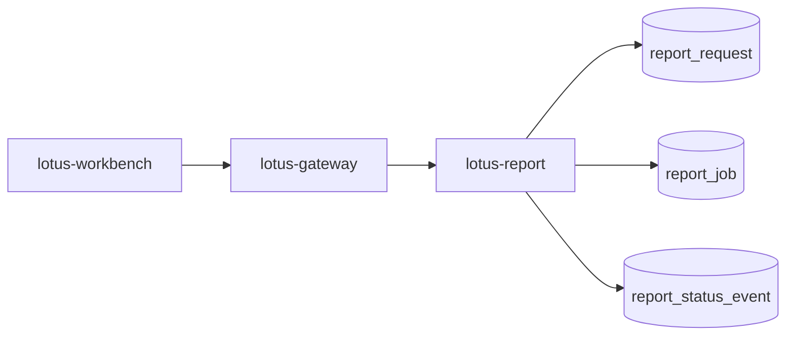

# RFC-0100: Reporting Gateway Invocation And Job Ledger Foundation

- Status: Proposed
- Date: 2026-04-23
- Owners:
  - `lotus-report` owners
  - `lotus-gateway` owners
  - `lotus-workbench` owners for product-surface adoption
  - lotus-platform governance
- Target repositories:
  - `lotus-report`
  - `lotus-gateway`
  - `lotus-workbench`
  - `lotus-platform`
- Depends on:
  - `RFC-0099-enterprise-reporting-and-document-archive-target-architecture.md`
  - `RFC-0026-synchronous-vs-asynchronous-integration-patterns.md`
  - `RFC-0071-centralized-environment-scoped-service-addressing-and-ingress-governance.md`
  - `RFC-0072-platform-wide-multi-lane-ci-validation-and-release-governance.md`
  - `lotus-report/rfcs/RFC-0002-first-class-portfolio-review-report-endpoint.md`

## Summary

This RFC defines the first implementation step toward the RFC-0099 target architecture: gateway-first
report initiation and a PostgreSQL-backed durable report request/job ledger in `lotus-report`.

The goal is to make report generation a governed workflow with durable request identity,
idempotency, status, failure categorization, traceability, and product-facing gateway posture before
rendering, archive, and batch production are added.

This RFC is implementation-bearing once accepted. It must be delivered slice by slice and must not
start PDF rendering, archive storage, or batch execution work.

## Problem

`lotus-report` currently exposes report-data APIs, but enterprise report generation needs durable
job lifecycle records backed by the same production-grade persistence posture used for supportable
banking workflows. Workbench must not call `lotus-report` directly for front-office report
generation. Gateway must become the product-facing initiation and status boundary, while
`lotus-report` owns the durable PostgreSQL job ledger and internal orchestration state.

Without this foundation:

1. ad hoc PDF/report generation cannot be safely asynchronous,
2. duplicate requests cannot be resolved through idempotency,
3. operators cannot inspect report job state,
4. later rendering and archive steps have no durable parent job,
5. Workbench can drift into raw service coupling.

## Target Scope

In scope:

1. `lotus-report` report request/job durable data model,
2. report initiation API in `lotus-report`,
3. report job status API in `lotus-report`,
4. idempotency key and request-hash behavior,
5. status and failure vocabulary,
6. gateway-facing report initiation and status APIs,
7. Workbench migration path to gateway-first report initiation where applicable,
8. OpenAPI/Swagger documentation and examples,
9. supported-features updates only after implementation-backed behavior exists.
10. report job operator-safe diagnostics for status, failure category, and retry eligibility,
11. exact cancellation semantics for pre-render/pre-archive report jobs,
12. repo-local documentation, wiki source, context, and supported-features hygiene,
13. PostgreSQL-backed `lotus-report` ledger persistence for local/dev and deployable runtime,
14. separate local/dev Postgres container or governed shared Postgres service for `lotus-report`,
15. SQL migration, index, uniqueness, readiness, and live DB evidence for the ledger tables.
16. operator-facing report job search/list APIs for support and diagnostics,
17. grouped and certified OpenAPI surfaces with explicit what/when/how guidance,
18. full success and error examples for every RFC-100 API.

Out of scope:

1. PDF rendering,
2. `lotus-render`,
3. `lotus-archive`,
4. batch scheduling,
5. retention, legal hold, and document download,
6. full report data snapshot lineage beyond job parent identifiers; RFC-0101 owns that.
7. report rerender, regenerate, replay, reissue, supersession, and production certification,
8. broad entitlement policy beyond carrying and enforcing the first gateway/report caller context
   needed for job creation and status access.

## Architecture Direction

Canonical front-office path:



`lotus-gateway` is the product-facing boundary. `lotus-report` is the durable job owner.

`lotus-report` must persist the report job ledger in PostgreSQL, not an application-local file
database. SQLite may be used only as an explicitly isolated unit-test adapter if that keeps tests
fast; integration, local runtime, Docker parity, and live evidence must prove the PostgreSQL path.

`lotus-report` must persist:

1. `report_request`,
2. `report_job`,
3. `report_status_event`,
4. idempotency key and request hash,
5. trigger identity and trigger type,
6. caller context references,
7. correlation and trace identifiers.

### Persistence Direction

The ledger persistence target for this RFC is PostgreSQL.

Required persistence posture:

1. `lotus-report` owns the ledger schema, migrations, repository/service adapter, and DB readiness
   checks,
2. local/dev runtime uses a separate Postgres container or governed local Postgres service for
   `lotus-report`,
3. deployable configuration uses a connection string or structured DB settings, not a file path,
4. migrations create `report_request`, `report_job`, and `report_status_event` with primary keys,
   foreign keys, uniqueness constraints, check constraints, and indexes for support queries,
5. idempotency uniqueness is enforced at the database layer, not only in application code,
6. status-event history remains append-only from the application contract perspective,
7. readiness checks fail when the ledger DB is unavailable or schema is not ready,
8. local evidence must show rows in PostgreSQL tables and must not use SQLite as the proof path,
9. operational support must have indexed access paths for job lookup by tenant/region/time,
   portfolio-scope diagnostics, status queues, completion/housekeeping scans, and event history.

Minimum indexes and constraints:

1. unique `report_request.idempotency_key`,
2. index on `report_request.created_at`,
3. index on `report_request.tenant_id`, `region`, and `created_at`,
4. index on `report_request.as_of_date`,
5. GIN or equivalent index on `report_request.portfolio_scope_json`,
6. index on `report_job.status` and `updated_at`,
7. index on `report_job.created_at`,
8. partial index on `report_job.completed_at` where completed,
9. index on `report_job.report_request_id`,
10. index on `report_status_event.report_job_id` and `created_at`,
11. check constraints for public status and failure-category vocabulary,
12. foreign key from `report_job.report_request_id` to `report_request.report_request_id`,
13. foreign key from `report_status_event.report_job_id` to `report_job.report_job_id`.

Partitioning and housekeeping direction:

1. RFC-0100 must make the ledger partition-ready by using time-based created/completed indexes,
   deterministic IDs, append-only events, and migration files that can evolve forward.
2. Do not introduce native range partitioning in the first migration unless global idempotency
   semantics are preserved. PostgreSQL partitioned-table uniqueness requires the partition key in
   unique constraints; blindly partitioning `report_request` by `created_at` would weaken global
   `idempotency_key` enforcement.
3. The target partitioning pattern is monthly range partitioning on `created_at` with either a
   separate global idempotency registry table or an idempotency key strategy that includes the
   governed partition dimension. That belongs in a later scale/retention RFC before high-volume
   batch production.
4. RFC-0100 must document housekeeping posture: no destructive purge endpoint in the first wave,
   no legal-hold/document-retention semantics before archive exists, and support scans must be
   indexed so future retention, purge, and batch cleanup jobs can be added without rewriting the
   ledger contract.

## Branching And Delivery

Implementation must happen on a dedicated remote feature branch unless an active RFC-0100 branch
already exists. If an active RFC-0100 branch exists, continue on it.

Required branch discipline:

1. keep `lotus-report`, `lotus-gateway`, and any Workbench changes on separate repository branches
   unless a repository already has an active RFC-0100 branch,
2. commit each completed and validated slice separately,
3. push after each validated slice so GitHub checks can run asynchronously,
4. monitor PR checks regularly and fix failures promptly,
5. do not start RFC-0101 or later work on the RFC-0100 branches,
6. keep untracked local output/evidence files out of commits unless the RFC explicitly requires
   them as source artifacts,
7. keep PR descriptions aligned with the slices actually delivered.

## Platform Governance And Mesh Requirements

1. Gateway-first invocation must follow RFC-0071 ingress and service-addressing posture.
2. Job-creating APIs must follow RFC-0026 async command/status/result semantics.
3. PR validation must follow RFC-0072 lane expectations for every touched repository.
4. If report job or lineage data becomes a governed data/evidence product, RFC-0084 and RFC-0091
   declaration, telemetry, SLO, access, and evidence requirements must be updated in the same slice.
5. Swagger/OpenAPI examples must use supported product names and must not leak RFC names.
6. Certified operational endpoints must explain when to call the endpoint, what it returns, and how
   callers should use it. Every public request/response attribute must carry type, description, and
   example coverage in OpenAPI.
7. `lotus-gateway` must remain the only Workbench-facing report initiation/status boundary.
8. `lotus-report` must not become a customer-facing UI contract owner.
9. Mesh declarations must not be updated with placeholder reporting products; update them only if
   durable job/lineage evidence becomes implementation-backed product material.

## Data Model Direction

### `report_request`

Minimum fields:

1. `report_request_id`,
2. `report_type`,
3. `portfolio_scope`,
4. `requested_output_formats`,
5. `as_of_date`,
6. `trigger_type`,
7. `triggered_by`,
8. `caller_application`,
9. `tenant_id`,
10. `region`,
11. `booking_center_code`,
12. `idempotency_key`,
13. `request_hash`,
14. `correlation_id`,
15. `trace_id`,
16. `created_at`.

### `report_job`

Minimum fields:

1. `report_job_id`,
2. `report_request_id`,
3. `report_type`,
4. `portfolio_scope`,
5. `status`,
6. `failure_category`,
7. `failure_message`,
8. `current_step`,
9. `retry_eligible`,
10. `cancel_requested`,
11. `created_at`,
12. `updated_at`,
13. `started_at`,
14. `completed_at`,
15. `cancelled_at`.

### `report_status_event`

Minimum fields:

1. `status_event_id`,
2. `report_job_id`,
3. `from_status`,
4. `to_status`,
5. `event_type`,
6. `message`,
7. `actor`,
8. `created_at`,
9. `correlation_id`,
10. `trace_id`.

Status-event records should be append-only. Current job status can be mutable, but status history
must remain durable.

## Idempotency Semantics

Job-creating commands must accept an idempotency key. The first implementation must use both:

1. caller-provided idempotency key, and
2. deterministic request hash.

The request hash must include at least:

1. report type,
2. portfolio scope,
3. as-of date,
4. requested output formats,
5. reporting currency where applicable,
6. report options that materially affect output,
7. caller tenant/region scope.

If the same idempotency key and request hash are submitted again, return the existing request/job.
If the same idempotency key is submitted with a different request hash, reject with a deterministic
conflict error. If no idempotency key is supplied for a job-creating command, reject the request
unless a governed internal/system path explicitly supplies an equivalent key.

## API Direction

Gateway product APIs:

```text
POST /api/v1/reports/portfolio-reviews
GET  /api/v1/report-jobs
GET  /api/v1/report-jobs/{job_id}
GET  /api/v1/report-jobs/{job_id}/events
POST /api/v1/report-jobs/{job_id}/cancel
```

`lotus-report` internal APIs:

```text
POST /reports/portfolio-reviews
GET  /reports/jobs
GET  /reports/jobs/{job_id}
GET  /reports/jobs/{job_id}/events
POST /reports/jobs/{job_id}/cancel
```

### API Grouping And Certification Direction

The API surface must be grouped so consumers can distinguish:

1. `Reports` command/data endpoints,
2. `Report Jobs` operational lifecycle endpoints.

Swagger/OpenAPI for every RFC-100 endpoint must include:

1. a concise summary,
2. a description that explicitly says what the endpoint does, when to call it, and how callers
   should use it safely,
3. full request examples for command endpoints,
4. full success-response examples,
5. explicit error responses with machine-readable codes and full example payloads,
6. description, type, and example coverage for every public request and response attribute,
7. no RFC names or implementation-roadmap wording in public API text.

### Operator Search/List Direction

RFC-100 must expose first-wave operator-safe search/list APIs so support and operations teams can:

1. find jobs without already knowing a `report_job_id`,
2. isolate tenant/region-specific failures,
3. search by portfolio scope and as-of date,
4. inspect current lifecycle state for recent work,
5. correlate user-reported duplicates through idempotency key and correlation identifiers.

First-wave supported filters:

1. `tenant_id`,
2. `region`,
3. `status`,
4. `report_type`,
5. `portfolio_id`,
6. `as_of_date`,
7. `idempotency_key`,
8. `correlation_id`,
9. `created_from`,
10. `created_to`,
11. `limit`.

The first wave may use cursorless bounded pagination if:

1. sort order is deterministic,
2. the limit is capped,
3. docs state that later RFCs may introduce cursor pagination for large-scale operations.

The list/search response must return support-safe summaries only. It must not expose stack traces,
worker topology, SQL fragments, or raw internal payload blobs.

### Request/Response Direction

Report initiation should return a job handle, not a rendered document:

```json
{
  "report_request_id": "rrq_...",
  "report_job_id": "rjob_...",
  "status": "accepted",
  "status_url": "/api/v1/report-jobs/rjob_...",
  "idempotency_key": "..."
}
```

Status responses must expose product-safe state:

```json
{
  "report_job_id": "rjob_...",
  "report_type": "portfolio_review",
  "status": "collecting_data",
  "failure_category": null,
  "retry_eligible": false,
  "created_at": "2026-04-23T00:00:00Z",
  "updated_at": "2026-04-23T00:00:03Z"
}
```

The gateway response must not expose database names, worker internals, raw stack traces, or internal
service topology.

Initial job states:

1. `accepted`,
2. `queued`,
3. `collecting_data`,
4. `data_ready`,
5. `completed`,
6. `completed_with_warnings`,
7. `failed`,
8. `cancelled`.

Initial failure categories:

1. `entitlement_failed`,
2. `validation_failed`,
3. `upstream_data_failed`,
4. `data_incomplete`,
5. `timeout`,
6. `cancelled`,
7. `operator_intervention_required`.

Cancellation is in scope only for jobs that have not reached rendering, archive, or completed
states. Once RFC-0102 and RFC-0103 are implemented, cancellation semantics must be revisited by
those RFCs or RFC-0105.

## Implementation Slices

### Slice 0: Cleanup And Structure

1. Review `lotus-report` reporting routers, services, tests, docs, and wiki for duplicate or stale
   reporting initiation language.
2. Review `lotus-gateway` report routes and Workbench report calls for direct service coupling.
3. Remove dead code made obsolete by the job-ledger direction.
4. Remove or clarify direct-Workbench invocation wording.
5. Improve repository structure where needed for `report-orchestrator`, `report-lineage-ledger`,
   and API router ownership.
6. Improve document structure and reduce sprawl by converting duplicate long-lived docs into links.
7. Move durable operator/report-job material to repo-local `wiki/` source where it belongs.
8. Avoid duplicate documentation across repo docs and wiki.
9. Record explicit no-wiki-change decision if no wiki source changes are needed.
10. Run the applicable wiki check before merge and publish after merge if wiki source changed.

Acceptance criteria:

1. obsolete or duplicate initiation docs are removed or linked,
2. module ownership for orchestration and ledger code is clear,
3. no unrelated cleanup is bundled into this slice,
4. wiki source is either updated and publishable or a no-wiki-change decision is recorded.

### Slice 1: PostgreSQL Ledger Persistence Foundation

1. Add PostgreSQL-backed durable report request/job/status-event tables in `lotus-report`.
2. Add governed migration files and migration runner/check commands for the three ledger tables.
3. Add local/dev Postgres runtime support for `lotus-report`, either as a dedicated container or as
   a governed shared Postgres service with an isolated database/schema.
4. Add repository/service module APIs for creating requests, creating jobs, reading jobs, appending
   status events, and resolving idempotent duplicates through DB-backed transactional behavior.
5. Enforce idempotency key uniqueness, request/job foreign keys, status-event foreign keys, and
   support indexes in the database.
6. Add connection configuration, connection pooling where appropriate, and readiness behavior that
   fails when the ledger DB or expected schema is unavailable.
7. Add unit and migration tests for idempotent create, duplicate request, conflict request, status
   transition, append-only status history, cancellation flag, failure category behavior, schema
   presence, and DB-level uniqueness.
8. Add migration smoke evidence and rollback/forward posture according to repo standards.
9. Add live local evidence proving rows are persisted in PostgreSQL, not SQLite.
10. Document partition-readiness, housekeeping posture, and why native partitioning is deferred
    until scale/retention semantics preserve global idempotency.

Acceptance criteria:

1. `lotus-report` can run locally against Postgres with the ledger schema applied,
2. `report_request`, `report_job`, and `report_status_event` exist in Postgres with required
   constraints and indexes,
3. idempotent duplicate and idempotency conflict behavior are enforced under transactionally safe
   DB access,
4. health/readiness reflects database availability and schema readiness,
5. SQLite is not used for integration, Docker parity, or live evidence paths,
6. migration smoke and live DB evidence are captured before this slice is closed.
7. operational indexes cover tenant/region/time diagnostics, as-of scans, portfolio-scope lookup,
   status queues, completion housekeeping, request/job joins, and event history.

### Slice 2: `lotus-report` APIs

1. Add report initiation and status APIs.
2. Preserve existing portfolio review JSON contract.
3. Add grouped internal API tags so report commands and job operations are distinct in Swagger.
4. Add OpenAPI examples with full request/response examples and no RFC names in Swagger.
5. Add deterministic error contracts for missing idempotency key, idempotency conflict, unknown job,
   invalid status transition, invalid filters, and unauthorized or missing caller context.
6. Add support-facing event-history retrieval for append-only job lifecycle diagnostics.
7. Add operator-safe job search/list retrieval with bounded filters for tenant, region, status,
   report type, portfolio id, as-of date, idempotency key, correlation id, and created-at window.
8. Add integration tests for submit/status/list/events/cancel, idempotent duplicate, idempotency
   conflict, validation failures, and filter behavior.
9. Ensure APIs return product-safe payloads without raw internals.
10. Ensure internal APIs read/write the PostgreSQL ledger through the governed repository/service
   layer and do not bypass migrations or DB readiness.
11. Ensure Swagger documents when to use submit, list, status, events, and cancel; what each
    endpoint returns; and how idempotency/caller-context headers are used.

Acceptance criteria:

1. `/reports/jobs` exists and is backed by indexed PostgreSQL filters,
2. `/reports/jobs`, `/reports/jobs/{job_id}`, `/reports/jobs/{job_id}/events`, and
   `/reports/jobs/{job_id}/cancel` are grouped under a dedicated `Report Jobs` Swagger tag,
3. every internal RFC-100 endpoint publishes success and error examples,
4. every internal request/response attribute exposed in Swagger has type, description, and example
   coverage,
5. integration tests prove list/search and error handling behavior.

### Slice 3: Gateway Boundary

1. Add gateway report initiation/status routes.
2. Pass identity, tenant, region, role, correlation, trace, and idempotency context.
3. Reject missing required product-facing caller context before forwarding job create/status/cancel.
4. Add gateway-first operator-safe job list/search route aligned with the internal support filters.
5. Group gateway `Reports` and `Report Jobs` APIs cleanly in Swagger.
6. Normalize gateway errors into product-safe errors.
7. Add gateway tests proving Workbench-facing contract does not expose internal service topology.
8. Add contract tests proving gateway does not bypass `lotus-report` job ownership or ledger
   persistence.

Acceptance criteria:

1. `/api/v1/report-jobs` exists and forwards only the governed filter surface,
2. gateway rewrites internal status URLs to gateway-relative URLs,
3. gateway OpenAPI for RFC-100 endpoints includes what/when/how descriptions, full examples, and
   explicit error contracts,
4. gateway tags separate `Reports` from `Report Jobs`,
5. contract and integration tests prove grouped and certified operational APIs.

### Slice 4: Workbench Adoption Path

1. Update Workbench only if a product flow currently initiates report generation.
2. Ensure Workbench uses gateway only.
3. Add browser or API-client tests where product behavior changes.
4. If there is no Workbench report-generation flow to update, record a deliberate no-Workbench-change
   decision with evidence from code search.

### Second-Last Slice: Hardening, Review, And Certification

1. Perform a proper code review of the full job-ledger implementation.
2. Tighten loose ends, remove temporary scaffolding, and simplify overly coupled modules.
3. Check API certification pattern compliance for every report and gateway API touched.
4. Verify OpenAPI/Swagger examples, request/response models, errors, and examples are production
   quality, with type, description, and example coverage for public attributes.
5. Verify route grouping, tag naming, and operator-facing API discoverability are coherent and
   consistent.
6. Verify platform governance and data mesh enterprise standards requirements are met.
7. Verify RFC-0071, RFC-0072, RFC-0084, RFC-0091, and repo-local standards.
8. Verify idempotency, cancellation, authorization context, observability identifiers, and status
   transition semantics.
9. Verify PostgreSQL persistence, schema constraints, indexes, migrations, readiness, local/dev
   container posture, partition-readiness, and housekeeping posture.
10. Make final quality improvements before closure.

Acceptance criteria:

1. review findings are fixed or explicitly deferred with rationale,
2. API certification evidence is current and specific,
3. PostgreSQL live evidence proves gateway-to-report-to-database persistence,
4. platform governance and mesh checks are green or governed as explicit deviations,
5. CI health is green or has active fix-forward ownership,
6. implementation is ready for final documentation and closure.

### Final Slice: Closure

1. Update docs with implementation-backed behavior only.
2. Update repo-local wiki source and publish after merge when wiki truth changed.
3. Update supported-features lists with delivered behavior only.
4. Update agent context and repository engineering context where operating truth changed.
5. Make a conscious review of whether skills, guidance, documentation, or agent context should be
   improved for future reporting job work.
6. Identify what should be added, removed, tightened, or clarified.
7. If no changes are needed, state that explicitly as a deliberate outcome with rationale.
8. Clean branch, remove stale generated files, and keep local output/evidence out of commits unless
   intentionally tracked.
9. Update PR evidence with real validation commands and GitHub check posture.
10. Close only when CI is green and wiki publication obligations are clear.

Acceptance criteria:

1. docs, wiki, context, and supported-features material match implementation truth,
2. supported-features entries do not describe RFC-0101+ capabilities as delivered,
3. wiki source has been checked before merge and published after merge if changed,
4. branch is clean and PR evidence is truthful,
5. future guidance/skills/context decision is explicitly recorded.

## Acceptance Criteria

1. Front-office report initiation is gateway-first.
2. `lotus-report` owns durable report request/job/status state.
3. Job-creating APIs are idempotent.
4. Status and failure vocabulary is explicit and tested.
5. OpenAPI examples are complete, public attributes carry type/description/example coverage, and
   customer/product wording does not mention RFC names.
6. Operational APIs are grouped coherently and expose list/search, status, events, and cancel with
   explicit success and error contracts.
7. Workbench does not call `lotus-report` directly for supported product flows.
8. Supported-features entries are added only for implemented and validated behavior.
9. Durable migrations exist for request, job, and status-event records.
10. Idempotent duplicate and idempotency conflict behavior are tested.
11. Gateway routes carry identity, tenant, region, role, correlation, trace, and idempotency context.
12. Cancellation semantics are bounded and tested for pre-render/pre-archive jobs.
13. Operator-safe job diagnostics, bounded list/search retrieval, and append-only event history are
    available without raw internals.
14. Docs, wiki, context, and supported-features material are implementation-backed and aligned.
15. `lotus-report` ledger persistence uses PostgreSQL for runtime, integration, Docker parity, and
    live evidence.
16. A separate local/dev Postgres container or governed shared Postgres database/schema exists for
    the `lotus-report` ledger.
17. Database readiness and schema readiness are part of service readiness.
18. Live evidence includes gateway request/response, report logs, gateway logs, and PostgreSQL table
    rows for `report_request`, `report_job`, and `report_status_event`.
19. Indexing, partition-readiness, and housekeeping posture are documented and validated by schema
    smoke checks where implementation-backed.

## Risks

| Risk | Mitigation |
| --- | --- |
| Gateway leaks internal report topology | Gateway response models expose only supported job posture |
| Idempotency creates false duplicates | Request hash includes report type, portfolio scope, as-of date, output format, and template intent |
| Ledger becomes too generic | Keep first wave scoped to reporting job lifecycle |
| Workbench bypasses gateway | Add tests and context guidance for gateway-only product flows |
| Status vocabulary drifts from later RFCs | Keep status names aligned with RFC-0099 and reserve render/archive states for later RFCs |
| Cancellation is over-promised | Limit cancellation to pre-render/pre-archive jobs and document future revisits |
| Documentation claims PDF support too early | Supported-features review blocks aspirational wording |
| SQLite or file-local persistence is mistaken for production durability | Require PostgreSQL for runtime, integration, Docker parity, and live evidence; allow SQLite only for explicitly isolated unit tests |
| DB uniqueness and idempotency rely only on application code | Enforce unique idempotency keys and foreign-key relationships in Postgres migrations |
| Ledger DB unavailable but service appears ready | Include DB connectivity and schema checks in readiness |
| Shared local database causes cross-test or cross-service contamination | Use an isolated `lotus-report` database/schema and resettable test database posture |
| Native partitioning weakens idempotency uniqueness | Defer partitioning until a later scale/retention RFC introduces a global idempotency registry or a governed partition-aware idempotency strategy |
| Ledger grows without supportable housekeeping path | Add completion/time indexes now, document first-wave no-purge posture, and require later archive/retention RFCs to add governed purge/legal-hold semantics |

## Validation

Required validation:

1. `lotus-report` repo-native lint, typecheck, unit, integration, migration smoke, and OpenAPI checks.
2. `lotus-gateway` repo-native lint, typecheck, and route tests.
3. Workbench validation only if UI flow changes.
4. Platform vocabulary and wiki checks where docs/context change.
5. Coverage gate for modified repositories where the repo enforces one.
6. Security/dependency checks where report/gateway APIs change.
7. API certification checks for every new or changed API.
8. GitHub PR checks monitored after each pushed slice.
9. PostgreSQL-backed live validation that starts `lotus-report`, `lotus-gateway`, and the ledger DB,
   submits a portfolio-review job through gateway, proves idempotent duplicate behavior, proves
   conflict behavior, proves status/cancel behavior, and dumps PostgreSQL ledger rows.
10. Docker/local parity validation proving the configured DB container/service is the ledger backing
    store for runtime paths.

## Supported Features

This RFC starts with no implementation-backed supported features. Add supported-features entries
only after the gateway-first initiation and durable job ledger behavior is implemented and validated.

When implemented, supported-features material may mention only:

1. gateway-first portfolio-review report job initiation,
2. durable report request/job/status tracking,
3. idempotent report job creation,
4. bounded job cancellation before render/archive phases,
5. product-safe job status retrieval,
6. PostgreSQL-backed report job ledger persistence.
7. operator-safe report job list/search for support diagnostics.

It must not claim PDF rendering, archive retrieval, batch production, rerender, regenerate, replay,
or production certification. Those belong to later RFCs.
