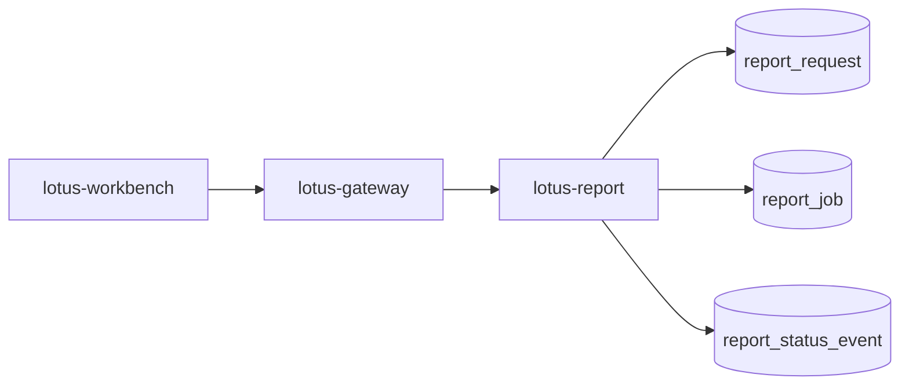

# RFC-0100: Reporting Gateway Invocation And Job Ledger Foundation

- Status: Proposed
- Date: 2026-04-23
- Owners:
  - `lotus-report` owners
  - `lotus-gateway` owners
  - `lotus-workbench` owners for product-surface adoption
  - lotus-platform governance
- Target repositories:
  - `lotus-report`
  - `lotus-gateway`
  - `lotus-workbench`
  - `lotus-platform`
- Depends on:
  - `RFC-0099-enterprise-reporting-and-document-archive-target-architecture.md`
  - `RFC-0026-synchronous-vs-asynchronous-integration-patterns.md`
  - `RFC-0071-centralized-environment-scoped-service-addressing-and-ingress-governance.md`
  - `RFC-0072-platform-wide-multi-lane-ci-validation-and-release-governance.md`
  - `lotus-report/rfcs/RFC-0002-first-class-portfolio-review-report-endpoint.md`

## Summary

This RFC defines the first implementation step toward the RFC-0099 target architecture: gateway-first
report initiation and a durable report request/job ledger in `lotus-report`.

The goal is to make report generation a governed workflow with durable request identity,
idempotency, status, failure categorization, traceability, and product-facing gateway posture before
rendering, archive, and batch production are added.

## Problem

`lotus-report` currently exposes report-data APIs, but enterprise report generation needs durable
job lifecycle records. Workbench must not call `lotus-report` directly for front-office report
generation. Gateway must become the product-facing initiation and status boundary, while
`lotus-report` owns the durable job ledger and internal orchestration state.

Without this foundation:

1. ad hoc PDF/report generation cannot be safely asynchronous,
2. duplicate requests cannot be resolved through idempotency,
3. operators cannot inspect report job state,
4. later rendering and archive steps have no durable parent job,
5. Workbench can drift into raw service coupling.

## Target Scope

In scope:

1. `lotus-report` report request/job durable data model,
2. report initiation API in `lotus-report`,
3. report job status API in `lotus-report`,
4. idempotency key and request-hash behavior,
5. status and failure vocabulary,
6. gateway-facing report initiation and status APIs,
7. Workbench migration path to gateway-first report initiation where applicable,
8. OpenAPI/Swagger documentation and examples,
9. supported-features updates only after implementation-backed behavior exists.

Out of scope:

1. PDF rendering,
2. `lotus-render`,
3. `lotus-archive`,
4. batch scheduling,
5. retention, legal hold, and document download,
6. full report data snapshot lineage beyond job parent identifiers; RFC-0101 owns that.

## Architecture Direction

Canonical front-office path:



`lotus-gateway` is the product-facing boundary. `lotus-report` is the durable job owner.

`lotus-report` must persist:

1. `report_request`,
2. `report_job`,
3. `report_status_event`,
4. idempotency key and request hash,
5. trigger identity and trigger type,
6. caller context references,
7. correlation and trace identifiers.

## Platform Governance And Mesh Requirements

1. Gateway-first invocation must follow RFC-0071 ingress and service-addressing posture.
2. Job-creating APIs must follow RFC-0026 async command/status/result semantics.
3. PR validation must follow RFC-0072 lane expectations for every touched repository.
4. If report job or lineage data becomes a governed data/evidence product, RFC-0084 and RFC-0091
   declaration, telemetry, SLO, access, and evidence requirements must be updated in the same slice.
5. Swagger/OpenAPI examples must use supported product names and must not leak RFC names.

## API Direction

Gateway product APIs:

```text
POST /api/v1/reports/portfolio-reviews
GET  /api/v1/report-jobs/{job_id}
```

`lotus-report` internal APIs:

```text
POST /reports/portfolio-reviews
GET  /reports/jobs/{job_id}
POST /reports/jobs/{job_id}/cancel
```

Initial job states:

1. `accepted`,
2. `queued`,
3. `collecting_data`,
4. `data_ready`,
5. `completed`,
6. `completed_with_warnings`,
7. `failed`,
8. `cancelled`.

Initial failure categories:

1. `entitlement_failed`,
2. `validation_failed`,
3. `upstream_data_failed`,
4. `data_incomplete`,
5. `timeout`,
6. `cancelled`,
7. `operator_intervention_required`.

## Implementation Slices

### Slice 0: Cleanup And Structure

1. Review `lotus-report` reporting routers, services, docs, and wiki for duplicate or stale
   reporting initiation language.
2. Remove or clarify direct-Workbench invocation wording.
3. Prepare module boundaries for `report-orchestrator` and `report-lineage-ledger`.
4. Update repo-local wiki source only for long-lived operator truth.
5. Record explicit no-wiki-change decision if no wiki source changes are needed.

### Slice 1: Report Job Ledger

1. Add durable report request/job/status-event models and migrations in `lotus-report`.
2. Add idempotency key and request-hash handling.
3. Add unit and migration tests for idempotent create, duplicate request, status transition, and
   failure category behavior.

### Slice 2: `lotus-report` APIs

1. Add report initiation and status APIs.
2. Preserve existing portfolio review JSON contract.
3. Add OpenAPI examples with full request/response examples and no RFC names in Swagger.
4. Add integration tests for submit/status/cancel and validation failures.

### Slice 3: Gateway Boundary

1. Add gateway report initiation/status routes.
2. Pass identity, tenant, region, role, correlation, trace, and idempotency context.
3. Add gateway tests proving Workbench-facing contract does not expose internal service topology.

### Slice 4: Workbench Adoption Path

1. Update Workbench only if a product flow currently initiates report generation.
2. Ensure Workbench uses gateway only.
3. Add browser or API-client tests where product behavior changes.

### Second-Last Slice: Hardening, Review, And Certification

1. Review full job-ledger implementation.
2. Verify API certification pattern compliance.
3. Verify OpenAPI examples and error contracts.
4. Verify platform governance and data mesh posture.
5. Tighten loose ends before closure.

### Final Slice: Closure

1. Update docs, wiki, context, and supported-features lists with implementation-backed behavior.
2. Review whether agent guidance or skills need changes for reporting job work.
3. Publish wiki after merge if wiki source changed.
4. Clean branch, update PR evidence, and close only when CI is green.

## Acceptance Criteria

1. Front-office report initiation is gateway-first.
2. `lotus-report` owns durable report request/job/status state.
3. Job-creating APIs are idempotent.
4. Status and failure vocabulary is explicit and tested.
5. OpenAPI examples are complete and customer/product wording does not mention RFC names.
6. Workbench does not call `lotus-report` directly for supported product flows.
7. Supported-features entries are added only for implemented and validated behavior.

## Risks

| Risk | Mitigation |
| --- | --- |
| Gateway leaks internal report topology | Gateway response models expose only supported job posture |
| Idempotency creates false duplicates | Request hash includes report type, portfolio scope, as-of date, output format, and template intent |
| Ledger becomes too generic | Keep first wave scoped to reporting job lifecycle |
| Workbench bypasses gateway | Add tests and context guidance for gateway-only product flows |

## Validation

Required validation:

1. `lotus-report` repo-native lint, typecheck, unit, integration, migration smoke, and OpenAPI checks.
2. `lotus-gateway` repo-native lint, typecheck, and route tests.
3. Workbench validation only if UI flow changes.
4. Platform vocabulary and wiki checks where docs/context change.

## Supported Features

This RFC starts with no implementation-backed supported features. Add supported-features entries
only after the gateway-first initiation and durable job ledger behavior is implemented and validated.
