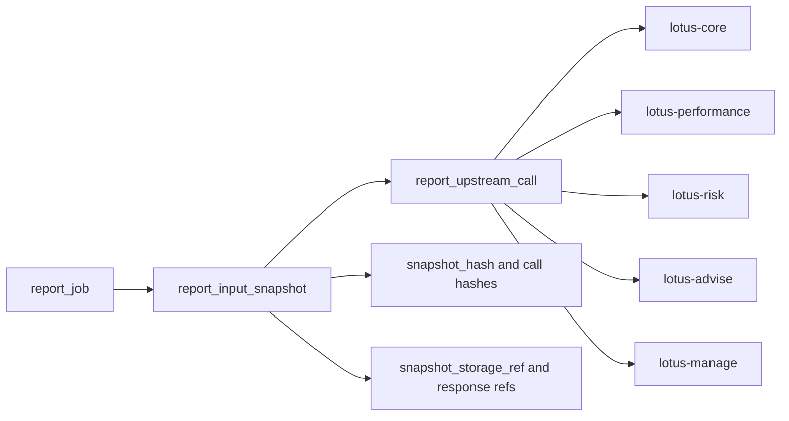

# RFC-0101: Report Data Snapshot And Lineage Contracts

- Status: Implemented
- Date: 2026-04-23
- Owners:
  - `lotus-report` owners
  - upstream domain service owners
  - `lotus-gateway` owners for any product-facing support surface
  - lotus-platform data mesh governance
- Target repositories:
  - `lotus-report`
  - `lotus-gateway`
  - `lotus-core`
  - `lotus-performance`
  - `lotus-risk`
  - `lotus-advise`
  - `lotus-manage`
  - `lotus-platform`
- Depends on:
  - `RFC-0099-enterprise-reporting-and-document-archive-target-architecture.md`
  - `RFC-0100-reporting-gateway-invocation-and-job-ledger-foundation.md`
  - `RFC-0102-render-package-template-registry-and-render-service.md`
  - `RFC-0103-document-archive-and-retrieval-contracts.md`
  - `RFC-0105-report-operations-replay-rerender-and-reissue-controls.md`
  - `RFC-0084-mesh-governance.md`
  - `RFC-0091-enterprise-data-mesh-maturity-and-production-readiness.md`

## Summary

This RFC defines the durable report input snapshot and upstream lineage contracts that sit on top of
the RFC-0100 report job ledger. The goal is to make report generation reproducible, supportable,
auditable, and explainable before rendering, archive storage, replay, rerender, or reissue flows
are introduced.

RFC-0101 is the contract and persistence foundation for answering these questions with evidence:

1. what exact data inputs produced a report-ready payload,
2. when that input set was captured,
3. which upstream calls and contract versions were used,
4. whether each upstream input was complete, partial, unavailable, or unsupported,
5. whether a later rerender or regenerate request is acting on the same input state or a changed
   input state.

This RFC is implementation-bearing once accepted. It must be delivered slice by slice. It must not
absorb render-package behavior, archive/document lifecycle behavior, or operator replay/rerender
mutation flows owned by later RFCs.

## Critical Review Outcome

The prior draft described the core idea correctly but was not yet an execution-grade RFC. It was
too ambiguous in the areas that mattered most in RFC-0100 delivery:

1. slice gating was too light,
2. cross-RFC ownership boundaries were too easy to misread,
3. proof and evidence expectations were under-specified,
4. support and operational API expectations were not explicit enough,
5. API certification and Swagger quality requirements were not written tightly enough,
6. supported-features discipline was present in spirit but not yet specific enough to prevent
   aspirational drift.

This revision closes those gaps and makes RFC-0101 implementation-ready.

## Problem

Generated reports cannot be certified from final PDFs or rendered documents alone. A banking-grade
reporting platform must preserve the machine-readable input state and the upstream lineage that
explains how the report-ready payload was formed.

Without explicit snapshot and lineage contracts:

1. rerender cannot prove that numbers stayed unchanged,
2. regenerate cannot explain changed numbers,
3. support teams cannot distinguish source-data issues from render or archive issues,
4. audit cannot verify source inputs and supportability posture,
5. downstream archive metadata cannot carry meaningful evidence references,
6. later replay, rerender, and reissue controls will be forced to guess at source state instead of
   operating on durable evidence.

## Implementation Prerequisites

Do not begin RFC-0101 implementation until these conditions are true:

1. RFC-0100 is merged and clean in `lotus-report`, `lotus-gateway`, and `lotus-platform`,
2. the RFC-0100 PostgreSQL-backed job ledger and operator APIs are the current truth,
3. current wiki publication is in sync for touched repositories,
4. no open architectural objection remains about whether snapshot storage is row-backed, object-ref
   backed, or hybrid for the first wave.

## Target Scope

In scope:

1. durable `report_input_snapshot` contract,
2. durable `report_upstream_call` contract,
3. canonical snapshot hashing and upstream request/response hashing rules,
4. supportability, completeness, and evidence-quality fields,
5. first-wave storage and retention posture for snapshots and lineage metadata,
6. first-wave portfolio review adoption,
7. support and operator read APIs for snapshot and lineage lookup,
8. OpenAPI and error-contract certification for any RFC-0101 APIs,
9. mesh declaration and evidence alignment where the implementation materially changes product
   evidence posture,
10. implementation-backed supported-features updates only after proof passes.

Out of scope:

1. render-package structure, template registry behavior, or render job orchestration,
2. archive/document binary storage, retrieval, legal hold, or retention semantics,
3. replay, rerender, regenerate, reissue, supersession, or operator mutation workflows,
4. broad upstream contract redesign,
5. customer-facing document download surfaces,
6. changing domain ownership away from upstream authoritative services.

## Cross-RFC Ownership Boundaries

RFC-0100 still owns:

1. report job creation,
2. idempotency,
3. status, list, events, and cancel,
4. the durable report request/job/event ledger.

RFC-0101 owns:

1. the durable input snapshot,
2. upstream call lineage,
3. snapshot hashing and lineage query semantics,
4. support-safe lookup APIs for that evidence.

RFC-0102 owns:

1. render package composition,
2. template registry,
3. render diagnostics and render determinism proof.

RFC-0103 owns:

1. archived document identity,
2. retrieval,
3. retention,
4. legal hold,
5. archive metadata and document lifecycle.

RFC-0105 owns:

1. replay,
2. rerender,
3. regenerate,
4. reissue,
5. operator mutation controls.

RFC-0101 may produce the evidence those RFCs depend on, but it must not implement their behavior.

## Architecture Direction

`lotus-report` owns the snapshot and lineage ledger. Upstream services remain authoritative for
their domain data and contracts. Snapshot lineage must capture enough durable evidence to explain
how a report-ready payload was derived without requiring later forensic reconstruction from logs.

Canonical relationship:

Design rules:

1. one report job may have zero or one first-wave durable input snapshot,
2. one snapshot may reference many upstream calls,
3. the snapshot must be immutable once marked captured,
4. lineage rows must be append-only from the application contract perspective,
5. supportability posture must be explicit on both the snapshot and each upstream call,
6. the snapshot contract must remain queryable without exposing sensitive raw upstream payloads by
   default.

## Persistence Direction

The first-wave persistence target is PostgreSQL in `lotus-report`, colocated with the RFC-0100 job
ledger but kept as clearly separate tables and modules.

Required persistence posture:

1. migrations create the snapshot and upstream-call tables with primary keys, foreign keys, check
   constraints, and indexes,
2. snapshot immutability is enforced through service behavior and validated through tests,
3. canonical JSON serialization is used before hashing,
4. request and response hash fields are deterministic and stable across retries,
5. large or sensitive raw payloads may be stored by redacted object reference rather than inline
   row storage when needed,
6. readiness must fail when the lineage schema is not ready,
7. support queries must be indexed by report job, snapshot id, service name, supportability status,
   and creation time.

Minimum indexes and constraints:

1. primary key on `report_input_snapshot.snapshot_id`,
2. unique foreign-key relationship from `report_input_snapshot.report_job_id` to `report_job` for
   first-wave single-snapshot posture,
3. index on `report_input_snapshot.created_at`,
4. index on `report_input_snapshot.supportability_status`,
5. index on `report_input_snapshot.report_type` and `created_at`,
6. primary key on `report_upstream_call.upstream_call_id`,
7. index on `report_upstream_call.snapshot_id`,
8. index on `report_upstream_call.service_name` and `endpoint`,
9. index on `report_upstream_call.supportability_status`,
10. index on `report_upstream_call.created_at`,
11. check constraints for snapshot and upstream-call supportability vocabulary,
12. check constraints for failure-category vocabulary where present.

## Data Model Direction

### `report_input_snapshot`

Minimum fields:

1. `snapshot_id`,
2. `report_job_id`,
3. `report_type`,
4. `report_data_contract_version`,
5. `portfolio_scope`,
6. `as_of_date`,
7. `snapshot_hash`,
8. `snapshot_storage_ref`,
9. `supportability_status`,
10. `completeness_status`,
11. `captured_at`,
12. `created_at`,
13. `correlation_id`,
14. `trace_id`,
15. `lineage_summary`.

### `report_upstream_call`

Minimum fields:

1. `upstream_call_id`,
2. `snapshot_id`,
3. `service_name`,
4. `endpoint`,
5. `method`,
6. `contract_version`,
7. `request_hash`,
8. `response_hash`,
9. `response_ref`,
10. `status_code`,
11. `latency_ms`,
12. `supportability_status`,
13. `completeness_status`,
14. `failure_category`,
15. `failure_message`,
16. `correlation_id`,
17. `trace_id`,
18. `captured_at`.

### Vocabulary Direction

Supportability and completeness values must be governed and stable. First-wave values should cover:

1. `complete`,
2. `partial`,
3. `unavailable`,
4. `not_supported`,
5. `redacted`,
6. `error`.

If a later implementation wants finer states, it must first update the platform vocabulary or the
repo-local contract and OpenAPI examples together.

## API Direction

RFC-0101 must explicitly certify any new operational APIs it introduces. The first-wave expectation
is support-safe read APIs in `lotus-report`, with gateway publication only if a product-facing or
operator-facing caller truly needs that boundary in the same RFC.

Minimum API surface expected for this RFC:

1. `GET /reports/jobs/{job_id}/snapshot`
2. `GET /reports/jobs/{job_id}/lineage`
3. `GET /reports/snapshots/{snapshot_id}`

If gateway exposes corresponding routes, it must keep the grouping and caller-context rules aligned
with RFC-0100 instead of inventing a different operational posture.

Every RFC-0101 API must be certified with:

1. correct group/tag placement,
2. explicit what/when/how guidance,
3. full request and response examples where applicable,
4. full error examples,
5. type, description, and example for every attribute,
6. support-safe redaction rules,
7. caller-context and entitlement rules documented explicitly.

## Branching And Delivery Expectations

Implementation must happen on a dedicated remote feature branch unless an active RFC-0101 branch
already exists. If an active RFC-0101 branch already exists, continue on it.

Required branch discipline:

1. keep one RFC-0101 branch per repository,
2. commit each completed and validated slice separately,
3. push after each validated slice so GitHub checks can run asynchronously,
4. monitor PR checks regularly and fix failures promptly,
5. keep RFC-0101 changes out of RFC-0102, RFC-0103, and RFC-0105 branches,
6. keep untracked evidence files out of commits unless they are repo-owned source truth,
7. maintain truthful PR descriptions and evidence sections.

## Platform Governance And Enterprise Mesh Requirements

1. Snapshot and lineage must preserve upstream domain authority boundaries from RFC-0050.
2. Any report evidence product declaration must follow RFC-0084 source ownership and consumer
   declaration rules.
3. Any promoted reporting evidence product must satisfy RFC-0091 enterprise mesh telemetry, SLO,
   access, lifecycle, and evidence-pack requirements.
4. Sensitive source payloads must be classified and redacted before logs, public artifacts, or wiki
   material reference them.
5. Snapshot evidence must clearly distinguish source-backed, partial, unavailable, and
   not-supported data.
6. Any new APIs must follow the RFC-0067 and current Lotus OpenAPI certification posture.

## Delivery Sequence

Do not move to the next slice until the current slice is implemented, validated, and in a solid
state.

### Slice 0: Cleanup And Structure

Required outcomes:

1. remove dead snapshot/lineage stubs, placeholder models, or obsolete doc fragments,
2. improve repository structure where snapshot and lineage modules would otherwise sprawl,
3. improve document structure and reduce duplicate lineage explanations,
4. move long-lived operator material to repo wiki where appropriate,
5. avoid duplicate documentation across repo and wiki,
6. ensure the wiki publication target is usable and reflects the post-RFC truth,
7. record an explicit no-wiki-change decision if wiki truth does not change.

Acceptance criteria:

1. module boundaries are clear,
2. document ownership is clear,
3. there is no duplicate authoritative explanation of snapshot behavior,
4. repo structure is cleaner than before the slice.

### Slice 1: Snapshot Contract And Storage

Required outcomes:

1. add snapshot models, persistence, and migration,
2. define canonical JSON serialization and snapshot hashing rules,
3. define storage-ref posture for large or sensitive payloads,
4. ensure snapshot immutability after capture,
5. add unit, migration, and integration tests for snapshot creation and lookup.

Acceptance criteria:

1. snapshots are durable,
2. hashes are deterministic,
3. first-wave storage posture is explicit,
4. schema and indexes are proven against PostgreSQL.

### Slice 2: Upstream Call Lineage

Required outcomes:

1. capture upstream call evidence for first-wave portfolio review generation,
2. record request hash, response hash or response ref, status code, latency, and supportability
   posture,
3. distinguish complete, partial, unavailable, unsupported, redacted, and failed inputs,
4. add tests for success, partial, failed, timeout, and unsupported upstream responses.

Acceptance criteria:

1. every first-wave upstream input path is represented in lineage,
2. supportability posture is explicit,
3. no required lineage field is inferred from logs alone,
4. redaction behavior is tested.

### Slice 3: Snapshot And Lineage Query APIs

Required outcomes:

1. add the RFC-0101 support-safe read APIs,
2. document caller-context rules explicitly,
3. certify OpenAPI and error contracts,
4. ensure Swagger is complete and grouped correctly.

Acceptance criteria:

1. API grouping is correct,
2. every attribute has description, type, and example,
3. every endpoint has clear what/when/how guidance,
4. success and error examples are complete,
5. negative-path tests cover not-found, unsupported, unavailable, and redacted cases.

### Slice 4: Data Mesh And Evidence Alignment

Required outcomes:

1. update report evidence declarations if and only if implementation-backed product truth changed,
2. validate producer/consumer declarations where applicable,
3. ensure certification does not treat placeholders as evidence truth,
4. define how snapshot lineage participates in evidence-pack posture without leaking sensitive
   source data.

Acceptance criteria:

1. mesh declarations are truthful,
2. no placeholder evidence is promoted,
3. evidence posture is aligned with RFC-0091 standards.

### Slice 5: Implementation Proof

Required outcomes:

1. prove the implementation end to end against the RFC,
2. capture evidence from the live application,
3. verify that evidence critically, not superficially,
4. identify gaps, inconsistencies, and loose ends,
5. iterate until the implementation is genuinely gold standard.

Required clean evidence pack contents:

1. full request payloads and full responses,
2. snapshot and upstream-call API responses,
3. PostgreSQL row extracts for snapshot and lineage tables,
4. index and constraint extracts,
5. runtime logs from gateway and report processes where applicable,
6. a short audit summary explaining what was proven and what was intentionally not in scope.

Rules learned from RFC-0100 that are mandatory here:

1. keep clean proof runs separate from diagnostic runs,
2. do not mix harness failures into the final evidence pack,
3. prove exact caller-context requirements with truthful request headers,
4. if a filter/list API is in scope, prove it with exact filters that isolate the intended row set.

Acceptance criteria:

1. the final evidence directory contains one clean proof run,
2. it proves both positive and negative behaviors,
3. DB state and API responses agree,
4. no unexplained drift remains between claimed and observed behavior.

### Second-Last Slice: Hardening, Review, And Certification

Required outcomes:

1. perform a proper code review of the full implementation,
2. tighten loose ends,
3. verify API certification pattern compliance,
4. verify platform governance and enterprise data mesh standards are met,
5. ensure all APIs are properly certified,
6. ensure Swagger is complete and high quality,
7. ensure error handling is complete, correct, and properly tested,
8. make final quality improvements before closure.

Specific review lenses:

1. canonical serialization consistency,
2. redaction correctness,
3. sensitive-data leakage prevention,
4. hash stability,
5. failure-category consistency,
6. storage growth and housekeeping posture,
7. support query performance,
8. domain-authority boundary correctness.

Acceptance criteria:

1. no known significant loose end remains,
2. OpenAPI quality gates pass,
3. governance and mesh validators pass where applicable,
4. code review findings are resolved or explicitly deferred with rationale.

### Final Slice: Closure

Required outcomes:

1. documentation updates,
2. agent context updates,
3. wiki updates,
4. supported-features updates,
5. branch hygiene and cleanup.

Additional required closure review:

1. review whether skills, guidance, documentation, or agent context should be improved to support
   better future work, faster ramp-up, and stronger agent effectiveness,
2. identify what should be added, removed, tightened, or clarified,
3. if no change is needed, state that explicitly as a deliberate outcome.

Acceptance criteria:

1. all implementation-bearing PRs are merged,
2. CI is green,
3. repo wiki publication is complete where required,
4. local and remote branch hygiene is complete,
5. supported-features material reflects only implemented behavior.

## Evidence Expectations

The implementation is not complete until live evidence proves:

1. snapshot creation on report generation,
2. durable linkage from job to snapshot,
3. durable linkage from snapshot to upstream calls,
4. complete and partial input posture,
5. support-safe query APIs,
6. deterministic hashes,
7. redaction behavior,
8. negative-path error handling.

Minimum proof scenarios:

1. complete upstream success,
2. partial upstream success,
3. unavailable upstream dependency,
4. unsupported upstream input,
5. snapshot lookup by job,
6. lineage lookup by snapshot or job,
7. redacted evidence path,
8. not-found API behavior.

## Risks

| Risk | Mitigation |
| --- | --- |
| Snapshot storage captures too much sensitive data | classify fields, prefer hashes and refs, test redaction, review logs and OpenAPI examples |
| Hashes are inconsistent across retries or environments | define canonical serialization and add golden-vector tests |
| Lineage becomes optional in success-only code paths | make snapshot and lineage capture part of the durable report workflow contract |
| Support APIs expose raw internals or sensitive payloads | create support-safe response models and explicit redaction behavior |
| Mesh declarations outrun implementation | update declarations only when implementation-backed product truth exists |
| RFC scope drifts into render or archive concerns | keep the RFC-0102, RFC-0103, and RFC-0105 boundaries explicit in code and docs |

## Validation Expectations

Required validation:

1. `lotus-report` repo-native lint, typecheck, unit, integration, migration, OpenAPI, and coverage
   gates,
2. gateway validation if RFC-0101 introduces or changes gateway-facing APIs,
3. PostgreSQL-backed migration and runtime proof,
4. security review of snapshot storage, redaction, and logging,
5. mesh validation if product declarations change,
6. live evidence review against the final accepted scope.

Execution expectations:

1. use GitHub effectively so checks can run asynchronously while work continues,
2. monitor pipelines at regular intervals,
3. fix failures promptly,
4. keep moving forward without losing control of quality,
5. do not allow CI health or branch quality to drift.

## Supported Features Discipline

No supported feature is added until snapshot and lineage behavior is implemented, validated, and
merged.

When implementation is complete, supported-features material should reflect only implementation-
backed entries such as:

1. durable report input snapshot capture,
2. durable upstream call lineage capture,
3. support-safe snapshot lookup,
4. support-safe lineage lookup,
5. explicit supportability and completeness posture.

Those entries must be added only in the final closure slice after proof is complete.

## Acceptance Criteria

RFC-0101 is complete only when all of the following are true:

1. snapshots are durable and immutable after capture,
2. upstream call lineage is durable and queryable,
3. canonical hashes are deterministic and tested,
4. partial, unavailable, unsupported, and redacted posture are explicit,
5. support APIs are certified and support-safe,
6. OpenAPI and error contracts are complete and high quality,
7. live evidence proves the end-to-end implementation cleanly,
8. mesh and governance posture is truthful,
9. supported-features, docs, wiki, and branch hygiene are complete.
