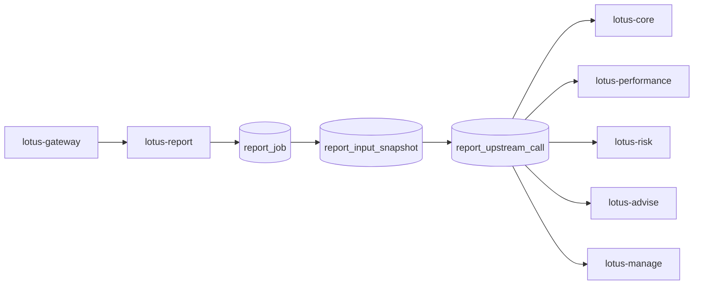

# RFC-0101: Report Data Snapshot And Lineage Contracts

- Status: Proposed
- Date: 2026-04-23
- Owners:
  - `lotus-report` owners
  - upstream domain service owners
  - `lotus-gateway` owners for governed operator read surfaces
  - lotus-platform governance
  - lotus-platform data mesh governance
- Target repositories:
  - `lotus-report`
  - `lotus-gateway`
  - `lotus-core`
  - `lotus-performance`
  - `lotus-risk`
  - `lotus-advise`
  - `lotus-manage`
  - `lotus-platform`
- Depends on:
  - `RFC-0099-enterprise-reporting-and-document-archive-target-architecture.md`
  - `RFC-0100-reporting-gateway-invocation-and-job-ledger-foundation.md`
  - `RFC-0084-mesh-governance.md`
  - `RFC-0091-enterprise-data-mesh-maturity-and-production-readiness.md`
  - `RFC-0026-synchronous-vs-asynchronous-integration-patterns.md`
  - `RFC-0071-centralized-environment-scoped-service-addressing-and-ingress-governance.md`
  - `RFC-0072-platform-wide-multi-lane-ci-validation-and-release-governance.md`
- Followed by:
  - `RFC-0102-render-package-template-registry-and-render-service.md`
  - `RFC-0103-document-archive-retrieval-retention-and-legal-hold.md`
  - `RFC-0104-batch-reporting-scheduler-concurrency-and-recovery.md`
  - `RFC-0105-reporting-observability-operations-and-replay-tooling.md`

## Summary

This RFC defines the first durable report-input snapshot and lineage foundation for Lotus
enterprise reporting.

RFC-0100 created durable report request and job identity. RFC-0101 adds the next mandatory layer:

1. immutable report-input snapshots,
2. append-only upstream-call lineage records,
3. canonical hashing and redaction rules,
4. supportability and completeness posture for every sourced input,
5. governed operator read APIs for snapshot and lineage diagnostics,
6. portfolio-review first-wave adoption with live proof.

The goal is to make every generated report explainable and supportable before Lotus adds rendering,
archive, replay, rerender, correction, or large-scale batch production.

This RFC is implementation-bearing once accepted. It must be delivered slice by slice and must not
start PDF rendering, archive storage, batch scheduling, legal hold, or replay tooling work.
It must also not move into implementation until this RFC itself is reviewed, tightened, and
accepted as the execution contract for the work.

## Problem

Generated reports cannot be certified from final PDFs or final JSON alone.

A banking-grade reporting platform must preserve enough durable evidence to answer:

1. which inputs were used,
2. which upstream services and contracts were called,
3. whether those inputs were complete, partial, unavailable, or not supported,
4. whether the report can be rerendered identically,
5. why a rerun or corrected report would produce different numbers,
6. whether a support incident is a data issue, orchestration issue, render issue, or archive issue.

Without explicit snapshot and lineage contracts:

1. rerender cannot prove numbers stayed unchanged,
2. regenerate cannot explain changed numbers,
3. support teams cannot distinguish upstream-data issues from later render/archive issues,
4. audit cannot verify source inputs and lineage,
5. archive metadata in RFC-0103 would have weak evidence references,
6. replay and correction tooling in RFC-0105 would be unsafe or non-certifiable.

## Target Scope

In scope:

1. `report_input_snapshot` durable contract and PostgreSQL storage,
2. `report_upstream_call` append-only durable contract and PostgreSQL storage,
3. canonical request hash, response hash, and snapshot hash semantics,
4. supportability and completeness posture for snapshot and upstream-call records,
5. snapshot redaction and sensitive-payload handling rules,
6. report data contract versioning captured with the snapshot,
7. portfolio-review first-wave adoption,
8. `lotus-report` internal operator read APIs for snapshot and lineage retrieval,
9. `lotus-gateway` product-safe operator read APIs for snapshot and lineage retrieval,
10. OpenAPI/Swagger documentation and examples for every API added or changed,
11. wiki, supported-features, and context updates only after implementation-backed behavior exists,
12. data mesh declaration updates only where lineage evidence becomes an actual governed product.

Out of scope:

1. rendering templates and rendering execution,
2. PDF binary generation,
3. archive binary storage,
4. batch scheduling and batch replay,
5. user-facing document download,
6. legal hold and retention enforcement,
7. changing upstream domain ownership,
8. production replay/rerender/reissue APIs beyond the first read-only lineage foundation,
9. introducing a new archive or object-store application.

## Architecture Direction

`lotus-report` owns the durable report snapshot ledger. Upstream domain services remain
authoritative for their own data.

RFC-0101 must make lineage durable enough to support later render, archive, replay, and audit use
cases without forcing those later RFCs to reverse-engineer missing evidence.

Canonical first-wave path:



The report job from RFC-0100 remains the parent.

The snapshot becomes the immutable evidence envelope for one report-input capture. The upstream-call
records become the append-only evidence trail for how that snapshot was assembled.

### Design Principles

1. prefer durable, queryable, supportable evidence over convenience payload dumps,
2. preserve upstream domain authority instead of copying ownership into `lotus-report`,
3. capture enough evidence to explain outcomes without leaking sensitive source payloads,
4. make later render, archive, replay, correction, and audit RFCs consumers of this foundation
   rather than owners of lineage logic,
5. keep first-wave implementation operationally simple enough to prove locally, in CI, and in live
   evidence packs.

### Core Decisions

1. The first-wave persistence target is PostgreSQL in `lotus-report`, not file storage and not a
   separate archive service.
2. The first-wave snapshot may store a redacted canonical JSON payload in PostgreSQL, plus hashes
   and structured source references. It must not require object storage to function.
3. Snapshot records are immutable after finalization. Corrections or regenerated inputs create a
   new snapshot, not in-place mutation.
4. Upstream-call lineage records are append-only.
5. Gateway remains the product-facing boundary for operator read APIs.
6. Public/operator APIs must expose support-safe lineage summaries and references, not raw
   unredacted upstream payloads.

### Why PostgreSQL First

RFC-0100 already established PostgreSQL as the report job ledger persistence target. RFC-0101
should extend that same operational model instead of splitting evidence across ad hoc stores before
the archive layer exists.

Benefits:

1. transactional association with `report_job`,
2. supportable indexed querying,
3. consistent readiness and migration posture,
4. simpler local and CI proof,
5. no premature storage-service sprawl.

Object storage may be introduced later if snapshot size or retention economics require it, but the
first wave must be certifiable and operationally simple.

## Service Boundaries And API Direction

### `lotus-report`

`lotus-report` owns:

1. snapshot creation,
2. upstream-call evidence capture,
3. snapshot immutability enforcement,
4. canonical hashing,
5. redacted evidence payload preparation,
6. internal operator lineage retrieval APIs.

### `lotus-gateway`

`lotus-gateway` owns:

1. product-facing operator lineage read APIs,
2. caller-context enforcement,
3. product-safe response posture,
4. error normalization,
5. gateway-relative links and route grouping.

### Upstream services

`lotus-core`, `lotus-performance`, `lotus-risk`, `lotus-advise`, and `lotus-manage` remain
authoritative for their own domain payloads. This RFC does not move their ownership, but it does
require `lotus-report` to capture lineage against their current governed APIs.

### API Surfaces

Gateway product-facing operator APIs:

```text
GET /api/v1/report-jobs/{job_id}/snapshot
GET /api/v1/report-jobs/{job_id}/lineage
```

`lotus-report` internal APIs:

```text
GET /reports/jobs/{job_id}/snapshot
GET /reports/jobs/{job_id}/lineage
```

This RFC does not introduce public mutation APIs for snapshots or lineage. Capture happens as part
of the report-job orchestration path inside `lotus-report`.

### Operator API Boundaries

1. job submission and lifecycle commands remain governed by RFC-0100,
2. RFC-0101 adds read-only evidence retrieval APIs only,
3. raw unredacted payload retrieval is explicitly out of scope,
4. any future replay, rerender, reissue, correction, or archive retrieval command surface belongs
   to later RFCs and must consume the evidence foundation created here instead of bypassing it.

## Platform Governance And Mesh Requirements

1. Snapshot and upstream-call evidence must preserve domain-authority boundaries from RFC-0050.
2. Any report evidence product declaration must follow RFC-0084 source ownership and consumer
   declaration rules.
3. Any promoted reporting evidence product must satisfy RFC-0091 telemetry, SLO, access, lifecycle,
   and evidence-pack requirements.
4. Snapshot evidence must clearly distinguish `ready`, `partial`, `unavailable`, and
   `not_supported` posture.
5. Sensitive source payloads must be redacted before logs, public artifacts, operator APIs, wiki
   examples, or live evidence are published.
6. Job and snapshot APIs must follow RFC-0026 async command/status/result semantics where
   applicable and must stay consistent with RFC-0100 route grouping and certification posture.
7. Swagger/OpenAPI examples must use product names and must not leak RFC names.
8. Every endpoint added or changed by this RFC must explain what it does, when to call it, and how
   it should be used safely.
9. Every public request and response attribute must carry type, description, and example coverage
   in OpenAPI.

## Data Model Direction

### `report_input_snapshot`

Minimum fields:

1. `snapshot_id`,
2. `report_job_id`,
3. `report_request_id`,
4. `report_type`,
5. `report_data_contract_version`,
6. `portfolio_scope_json`,
7. `as_of_date`,
8. `reporting_currency`,
9. `requested_output_formats_json`,
10. `snapshot_status`,
11. `supportability_status`,
12. `completeness_status`,
13. `snapshot_hash`,
14. `canonical_snapshot_json`,
15. `snapshot_storage_ref`,
16. `source_ref_ids_json`,
17. `redaction_policy_version`,
18. `created_at`,
19. `finalized_at`,
20. `superseded_by_snapshot_id`.

### `report_upstream_call`

Minimum fields:

1. `upstream_call_id`,
2. `snapshot_id`,
3. `service_name`,
4. `endpoint`,
5. `method`,
6. `contract_version`,
7. `request_hash`,
8. `response_hash`,
9. `request_ref`,
10. `response_ref`,
11. `status_code`,
12. `latency_ms`,
13. `correlation_id`,
14. `trace_id`,
15. `supportability_status`,
16. `completeness_status`,
17. `failure_category`,
18. `failure_message`,
19. `captured_at`.

### Vocabulary Direction

`snapshot_status` first wave:

1. `collecting`,
2. `finalized`,
3. `failed`.

`supportability_status` first wave:

1. `ready`,
2. `partial`,
3. `unavailable`,
4. `not_supported`.

`completeness_status` first wave:

1. `complete`,
2. `partial`,
3. `empty`,
4. `not_applicable`.

These vocabularies must be enforced in code, OpenAPI, and database constraints.

## Snapshot, Hashing, And Redaction Rules

### Canonical Hashing

RFC-0101 must define deterministic canonical JSON hashing for:

1. the finalized report snapshot payload,
2. upstream request payloads where present,
3. upstream response payloads where present.

Hashing rules:

1. sorted keys,
2. deterministic separators,
3. normalized dates/timestamps,
4. canonical handling for nulls and omitted fields,
5. explicit tests with golden vectors.

### Redaction

The first wave must distinguish:

1. payload stored inline and safe,
2. payload stored only as hash plus supportability metadata because it is sensitive,
3. payload unavailable because upstream did not return it,
4. payload unsupported because the feature is not sourced.

The redaction policy must be explicit and versioned via `redaction_policy_version`.

The first wave must not expose:

1. raw secrets,
2. raw authentication headers,
3. raw upstream host topology beyond governed service names,
4. raw PII fields not already approved for support surfaces.

## Persistence Direction

RFC-0101 extends the RFC-0100 PostgreSQL ledger with new tables, foreign keys, and indexes.

Required posture:

1. `report_input_snapshot.report_job_id` references `report_job.report_job_id`,
2. `report_upstream_call.snapshot_id` references `report_input_snapshot.snapshot_id`,
3. snapshots are immutable after finalization from the application-contract perspective,
4. upstream-call records are append-only,
5. readiness fails if snapshot/lineage schema is missing after migration,
6. indexing supports support lookups by job, snapshot, service, supportability status, and time.

Minimum indexes:

1. unique `report_input_snapshot.snapshot_id`,
2. unique partial constraint ensuring one active finalized snapshot per `report_job_id` in the
   first wave,
3. index on `report_input_snapshot.report_job_id`,
4. index on `report_input_snapshot.created_at`,
5. index on `report_input_snapshot.snapshot_status`,
6. index on `report_input_snapshot.supportability_status`,
7. index on `report_upstream_call.snapshot_id`,
8. index on `report_upstream_call.service_name` and `captured_at`,
9. index on `report_upstream_call.supportability_status`,
10. index on `report_upstream_call.failure_category`.

### Operational Database Posture

The first wave must be supportable as a production ledger, not just as a development store.

Required posture:

1. migrations are forward-only and repeatable,
2. DDL and migration smoke prove clean bootstrap on PostgreSQL,
3. indexes are intentionally chosen for operator lookup paths, not added opportunistically,
4. housekeeping is limited to non-destructive operational maintenance in this RFC; retention and
   purge policy remain for RFC-0103,
5. any partitioning decision must preserve global job-to-snapshot lookup and idempotent support
   semantics and therefore is not assumed by this RFC,
6. readiness and diagnostics must fail loudly when schema drift or required index drift is present.

## Sequencing And Dependency Rules

This RFC must be implemented in order. A later slice must not begin until the current slice is
implemented, validated, and reviewed.

Mandatory sequencing:

1. Cleanup And Structure
2. Snapshot Contract And Storage Foundation
3. Upstream Call Lineage Capture
4. Operator Read APIs
5. Portfolio-Review First-Wave Adoption
6. Mesh And Governance Alignment
7. Implementation Proof
8. Second-Last Hardening, Review, And Certification
9. Final Closure

Rules:

1. slice acceptance criteria are gating, not descriptive,
2. proof and hardening slices are mandatory delivery work, not optional polish,
3. any discovered cross-repository prerequisite must be resolved in the owning repository before
   dependent slices can be called complete,
4. if a slice exposes a missing upstream prerequisite, the RFC implementation must either close the
   gap or record a governed, explicit dependency with owner, impact, and blocked acceptance
   criterion,
5. no later RFC work may be smuggled into this RFC under the label of "future-proofing".

## Implementation Slices

### Slice 0: Cleanup And Structure

1. Review current `lotus-report` lineage, evidence, coverage, and report-data docs, code, tests,
   and wiki.
2. Remove dead code and stale lineage/evidence helpers made obsolete by the RFC-0101 direction.
3. Improve repository structure where needed so snapshot and upstream-call evidence ownership is
   clear.
4. Improve document structure and reduce sprawl by converting duplicate long-lived docs into links.
5. Move durable operator lineage truth to repo-local `wiki/` source where it belongs.
6. Avoid duplicate documentation across repo docs and wiki.
7. Ensure the wiki is published, usable, and reflects the true post-RFC state of the application.

Acceptance criteria:

1. snapshot and lineage ownership boundaries are clear in code and docs,
2. stale or duplicate lineage material is removed or linked,
3. no unrelated cleanup is bundled into this slice,
4. wiki source is either updated and publishable or an explicit no-wiki-change decision is
   recorded.

### Slice 1: Snapshot Contract And Storage Foundation

1. Add PostgreSQL-backed `report_input_snapshot` schema, migrations, models, and repository logic.
2. Define snapshot finalization, immutability, and supersession semantics.
3. Add canonical snapshot hashing and redaction policy versioning.
4. Add readiness checks and migration smoke for the snapshot table.
5. Add unit and integration tests for creation, immutability, supersession posture, and hash
   determinism.

Acceptance criteria:

1. snapshots persist durably in PostgreSQL,
2. finalized snapshots are immutable through application contracts,
3. snapshot hashes are deterministic and covered by tests,
4. readiness fails when snapshot schema is unavailable.

### Slice 2: Upstream Call Lineage Capture

1. Add PostgreSQL-backed `report_upstream_call` schema, migrations, models, and repository logic.
2. Capture upstream service name, endpoint, method, contract version, request hash, response hash,
   response posture, latency, trace, and supportability semantics for portfolio-review assembly.
3. Add append-only write rules.
4. Add tests for success, partial, unavailable, timeout, and not-supported upstream responses.

Acceptance criteria:

1. every finalized first-wave snapshot carries queryable upstream-call lineage,
2. upstream-call rows are append-only,
3. response posture is explicit for sourced, partial, unavailable, and not-supported inputs,
4. hashes and status metadata are stored without leaking unsafe payloads.

### Slice 3: Operator Read APIs

1. Add `lotus-report` internal read APIs for job snapshot and lineage retrieval.
2. Add `lotus-gateway` product-safe operator read APIs for job snapshot and lineage retrieval.
3. Group APIs correctly under `Report Jobs` and ensure they are clearly distinguished from report
   generation commands.
4. Ensure Swagger is complete and high quality:
   - grouped correctly,
   - clear what/when/how guidance for each endpoint,
   - full request and response examples,
   - every attribute has description, type, and example value,
   - complete error contracts and examples.
5. Add tests for success, unknown job, missing caller context, and product-safe error handling.

Acceptance criteria:

1. both internal and gateway operator read surfaces are implemented,
2. all APIs are properly certified,
3. Swagger is complete and operator-usable,
4. no RFC names leak into public API text,
5. error handling is complete, correct, and properly tested.

### Slice 4: Portfolio-Review First-Wave Adoption

1. Wire portfolio-review job completion so the report-input snapshot and upstream-call lineage are
   created as part of the first-wave reporting flow.
2. Ensure snapshot creation is mandatory for the supported first-wave path rather than optional best
   effort.
3. Record supportability and completeness posture in the snapshot from actual upstream outcomes.
4. Update `lotus-report` supported-features only after the behavior is implemented and validated.

Acceptance criteria:

1. first-wave portfolio review jobs create a durable finalized snapshot when successful,
2. partial and unavailable upstream states are reflected truthfully in lineage,
3. supported-features wording is implementation-backed, not aspirational.

### Slice 5: Mesh And Governance Alignment

1. Update report evidence product declarations only if the lineage surfaces now qualify as governed
   products.
2. Validate producer and consumer declarations where updated.
3. Ensure data mesh certification does not treat placeholder lineage as certified evidence.

Acceptance criteria:

1. mesh declarations are updated only when implementation-backed,
2. governance artifacts and runtime truth do not drift,
3. any no-change decision is explicit and justified.

### Implementation Proof Slice

1. Prove the implementation end to end against this RFC.
2. Capture evidence from the live application, including:
   - gateway request and response for job snapshot retrieval,
   - gateway request and response for job lineage retrieval,
   - internal `lotus-report` request and response where useful,
   - PostgreSQL rows for `report_input_snapshot` and `report_upstream_call`,
   - logs proving trace and correlation continuity,
   - evidence showing partial/unavailable or redacted posture where applicable.
3. Verify that evidence critically, not superficially.
4. Identify gaps, inconsistencies, and loose ends.
5. Iterate until the implementation is genuinely gold standard.

Minimum evidence pack contents:

1. gateway submit request and response for a first-wave portfolio-review job,
2. gateway snapshot retrieval request and response,
3. gateway lineage retrieval request and response,
4. internal `lotus-report` retrieval request and response where useful for diagnosis,
5. PostgreSQL query output for the created `report_job`, `report_input_snapshot`, and
   `report_upstream_call` rows,
6. log excerpts proving correlation and trace continuity,
7. evidence for at least one redacted field posture or hash-only payload posture,
8. evidence for at least one non-perfect upstream posture such as `partial`, `unavailable`, or
   `not_supported`, if the supported first-wave scenario can reproduce it truthfully,
9. a written audit of the evidence explaining what is proven, what remains out of scope, and what
   future RFCs still own.

Acceptance criteria:

1. live evidence proves snapshot and lineage creation and retrieval end to end,
2. evidence review explicitly calls out what is proven and what is not,
3. any gaps found are fixed or deliberately deferred with rationale,
4. proof artifacts are stored in a governed output location and referenced truthfully.

### Second-Last Slice: Hardening, Review, And Certification

1. Perform a proper code review of the full implementation.
2. Tighten loose ends.
3. Verify API certification pattern compliance.
4. Verify platform governance and enterprise data mesh standards are met.
5. Ensure all APIs are properly certified.
6. Ensure Swagger is complete and high quality:
   - grouped correctly,
   - clear what/when/how guidance for each endpoint,
   - full request and response examples,
   - every attribute has description, type, and example value.
7. Ensure error handling is complete, correct, and properly tested.
8. Verify sensitive payload handling, redaction, hashing, and immutability semantics.
9. Make final quality improvements before closure.

Mandatory review lenses:

1. architectural simplicity and module boundaries,
2. database correctness, index quality, and operational query posture,
3. API certification and OpenAPI completeness,
4. sensitive-data handling and log safety,
5. failure-mode correctness and error-contract fidelity,
6. dead code, duplicate logic, and stale compatibility handling,
7. test depth and realism,
8. mesh-governance and platform-governance compliance.

Acceptance criteria:

1. review findings are fixed or explicitly deferred with rationale,
2. API certification evidence is current and specific,
3. governance and mesh checks are green or governed as explicit deviations,
4. implementation is ready for final documentation and closure.

### Final Closure Slice

1. Documentation updates.
2. Agent context updates.
3. Wiki updates.
4. Supported-features updates.
5. Branch hygiene and cleanup.
6. Consciously review whether skills, guidance, documentation, or agent context should be improved
   to support better future work, faster ramp-up, and stronger agent effectiveness.
7. Identify what should be added, removed, tightened, or clarified.
8. If no changes are needed, state that explicitly as a deliberate outcome.

Acceptance criteria:

1. docs, wiki, context, and supported-features material match implementation truth,
2. wiki source has been checked before merge and published after merge if changed,
3. branch is clean and PR evidence is truthful,
4. future guidance and skill improvements are explicitly recorded, even if the outcome is
   deliberate no change.

## Branching And Delivery

Implementation must happen on a dedicated remote feature branch unless an active RFC-0101 branch
already exists. If an active RFC-0101 branch exists, continue on it.

Required branch discipline:

1. keep `lotus-report`, `lotus-gateway`, and any upstream adoption changes on separate repository
   branches unless a repository already has an active RFC-0101 branch,
2. commit each completed and validated slice separately,
3. push after each validated slice so GitHub checks can run asynchronously,
4. monitor PR checks regularly and fix failures promptly,
5. do not start RFC-0102 or later work on the RFC-0101 branches,
6. keep untracked local output and evidence files out of commits unless the RFC explicitly requires
   them as source artifacts,
7. keep PR descriptions aligned with the slices actually delivered.

Execution expectations:

1. use GitHub effectively so checks can run asynchronously while implementation continues,
2. monitor pipelines at regular intervals,
3. fix failures promptly and on the owning branch,
4. keep moving forward without losing control of quality,
5. do not allow CI health or branch quality to drift,
6. keep evidence truthful; do not claim a slice is complete before its acceptance criteria and
   proof are actually satisfied.

## Slice-to-Repository Responsibility

| Slice | Primary repositories | Notes |
| --- | --- | --- |
| Cleanup And Structure | `lotus-report`, `lotus-gateway`, `lotus-platform` | Only repositories materially changed by the slice should be touched |
| Snapshot Contract And Storage Foundation | `lotus-report` | PostgreSQL schema, migrations, hashing, redaction, readiness |
| Upstream Call Lineage Capture | `lotus-report` | May require coordination with upstream owners for contract version truth |
| Operator Read APIs | `lotus-report`, `lotus-gateway` | Gateway is the product-facing boundary |
| Portfolio-Review First-Wave Adoption | `lotus-report` | Upstream repos change only if contract corrections are truly required |
| Mesh And Governance Alignment | `lotus-platform`, `lotus-report`, `lotus-gateway` | Only if lineage surfaces become implementation-backed governed products |
| Implementation Proof | changed repositories plus local runtime dependencies | Evidence must be end to end |
| Hardening And Review | all changed repositories | Review is cross-repository if the slice crossed repositories |
| Final Closure | all changed repositories | Docs, wiki, supported-features, context, branch hygiene |

## Acceptance Criteria

1. Report-input snapshots are durable and immutable after finalization.
2. Upstream-call lineage is queryable by report job and snapshot.
3. Snapshot hashes make rerender and reproduce workflows auditable.
4. Partial, unavailable, and not-supported upstream data is explicitly represented.
5. Sensitive payloads are not leaked in logs, wiki examples, Swagger examples, or public evidence.
6. Portfolio review uses the snapshot and lineage contract for first-wave proof.
7. Gateway-first operator read APIs exist for snapshot and lineage diagnostics.
8. All APIs introduced or changed by this RFC are properly certified.
9. Swagger is grouped correctly and fully documented with type, description, and example coverage.
10. Supported-features material reflects only implementation-backed behavior.

## Risks

| Risk | Mitigation |
| --- | --- |
| Snapshot stores too much sensitive data | Use redaction, classification, inline-safe payload rules, and hash-only posture where needed |
| Snapshot storage becomes fragmented too early | Keep first-wave storage in PostgreSQL and defer external object-store complexity |
| Hashes are inconsistent across environments | Define canonical serialization and test golden vectors |
| Lineage becomes optional or best effort | Make snapshot creation part of the supported report-job lifecycle |
| Upstream services lack source refs | Capture request/response hashes and explicit unavailable posture first, then improve refs in later RFCs |
| Operator APIs leak too much detail | Keep gateway responses support-safe and certify every field |
| Mesh declarations get ahead of implementation | Update declarations only when lineage surfaces are actually delivered |
| RFC-0102 or RFC-0103 are blocked by ambiguity | Define snapshot ownership, immutability, supersession, and retrieval semantics now |

## Validation

Required validation:

1. `lotus-report` repo-native lint, typecheck, unit, integration, migration, OpenAPI, and coverage
   gates.
2. `lotus-gateway` repo-native lint, typecheck, contract, integration, and OpenAPI gates.
3. Data mesh validation if declarations change.
4. Security review of snapshot storage, redaction, and logging posture.
5. Live end-to-end validation proving:
   - job creation through gateway,
   - snapshot creation in `lotus-report`,
   - lineage capture for upstream calls,
   - snapshot retrieval through gateway,
   - lineage retrieval through gateway,
   - PostgreSQL evidence rows,
   - trace and correlation continuity.
6. GitHub PR checks monitored after each pushed slice.

OpenAPI and API certification validation is mandatory for every changed endpoint:

1. endpoints are grouped correctly,
2. each endpoint explains what it does, when it should be called, and how it should be used,
3. every request and response model field has type, description, and example coverage,
4. full request and response examples exist for success and relevant error cases,
5. error handling is fully described, normalized, and tested,
6. RFC names and internal design shorthand do not leak into public API descriptions.

## Supported Features

This RFC starts with no implementation-backed supported features.

Add supported-features entries only after snapshot and lineage behavior is implemented, validated,
and reflected truthfully in repository product material.

When implemented, supported-features material may mention only:

1. durable report-input snapshots,
2. append-only upstream-call lineage records,
3. gateway-first snapshot retrieval,
4. gateway-first lineage retrieval,
5. canonical snapshot and response hashing,
6. explicit supportability and completeness posture for first-wave portfolio review lineage.

It must not claim:

1. PDF rendering,
2. archive download,
3. legal hold,
4. batch replay,
5. correction or reissue tooling,
6. production certification beyond the actual implemented scope.

## Evidence Expectations

The implementation is not complete because tests pass alone. This RFC requires three evidence
layers:

1. code and test evidence,
2. OpenAPI and documentation evidence,
3. live end-to-end evidence.

The proof standard is:

1. the live evidence must be reproducible from documented commands,
2. the evidence must match the actual code on the branch under review,
3. logs, DB rows, requests, and responses must reconcile to one another,
4. any negative or partial posture demonstrated in the evidence must be explained, not hand-waved,
5. if a required proof path cannot be produced, the slice is not complete.

## Additional Risks And Watchpoints

1. snapshot payload shape drifts from report data contract version semantics,
2. gateway operator APIs accidentally become internal debug dumps instead of certified support
   surfaces,
3. first-wave lineage capture is implemented only for success paths and misses partial or failure
   semantics,
4. PostgreSQL evidence grows without any operator query discipline, causing support pain before
   retention RFCs land,
5. documentation and wiki drift away from the implemented route grouping and error contracts,
6. future render or archive RFCs may try to bypass the lineage foundation if the ownership rules
   are not explicit now.
