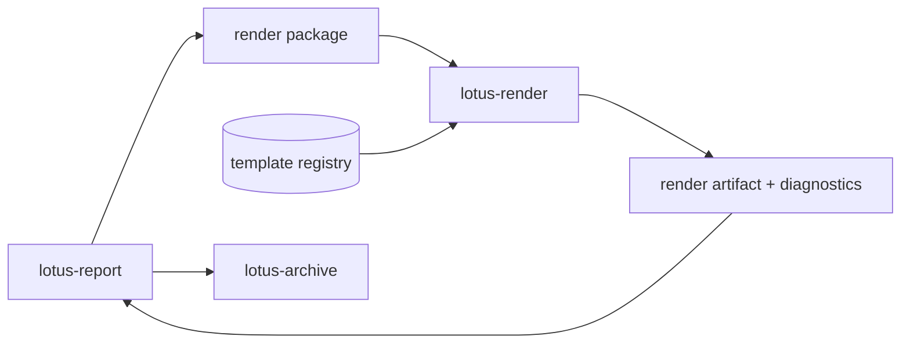

# RFC-0102: Render Package, Template Registry, And `lotus-render`

- Status: Proposed
- Date: 2026-04-23
- Owners:
  - future `lotus-render` owners
  - `lotus-report` owners
  - lotus-platform governance
- Target repositories:
  - `lotus-render`
  - `lotus-report`
  - `lotus-platform`
- Depends on:
  - `RFC-0099-enterprise-reporting-and-document-archive-target-architecture.md`
  - `RFC-0100-reporting-gateway-invocation-and-job-ledger-foundation.md`
  - `RFC-0101-report-data-snapshot-and-lineage-contracts.md`

## Summary

This RFC defines `lotus-render`, the deterministic rendering service that converts governed render
packages into PDF and future human-readable formats. It also defines the render package contract,
template registry, Typst adoption path, template versioning, render diagnostics, and rendering
validation evidence.

## Problem

Rendering inside `lotus-report` would mix data orchestration, template governance, PDF runtime
dependencies, and CPU-heavy work in one service. Enterprise reporting needs a separate rendering
boundary that cannot fetch business data and can be scaled, tested, versioned, and diagnosed
independently.

## Target Scope

In scope:

1. `lotus-render` service/repository creation or explicitly extraction-ready module if repository
   creation is deferred,
2. render package schema,
3. template registry and manifest,
4. Typst PDF rendering direction,
5. render job lifecycle and diagnostics,
6. golden render and visual regression tests,
7. `lotus-report` integration with render package submission.

Out of scope:

1. report data assembly,
2. document archive storage,
3. batch scheduling,
4. business ownership of report numbers,
5. unrestricted business-user template editing.

## Architecture Direction

`lotus-render` must accept a complete render package and return a render artifact or failure
diagnostic. It must not call `lotus-core`, `lotus-performance`, `lotus-risk`, `lotus-advise`,
`lotus-manage`, or `lotus-gateway` for report data.

Target path:

## Platform Governance And Mesh Requirements

1. `lotus-render` must not become a data-product authority; it consumes complete render packages
   from `lotus-report`.
2. Template registry source must be governed through PR review, CI, golden renders, and ownership
   metadata.
3. Render APIs must follow platform OpenAPI quality and API certification expectations.
4. Render evidence may be referenced by reporting evidence products, but it must not replace report
   data lineage or upstream source evidence.
5. Service creation or extraction must update platform service topology, context, wiki, and
   repository engineering context in the implementation RFC that creates the service.

## Render Package Contract

Minimum fields:

1. `render_job_id`,
2. `report_job_id`,
3. `snapshot_id`,
4. `report_type`,
5. `report_data_contract_version`,
6. `template_id`,
7. `template_version`,
8. `locale`,
9. `brand_variant`,
10. `output_format`,
11. `render_context`,
12. `report_data`,
13. `lineage_refs`.

## Template Registry

The registry must declare:

1. template ID,
2. template version,
3. supported report types,
4. supported report-data contract versions,
5. supported locales,
6. supported brand variants,
7. supported output formats,
8. required disclosure fragments,
9. owner and approval metadata,
10. golden sample IDs.

## Implementation Slices

### Slice 0: Cleanup And Structure

1. Review existing report template/rendering docs and remove duplicates.
2. Decide whether first slice creates `lotus-render` repository or extraction-ready module.
3. Ensure no rendering responsibility remains ambiguously documented in `lotus-report`.
4. Prepare wiki source for long-lived render operator guidance.

### Slice 1: Render Service Foundation

1. Scaffold `lotus-render` or extraction-ready module with repo-native CI.
2. Add health, readiness, structured logging, and trace context handling.
3. Add render job status model.

### Slice 2: Render Package And Template Registry

1. Implement render package validation.
2. Implement template manifest loading and compatibility checks.
3. Add tests for unsupported report type, template version, locale, output format, and contract
   version.

### Slice 3: Typst PDF Rendering

1. Add Typst rendering integration.
2. Add first portfolio review template proof.
3. Add render artifact hash and diagnostics.
4. Add golden sample and visual regression evidence.

### Slice 4: `lotus-report` Integration

1. Submit render packages from `lotus-report`.
2. Record render attempts in the report ledger.
3. Add failure handling and retry posture.

### Second-Last Slice: Hardening, Review, And Certification

1. Review render service boundaries and ensure it does not fetch data.
2. Verify API certification and template-governance evidence.
3. Verify deterministic output and failure diagnostics.

### Final Slice: Closure

1. Update docs, wiki, supported-features, context, and skills/guidance.
2. Publish wiki after merge if changed.
3. Record render service support status truthfully.

## Acceptance Criteria

1. `lotus-render` has a clear service or extraction-ready module boundary.
2. Render package schema is versioned and validated.
3. Templates are versioned through a governed registry.
4. PDF rendering is deterministic enough for golden sample tests.
5. Render failures are classified and persisted in `lotus-report`.
6. Render service does not fetch business data.

## Risks

| Risk | Mitigation |
| --- | --- |
| Typst operational dependency is immature locally | Add deterministic install/run docs and CI proof |
| Template changes become uncontrolled | Require PR, registry manifest, golden renders, and visual regression evidence |
| Render package leaks sensitive data | Classify render package and avoid logs of full payload |
| Service split happens too early | Allow extraction-ready module only if API/contract boundary is preserved |

## Validation

Required validation:

1. `lotus-render` lint, typecheck, unit, integration, render smoke, and golden render tests.
2. `lotus-report` integration tests for render submission and failures.
3. Platform checks for service naming and docs/wiki consistency.

## Supported Features

No supported rendering feature may be listed until a render package, template registry entry,
render output, diagnostics, and validation evidence exist.
