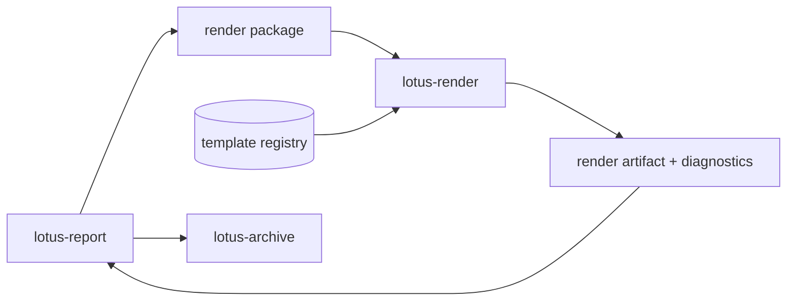

# RFC-0102: Render Package, Template Registry, And `lotus-render`

- Status: Proposed
- Date: 2026-04-23
- Owners:
  - future `lotus-render` owners
  - `lotus-report` owners
  - `lotus-gateway` owners for any product-safe render-status exposure
  - lotus-platform governance
- Target repositories:
  - future `lotus-render`
  - `lotus-report`
  - `lotus-platform`
  - `lotus-gateway` only if operator/product-safe status surfaces change
- Depends on:
  - `RFC-0099-enterprise-reporting-and-document-archive-target-architecture.md`
  - `RFC-0100-reporting-gateway-invocation-and-job-ledger-foundation.md`
  - `RFC-0101-report-data-snapshot-and-lineage-contracts.md`
  - `RFC-0026-synchronous-vs-asynchronous-integration-patterns.md`
  - `RFC-0071-centralized-environment-scoped-service-addressing-and-ingress-governance.md`
  - `RFC-0072-platform-wide-multi-lane-ci-validation-and-release-governance.md`
- Followed by:
  - `RFC-0103-document-archive-retrieval-retention-and-legal-hold.md`
  - `RFC-0104-batch-reporting-scheduler-concurrency-and-recovery.md`
  - `RFC-0105-reporting-observability-operations-and-replay-tooling.md`

## Summary

This RFC defines the deterministic rendering layer for Lotus enterprise reporting.

RFC-0100 established the gateway-first job ledger. RFC-0101 establishes report-input snapshots and
source lineage. RFC-0102 adds the next mandatory layer:

1. `lotus-render` as the rendering service boundary,
2. the governed render-package contract,
3. the template registry and compatibility model,
4. Typst-based PDF rendering direction,
5. render-job lifecycle, diagnostics, and persistence direction,
6. golden-render and visual-regression evidence,
7. `lotus-report` integration with render submission and render-attempt recording.

The goal is to make rendering deterministic, supportable, extractable, and certifiable before
archive, large-scale batch execution, and replay tooling are added.

This RFC is implementation-bearing once accepted. It must be delivered slice by slice and must not
start archive retrieval, legal hold, batch scheduling, rerender/regenerate/replay workflows, or
customer-facing document retrieval work.
It must also not move into implementation until this RFC itself is reviewed, tightened, and
accepted as the execution contract for the work.

## Problem

If rendering remains an ad hoc internal concern inside `lotus-report`, the platform will blur too
many responsibilities:

1. report-data assembly,
2. template governance,
3. CPU-heavy PDF rendering,
4. render diagnostics,
5. output compatibility,
6. future extraction into a dedicated service.

Enterprise reporting needs a rendering boundary that:

1. accepts only complete render packages,
2. never fetches business data itself,
3. validates template and contract compatibility deterministically,
4. produces render diagnostics and output hashes,
5. can be tested through golden outputs and visual regression evidence,
6. stays cleanly separable from archive and replay concerns.

Without this boundary:

1. render failures are hard to distinguish from data-assembly failures,
2. template changes become difficult to govern safely,
3. deterministic rerender later becomes uncertain,
4. `lotus-report` becomes increasingly monolithic,
5. future archive and replay RFCs inherit ambiguous render ownership.

## Target Scope

In scope:

1. `lotus-render` service/repository creation or explicitly extraction-ready module if repository
   creation is deferred,
2. render-package contract and validation,
3. template registry, template manifest, and compatibility model,
4. Typst PDF rendering direction and governed runtime posture,
5. render-job lifecycle and diagnostics,
6. render attempt persistence in `lotus-report`,
7. golden render and visual regression evidence,
8. `lotus-report` integration with render package submission,
9. API/OpenAPI expectations for any render-facing or render-related API added or changed,
10. docs, wiki, supported-features, and context updates only after implementation-backed behavior
   exists.

Out of scope:

1. report data assembly and upstream lineage capture,
2. archive storage, document retrieval, retention, legal hold, or document supersession,
3. batch scheduling and concurrency control,
4. rerender, regenerate, replay, or reissue command workflows,
5. business ownership of report numbers,
6. unrestricted business-user editing of production templates,
7. HTML preview or other non-PDF output formats as first-wave supported features unless
   implementation-backed in the same RFC.

## Architecture Direction

`lotus-render` must accept a complete render package and return a render artifact or failure
diagnostic. It must not call `lotus-core`, `lotus-performance`, `lotus-risk`, `lotus-advise`,
`lotus-manage`, or `lotus-gateway` for business data.

Target path:

### Design Principles

1. rendering consumes complete inputs rather than reconstructing missing business context,
2. template governance is source-controlled, versioned, and certifiable,
3. render diagnostics must be durable enough for operator support and later replay semantics,
4. render output must be deterministic enough for golden proof within defined environment bounds,
5. the first wave must be extraction-ready even if service creation is staged.

### Core Decisions

1. `lotus-render` is the target-state service name and ownership boundary.
2. A first implementation may begin as an extraction-ready module only if the API, contract,
   diagnostics, and template-governance boundaries are preserved exactly as if it were a separate
   service.
3. Typst is the preferred first-wave PDF engine.
4. Templates must not fetch business data or invoke upstream APIs.
5. `lotus-report` remains the owner of render submission, job correlation, and render-attempt
   lineage.
6. Final document archive remains out of scope and belongs to RFC-0103.

## Adjacent RFC Alignment

### Relationship To RFC-0100

RFC-0100 owns:

1. gateway-first report submission,
2. job identity and lifecycle,
3. status/events/list/cancel APIs,
4. PostgreSQL job ledger posture.

RFC-0102 must extend that foundation by adding render-attempt behavior and diagnostics without
redefining RFC-0100 job ownership or public job lifecycle semantics.

### Relationship To RFC-0101

RFC-0101 owns:

1. `snapshot_id`,
2. report-input snapshot immutability,
3. upstream-call lineage,
4. source evidence and hashing posture.

RFC-0102 consumes that foundation. It must not re-invent snapshot semantics or bypass RFC-0101
lineage with render-time data fetching.

### Relationship To RFC-0103

RFC-0102 owns render output and diagnostics, but not document archival.

RFC-0102 may define:

1. render artifact hash,
2. render output metadata needed by `lotus-report`,
3. compatibility between template version and render output.

RFC-0102 must not define:

1. document IDs,
2. object storage,
3. retention,
4. legal hold,
5. document download APIs,
6. document supersession semantics.

RFC-0102 must hand off enough archive-ready metadata to RFC-0103, but only as render output
evidence:

1. output hash,
2. output size and MIME type where available,
3. template identity and render service version,
4. render completion timestamp,
5. render-attempt identifier.

RFC-0103 remains the owner of turning that evidence into a durable archived document record.

### Relationship To RFC-0105

RFC-0102 must create the render-attempt evidence that later enables:

1. rerender,
2. replay diagnostics,
3. render-failure classification,
4. render-latency observability.

RFC-0102 must not introduce those mutation or replay commands itself.

For avoidance of doubt:

1. RFC-0102 may define the evidence needed for future rerender,
2. RFC-0102 must not expose rerender APIs,
3. RFC-0102 must not expose replay APIs,
4. RFC-0102 must not define operator workflows that imply replay authority already exists.

## Service Boundaries And API Direction

### `lotus-render`

`lotus-render` owns:

1. render package validation,
2. template registry loading and compatibility checks,
3. PDF rendering,
4. render diagnostics,
5. render artifact hashing,
6. render failure classification,
7. render-service health and readiness.

### `lotus-report`

`lotus-report` owns:

1. deciding when a render should start,
2. constructing the complete render package,
3. correlating render work to `report_job_id` and `snapshot_id`,
4. persisting render-attempt lineage,
5. deciding whether a render failure should fail the report job or remain in a partial state.

`lotus-report` must not take archive shortcuts in this RFC by treating a render artifact as an
archived document. Render completion and archive completion remain distinct lifecycle steps.

### `lotus-gateway`

Gateway is not expected to become a direct rendering API surface in this RFC. If any render-related
status surfaces are exposed, they must remain product-safe and job-centric through RFC-0100 job
status posture rather than exposing raw render-service topology.

## Platform Governance And Mesh Requirements

1. `lotus-render` must not become a domain-data-product authority.
2. Template registry source must be governed through PR review, CI, golden renders, compatibility
   checks, and ownership metadata.
3. Render APIs must follow platform OpenAPI quality and API certification expectations.
4. Render evidence may be referenced by reporting evidence products, but it must not replace
   RFC-0101 report data lineage or upstream source evidence.
5. Service creation or extraction must update platform service topology, context, wiki, and
   repository engineering context in the implementation RFC that creates the service.
6. Public/product-safe API text must not leak RFC names or implementation-roadmap wording.
7. Every changed endpoint must explain what it does, when to call it, and how it should be used
   safely.
8. Every public request and response attribute must carry type, description, and example coverage
   in OpenAPI.

## Render Package Contract

Minimum fields:

1. `render_job_id`,
2. `report_job_id`,
3. `snapshot_id`,
4. `report_type`,
5. `report_data_contract_version`,
6. `template_id`,
7. `template_version`,
8. `locale`,
9. `brand_variant`,
10. `output_format`,
11. `render_context`,
12. `report_data`,
13. `lineage_refs`.

### Render Context Direction

`render_context` must be governed and bounded. First-wave minimum fields:

1. `correlation_id`,
2. `trace_id`,
3. `requested_by_type`,
4. `requested_by_id` when permitted,
5. `generation_timestamp`,
6. `render_reason`,
7. `classification`,
8. `disclosure_bundle_refs`.

The render package must carry enough context to render deterministically, but must not become a
dumping ground for unrelated upstream payloads or raw secrets.

### Hashing Direction

RFC-0102 must define deterministic hashing for:

1. the render package canonical payload or package reference,
2. the output binary,
3. the template manifest identity used for rendering.

Golden-vector tests are required for canonical package hashing where feasible.

Binary output hashing must be stable for the exact generated artifact bytes. If first-wave
determinism is environment-bounded rather than universal, the RFC implementation must state the
supported runtime envelope explicitly and prove determinism inside that envelope.

## Template Registry

The registry must declare:

1. template ID,
2. template version,
3. supported report types,
4. supported report-data contract versions,
5. supported locales,
6. supported brand variants,
7. supported output formats,
8. required disclosure fragments,
9. owner and approval metadata,
10. golden sample IDs.

### Registry Governance Direction

The first wave must also define:

1. manifest schema validation,
2. compatibility failure behavior,
3. deprecation posture for older templates,
4. how disclosure fragments are versioned,
5. how business-owned text changes are governed without bypassing code review,
6. how template/runtime compatibility is certified in CI.

The registry must also make it explicit whether a template is:

1. active,
2. deprecated-but-rerenderable,
3. blocked for new rendering,
4. blocked entirely due to compatibility or governance failure.

## Render Attempt And Diagnostics Direction

RFC-0102 must define a durable render-attempt model, whether stored in `lotus-report` or in an
extraction-ready boundary designed to stay stable after service split.

Minimum fields:

1. `render_attempt_id`,
2. `render_job_id`,
3. `report_job_id`,
4. `snapshot_id`,
5. `template_id`,
6. `template_version`,
7. `render_service_version`,
8. `output_format`,
9. `package_hash`,
10. `output_hash`,
11. `status`,
12. `failure_category`,
13. `failure_message`,
14. `duration_ms`,
15. `created_at`,
16. `completed_at`.

Failure categories should distinguish at least:

1. `package_validation_failed`,
2. `template_compatibility_failed`,
3. `template_runtime_failed`,
4. `render_timeout`,
5. `output_validation_failed`,
6. `operator_intervention_required`.

The first wave should also define whether a failed render-attempt can be retried automatically
within the same report job or requires later RFC-0105 operator action. The implementation must not
leave retry posture implicit.

## Sequencing And Dependency Rules

This RFC must be implemented in order. A later slice must not begin until the current slice is
implemented, validated, and reviewed.

Mandatory sequencing:

1. Cleanup And Structure
2. Render Service Foundation
3. Render Package And Template Registry
4. Typst PDF Rendering
5. `lotus-report` Integration
6. Implementation Proof
7. Second-Last Hardening, Review, And Certification
8. Final Closure

Rules:

1. slice acceptance criteria are gating, not descriptive,
2. proof and hardening slices are mandatory delivery work,
3. if repository creation is deferred, the extraction-ready module must still satisfy the same
   contract and evidence bar,
4. no archive, replay, or batch semantics may be smuggled into this RFC under "future-proofing",
5. any required cross-repository prerequisite must be resolved before dependent slices close.

Render-service extraction, if deferred, must still preserve:

1. a stable package contract,
2. a stable diagnostics model,
3. a stable render-attempt persistence contract,
4. a documented extraction path that does not require redesigning first-wave callers.

## Implementation Slices

### Slice 0: Cleanup And Structure

1. Review existing report template/rendering docs, code, tests, and wiki for duplicate or stale
   rendering guidance.
2. Decide whether the first implementation creates a new `lotus-render` repository or an
   extraction-ready module.
3. Ensure no rendering responsibility remains ambiguously documented in `lotus-report`.
4. Improve repository structure where needed for render service, template registry, and diagnostics
   ownership.
5. Improve document structure and reduce sprawl by converting duplicate long-lived docs into links.
6. Move durable render operator and template-governance truth to repo-local `wiki/` source where
   appropriate.
7. Avoid duplicate documentation across repo docs and wiki.
8. Ensure the wiki is published, usable, and reflects the true post-RFC state of the application.

Acceptance criteria:

1. rendering ownership boundaries are clear in code and docs,
2. stale or duplicate rendering material is removed or linked,
3. the service-vs-module decision is explicit and justified,
4. wiki source is either updated and publishable or an explicit no-wiki-change decision is
   recorded.

### Slice 1: Render Service Foundation

1. Scaffold `lotus-render` or extraction-ready module with repo-native CI and health/readiness
   posture.
2. Add structured logging, trace propagation, and bounded runtime configuration.
3. Define render-job status and render-attempt persistence direction.
4. Add tests for service/module bring-up and readiness behavior.

Acceptance criteria:

1. the render boundary is concretely scaffolded,
2. health and readiness are implementation-backed,
3. trace and correlation identifiers flow into the render boundary,
4. render-attempt ownership is explicit and durable,
5. the service-vs-module decision does not leave future extraction ambiguous.

### Slice 2: Render Package And Template Registry

1. Implement render package validation.
2. Implement template manifest loading and compatibility checks.
3. Define canonical render-package hashing.
4. Add tests for unsupported report type, template version, locale, output format, and contract
   version.
5. Add tests for invalid disclosure bundles, invalid manifest shape, and unsafe package content
   handling.

Acceptance criteria:

1. render packages are versioned and validated deterministically,
2. template compatibility checks are explicit and tested,
3. unsafe or incomplete packages fail before rendering starts,
4. package hashing and manifest identity are durable and supportable,
5. template lifecycle posture is explicit enough for later rerender and archive reasoning.

### Slice 3: Typst PDF Rendering

1. Add Typst rendering integration.
2. Add first portfolio-review template proof.
3. Add output hash and render diagnostics.
4. Add golden sample rendering and visual regression evidence.
5. Add tests for render timeout, invalid template runtime, and output validation failure.

Acceptance criteria:

1. Typst rendering works through the governed render boundary,
2. output hashes and diagnostics are durable,
3. deterministic rendering is proven to the defined first-wave evidence standard,
4. failures are classified and supportable,
5. determinism claims are bounded truthfully to the supported runtime envelope when applicable.

### Slice 4: `lotus-report` Integration

1. Submit render packages from `lotus-report`.
2. Record render attempts in the report ledger.
3. Add failure handling and bounded retry posture where appropriate.
4. Ensure report-job state integrates cleanly with render-attempt outcomes without redefining
   RFC-0100 job ownership.
5. Update supported-features only after behavior is implemented and validated.

Acceptance criteria:

1. `lotus-report` can submit a supported first-wave render package,
2. render-attempt records are correlated to `report_job_id` and `snapshot_id`,
3. render failures are reflected truthfully without leaking archive or replay semantics,
4. supported-features wording is implementation-backed, not aspirational,
5. render completion remains clearly separate from archive completion.

### Implementation Proof Slice

1. Prove the implementation end to end against this RFC.
2. Capture evidence from the live application, including:
   - render package submission,
   - render-attempt persistence,
   - Typst render output and hash,
   - diagnostics for at least one failure case,
   - logs proving trace and correlation continuity,
   - golden-render or visual-regression proof.
3. Verify that evidence critically, not superficially.
4. Identify gaps, inconsistencies, and loose ends.
5. Iterate until the implementation is genuinely gold standard.

Minimum evidence pack contents:

1. request/response or internal invocation proof for the render boundary,
2. persisted render-attempt rows,
3. output artifact hash evidence,
4. template registry and compatibility evidence,
5. logs showing trace and correlation continuity,
6. at least one controlled render failure case with correct failure category,
7. explicit proof of the supported determinism envelope,
8. a written audit explaining what is proven and what later RFCs still own.

Acceptance criteria:

1. live evidence proves render submission, rendering, and diagnostics end to end,
2. evidence review explicitly calls out what is proven and what is not,
3. any gaps found are fixed or deliberately deferred with rationale,
4. proof artifacts are stored in a governed output location and referenced truthfully.

### Second-Last Slice: Hardening, Review, And Certification

1. Perform a proper code review of the full implementation.
2. Tighten loose ends.
3. Verify API certification pattern compliance.
4. Verify platform governance and enterprise data mesh requirements are met where applicable.
5. Ensure all APIs are properly certified.
6. Ensure Swagger is complete and high quality:
   - grouped correctly,
   - clear what/when/how guidance for each endpoint,
   - full request and response examples,
   - every attribute has description, type, and example value.
7. Ensure error handling is complete, correct, and properly tested.
8. Verify deterministic rendering evidence, template-governance quality, and sensitive-data
   handling in logs and diagnostics.
9. Make final quality improvements before closure.

Mandatory review lenses:

1. architectural simplicity and extraction readiness,
2. template-registry governance quality,
3. render determinism and environment sensitivity,
4. API certification and OpenAPI completeness,
5. failure-mode correctness and diagnostics fidelity,
6. dead code, duplicate logic, and stale compatibility handling,
7. test depth and realism,
8. boundary clarity with RFC-0101, RFC-0103, and RFC-0105.
9. archive-handoff clarity and non-overlap with document lifecycle ownership.

Acceptance criteria:

1. review findings are fixed or explicitly deferred with rationale,
2. API certification evidence is current and specific,
3. deterministic render proof is current and supportable,
4. implementation is ready for final documentation and closure.

### Final Closure Slice

1. Documentation updates.
2. Agent context updates.
3. Wiki updates.
4. Supported-features updates.
5. Branch hygiene and cleanup.
6. Consciously review whether skills, guidance, documentation, or agent context should be improved
   to support better future work, faster ramp-up, and stronger agent effectiveness.
7. Identify what should be added, removed, tightened, or clarified.
8. If no changes are needed, state that explicitly as a deliberate outcome.

Acceptance criteria:

1. docs, wiki, context, and supported-features material match implementation truth,
2. wiki source has been checked before merge and published after merge if changed,
3. branch is clean and PR evidence is truthful,
4. future guidance and skill improvements are explicitly recorded, even if the outcome is
   deliberate no change.

## Branching And Delivery

Implementation must happen on a dedicated remote feature branch unless an active RFC-0102 branch
already exists. If an active RFC-0102 branch exists, continue on it.

Required branch discipline:

1. keep `lotus-render`, `lotus-report`, `lotus-platform`, and any `lotus-gateway` changes on
   separate repository branches unless a repository already has an active RFC-0102 branch,
2. commit each completed and validated slice separately,
3. push after each validated slice so GitHub checks can run asynchronously,
4. monitor PR checks regularly and fix failures promptly,
5. do not start RFC-0103 or later work on RFC-0102 branches,
6. keep untracked local output and evidence files out of commits unless the RFC explicitly requires
   them as source artifacts,
7. keep PR descriptions aligned with the slices actually delivered.

Execution expectations:

1. use GitHub effectively so checks can run asynchronously while implementation continues,
2. monitor pipelines at regular intervals,
3. fix failures promptly and on the owning branch,
4. keep moving forward without losing control of quality,
5. do not allow CI health or branch quality to drift,
6. keep evidence truthful; do not claim a slice is complete before its acceptance criteria and
   proof are actually satisfied.

## Slice-to-Repository Responsibility

| Slice | Primary repositories | Notes |
| --- | --- | --- |
| Cleanup And Structure | future `lotus-render`, `lotus-report`, `lotus-platform` | Only materially changed repositories should be touched |
| Render Service Foundation | future `lotus-render` or extraction-ready boundary | Service-vs-module decision must stay explicit |
| Render Package And Template Registry | future `lotus-render`, `lotus-report` | Package validation and manifest compatibility |
| Typst PDF Rendering | future `lotus-render` | Includes golden and visual regression proof |
| `lotus-report` Integration | `lotus-report`, future `lotus-render` | Correlation and render-attempt persistence |
| Implementation Proof | changed repositories plus local runtime dependencies | Evidence must be end to end |
| Hardening And Review | all changed repositories | Review is cross-repository if the slice crossed repositories |
| Final Closure | all changed repositories | Docs, wiki, supported-features, context, branch hygiene |

## Prerequisites For Implementation Start

RFC-0102 implementation should not begin until:

1. RFC-0100 request/job/event ownership is stable,
2. RFC-0101 snapshot and lineage contracts are stable enough to supply `snapshot_id`,
   `report_data_contract_version`, and source evidence references,
3. the service-vs-extraction-ready-module decision is explicit,
4. the implementation plan names the exact repositories and modules in scope for each slice,
5. the golden-render and visual-regression proof approach is agreed before coding begins.

## Acceptance Criteria

1. `lotus-render` has a clear service or extraction-ready module boundary.
2. Render package schema is versioned and validated.
3. Templates are versioned through a governed registry.
4. PDF rendering is deterministic enough for golden sample tests under the defined first-wave
   environment posture.
5. Render failures are classified and persisted in `lotus-report`.
6. Render service does not fetch business data.
7. APIs introduced or changed by this RFC are properly certified.
8. Swagger is grouped correctly and fully documented with type, description, and example coverage.
9. Supported-features material reflects only implementation-backed behavior.

## Risks

| Risk | Mitigation |
| --- | --- |
| Typst operational dependency is immature locally | Add deterministic install/run docs, CI proof, and environment-bound determinism expectations |
| Template changes become uncontrolled | Require PR, manifest schema, golden renders, visual regression evidence, and ownership metadata |
| Render package leaks sensitive data | Classify package content, avoid full payload logs, and test redaction posture |
| Service split happens too early or too late | Allow extraction-ready module only if service boundary remains explicit and testable |
| Render determinism varies across runtime environments | Define supported runtime posture and prove first-wave environment controls |
| Render concerns bleed into archive or replay RFCs | Keep output/archive/replay ownership boundaries explicit in code and docs |

## Validation

Required validation:

1. `lotus-render` or extraction-ready boundary lint, typecheck, unit, integration, render smoke,
   and golden render tests.
2. `lotus-report` integration tests for render submission and render failures.
3. Platform checks for service naming, docs, wiki, and context consistency.
4. API certification checks for every new or changed API.
5. Live end-to-end validation proving:
   - render package submission,
   - template compatibility checks,
   - Typst render output,
   - render diagnostics,
   - persisted render-attempt evidence,
   - trace and correlation continuity.
6. GitHub PR checks monitored after each pushed slice.

OpenAPI and API certification validation is mandatory for every changed endpoint:

1. endpoints are grouped correctly,
2. each endpoint explains what it does, when it should be called, and how it should be used,
3. every request and response model field has type, description, and example coverage,
4. full request and response examples exist for success and relevant error cases,
5. error handling is fully described, normalized, and tested,
6. RFC names and internal design shorthand do not leak into public API descriptions.

Cross-RFC validation is also required:

1. render-package fields required by RFC-0101 snapshots remain compatible with snapshot semantics,
2. output and diagnostics required later by RFC-0103 archive flows are available or explicitly
   deferred,
3. rerender and replay semantics are not accidentally implemented under RFC-0102 despite being
   reserved for RFC-0105,
4. render completion is not presented as document availability before RFC-0103 archive ownership
   exists.

## Supported Features

This RFC starts with no implementation-backed supported features.

Add supported-features entries only after render behavior is implemented, validated, and reflected
truthfully in repository product material.

When implemented, supported-features material may mention only:

1. governed render-package validation,
2. template registry compatibility enforcement,
3. Typst PDF rendering for supported report types,
4. durable render diagnostics and output hashing,
5. `lotus-report` render submission and render-attempt recording.
6. bounded deterministic rendering posture for the supported runtime envelope.

It must not claim:

1. archive download,
2. legal hold,
3. batch production,
4. replay,
5. rerender/regenerate operator commands,
6. production certification beyond the actual implemented scope.

## Evidence Expectations

The implementation is not complete because tests pass alone. This RFC requires three evidence
layers:

1. code and test evidence,
2. OpenAPI and documentation evidence,
3. live end-to-end rendering evidence.

The proof standard is:

1. the live evidence must be reproducible from documented commands,
2. the evidence must match the actual code on the branch under review,
3. logs, render-attempt rows, requests, and outputs must reconcile to one another,
4. any determinism caveat must be explained explicitly rather than hand-waved,
5. if a required proof path cannot be produced, the slice is not complete.

## Additional Risks And Watchpoints

1. template compatibility rules may be underspecified and later block rerender or archive
   compatibility decisions,
2. render success may be misinterpreted operationally as archive success if lifecycle boundaries are
   not kept explicit,
3. extraction-ready module posture may become a permanent ambiguous compromise if not governed
   tightly,
4. visual regression evidence may be noisy or non-actionable if the supported runtime envelope is
   not controlled.

## Open Questions

1. Should the first implementation create a dedicated `lotus-render` repository immediately, or is
   an extraction-ready module the lower-risk first step?
2. Which disclosures should be embedded directly in templates versus injected as governed fragments?
3. Should visual-regression proof use rendered-image comparison, PDF structural comparison, or a
   layered approach for first-wave certification?
