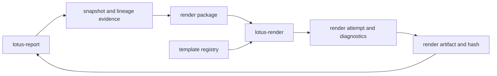

# RFC-0102: Render Package, Template Registry, And `lotus-render`

- Status: Proposed
- Date: 2026-04-23
- Owners:
  - future `lotus-render` owners
  - `lotus-report` owners
  - `lotus-gateway` owners for any product-facing operator surface
  - lotus-platform governance
- Target repositories:
  - `lotus-render`
  - `lotus-report`
  - `lotus-gateway`
  - `lotus-platform`
- Depends on:
  - `RFC-0099-enterprise-reporting-and-document-archive-target-architecture.md`
  - `RFC-0100-reporting-gateway-invocation-and-job-ledger-foundation.md`
  - `RFC-0101-report-data-snapshot-and-lineage-contracts.md`
  - `RFC-0072-platform-wide-multi-lane-ci-validation-and-release-governance.md`
  - `RFC-0084-mesh-governance.md`
  - `RFC-0091-enterprise-data-mesh-maturity-and-production-readiness.md`

## Summary

This RFC defines the deterministic rendering boundary for Lotus reporting. It introduces:

1. `lotus-render` as the rendering service or an extraction-ready first module if repository
   creation is consciously deferred,
2. the governed render package contract passed from `lotus-report` to the renderer,
3. the governed template registry and template lifecycle rules,
4. deterministic render-attempt and render-diagnostic contracts,
5. golden-render and visual-regression proof expectations,
6. the first-wave `lotus-report` integration path for portfolio review rendering.

The goal is to make rendering a separately governable, supportable, testable, and certifiable
boundary before archive, document retrieval, rerender, replay, or batch orchestration behavior is
implemented.

This RFC is implementation-bearing once accepted. It must be delivered slice by slice. It must not
absorb archive/document lifecycle behavior from RFC-0103 or replay/rerender/regenerate operator
mutation behavior from RFC-0105.

## Critical Review Outcome

The prior draft captured the intended rendering boundary, but it was not yet execution-grade.
Compared with what RFC-0100 and RFC-0101 required in practice, the draft was still too loose in
the areas that matter most for implementation control:

1. implementation prerequisites and sequencing were under-specified,
2. service-ownership boundaries with RFC-0101, RFC-0103, and RFC-0105 were too easy to misread,
3. proof expectations were too light for a rendering system that must make deterministic claims,
4. template-registry governance and template lifecycle posture were not explicit enough,
5. API certification and Swagger quality expectations were present in spirit but not in sufficient
   detail,
6. cleanup, structure, closure, wiki, and supported-features discipline needed sharper wording.

This revision closes those gaps and makes RFC-0102 a stronger execution guide.

## Problem

Rendering inside `lotus-report` would mix data orchestration, upstream lineage, template
governance, heavy runtime dependencies, CPU-intensive render work, artifact hashing, and
operator-facing diagnostics into one service. That would make the system harder to scale, reason
about, certify, and troubleshoot.

Enterprise reporting needs a rendering boundary that:

1. accepts a complete governed render package and never fetches business data directly,
2. versions template and disclosure behavior explicitly,
3. produces deterministic or explicitly bounded-deterministic artifacts,
4. emits supportable failure diagnostics and artifact hashes,
5. can be validated independently of snapshot capture and archive storage,
6. does not let template drift or local workstation setup masquerade as production truth.

Without that boundary:

1. render failures blur together with data failures,
2. template changes become hard to govern,
3. operator support cannot isolate render-stage issues cleanly,
4. later archive and replay flows will lack a certifiable render contract,
5. PDF generation risks being treated as a local helper instead of a production service.

## Implementation Prerequisites

Do not begin RFC-0102 implementation until these conditions are true:

1. RFC-0100 is merged and clean, and the report job ledger is the current truth,
2. RFC-0101 is merged and clean, and durable snapshot and lineage capture is the current truth,
3. current wiki publication is in sync for repositories whose reporting or render guidance would be
   affected,
4. there is no unresolved architectural objection about whether the first implementation creates a
   new `lotus-render` repository or uses an extraction-ready module in `lotus-report`,
5. there is no unresolved architectural objection about the first-wave template engine and runtime
   packaging posture.

RFC-0102 may depend on RFC-0101 evidence, but it must not reopen RFC-0101 scope.

## Target Scope

In scope:

1. `lotus-render` service creation or an explicitly extraction-ready first module if repository
   creation is deferred,
2. render package schema and versioning rules,
3. template registry, template manifest, and template lifecycle governance,
4. Typst-first PDF rendering direction for the first wave,
5. render attempt lifecycle, render diagnostics, and artifact hashing,
6. first-wave portfolio review render proof,
7. `lotus-report` integration that submits complete render packages and records render outcomes,
8. support-safe operator read APIs where needed for render status and diagnostics,
9. OpenAPI, error-contract, and Swagger certification for any RFC-0102 APIs,
10. implementation-backed supported-features updates only after proof passes.

Out of scope:

1. report input assembly and upstream data fetch orchestration,
2. input snapshot capture and lineage capture,
3. archive/document binary storage, retrieval, retention, legal hold, or supersession,
4. replay, rerender, regenerate, reissue, or operator mutation workflows,
5. unrestricted business-user template editing,
6. broad customer-facing document download surfaces,
7. batch scheduling or large-scale production queuing.

## Cross-RFC Ownership Boundaries

RFC-0100 still owns:

1. report job creation,
2. idempotency,
3. status, list, events, and cancel,
4. the durable report request/job/event ledger.

RFC-0101 still owns:

1. durable input snapshot capture,
2. upstream call lineage,
3. snapshot hashing,
4. support-safe lineage and snapshot evidence lookup.

RFC-0102 owns:

1. render package composition contract,
2. template registry and lifecycle governance,
3. render execution,
4. render-attempt diagnostics,
5. artifact hashing and golden-render proof.

RFC-0103 owns:

1. archived document identity,
2. archive retrieval and download posture,
3. retention, purge, legal hold, and document lifecycle,
4. supersession, correction, and reissue relationships.

RFC-0105 owns:

1. replay,
2. rerender,
3. regenerate,
4. operator mutation controls,
5. broader reporting observability and operations tooling.

RFC-0102 may produce the render evidence those later RFCs depend on, but it must not implement
their behavior.

Two boundary rules are especially important:

1. render completion is not archive completion,
2. retaining enough evidence to support future rerender is not the same thing as implementing a
   rerender command.
3. RFC-0102 may hand off render evidence to RFC-0103, but it does not create archive identity,
   archived-document truth, or retrieval semantics.
4. RFC-0102 may retain evidence that later enables RFC-0105 replay or rerender decisions, but it
   does not expose replay, rerender, regenerate, or operator mutation workflows.

## Architecture Direction

`lotus-render` must accept a complete render package and return either a render artifact plus
diagnostics or a failure diagnostic. It must not fetch business data from `lotus-core`,
`lotus-performance`, `lotus-risk`, `lotus-advise`, `lotus-manage`, or `lotus-gateway`.

Canonical relationship:

Design rules:

1. `lotus-report` owns render package assembly because it owns report job, snapshot, and lineage
   context,
2. `lotus-render` owns template validation, render execution, artifact hashing, and render-stage
   diagnostics,
3. template metadata must be versioned and governed through source-controlled manifests,
4. render results must be support-safe and queryable without exposing full sensitive payloads or
   templates by default,
5. the first implementation must be extraction-ready even if a separate repository is deferred,
6. render engine determinism claims must be explicitly bounded to a supported runtime envelope when
   byte-for-byte determinism is not practical across all environments.
7. render output metadata must be sufficient for later archive handoff, but archive ownership must
   remain entirely outside the render boundary.

## Platform Governance And Enterprise Mesh Requirements

1. `lotus-render` must not become a domain-data authority or a data-product authority; it consumes
   complete packages from `lotus-report`.
2. Template registry truth must be governed through PR review, CI, ownership metadata, approval
   metadata, and golden-render proof.
3. Any RFC-0102 API must follow current Lotus API certification and OpenAPI quality standards.
4. Render evidence may be referenced by reporting evidence products, but it must not replace
   RFC-0101 snapshot and lineage evidence.
5. If the service is created as a new repository, platform service topology, context, wiki, and
   repository engineering context must be updated in the same implementation program.
6. Sensitive report content must not leak into logs, metrics, or public artifacts.
7. Mesh declarations must not be updated with placeholder render products. Update them only if a
   durable implementation-backed render evidence product becomes real.

## Render Package Contract

The render package is the complete input contract passed into the rendering boundary.

Minimum fields:

1. `render_job_id`,
2. `report_job_id`,
3. `snapshot_id`,
4. `report_type`,
5. `report_data_contract_version`,
6. `template_id`,
7. `template_version`,
8. `locale`,
9. `brand_variant`,
10. `output_format`,
11. `render_context`,
12. `report_data`,
13. `lineage_refs`,
14. `disclosure_refs`,
15. `requested_by`,
16. `correlation_id`,
17. `trace_id`.

Contract rules:

1. the package must be self-sufficient for rendering and must not require follow-up business-data
   calls,
2. package schema must be versioned and validated before rendering starts,
3. large or sensitive package elements may be referenced indirectly if the render contract remains
   deterministic and supportable,
4. package content that influences visible output must be included in the artifact-hash semantics
   or the bounded-determinism statement.

## Template Registry Direction

The template registry is governed source truth. It must declare:

1. template ID,
2. template version,
3. supported report types,
4. supported report-data contract versions,
5. supported locales,
6. supported brand variants,
7. supported output formats,
8. required disclosure fragments,
9. owner and approval metadata,
10. template status,
11. golden sample IDs,
12. runtime or engine constraints where needed.

Template lifecycle statuses must be explicit. First-wave statuses:

1. `active`,
2. `deprecated_rerenderable`,
3. `blocked_for_new_renders`,
4. `blocked`.

Lifecycle rules:

1. `active` templates may be used for new renders,
2. `deprecated_rerenderable` templates may remain usable for future evidence-preserving rerender
   needs without being acceptable for new production use forever,
3. `blocked_for_new_renders` templates may not be selected for new work but remain historically
   declared,
4. `blocked` templates are fully disabled and require an explicit governance action to reuse.

## Render Attempt And Diagnostics Direction

RFC-0102 must define a durable render-attempt record or equivalent extraction-ready module boundary
that can express:

1. render attempt identity,
2. render package version,
3. template identity and version,
4. engine/runtime version,
5. output format,
6. artifact hash,
7. render duration,
8. render status,
9. failure category,
10. failure message or operator-safe diagnostic summary,
11. correlation and trace identifiers.

RFC-0102 may also define archive-ready handoff fields such as output size, MIME type, completion
timestamp, and template/runtime identity, but those fields remain render evidence only until
RFC-0103 turns them into archive-owned document metadata.

First-wave render statuses should cover:

1. `accepted`,
2. `validating_package`,
3. `rendering`,
4. `rendered`,
5. `failed`.

First-wave failure categories should cover:

1. `package_validation_failed`,
2. `template_not_supported`,
3. `template_render_failed`,
4. `engine_unavailable`,
5. `artifact_validation_failed`,
6. `timeout`,
7. `operator_intervention_required`.

## Determinism And Artifact Proof Direction

Determinism must be stated precisely.

Required posture:

1. if byte-for-byte deterministic output is achievable for the supported runtime envelope, prove it
   and treat hash equality as a hard expectation,
2. if only bounded determinism is practical, state the supported runtime envelope explicitly and
   prove within that envelope,
3. visual-regression proof must not replace artifact-hash proof when byte identity is claimed,
4. template, engine version, and package version must all participate in explaining why an output
   changed,
5. diagnostics must make it clear whether a difference came from package data, template/version
   drift, engine/runtime drift, or a failure path.

The first proof must also state whether determinism is being claimed as:

1. byte-identical output within the supported runtime envelope, or
2. bounded deterministic output where visual equivalence and artifact metadata remain stable even if
   byte identity is not guaranteed outside that envelope.

## API Direction

RFC-0102 must explicitly certify any new APIs it introduces. The first-wave default is internal
support-safe render APIs. Gateway publication should happen only if a real caller needs it in the
same RFC.

Expected internal API surface for the first wave:

1. `POST /renders`
2. `GET /renders/{render_job_id}`
3. `GET /renders/{render_job_id}/artifact-metadata`

If gateway later exposes corresponding routes in the same RFC, it must keep the grouping and
caller-context posture aligned with RFC-0100 rather than inventing a separate operational model.

Every RFC-0102 API must be certified with:

1. correct group/tag placement,
2. explicit what/when/how guidance,
3. full request and response examples where applicable,
4. full error examples,
5. type, description, and example for every attribute,
6. support-safe error and diagnostic posture,
7. explicit caller-context and authorization rules where relevant.

## Branching And Delivery Expectations

Implementation must happen on a dedicated remote feature branch unless an active RFC-0102 branch
already exists. If an active RFC-0102 branch already exists, continue on it.

Required branch discipline:

1. keep one RFC-0102 branch per touched repository,
2. commit each completed and validated slice separately,
3. push after each validated slice so GitHub checks can run asynchronously,
4. monitor PR checks regularly and fix failures promptly,
5. keep RFC-0102 changes out of RFC-0103 and RFC-0105 branches,
6. keep generated proof files out of commits unless they are intentional source truth,
7. maintain truthful PR descriptions and evidence sections.

## Delivery Sequence

Do not move to the next slice until the current slice is implemented, validated, and in a solid
state.

### Slice 0: Cleanup And Structure

Required outcomes:

1. remove dead code or placeholder rendering stubs that would confuse ownership,
2. improve repository structure where rendering, template, and diagnostics modules would otherwise
   sprawl,
3. improve document structure and reduce duplicate rendering guidance,
4. move long-lived operator and template-governance material to repo-local wiki where appropriate,
5. avoid duplicate documentation across repo docs and wiki,
6. ensure the wiki publication target is usable and reflects the post-RFC truth,
7. record an explicit no-wiki-change decision if wiki truth does not change.

Acceptance criteria:

1. module boundaries are clear,
2. document ownership is clear,
3. there is no duplicate authoritative explanation of rendering behavior,
4. repository structure is cleaner than before the slice.

### Slice 1: Render Service Foundation

Required outcomes:

1. create `lotus-render` as a new repository or establish an extraction-ready module boundary with
   a conscious service-creation decision,
2. add health, readiness, structured logging, and trace-context handling,
3. define the render job and render attempt model,
4. add repo-native CI posture and local runtime setup,
5. add unit and integration tests for service bring-up and failure posture.

Acceptance criteria:

1. the rendering boundary is explicit and extraction-ready,
2. readiness reflects runtime availability,
3. no business-data fetch path exists in the renderer,
4. the service or module is governable through repo-native checks.

### Slice 2: Render Package And Template Registry

Required outcomes:

1. implement render package validation,
2. implement template manifest loading and compatibility checks,
3. implement explicit template lifecycle status handling,
4. add tests for unsupported report type, template version, locale, brand variant, output format,
   and contract version,
5. add tests for blocked and deprecated template posture.

Acceptance criteria:

1. render packages are versioned and validated,
2. template compatibility is explicit and test-backed,
3. lifecycle posture is explicit and supportable,
4. registry truth is PR-governed and machine-validated.

### Slice 3: Typst PDF Rendering And Diagnostics

Required outcomes:

1. integrate Typst rendering for the first supported report type,
2. add the first portfolio review template proof,
3. add artifact hash generation and render diagnostics,
4. add golden sample and visual-regression evidence,
5. define and test bounded determinism posture where necessary.

Acceptance criteria:

1. the first supported PDF render path is real and validated,
2. artifact hashing and diagnostics are durable and truthful,
3. golden proof exists for the supported runtime envelope,
4. no determinism claim is left vague.

### Slice 4: `lotus-report` Integration

Required outcomes:

1. submit render packages from `lotus-report`,
2. record render attempts and outcomes in the reporting flow,
3. add failure handling and retry posture only for internal transient delivery to the render stage,
4. ensure `lotus-report` still owns data assembly and does not push business-data fetching into the
   renderer,
5. add integration tests covering success, package-validation failure, template mismatch, and
   render failure diagnostics.

Acceptance criteria:

1. `lotus-report` can submit a complete render package to the renderer,
2. render outcomes are reflected in reporting state truthfully,
3. failure posture is explicit and operator-safe,
4. no archive or replay semantics are introduced accidentally,
5. no render outcome is described as archived, retrievable, reissued, replayed, or rerenderable by
   command unless a later RFC has explicitly implemented that behavior.

### Slice 5: Implementation Proof

Required outcomes:

1. prove the implementation end to end against the RFC,
2. capture evidence from the live application,
3. verify that evidence critically, not superficially,
4. identify gaps, inconsistencies, and loose ends,
5. iterate until the implementation is genuinely gold standard.

Required clean evidence pack contents:

1. render package request and response evidence,
2. render status and artifact-metadata API responses,
3. template registry proof for the rendered template,
4. artifact hashes,
5. golden render and visual-regression outputs,
6. runtime logs from report and render processes where applicable,
7. a short audit summary explaining what was proven and what was intentionally out of scope.

Mandatory proof rules learned from RFC-0100 and RFC-0101:

1. keep clean proof runs separate from diagnostic runs,
2. do not mix harness failures into the final evidence pack,
3. prove exact runtime and version envelope when determinism is claimed,
4. if an operator/status API is in scope, prove it with exact requests that isolate the intended
   render attempt and artifact.

Acceptance criteria:

1. the final evidence directory contains one clean proof run,
2. it proves positive and negative render behavior,
3. artifact metadata, diagnostics, and hashes agree,
4. no unexplained drift remains between claimed and observed behavior.

### Second-Last Slice: Hardening, Review, And Certification

Required outcomes:

1. perform a proper code review of the full implementation,
2. tighten loose ends,
3. verify API certification pattern compliance,
4. verify platform governance and enterprise data mesh standards are met,
5. ensure all APIs are properly certified,
6. ensure Swagger is complete and high quality,
7. ensure error handling is complete, correct, and properly tested,
8. make final quality improvements before closure.

Specific review lenses:

1. render boundary purity and no-data-fetch discipline,
2. template-governance correctness,
3. deterministic-output claims versus actual proof,
4. artifact-hash stability,
5. support-safe diagnostics and redaction,
6. engine/runtime packaging reliability,
7. support query performance and status clarity,
8. avoidance of archive/replay scope leakage.
9. archive-handoff evidence clarity without archive-ownership leakage,
10. replay/rerender readiness evidence without replay/rerender command leakage.

Acceptance criteria:

1. no known significant loose end remains,
2. OpenAPI quality gates pass,
3. governance and mesh validators pass where applicable,
4. code review findings are resolved or explicitly deferred with rationale.

### Final Slice: Closure

Required outcomes:

1. documentation updates,
2. agent context updates,
3. wiki updates,
4. supported-features updates,
5. branch hygiene and cleanup.

Additional required closure review:

1. review whether skills, guidance, documentation, or agent context should be improved to support
   better future work, faster ramp-up, and stronger agent effectiveness,
2. identify what should be added, removed, tightened, or clarified,
3. if no change is needed, state that explicitly as a deliberate outcome.

Acceptance criteria:

1. all implementation-bearing PRs are merged,
2. CI is green,
3. repo wiki publication is complete where required,
4. local and remote branch hygiene is complete,
5. supported-features material reflects only implemented behavior.

## Evidence Expectations

Implementation is not complete until live evidence proves:

1. render package validation,
2. template registry compatibility enforcement,
3. real render execution for the first supported template,
4. artifact hash generation,
5. support-safe diagnostics,
6. golden render behavior,
7. negative-path render failures,
8. truthful `lotus-report` to `lotus-render` integration.

Minimum proof scenarios:

1. successful render with a supported template,
2. unsupported template or contract mismatch,
3. deterministic or bounded-deterministic repeat render proof,
4. render-engine failure path,
5. package-validation failure path,
6. artifact-metadata lookup,
7. visual-regression comparison,
8. support-safe operator response without sensitive leakage,
9. explicit proof that render evidence exists without implying archive retrieval or replay command
   support.

## Validation Expectations

Required validation:

1. `lotus-render` repo-native lint, typecheck, unit, integration, render smoke, and OpenAPI
   checks,
2. golden-render and visual-regression tests for supported templates,
3. `lotus-report` integration tests for render package submission and render failures,
4. gateway validation only if RFC-0102 introduces or changes gateway-facing APIs,
5. platform validation for service topology, docs/wiki consistency, and any contract or context
   updates,
6. security review of template loading, render package handling, and logging,
7. live evidence review against the final accepted scope,
8. cross-RFC validation that RFC-0103 archive semantics and RFC-0105 replay semantics are not
   accidentally claimed in APIs, docs, supported-features text, or proof artifacts.

Execution expectations:

1. use GitHub effectively so checks can run asynchronously while work continues,
2. monitor pipelines at regular intervals,
3. fix failures promptly,
4. keep moving forward without losing control of quality,
5. do not allow CI health or branch quality to drift.

## Supported Features Discipline

No supported feature is added until rendering behavior is implemented, validated, merged, and
proven.

When implementation is complete, supported-features material should reflect only
implementation-backed entries such as:

1. governed render package submission for supported report types,
2. governed template registry for supported templates,
3. deterministic or bounded-deterministic PDF rendering within the supported runtime envelope,
4. artifact hash generation and support-safe render diagnostics,
5. first-wave portfolio review render support.

Those entries must be added only in the final closure slice after proof is complete.

It must not claim:

1. archive retrieval,
2. legal hold or retention,
3. customer-facing document download,
4. replay, rerender, regenerate, or operator mutation controls,
5. broad multi-format support unless implemented and proven.

## Risks

| Risk | Mitigation |
| --- | --- |
| Typst runtime or packaging behaves differently across environments | define a supported runtime envelope, prove within it, and document the envelope explicitly |
| Template changes become uncontrolled | require PR-governed registry manifests, ownership metadata, golden renders, and visual regression evidence |
| Render package leaks sensitive data | classify fields, prefer refs where appropriate, and test log/diagnostic redaction |
| Renderer grows data-fetch behavior over time | keep render boundary pure and test that no domain-service calls are made |
| Determinism claims are overstated | distinguish hard determinism from bounded determinism and prove only what is actually true |
| Render completion is mistaken for archive completion | keep RFC-0103 boundary explicit in docs, APIs, and supported-features language |
| Future rerender semantics leak into this RFC | keep RFC-0105 ownership explicit and avoid mutation APIs here |
| Visual regression evidence is noisy or non-actionable | define stable fixtures, runtime envelope, and artifact naming for comparison proof |

## Acceptance Criteria

RFC-0102 is complete only when all of the following are true:

1. the render boundary is explicit and governable,
2. render package schema is versioned and validated,
3. templates are governed through a versioned registry with explicit lifecycle posture,
4. the first supported PDF render path is real and validated,
5. render diagnostics and artifact hashes are durable and support-safe,
6. determinism claims are explicit, bounded where necessary, and proven,
7. `lotus-report` integration is truthful and does not move business-data ownership into the
   renderer,
8. OpenAPI and error contracts are complete and high quality,
9. live evidence proves the end-to-end implementation cleanly,
10. docs, wiki, context, supported-features, and branch hygiene are complete.
