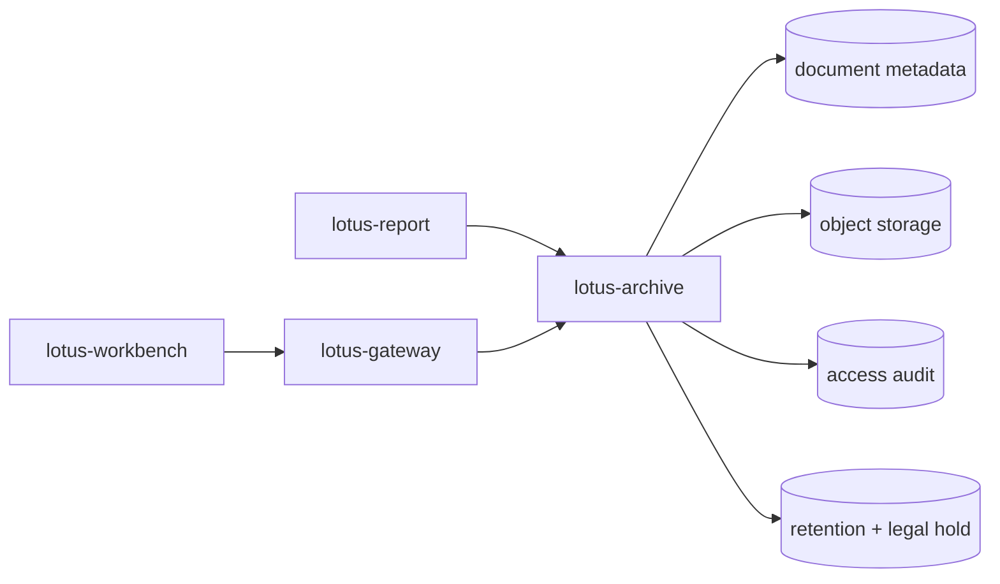

# RFC-0103: Document Archive, Retrieval, Retention, And Legal Hold

- Status: Proposed
- Date: 2026-04-23
- Owners:
  - future `lotus-archive` owners
  - `lotus-report` owners
  - `lotus-gateway` owners
  - lotus-platform governance
- Target repositories:
  - `lotus-archive`
  - `lotus-report`
  - `lotus-gateway`
  - `lotus-workbench`
  - `lotus-platform`
- Depends on:
  - `RFC-0099-enterprise-reporting-and-document-archive-target-architecture.md`
  - `RFC-0100-reporting-gateway-invocation-and-job-ledger-foundation.md`
  - `RFC-0101-report-data-snapshot-and-lineage-contracts.md`
  - `RFC-0102-render-package-template-registry-and-render-service.md`

## Summary

This RFC defines `lotus-archive`, the generated-document archive and retrieval service for Lotus.
It owns document metadata, binary storage, retention, purge, legal hold, access audit, reissue,
correction, supersession, and controlled retrieval.

## Problem

Generated reports must not be treated as files written to a local output directory. Banking-grade
reporting needs a document archive with durable metadata, access controls, retention policies, legal
hold, audit trails, and retrieval APIs.

## Target Scope

In scope:

1. `lotus-archive` service/repository or extraction-ready first module,
2. document metadata model,
3. object storage adapter,
4. archive create and retrieval APIs,
5. access audit,
6. retention and purge eligibility,
7. legal hold,
8. reissue, correction, and supersession relationships,
9. gateway document metadata/download facade.

Out of scope:

1. report data assembly,
2. rendering,
3. batch scheduling,
4. arbitrary non-Lotus file management,
5. customer communication workflow beyond generated document archival.

## Architecture Direction

Target path:

`lotus-archive` owns archive metadata and binary storage. Gateway owns product-facing retrieval.

## Platform Governance And Mesh Requirements

1. `lotus-archive` owns generated-document records, not domain data truth.
2. Archive metadata and access evidence must align with RFC-0084/RFC-0091 if promoted as a governed
   reporting evidence product.
3. Gateway remains the product-facing retrieval boundary; Workbench must not call archive APIs
   directly.
4. Document access, purge, legal hold, and supersession APIs must satisfy API certification and
   platform security governance before publication.
5. Wiki and supported-features material must distinguish archive infrastructure from
   customer-supported document retrieval features.

## Storage Direction

1. PostgreSQL for document metadata, access audit, legal hold, retention, and supersession graph.
2. S3-compatible object storage for document binaries.
3. MinIO or adapter-backed filesystem for local development behind the same abstraction.

## Document Metadata

Minimum fields:

1. `document_id`,
2. `report_job_id`,
3. `snapshot_id`,
4. `report_type`,
5. `portfolio_scope`,
6. `as_of_date`,
7. `frequency`,
8. `template_id`,
9. `template_version`,
10. `render_service_version`,
11. `report_data_contract_version`,
12. `storage_key`,
13. `checksum`,
14. `size_bytes`,
15. `mime_type`,
16. `classification`,
17. `retention_policy_id`,
18. `legal_hold_status`,
19. `superseded_by_document_id`,
20. `created_at`.

## Implementation Slices

### Slice 0: Cleanup And Structure

1. Review existing document/download/archive wording across report, gateway, Workbench, and wiki.
2. Remove duplicate or misleading storage documentation.
3. Decide whether first implementation creates `lotus-archive` repository or extraction-ready
   module.
4. Prepare archive operator wiki source.

### Slice 1: Archive Metadata And Storage Adapter

1. Add document metadata model and migration.
2. Add object storage abstraction.
3. Add local storage adapter only behind the same interface.
4. Add tests for metadata, checksum, and storage failures.

### Slice 2: Archive And Retrieval APIs

1. Add create/archive document API.
2. Add metadata lookup API.
3. Add controlled download API or short-lived URL API.
4. Add access audit.

### Slice 3: Retention, Purge, And Legal Hold

1. Add retention policy fields.
2. Add legal hold set/release APIs.
3. Add purge eligibility and housekeeping job.
4. Prove legal hold blocks purge.

### Slice 4: Reissue, Correction, And Supersession

1. Add document relationship model.
2. Add APIs to mark superseded, corrected, and reissued documents.
3. Add tests for retrieval of current vs historical documents.

### Slice 5: Gateway And Workbench Retrieval

1. Add gateway document metadata/download facade.
2. Update Workbench only if a supported retrieval surface exists.
3. Ensure no direct archive calls from Workbench.

### Second-Last Slice: Hardening, Review, And Certification

1. Review storage, retrieval, audit, and purge behavior.
2. Verify API certification, security, and platform governance.
3. Verify no sensitive content is logged or exposed in public artifacts.

### Final Slice: Closure

1. Update docs, wiki, supported-features, context, and guidance.
2. Publish wiki after merge if changed.
3. Record archive support posture truthfully.

## Acceptance Criteria

1. Generated documents are archived with durable metadata and binary storage.
2. Retrieval is controlled and audited.
3. Legal hold prevents purge.
4. Retention and purge eligibility are explicit.
5. Supersession/correction/reissue relationships are durable.
6. Gateway is the product-facing retrieval boundary.

## Risks

| Risk | Mitigation |
| --- | --- |
| Archive becomes generic file store | Scope to Lotus-generated documents first |
| Direct bucket exposure | Use service-mediated retrieval or short-lived signed URLs only |
| Legal hold is bypassed | Enforce legal hold in purge logic and tests |
| Access audit is incomplete | Record every metadata and binary retrieval event |

## Validation

Required validation:

1. Archive service lint, typecheck, unit, integration, migration, and storage-adapter tests.
2. Gateway route tests for document retrieval.
3. Security tests for entitlement and access audit.
4. Retention/legal-hold/purge tests.

## Supported Features

No archive feature may be listed as supported until metadata, storage, retrieval, audit, and
retention behavior are implemented and validated.
