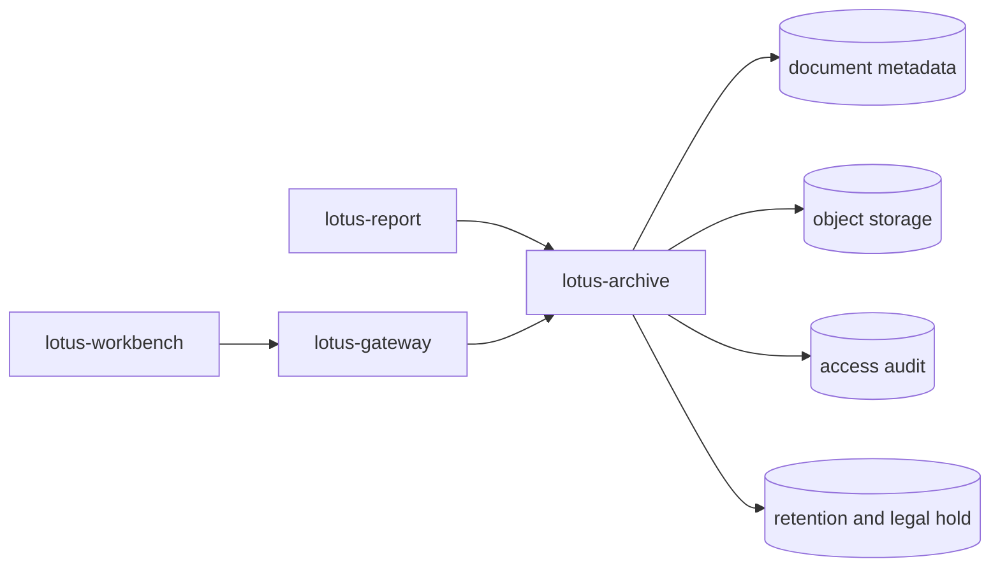

# RFC-0103: Document Archive, Retrieval, Retention, And Legal Hold

- Status: Proposed
- Date: 2026-04-23
- Hardened: 2026-04-25
- Owners:
  - future `lotus-archive` owners
  - `lotus-report` owners
  - `lotus-gateway` owners
  - `lotus-workbench` owners when product-facing retrieval is exposed
  - lotus-platform governance
- Target repositories:
  - `lotus-archive`
  - `lotus-report`
  - `lotus-gateway`
  - `lotus-workbench`
  - `lotus-platform`
- Depends on:
  - `RFC-0099-enterprise-reporting-and-document-archive-target-architecture.md`
  - `RFC-0100-reporting-gateway-invocation-and-job-ledger-foundation.md`
  - `RFC-0101-report-data-snapshot-and-lineage-contracts.md`
  - `RFC-0102-render-package-template-registry-and-render-service.md`

## Summary

This RFC defines `lotus-archive`, the generated-document archive and retrieval service for Lotus.
It owns document metadata, binary storage, retention, purge eligibility, legal hold, access audit,
document lifecycle relationships, and controlled retrieval for Lotus-generated documents.

This RFC is intentionally not a generic file-management system. It is a banking-grade archive for
reports and document artifacts produced through governed Lotus reporting flows.

## Critical Review Outcome

The previous RFC-0103 draft captured the broad archive intent, but it was not yet strong enough to
guide implementation. Lessons from RFC-0100 through RFC-0102 showed that implementation RFCs need
clearer boundaries, stronger scaffold expectations, explicit proof rules, and tighter closure
governance before coding starts.

This revision tightens the RFC in the following areas:

1. platform automation and new-service scaffolding are now first-class implementation scope,
2. cleanup, documentation structure, wiki posture, and supported-features governance are explicit,
3. archive ownership is separated from report jobs, snapshots, rendering, replay, batch scheduling,
   and general file storage,
4. API certification, Swagger quality, error contracts, audit, entitlements, retention, and legal
   hold expectations are precise enough for implementation,
5. implementation proof requires live evidence and critical review rather than superficial success
   checks,
6. second-last hardening and final closure slices follow the current RFC governance standard,
7. supported-features wording is gated on implementation-backed proof only.

Implementation must not start until this RFC is reviewed as the execution guide for RFC-0103.

## Problem

Generated reports must not be treated as files written to a local output directory. Private-banking
reporting needs durable, controlled, auditable archive behavior:

1. every generated document must have stable identity and metadata,
2. every binary artifact must have durable storage and integrity evidence,
3. document access must be authorized, audited, and supportable,
4. retention and purge eligibility must be explicit,
5. legal hold must block purge and be auditable,
6. reissue, correction, and supersession relationships must preserve document history,
7. gateway and Workbench must not bypass archive governance,
8. support teams must be able to trace a document back to report job, snapshot, render attempt, and
   archive state.

Without a first-class archive boundary:

1. document retrieval risks becoming an uncontrolled bucket or local file path exposure,
2. legal hold and retention semantics cannot be proven,
3. support teams cannot distinguish render completion from archive completion,
4. customer-facing document access could be listed as supported before it is safe,
5. later batch, replay, rerender, and production-certification RFCs would lack durable document
   lifecycle truth.

## Implementation Prerequisites

Do not begin RFC-0103 implementation until these conditions are true:

1. RFC-0100 is merged and clean enough to provide durable report job identity and status truth,
2. RFC-0101 is merged and clean enough to provide snapshot and lineage references,
3. RFC-0102 is merged and clean enough to provide render output metadata and artifact hashes,
4. current reporting and rendering wiki/source documentation is synchronized where it changed,
5. there is no unresolved architectural objection to `lotus-archive` being a separate service and
   repository,
6. the first-wave archive storage posture is agreed: PostgreSQL metadata plus an S3-compatible
   object-storage abstraction, with local MinIO or filesystem-backed development adapter behind the
   same interface,
7. the first-wave retention classes and legal-hold authority model have enough product/legal input
   to implement safely or are explicitly scoped as conservative placeholders.

RFC-0103 may depend on RFC-0100 through RFC-0102 evidence, but it must not reopen those scopes.

## Target Scope

In scope:

1. `lotus-archive` as a separate service/repository and deployable runtime,
2. document metadata model, migrations, repository layer, and support-safe query model,
3. object-storage abstraction and local development adapter behind the same interface,
4. archive create API for generated documents and render artifacts,
5. metadata lookup, controlled retrieval, and download authorization APIs,
6. access audit for metadata reads and binary retrieval,
7. retention policy assignment, purge eligibility, purge execution controls, and purge audit,
8. legal hold set/release APIs and legal-hold audit,
9. reissue, correction, and supersession relationships,
10. `lotus-report` archive handoff after successful render completion,
11. `lotus-gateway` document metadata/download facade when a supported product-facing retrieval
    flow is included,
12. `lotus-workbench` retrieval surface only if gateway-backed product access is implemented in
    this RFC,
13. API certification, Swagger quality, structured errors, observability, security, and validation,
14. documentation, wiki, context, supported-features, and branch-hygiene closure.

Out of scope:

1. report request/job creation and cancellation semantics owned by RFC-0100,
2. report data assembly, snapshot capture, and upstream lineage owned by RFC-0101,
3. render package validation, template registry, render execution, and artifact hash generation
   owned by RFC-0102,
4. batch scheduling, concurrency, and recovery owned by RFC-0104,
5. replay, rerender, regenerate, and broader operations tooling owned by RFC-0105,
6. full reporting entitlement model, region/tenant segregation program, and security certification
   beyond the archive controls required here, owned by RFC-0106,
7. final enterprise production certification owned by RFC-0107,
8. arbitrary non-Lotus file storage,
9. customer communication delivery, notification, e-signature, or inbox workflows,
10. broad document management features such as manual uploads, free-form folders, OCR, or external
    file collaboration.

## Cross-RFC Ownership Boundaries

RFC-0100 owns:

1. report request identity,
2. report job identity,
3. report status/event ledger,
4. pre-render/pre-archive cancellation posture.

RFC-0101 owns:

1. report data snapshots,
2. upstream call lineage,
3. snapshot hashes and support-safe lineage lookup.

RFC-0102 owns:

1. render package construction and validation,
2. template registry and rendering,
3. render attempt diagnostics,
4. render artifact hashes and render output metadata.

RFC-0103 owns:

1. archived document identity,
2. archive metadata,
3. durable binary storage,
4. retrieval authorization and access audit,
5. retention, purge, and legal hold,
6. document lifecycle relationships.

RFC-0104 owns:

1. batch selection,
2. scheduling,
3. concurrency,
4. retry and recovery for batch production.

RFC-0105 owns:

1. replay,
2. rerender,
3. regenerate,
4. stuck-job and broader operator mutation workflows,
5. reporting observability beyond the archive evidence required here.

RFC-0106 owns:

1. full reporting security and entitlement model,
2. tenant and region segregation certification,
3. cross-service reporting security posture.

Boundary rules:

1. render completion is not archive completion,
2. archive storage is not customer-facing retrieval until gateway-backed access is implemented,
3. legal hold is not a general entitlement override,
4. purge eligibility is not purge execution,
5. supersession preserves history; it must not overwrite or delete historical document truth,
6. gateway publication must not turn internal archive APIs into an ungoverned document-download
   surface,
7. Workbench must not call `lotus-archive` directly.

## Architecture Direction

Canonical path:

Design rules:

1. `lotus-report` submits archive-ready output only after render success,
2. `lotus-archive` assigns archived document identity and stores binary artifacts,
3. `lotus-archive` must persist enough metadata to trace the document to report job, snapshot,
   render attempt, template, checksum, storage object, retention policy, legal hold status, and
   lifecycle relationships,
4. `lotus-gateway` is the product-facing retrieval boundary,
5. `lotus-workbench` consumes gateway/BFF contracts only,
6. object storage must be accessed through the archive service or short-lived signed URLs issued
   through archive authorization,
7. logs, metrics, errors, and public artifacts must not expose document content, object-store
   secrets, internal bucket paths, sensitive client data, or unrestricted download URLs.

## Storage Direction

First-wave storage posture:

1. PostgreSQL for document metadata, access audit, legal hold, retention, purge, and supersession
   graph,
2. S3-compatible object storage for binary document artifacts,
3. MinIO or adapter-backed filesystem for local development behind the same storage abstraction,
4. checksum validation on archive write and retrieval,
5. explicit object key strategy that is stable, non-guessable, tenant/region-aware where required,
   and not derived from customer names or sensitive natural identifiers,
6. encryption-at-rest posture documented for production storage,
7. no direct bucket access from Workbench or customer-facing clients.

## Document Metadata Contract

Minimum document fields:

1. `document_id`,
2. `report_job_id`,
3. `report_request_id`,
4. `snapshot_id`,
5. `render_job_id`,
6. `render_attempt_id`,
7. `report_type`,
8. `portfolio_scope`,
9. `portfolio_id`,
10. `client_id` or support-safe client reference where available,
11. `as_of_date`,
12. `reporting_period_start`,
13. `reporting_period_end`,
14. `frequency`,
15. `template_id`,
16. `template_version`,
17. `render_service_version`,
18. `report_data_contract_version`,
19. `storage_provider`,
20. `storage_bucket` or support-safe storage namespace,
21. `storage_key`,
22. `checksum_algorithm`,
23. `checksum`,
24. `size_bytes`,
25. `mime_type`,
26. `output_format`,
27. `classification`,
28. `region`,
29. `tenant_id` where tenant scope is available,
30. `retention_policy_id`,
31. `retention_start_date`,
32. `retain_until_date`,
33. `purge_eligible_at`,
34. `purged_at`,
35. `purge_status`,
36. `legal_hold_status`,
37. `legal_hold_count`,
38. `supersedes_document_id`,
39. `superseded_by_document_id`,
40. `correction_of_document_id`,
41. `reissue_of_document_id`,
42. `created_by_service`,
43. `created_by_actor`,
44. `created_at`,
45. `updated_at`.

These fields are the target minimum. If implementation discovers a field is unavailable from
upstream evidence, record it as a source gap or a consciously deferred field rather than inventing
placeholder truth.

## Source And Evidence Mapping

Archive attributes must be source-backed:

| Attribute group | Source owner | Expected source |
| --- | --- | --- |
| Report request and job identity | `lotus-report` | RFC-0100 report request/job ledger |
| Snapshot identity and lineage references | `lotus-report` | RFC-0101 snapshot and lineage records |
| Render identity, artifact hash, MIME type, size, template, and render version | `lotus-report` and `lotus-render` | RFC-0102 render result and artifact metadata |
| Portfolio scope, portfolio ID, client/support reference, reporting currency, and region where available | `lotus-core` through `lotus-report` | report job/snapshot context |
| Archive document identity, storage key, retention, legal hold, purge, lifecycle relationships, and access audit | `lotus-archive` | archive metadata and audit models |
| Product-facing metadata and download posture | `lotus-gateway` | gateway facade over archive APIs |
| Workbench presentation state | `lotus-workbench` | gateway/BFF response only |

If a field is useful but not available:

1. document it in the RFC implementation notes or follow-up source-gap inventory,
2. do not expose it as a client-facing fact,
3. decide whether the source belongs in `lotus-report`, `lotus-core`, `lotus-render`,
   `lotus-archive`, or a later RFC.

## API Direction

Expected internal archive API surface:

1. `POST /documents`
2. `GET /documents/{document_id}`
3. `GET /documents/{document_id}/download`
4. `POST /documents/{document_id}/download-url` if signed URLs are used
5. `GET /documents/{document_id}/access-events`
6. `POST /documents/{document_id}/legal-holds`
7. `DELETE /documents/{document_id}/legal-holds/{legal_hold_id}`
8. `GET /documents/{document_id}/retention`
9. `POST /documents/{document_id}/purge-evaluation`
10. `POST /documents/{document_id}/purge`
11. `POST /documents/{document_id}/supersede`
12. `POST /documents/{document_id}/correct`
13. `POST /documents/{document_id}/reissue`

Expected gateway facade when product-facing retrieval is implemented:

1. `GET /api/v1/reporting/documents`
2. `GET /api/v1/reporting/documents/{document_id}`
3. `POST /api/v1/reporting/documents/{document_id}/download-url` or equivalent controlled
   download route

Every API introduced by this RFC must be certified with:

1. correct group/tag placement,
2. clear what/when/how guidance,
3. complete request examples,
4. complete response examples,
5. complete error examples,
6. every attribute documented with description, type, and example,
7. support-safe error messages,
8. caller-context and authorization rules,
9. audit behavior documented per endpoint,
10. retention/legal-hold side effects documented where applicable.

## Error Handling Requirements

First-wave archive error taxonomy must distinguish:

1. `document_not_found`,
2. `document_not_accessible`,
3. `document_binary_missing`,
4. `document_checksum_mismatch`,
5. `storage_write_failed`,
6. `storage_read_failed`,
7. `metadata_validation_failed`,
8. `duplicate_archive_request`,
9. `retention_policy_not_found`,
10. `legal_hold_active`,
11. `legal_hold_not_found`,
12. `purge_not_eligible`,
13. `document_already_purged`,
14. `supersession_conflict`,
15. `unsupported_lifecycle_transition`,
16. `caller_context_missing`,
17. `authorization_failed`,
18. `operator_intervention_required`.

Errors must not reveal sensitive document content, object keys in customer-facing responses, or
unredacted internal storage details.

## Retention, Purge, And Legal Hold Direction

Retention rules:

1. every archived document must have a retention policy,
2. retention policy assignment must be explicit and audit-backed,
3. purge eligibility must be derived from retention and legal-hold state,
4. purge execution must be a separate governed action from eligibility calculation,
5. purge must be idempotent and auditable,
6. purged document metadata must remain available in support-safe form unless legal or policy
   review requires a stricter posture,
7. legal hold must block purge regardless of retention eligibility,
8. legal hold set/release must preserve actor, reason, authority reference, timestamp, and audit
   trail.

First-wave legal-hold fields:

1. `legal_hold_id`,
2. `document_id`,
3. `hold_status`,
4. `hold_reason`,
5. `authority_reference`,
6. `requested_by`,
7. `requested_at`,
8. `released_by`,
9. `released_at`,
10. `release_reason`.

## Access Audit Direction

Archive access audit must record:

1. metadata read,
2. binary download,
3. signed URL issuance,
4. retention read/evaluation,
5. purge evaluation,
6. purge execution,
7. legal hold set/release,
8. supersession/correction/reissue mutation,
9. failed authorization attempts where supportable and safe.

Minimum audit fields:

1. `audit_event_id`,
2. `document_id`,
3. `event_type`,
4. `actor_type`,
5. `actor_id`,
6. `caller_service`,
7. `caller_context_hash` or safe reference,
8. `authorization_decision`,
9. `authorization_reason_code`,
10. `correlation_id`,
11. `trace_id`,
12. `ip_address` or safe source reference where applicable,
13. `user_agent` where applicable,
14. `created_at`.

## Platform Governance And Enterprise Data Mesh Requirements

1. `lotus-archive` owns generated-document records, not business-domain truth.
2. Archive metadata may become part of a reporting evidence product, but only through
   implementation-backed domain-data-product declarations.
3. Do not add placeholder mesh products for `lotus-archive`.
4. Gateway remains the product-facing retrieval boundary.
5. Workbench must not call archive APIs directly.
6. Document access, purge, legal hold, and supersession APIs must satisfy API certification and
   platform security governance before publication.
7. Wiki and supported-features material must distinguish archive infrastructure from
   customer-supported document retrieval.
8. Platform automation improvements discovered during this RFC must be fixed in
   `lotus-platform`, not copied into local one-off scripts.

## Branching And Delivery Expectations

Implementation must happen on a dedicated remote feature branch unless an active RFC-0103 branch
already exists. If an active RFC-0103 branch exists, continue on it.

Required branch discipline:

1. keep one RFC-0103 branch per touched repository,
2. commit each completed and validated slice separately,
3. push after each validated slice so GitHub checks can run asynchronously,
4. monitor PR checks regularly while continuing non-conflicting work,
5. fix failures promptly,
6. do not allow CI health or branch quality to drift,
7. keep RFC-0103 changes out of RFC-0104, RFC-0105, RFC-0106, and RFC-0107 branches,
8. keep generated proof files out of commits unless they are intentional source truth,
9. keep PR descriptions aligned with the actual slices delivered,
10. do not merge with unresolved failing checks unless a platform owner records a governed
    deviation.

## Delivery Sequence

Do not move to the next slice until the current slice is fully implemented, validated, reviewed,
and in a solid state.

### Slice 0: Platform Automation And Scaffolding Improvement

Required outcomes:

1. identify gaps in `lotus-platform` automation that should already have been handled as part of
   service scaffolding,
2. improve `lotus-platform` automation so those gaps are fixed at the platform level rather than
   repeatedly solved inside individual apps,
3. identify cross-cutting concerns that should be scaffolded by default for new applications,
4. improve app scaffolding automation so future services start with stronger governance from day
   one,
5. cover API certification pattern, Swagger quality, observability, health endpoints, readiness,
   structured logging, trace propagation, error handling, test scaffolding, CI defaults,
   documentation scaffolding, wiki source stubs, supported-features posture, and governance hooks
   where applicable,
6. prove scaffold uplift through a fresh scaffold check or generated-service baseline artifact,
7. continue improving platform automation during later slices when repeatable gaps are discovered.

Acceptance criteria:

1. the first `lotus-archive` scaffold does not require avoidable one-off setup for standard Lotus
   service concerns,
2. future app creation benefits from the same improvements,
3. platform automation tests prove the scaffold defaults,
4. the RFC/PR records which platform gaps were fixed and which were consciously deferred.

### Slice 1: Cleanup And Structure

Required outcomes:

1. remove dead code, misleading archive/download wording, or stale local file-output assumptions
   across affected repositories,
2. improve repository structure where archive, storage, audit, retention, legal hold, and lifecycle
   modules would otherwise sprawl,
3. improve document structure and reduce sprawl,
4. move long-lived operator material to repo-local wiki source where appropriate,
5. avoid duplicate authoritative documentation across repo docs and wiki,
6. ensure the wiki source reflects the intended post-RFC state,
7. record an explicit no-wiki-change decision if wiki truth does not change in this slice.

Acceptance criteria:

1. document/archive ownership is clear,
2. there is no duplicate authoritative description of archive support posture,
3. stale local-output assumptions are removed or explicitly scoped as development-only,
4. repository and documentation structure is cleaner than before the slice.

### Slice 2: Archive Service Foundation

Required outcomes:

1. create `lotus-archive` as a new repository and deployable service,
2. add repository engineering context, README, local runbook, wiki source, and supported-features
   baseline,
3. add health, readiness, structured logging, correlation/trace propagation, and safe error
   contracts,
4. add repo-native feature-lane and PR-merge validation commands,
5. add service CI using the platform-standard lane model,
6. add unit and integration tests for service bring-up, health/readiness, error envelope, and
   caller-context handling.

Acceptance criteria:

1. `lotus-archive` is a governable service boundary,
2. no product-facing archive feature is claimed yet,
3. health/readiness accurately reflect runtime posture,
4. repo-native checks and CI are in place,
5. service scaffolding follows platform defaults improved in Slice 0.

### Slice 3: Metadata Model And Storage Adapter

Required outcomes:

1. implement document metadata model and migration,
2. implement object storage abstraction,
3. implement local development adapter behind the same interface,
4. implement checksum calculation and validation,
5. implement idempotent archive-write behavior for duplicate archive requests,
6. add tests for metadata validation, checksum mismatch, storage write/read failure, and duplicate
   request behavior.

Acceptance criteria:

1. document metadata is durable and queryable,
2. binary storage is abstracted and test-backed,
3. checksums are enforced,
4. duplicate archive requests do not create uncontrolled duplicate documents,
5. storage implementation details do not leak into customer-facing responses.

### Slice 4: Archive Create And Retrieval APIs

Required outcomes:

1. add create/archive document API,
2. add document metadata lookup API,
3. add controlled binary download or short-lived URL API,
4. enforce caller context and authorization posture,
5. record access audit for metadata and binary retrieval,
6. certify Swagger/OpenAPI for all new endpoints,
7. add tests for success, authorization denial, missing binary, checksum mismatch, and audit event
   creation.

Acceptance criteria:

1. generated documents can be archived through an API,
2. metadata retrieval is controlled and audited,
3. binary retrieval is controlled and audited,
4. Swagger documents what, when, how, examples, attributes, and errors,
5. no direct object-store exposure is possible without archive-mediated authorization.

### Slice 5: Retention, Purge, And Legal Hold

Required outcomes:

1. implement retention policy assignment and retention metadata,
2. implement purge eligibility evaluation,
3. implement purge execution controls,
4. implement legal hold set/release APIs,
5. ensure legal hold blocks purge,
6. audit retention, purge, and legal-hold actions,
7. add tests for retention assignment, purge eligibility, purge idempotency, legal-hold block,
   release behavior, and audit evidence.

Acceptance criteria:

1. every document has an explicit retention posture,
2. purge eligibility is separate from purge execution,
3. legal hold reliably blocks purge,
4. retention and legal-hold APIs are certified,
5. purge leaves support-safe evidence.

### Slice 6: Reissue, Correction, And Supersession

Required outcomes:

1. implement document relationship model,
2. implement supersession API,
3. implement correction API,
4. implement reissue API,
5. preserve current and historical document lookup behavior,
6. add tests for relationship creation, conflict handling, current-document lookup, historical
   lookup, and unsupported lifecycle transitions.

Acceptance criteria:

1. corrected, reissued, and superseded documents preserve history,
2. relationship semantics are explicit and audited,
3. current-vs-historical retrieval behavior is tested,
4. lifecycle transitions cannot silently corrupt document history.

### Slice 7: `lotus-report` Handoff

Required outcomes:

1. integrate `lotus-report` with `lotus-archive` after successful render completion,
2. pass source-backed metadata from report job, snapshot, and render evidence,
3. record archive success/failure in report status truthfully,
4. add retry posture only where it is safe and bounded,
5. add tests for archive success, archive service failure, metadata validation failure, storage
   failure, and report status mapping.

Acceptance criteria:

1. `lotus-report` can archive a rendered document,
2. archive completion is distinct from render completion,
3. report status and event history reflect archive outcomes truthfully,
4. no legal-hold, purge, or retrieval behavior is faked in `lotus-report`.

### Slice 8: Gateway And Optional Workbench Retrieval

Required outcomes:

1. add gateway document metadata and controlled download facade if product-facing retrieval is in
   this RFC scope,
2. map caller context and authorization posture into archive calls,
3. expose support-safe document metadata and download posture,
4. add Workbench surface only when gateway support is complete and product-supported,
5. prove Workbench has no direct archive calls,
6. add gateway and Workbench tests for ready, unavailable, unauthorized, not found, legal-hold
   neutral retrieval posture, and download failure states where applicable.

Acceptance criteria:

1. gateway is the product-facing retrieval boundary,
2. Workbench consumes gateway/BFF only,
3. product-facing retrieval is listed as supported only after gateway and UI evidence exists,
4. unavailable or unauthorized states are explicit and not masked as empty success.

### Slice 9: Implementation Proof

Required outcomes:

1. prove the implementation end to end against this RFC,
2. capture evidence from the live application,
3. verify evidence critically, not superficially,
4. identify gaps, inconsistencies, and loose ends,
5. iterate until the implementation is genuinely production-ready for the supported scope.

Required evidence pack:

1. archive create request and response,
2. metadata lookup response,
3. binary retrieval or signed URL issuance response,
4. access-audit records for metadata and binary retrieval,
5. legal-hold set/release evidence,
6. purge eligibility and legal-hold-blocked purge evidence,
7. supersession/correction/reissue relationship evidence,
8. `lotus-report` archive handoff evidence,
9. gateway facade evidence if gateway retrieval is included,
10. Workbench proof if Workbench retrieval is included,
11. storage checksum evidence,
12. structured logs showing safe correlation without sensitive leakage,
13. audit summary explaining what was proven, what failed during diagnostics, what was fixed, and
    what remains out of scope.

Mandatory proof rules:

1. keep clean proof runs separate from diagnostic runs,
2. do not mix failed harness attempts into final evidence without explaining them,
3. prove exact service versions and commit SHAs,
4. prove negative paths, not only happy paths,
5. prove that unsupported future features are not presented as supported.

Acceptance criteria:

1. final evidence contains one clean proof run,
2. positive and negative archive behavior are proven,
3. metadata, storage, audit, retention, legal hold, and lifecycle evidence agree,
4. gateway/Workbench proof exists if product retrieval is claimed,
5. no unexplained drift remains between RFC claims and observed behavior.

### Second-Last Slice: Hardening, Review, And Certification

Required outcomes:

1. perform a proper code review of the full implementation,
2. remove dead code, duplicate logic, stale scaffolding, and avoidable complexity,
3. tighten loose ends,
4. verify API certification pattern compliance,
5. verify platform governance and enterprise data mesh standards are met,
6. ensure all APIs are properly certified,
7. ensure Swagger is complete and high quality,
8. ensure every attribute has description, type, and example value,
9. ensure every endpoint has clear what/when/how guidance,
10. ensure request, response, and error examples are complete,
11. ensure error handling is complete, correct, safe, and properly tested,
12. verify security, audit, retention, purge, legal hold, and lifecycle behavior,
13. make final quality improvements before closure.

Specific review lenses:

1. archive boundary purity,
2. object-storage safety,
3. checksum and integrity guarantees,
4. caller-context and authorization posture,
5. access-audit completeness,
6. legal-hold and purge correctness,
7. retention policy clarity,
8. lifecycle relationship correctness,
9. gateway-only product access,
10. Workbench no-direct-service-call posture,
11. Swagger and error-contract quality,
12. supported-features truth,
13. platform automation/scaffold improvements that should be generalized,
14. avoidance of batch/replay/rerender/security-RFC scope leakage.

Acceptance criteria:

1. no known significant loose end remains in the supported scope,
2. API certification and OpenAPI quality gates pass,
3. platform governance validators pass where applicable,
4. security and audit tests cover real risks,
5. review findings are fixed or explicitly deferred with rationale and owner,
6. implementation is smaller, cleaner, and more maintainable after review.

### Final Slice: Closure

Required outcomes:

1. documentation updates,
2. agent context updates,
3. wiki updates,
4. supported-features updates,
5. branch hygiene and cleanup,
6. final PR evidence and CI health review.

Required final review:

1. review whether skills, guidance, documentation, automation, scaffolding, or agent context should
   be improved to support better future work, faster ramp-up, and stronger agent effectiveness,
2. identify what should be added, removed, tightened, or clarified,
3. implement durable guidance updates when they are clearly needed,
4. if no changes are needed, state that explicitly as a deliberate outcome,
5. confirm wiki source is updated or record a no-wiki-change decision,
6. run wiki check-only before merge when wiki source changed,
7. publish wiki after merge when wiki source changed,
8. clean local and remote branches after merge.

Acceptance criteria:

1. all implementation-bearing PRs are merged,
2. CI is green for relevant feature, PR merge, and main releasability gates,
3. documentation, wiki, context, and supported-features material match implementation truth,
4. no aspirational archive feature appears as supported,
5. branch hygiene is complete,
6. closure evidence is sufficient for RFC-0107 production certification to consume later.

## Evidence Expectations

Implementation is not complete until live evidence proves:

1. archive service health and readiness,
2. metadata validation,
3. durable binary storage,
4. checksum validation,
5. controlled metadata retrieval,
6. controlled binary retrieval or signed URL issuance,
7. access audit,
8. retention policy assignment,
9. purge eligibility,
10. legal hold blocking purge,
11. legal hold release behavior,
12. purge execution behavior,
13. supersession/correction/reissue relationships,
14. `lotus-report` archive handoff,
15. gateway-only product access if product retrieval is in scope,
16. Workbench no-direct-archive-call posture if Workbench is touched,
17. safe error handling and redaction,
18. no supported-feature overclaim.

## Validation Expectations

Required validation:

1. `lotus-archive` repo-native lint, typecheck, unit, integration, migration, OpenAPI, and storage
   adapter tests,
2. `lotus-report` integration tests for archive handoff and archive failure handling,
3. `lotus-gateway` route tests if gateway retrieval is included,
4. `lotus-workbench` tests if Workbench retrieval is included,
5. platform feature-lane and PR-merge checks for platform automation, scaffold, docs, context, and
   wiki changes,
6. security tests for caller context, authorization, audit, legal hold, purge, and sensitive-data
   redaction,
7. Swagger/API certification tests or validators for every touched API,
8. wiki sync check-only before merge where wiki source changed.

Execution expectations:

1. use GitHub effectively so checks can run asynchronously while work continues,
2. monitor pipelines at regular intervals,
3. fix failures promptly,
4. keep moving without losing quality control,
5. do not allow CI health or branch quality to drift.

## Supported Features

This RFC starts with no implementation-backed archive supported features.

Supported-features material may be updated only after implementation, validation, documentation,
and proof are complete. Eligible supported-feature entries after implementation may include only
the behavior actually delivered, such as:

1. generated-document archival with durable metadata,
2. object-backed binary storage with checksum verification,
3. controlled document metadata lookup,
4. controlled document download or signed URL issuance,
5. access audit for document retrieval,
6. retention policy assignment and purge eligibility,
7. legal hold set/release with purge blocking,
8. support-safe purge execution,
9. supersession/correction/reissue relationships,
10. report-to-archive handoff,
11. gateway-backed document retrieval,
12. Workbench document retrieval surface.

Unsupported or not-yet-supported wording must remain explicit for:

1. arbitrary file storage,
2. manual customer document upload,
3. external file-sharing workflow,
4. customer notification or document delivery,
5. e-signature,
6. OCR or document content extraction,
7. batch scheduling,
8. replay, rerender, or regenerate commands,
9. full production reporting certification before RFC-0107.

Supported-features entries must name:

1. backing API or capability,
2. repository and PR,
3. validation evidence,
4. support state: `ready`, `partial`, `unavailable`, or `not_supported`,
5. any caller or environment limitation.

Infrastructure that is implemented but not product-facing must be described as infrastructure, not
as a customer-supported retrieval feature.

## Documentation, Wiki, And Context Impact

Expected documentation changes during implementation:

1. `lotus-archive` README and repository engineering context,
2. `lotus-archive` supported-features list,
3. `lotus-archive` wiki source for operator and support posture,
4. `lotus-report` docs for archive handoff and status behavior,
5. `lotus-gateway` docs if document retrieval is published,
6. `lotus-workbench` docs if a retrieval surface is implemented,
7. `lotus-platform` context and RFC index when archive becomes real platform topology,
8. platform scaffold and automation docs when Slice 0 changes cross-cutting service creation.

Avoid duplicate documentation:

1. repo README should summarize local development and supported surface,
2. wiki should be operator/product-support oriented,
3. RFC should remain implementation plan and evidence record,
4. context should capture durable operating truth after implementation changes platform reality.

## Risks

| Risk | Mitigation |
| --- | --- |
| Archive becomes a generic file store | Scope first wave to Lotus-generated documents and reject manual arbitrary uploads |
| Direct bucket exposure | Use service-mediated retrieval or short-lived signed URLs issued only after archive authorization |
| Legal hold is bypassed | Enforce legal hold in purge logic, API tests, and proof evidence |
| Retention logic is implemented as documentation only | Persist policy fields, calculate eligibility, test purge behavior, and audit decisions |
| Access audit is incomplete | Record metadata reads, binary retrieval, signed URL issuance, legal hold, purge, and lifecycle mutations |
| Render completion is mistaken for archive completion | Keep report, render, and archive statuses separate in APIs, docs, and supported-features material |
| Sensitive data leaks through logs or Swagger examples | Use support-safe examples, redaction tests, and security review |
| Gateway or Workbench bypasses archive governance | Enforce gateway facade and test Workbench no-direct-service-call posture |
| Platform scaffold gaps are solved locally | Make scaffold uplift a required Slice 0 outcome in `lotus-platform` |
| Supported-features overclaim | Gate supported-features updates on live proof and final closure review |
| Purge deletes needed support evidence | Preserve support-safe metadata and audit trail unless legal guidance requires stricter handling |
| Supersession overwrites history | Model lifecycle relationships append-only and test historical lookup |

## Acceptance Criteria

RFC-0103 is complete only when all of the following are true:

1. platform automation/scaffolding improvements identified by this RFC are implemented or
   consciously deferred with evidence,
2. `lotus-archive` exists as a governable service boundary,
3. archive metadata model is durable, source-backed, and migration-backed,
4. binary storage is abstracted, durable, checksum-backed, and safely retrievable,
5. archive create, metadata lookup, and controlled retrieval APIs are implemented and certified,
6. access audit records document access and mutations,
7. retention policy, purge eligibility, purge execution, and legal hold are implemented and tested,
8. legal hold blocks purge and that behavior is proven,
9. supersession, correction, and reissue relationships preserve document history,
10. `lotus-report` hands off rendered artifacts to archive truthfully,
11. gateway is the only product-facing retrieval boundary if product retrieval is implemented,
12. Workbench does not call archive directly if Workbench is touched,
13. Swagger/OpenAPI quality is complete for every API touched,
14. error handling is safe, explicit, and tested,
15. live evidence proves the supported scope end to end,
16. second-last hardening and code review are complete,
17. docs, wiki, context, supported-features, and branch hygiene are complete,
18. no unsupported archive, retrieval, batch, replay, rerender, or production-certification feature
    is described as supported.

## Open Questions

These questions must be resolved or explicitly deferred before the relevant slice begins:

1. Which retention classes are first-wave scope for generated portfolio review reports?
2. What legal authority model is required for legal hold set/release in first wave?
3. Should signed URLs be used for binary download, or should all downloads stream through
   `lotus-archive`?
4. What is the first-wave production object-storage target and encryption posture?
5. Which document classifications are required in first wave?
6. Which gateway product-facing retrieval routes are required before RFC-0107?
7. Is Workbench document retrieval part of RFC-0103 or deferred until a concrete product surface is
   approved?
8. What support-safe metadata remains queryable after purge?
9. Which archive metadata should later be promoted into a governed domain-data-product evidence
   declaration?
