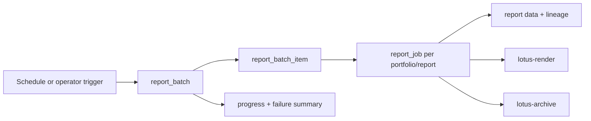

# RFC-0104: Batch Reporting Scheduler, Concurrency, And Recovery

- Status: Proposed
- Date: 2026-04-23
- Owners:
  - `lotus-report` owners
  - lotus-platform operations
  - upstream domain service owners
- Target repositories:
  - `lotus-report`
  - `lotus-platform`
  - optionally `lotus-gateway` for operator-facing status
  - optionally `lotus-workbench` for product/operator surfaces
- Depends on:
  - `RFC-0099-enterprise-reporting-and-document-archive-target-architecture.md`
  - `RFC-0100-reporting-gateway-invocation-and-job-ledger-foundation.md`
  - `RFC-0101-report-data-snapshot-and-lineage-contracts.md`
  - `RFC-0102-render-package-template-registry-and-render-service.md`
  - `RFC-0103-document-archive-retrieval-retention-and-legal-hold.md`

## Summary

This RFC defines durable batch reporting for all active portfolios, selected subsets, explicit
portfolio lists, and scheduled monthly, quarterly, semi-annual, and yearly production cycles.

## Problem

Batch reporting cannot be a script or in-memory loop. It must support long-running execution,
idempotency, retry, recovery, progress, failure tracking, operational visibility, and controlled
concurrency so production batches do not overload upstream services or rendering/archive workers.

## Target Scope

In scope:

1. batch model and batch item model,
2. portfolio selection modes,
3. schedules and frequencies,
4. batch size and concurrency controls,
5. retry and recovery policy,
6. pause/resume/cancel/retry-failed-only,
7. progress and failure tracking APIs,
8. operator visibility,
9. Temporal target-state decision or governed phase-one alternative.

Out of scope:

1. new report templates,
2. document retention policy,
3. Workbench UI unless a supported operator/product surface is explicitly in scope,
4. changing upstream domain data ownership.

## Architecture Direction

`lotus-report` owns batch control. Batch execution creates one durable `report_job` per report item.

Batch selectors:

1. `all_active_portfolios`,
2. `portfolio_subset`,
3. `portfolio_list`,
4. `batch_manifest`.

Frequencies:

1. `monthly`,
2. `quarterly`,
3. `semi_annual`,
4. `yearly`,
5. `explicit`.

## Platform Governance And Mesh Requirements

1. Batch orchestration must follow RFC-0026 async job/status/result semantics.
2. Concurrency and retry policy must avoid overloading upstream data authorities and must preserve
   RFC-0050 service ownership.
3. Batch progress and failure summaries must use platform status/failure vocabulary and be
   documented in OpenAPI.
4. If batch production generates reporting evidence products at scale, RFC-0084/RFC-0091 telemetry,
   SLO, access, and evidence posture must be updated.
5. CI evidence must include retry, resume, idempotency, and concurrency tests before support is
   listed.

## Implementation Slices

### Slice 0: Cleanup And Structure

1. Review existing batch, scheduler, and long-running job docs.
2. Remove stale script-like batch references.
3. Prepare `report-batch-orchestrator` module boundary.
4. Move long-lived operator batch guidance to wiki source where appropriate.

### Slice 1: Batch Ledger And Selectors

1. Add `report_batch` and `report_batch_item` models and migrations.
2. Add selectors for explicit portfolio list and selected subset first.
3. Add tests for idempotent batch creation and selector validation.

### Slice 2: Scheduling And Frequency

1. Add schedule/frequency contract.
2. Add monthly, quarterly, semi-annual, yearly, and explicit cycle semantics.
3. Add tests for schedule materialization and as-of date selection.

### Slice 3: Concurrency And Back-Pressure

1. Add batch size and max concurrency controls.
2. Add per-upstream and render/archive back-pressure hooks.
3. Add tests proving concurrency limits are enforced.

### Slice 4: Retry, Resume, And Recovery

1. Add bounded retry policy.
2. Add resume from durable item state.
3. Add retry-failed-only.
4. Add pause/cancel behavior.
5. Add tests for failed, stuck, partial, and resumed batches.

### Slice 5: Progress APIs And Operator Visibility

1. Add status/progress APIs.
2. Add failure summaries by category and upstream service.
3. Add optional gateway/operator exposure only if a supported need exists.

### Second-Last Slice: Hardening, Review, And Certification

1. Review batch state transitions, concurrency, and recovery.
2. Verify API certification, platform governance, and data mesh posture.
3. Run non-functional concurrency and recovery tests.

### Final Slice: Closure

1. Update docs, wiki, context, supported-features, and skills/guidance.
2. Publish wiki after merge if changed.
3. Ensure branch and PR evidence are clean.

## Acceptance Criteria

1. Batch reporting supports explicit lists, subsets, and eventually all active portfolios.
2. Batch size and concurrency are configurable and enforced.
3. Failed items are tracked and retryable.
4. Interrupted batches are resumable.
5. Duplicate batch submissions are idempotent.
6. Operators can inspect progress and failures.

## Risks

| Risk | Mitigation |
| --- | --- |
| Batch overloads upstream services | Per-upstream concurrency and back-pressure |
| Batch state is not recoverable | Durable batch and item ledger |
| Duplicate documents are generated | Idempotency and archive supersession checks |
| Long-running jobs become opaque | Progress APIs, status events, metrics, and traces |

## Validation

Required validation:

1. `lotus-report` unit, integration, migration, OpenAPI, and coverage gates.
2. Long-running batch simulation.
3. Retry/resume/failure tests.
4. Concurrency/back-pressure tests.

## Supported Features

Batch features must be listed only after the relevant selector, schedule, concurrency, retry, and
progress behavior is implemented and validated.
