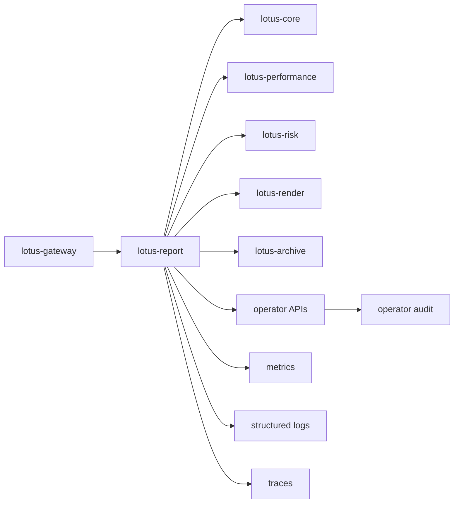

# RFC-0105: Reporting Observability, Operations, And Replay Tooling

- Status: Implementation In Progress; Slices 0-5 Complete
- Date: 2026-04-23
- Gold-pass hardened: 2026-04-26
- RFC-0104 closure alignment: 2026-04-26
- Owners:
  - `lotus-report` owners
  - `lotus-render` owners
  - `lotus-archive` owners
  - `lotus-gateway` owners
  - `lotus-platform` operations
- Target repositories:
  - `lotus-report`
  - `lotus-render`
  - `lotus-archive`
  - `lotus-gateway`
  - `lotus-platform`
  - optionally `lotus-workbench` only after a gateway-backed supported operator or product surface
    is approved
- Depends on:
  - `RFC-0099-enterprise-reporting-and-document-archive-target-architecture.md`
  - `RFC-0100-reporting-gateway-invocation-and-job-ledger-foundation.md`
  - `RFC-0101-report-data-snapshot-and-lineage-contracts.md`
  - `RFC-0102-render-package-template-registry-and-render-service.md`
  - `RFC-0103-document-archive-retrieval-retention-and-legal-hold.md`
  - implementation-backed RFC-0104 first-wave batch, worker, scheduler, gateway, Workbench, and
    scheduler-administration primitives where batch replay or batch monitoring is included
- Follow-on RFC boundaries:
  - `RFC-0106-reporting-security-entitlements-and-region-tenant-segregation.md` owns final
    entitlement, tenant, region, and document-access certification.
  - `RFC-0107-enterprise-reporting-production-certification.md` owns final release certification
    after RFC-0104 through RFC-0106 are implemented and proven.

## Summary

This RFC defines the reporting observability, operations, and replay capability required to operate
enterprise reporting safely across `lotus-gateway`, `lotus-report`, `lotus-render`, and
`lotus-archive`.

The implementation must give operators a source-backed, audit-safe view of report requests, report
jobs, snapshots, render jobs, archive handoff, archived documents, batch progress, failures, stuck
states, replay eligibility, rerender eligibility, regeneration eligibility, and service-level
posture. It must avoid technical leakage into client-facing surfaces and must never log sensitive
report content as a substitute for proper lineage or evidence.

## Critical Review Outcome

The original RFC-0105 draft identified the right broad topic but was not strong enough to guide
implementation. The main gaps were:

1. no platform automation and scaffolding improvement slice,
2. no cleanup and structure slice,
3. no implementation-proof slice with live evidence,
4. no explicit second-last hardening/API-certification slice,
5. no final documentation/context/wiki/supported-features/branch-hygiene slice,
6. no precise distinction between rerender, regenerate, replay, retry, and recovery,
7. no supported-features discipline,
8. no API certification and Swagger quality checklist,
9. no live evidence requirements for cross-service traceability,
10. insufficient privacy and sensitive-content guardrails for logs, metrics, traces, and operator
    APIs,
11. insufficient platform-scaffolding feedback loop for observability defaults that future Lotus
    services should inherit,
12. insufficient dependency alignment with RFC-0104, RFC-0106, and RFC-0107.

This gold pass tightens RFC-0105 into an implementation-ready execution guide. Implementation must
not begin until this RFC is reviewed as the working plan for observability, operations, and replay.

## Gold-Pass Readiness Assessment

| Review area | Gold-pass finding | Required implementation posture |
| --- | --- | --- |
| Scope clarity | Observability, operator diagnostics, rerender, regenerate, replay, stuck-state handling, SLA monitoring, and dashboard contracts are separated from batch scheduling, security certification, and final production certification. | Keep RFC-0105 focused on source-backed operations. Do not reopen RFC-0100 through RFC-0104 data models unless a gap is proven and documented. |
| Architecture direction | `lotus-report` remains reporting job and replay control owner; `lotus-render` remains render execution owner; `lotus-archive` remains document lifecycle owner; `lotus-gateway` is the product/operator access boundary when exposed. | Avoid hidden direct archive/render calls from Workbench. Gateway and service APIs must expose only certified, support-safe views. |
| Platform leverage | Slice 0 requires platform scaffold and automation improvements for observability defaults. | Fix repeatable logging, OpenAPI, health, metrics, CI, and runbook gaps in `lotus-platform`, not as local one-off app code. |
| Data protection | Identifier-only observability is the default; report payloads, rendered artifacts, client PII beyond permitted identifiers, and raw upstream payloads must not be logged or exposed in metrics. | Add tests and review checks for no sensitive content in logs, metrics, traces, and operator APIs. |
| Replay semantics | Rerender, regenerate, replay, retry, and recovery are distinct operations with different lineage and archive consequences. | Model them separately in API names, docs, tests, and audit events. Do not use one generic "rerun" command. |
| API quality | Operator APIs require certification, complete Swagger, examples, safe errors, audit side effects, and authorization posture. | Every new API must pass OpenAPI quality and endpoint certification before supported-features promotion. |
| Evidence | Live proof must follow a report from gateway/job creation through snapshot, render, archive, and operator lookup; replay/rerender/regenerate proof must compare before/after evidence. | Do not close with unit tests only or a single happy-path curl. Capture live app evidence and verify it critically. |
| Closure | Second-last hardening and final closure slices follow the current RFC governance standard. | Complete code review, docs/context/wiki/supported-features, skills/guidance assessment, CI evidence, and branch hygiene before closure. |

Gold-pass conclusion: RFC-0105 is implementation-ready as an execution guide after this revision.
Implementation remains unstarted. Supported-features entries must remain planned or absent until
the corresponding code, tests, API contracts, docs, and live evidence are complete.

## Second Gold-Pass Additions

This final pre-implementation pass tightened the execution guide in four areas that were still too
easy to under-prove during delivery:

1. explicit no-go gates before implementation can begin,
2. mandatory data-protection proof for logs, metrics, traces, dashboards, and operator APIs,
3. slice exit discipline so implementation cannot move forward on shallow evidence,
4. dependency handoff rules to RFC-0106 and RFC-0107 for entitlement and production certification.

The RFC remains implementation-ready. These additions do not expand first-wave scope; they make the
quality bar harder to bypass.

## RFC-0104 Closure Alignment

RFC-0104 is now implemented for first-wave batch scope across `lotus-report`, `lotus-gateway`,
`lotus-workbench`, and `lotus-platform`. RFC-0105 implementation may consume, but must not
redefine, these implementation-backed surfaces:

1. durable `report_batch` and `report_batch_item` PostgreSQL state,
2. batch materialization/status/control/operator-run APIs in `lotus-report`,
3. gateway batch materialization/status/control/operator-run APIs,
4. config-backed scheduler process materialization for explicit-list, all-active, and inline
   manifest schedules,
5. gateway-facing scheduler administration for schedule listing and bounded due-schedule
   materialization,
6. Workbench explicit single-portfolio batch operation through gateway/BFF,
7. report-job, snapshot, render, archive, and document identifiers produced by the RFC-0100 through
   RFC-0104 flow.

This alignment changes the RFC-0105 implementation starting point:

1. Batch monitoring and batch-item replay may be included only for those RFC-0104 paths that are
   already implementation-backed.
2. Scheduler CRUD, persisted schedule registry management, entitlement certification, and production
   certification remain out of RFC-0105 scope.
3. The first implementation wave should start with source-backed observability contracts and
   support-safe operator lookup foundations before adding mutating rerender/regenerate/replay
   commands.
4. Any Workbench operations surface must remain deferred until a gateway-backed supported operator
   or product workflow is explicitly approved.

## Pre-Implementation No-Go Gates

Implementation must not begin until the implementer records a branch-local execution note covering:

1. active branch and PR target,
2. repositories expected to change,
3. whether RFC-0104 first-wave batch primitives are in scope for this RFC-0105 implementation wave,
4. whether any operator API will be exposed through `lotus-gateway` in this wave,
5. whether dashboard artifacts will be committed as dashboard JSON, markdown contract, or both,
6. local live-stack strategy for `lotus-report`, `lotus-render`, and `lotus-archive`,
7. data-protection validation command or test plan,
8. CI lanes expected before merge.

The first implementation branch must record these initial decisions before code changes:

1. first-wave operator APIs are exposed through `lotus-report` first, with gateway exposure added
   only after report contracts are certified,
2. dashboard artifacts start as markdown/JSON contracts tied to implemented metric names; no
   dashboard may claim a metric that is not emitted and tested,
3. batch operations use RFC-0104 durable source state and do not introduce a second batch status
   store,
4. mutating rerender, regenerate, and replay commands remain planned until trace/log/operator lookup
   and audit foundations are implemented and proven.

If any of these are unknown, the first implementation commit must be limited to resolving the
unknown rather than adding product behavior.

## Mandatory Data-Protection Proof

Every slice that touches logs, metrics, traces, dashboards, operator APIs, or audit records must
prove that it does not expose:

1. raw report payloads,
2. rendered document bytes,
3. raw upstream service payloads,
4. client names unless explicitly allowed by a support-safe contract,
5. account numbers, booking-center-sensitive details, or unrestricted portfolio holdings,
6. secrets, service credentials, signed URLs, object-storage keys, or bearer tokens.

Accepted proof may include unit tests, integration tests, generated OpenAPI example checks, log
capture assertions, metric-label assertions, dashboard-contract validation, and live proof
artifacts. A slice cannot be marked complete with only code review if it changes a data-exposure
surface.

## Slice Exit Discipline

Each implementation slice must record:

1. what was implemented,
2. what was deliberately not implemented,
3. code paths changed,
4. tests added or strengthened,
5. local validation commands and results,
6. GitHub check status when a PR exists,
7. docs, wiki, supported-features, context, and skill impact,
8. discovered source gaps or semantic questions,
9. whether the next slice is safe to start.

The next slice must not start until the current slice has a passing targeted validation set and no
known P0/P1 correctness, privacy, API-certification, or supported-features mismatch.

## Cross-RFC Handoff Rules

RFC-0105 implementation must hand off the following instead of solving them locally:

1. final role, entitlement, tenant, region, and document-access authorization to RFC-0106,
2. full release evidence, production readiness, and cross-app certification to RFC-0107,
3. new batch scheduler/runtime behavior or scheduler registry management to a new RFC-0104 amendment
   or RFC-0107 certification finding, not to RFC-0105,
4. new report visual/template content to RFC-0102 unless the work is only observability metadata,
5. retention, purge, and legal-hold semantics to RFC-0103.

If implementation discovers that one of these boundaries is blocking safe RFC-0105 delivery, the
RFC proof ledger must record the blocker and the receiving RFC/owner rather than silently expanding
scope.

## Problem

Enterprise reporting failures cross service boundaries:

1. `lotus-gateway` request and caller context,
2. `lotus-report` request/job ledger, snapshot, lineage, render orchestration, archive handoff, and
   batch orchestration,
3. upstream domain services such as `lotus-core`, `lotus-performance`, `lotus-risk`, and
   `lotus-advise`,
4. `lotus-render` template/package validation and render execution,
5. `lotus-archive` metadata, storage, retrieval, retention, legal hold, and access audit,
6. platform infrastructure, CI, health, readiness, and local/live runtime posture.

Without source-backed observability and operator tooling, operators cannot reliably answer:

1. whether a report was accepted, captured, rendered, archived, retrieved, or failed,
2. whether a failure belongs to data, render, archive, entitlement, timeout, infrastructure, or
   operator action,
3. whether rerender from the same snapshot is safe,
4. whether regenerate from upstream data is required,
5. whether replaying a failed job or batch item will preserve lineage and audit semantics,
6. whether a report or batch is stuck,
7. whether service-level objectives have breached,
8. whether a support view is based on live source truth or stale derived evidence.

## Business Outcome

After implementation, support and operations should be able to:

1. trace a report from gateway request to archived document,
2. inspect a report job, snapshot, render attempt, archive handoff, document, batch, and batch item
   without database access,
3. classify failures safely,
4. rerender from the same immutable snapshot when the report data is correct but rendering failed
   or needs a corrected template/runtime,
5. regenerate from upstream data when the report data itself must be refreshed,
6. replay eligible failed jobs or batch items without blind whole-batch reruns,
7. detect stuck states and SLA breaches,
8. prove all operator actions and generated documents through audit-safe evidence.

## Target Scope

In scope:

1. trace and correlation propagation across gateway, report, upstream calls, render, archive, and
   batch paths,
2. structured logging contracts and no-sensitive-content guardrails,
3. metrics vocabulary and implementation for report, render, archive, and batch operations,
4. dashboard and alert contract artifacts,
5. operator status APIs for requests, jobs, snapshots, lineage, renders, archive handoff,
   documents, batches, and batch items where those capabilities are already implemented,
6. rerender from existing snapshot,
7. regenerate from upstream data,
8. replay eligible failed report jobs and batch items,
9. stuck-state detection for report jobs, render jobs, archive handoffs, and batch items,
10. SLA breach metrics and attention events,
11. audit events for operator actions,
12. API certification and Swagger quality for every new operator API,
13. platform automation and scaffolding improvements discovered during implementation,
14. supported-features entries only after implementation-backed proof exists.

Out of scope:

1. new report templates or client-facing report content changes,
2. changing document retention, purge, or legal-hold semantics owned by RFC-0103,
3. batch scheduler/runtime implementation owned by RFC-0104,
4. final entitlement, tenant, region, and document-access certification owned by RFC-0106,
5. final release certification owned by RFC-0107,
6. Workbench UI unless a gateway-backed supported operator/product surface is explicitly approved,
7. raw database admin tooling,
8. exporting sensitive report payloads, rendered documents, or raw upstream payloads through logs,
   metrics, traces, or generic support APIs,
9. replacing the RFC-0100 report job ledger, RFC-0101 snapshot lineage, RFC-0102 render package, or
   RFC-0103 archive identity semantics.

## Locked First-Wave Decisions

These decisions are fixed unless a committed RFC amendment changes them:

1. `lotus-report` owns reporting operation control, replay requests, rerender requests, regenerate
   requests, and report-job/batch status composition.
2. `lotus-render` owns render attempt execution and render runtime metadata.
3. `lotus-archive` owns archived document identity, retrieval, lifecycle, retention, legal hold,
   and access audit.
4. `lotus-gateway` is the access boundary for any product-facing or cross-service operator surface.
5. Rerender uses an existing immutable RFC-0101 snapshot and must not call upstream domain data.
6. Regenerate creates a new data snapshot from upstream sources and must preserve lineage from the
   old job/snapshot when the action is a correction or replacement.
7. Replay is an execution-control operation for failed or stuck work; it must be eligibility-gated,
   idempotent, audited, and bounded.
8. Retry is a narrower automated or operator-initiated repeat of a failed step that is known to be
   retryable.
9. Recovery repairs abandoned leases or stuck in-flight ownership without changing business data.
10. No supported feature may be listed as implementation-backed before code, tests, API contract,
    docs, and proof exist.

## Conditional Decisions

These decisions must be resolved in the slice that needs them:

1. whether first-wave operator APIs are exposed only from `lotus-report` or also through
   `lotus-gateway`,
2. whether first-wave dashboards are committed as JSON dashboard artifacts, markdown dashboard
   contracts, or both,
3. the first-wave metrics backend naming convention and labels accepted by platform operations,
4. first-wave stuck-state thresholds by status and service,
5. first-wave SLA objectives for report acceptance, data capture, render, archive, and batch item
   completion,
6. first-wave rerender/archive supersession semantics when a rerender succeeds,
7. first-wave regenerate/archive supersession semantics when a regenerated report succeeds,
8. first-wave replay eligibility for report jobs that already produced archived documents,
9. first-wave Workbench visibility, if any,
10. whether RFC-0105 evidence updates any RFC-0084/RFC-0091 product declarations or remains local
    until RFC-0107 certification.

Deferred decisions must name the owner, reason, downstream impact, and supported-features posture.

## Architecture Direction

The target architecture is source-backed observability over existing durable identities, not a new
shadow state store.

Core implementation rules:

1. Trace identifiers and correlation identifiers must be propagated, not regenerated per hop unless
   a child span/id is explicitly modeled.
2. Operator views must compose from durable source records: report request, report job, snapshot,
   upstream-call lineage, render metadata, archive handoff, archive document metadata, batch, and
   batch item.
3. Metrics and logs must carry identifiers and categories, not report payloads.
4. Rerender, regenerate, replay, retry, and recovery must have separate command paths, event types,
   audit entries, Swagger docs, and tests.
5. Dashboard and alert contracts must be generated or validated from stable metric names.
6. Heartbeat or attention integration must consume source evidence and never invent reporting
   posture.

## Required Identifier Contract

Every relevant observability record must carry the identifiers available at that point in the flow:

| Identifier | Owner | Required where available |
| --- | --- | --- |
| `correlation_id` | Caller / gateway / service propagation | All logs, traces, operator APIs, job events, render/archive handoff |
| `trace_id` | Caller / gateway / service propagation | All logs, traces, operator APIs, job events, render/archive handoff |
| `report_request_id` | `lotus-report` | Request, job, replay, regenerate, operator lookup |
| `report_job_id` | `lotus-report` | Job, snapshot, render, archive, replay, rerender, regenerate |
| `snapshot_id` | `lotus-report` | Rerender, lineage, archive metadata, support lookup |
| `render_job_id` | `lotus-render` / `lotus-report` | Render attempt, archive handoff, support lookup |
| `archive_request_id` | `lotus-report` / `lotus-archive` | Archive handoff and archive diagnostics |
| `document_id` | `lotus-archive` | Archive/document lookup, retrieval audit, supersession |
| `batch_id` | `lotus-report` | Batch status, batch item, replay, stuck-state scan |
| `batch_item_id` | `lotus-report` | Batch item execution, replay, stuck-state scan |
| `portfolio_id` | `lotus-core` / report scope | Only where permitted by access policy and support-safe redaction |

## Observability And Operations Attribute Inventory

| Attribute | Business meaning | Source application | Source object / source contract | Status before implementation | Action required |
| --- | --- | --- | --- | --- | --- |
| `failure_category` | Product-safe failure reason | `lotus-report`, `lotus-render`, `lotus-archive` | Report job, render response, archive response | Partially available | Normalize and document taxonomy for all operator APIs and metrics. |
| `current_step` | Current lifecycle step | `lotus-report` | Report job ledger | Available | Use as operator display input, not as the only stuck-state signal. |
| `snapshot_hash` | Immutable report input integrity | `lotus-report` | RFC-0101 snapshot | Available | Include in rerender proof and support lookup. |
| `render_artifact_sha256` | Render artifact integrity | `lotus-render` / `lotus-report` | RFC-0102 render metadata | Available | Include in rerender and archive trace views. |
| `archive_document_id` | Archived document identity | `lotus-archive` / `lotus-report` | RFC-0103 archive response | Available | Include in end-to-end trace. |
| `batch_status_counts` | Batch progress summary | `lotus-report` | RFC-0104 batch status | Available for first-wave APIs | Include in operations dashboard and stuck-state detection. |
| `batch_schedule_id` | Configured schedule identity used for scheduled materialization | `lotus-report` | RFC-0104 scheduler config and scheduler-admin response | Available for config-backed first-wave schedules | Include in scheduler operations lookup and scheduler-materialization trace views. |
| `batch_schedule_run_correlation_id` | Correlates an operator-triggered scheduler pass to materialized batches | `lotus-report` / `lotus-gateway` | RFC-0104 scheduler-admin run response and batch record | Available for first-wave scheduler-admin API | Include in logs, operator lookup, and proof for scheduler-admin diagnostics. |
| `operator_action_id` | Audit identity for an operator command | `lotus-report` or `lotus-archive` | New RFC-0105 audit record | Missing | Add source-backed audit model before replay/rerender/regenerate APIs are supported. |
| `stuck_reason` | Why a job/item is considered stuck | `lotus-report` derived from durable state and thresholds | New RFC-0105 stuck-state scanner | Missing | Implement threshold-backed scanner and evidence. |
| `sla_breach_status` | Whether a report flow breached an objective | `lotus-report` / platform metrics | New RFC-0105 SLA contract | Missing | Define objectives and prove metrics/alerts. |
| `dashboard_metric_name` | Stable metric used by dashboards/alerts | `lotus-platform` / service instrumentation | Metrics contract | Missing | Add metric contract validation before dashboard claims. |

## Replay Semantics

| Operation | Meaning | Source data | Creates new snapshot? | Creates new render? | Archive consequence | Required audit |
| --- | --- | --- | --- | --- | --- | --- |
| Rerender | Render again from the same immutable snapshot | Existing RFC-0101 snapshot | No | Yes | New archive document or supersession link if archived | Operator action, old/new render ids, snapshot id, reason |
| Regenerate | Recollect data and generate a new report from upstream services | Current upstream domain data | Yes | Yes for PDF | New archive document with correction/supersession lineage when applicable | Operator action, old/new snapshot ids, source lineage, reason |
| Replay | Resume/re-execute eligible failed or stuck workflow item | Existing durable job/item state | Depends on replay target | Depends on replay target | Must preserve or explicitly create lineage | Operator action, eligibility decision, before/after state |
| Retry | Repeat a retryable failed step | Existing durable step state | No unless step is data capture and contract allows it | Depends on failed step | No archive change unless retried render/archive succeeds | Retry event, failure category, attempt count |
| Recovery | Repair abandoned lease or stuck ownership | Existing durable lease/state | No | No | No archive change | Recovery event, expired owner/token, recovered item |

## Implementation Slices

### Slice 0: Platform Automation And Scaffolding Improvement

Purpose: raise the platform baseline before solving observability locally in every app.

Required work:

1. audit `lotus-platform` scaffolding and validation gaps discovered by RFC-0099 through RFC-0104,
2. improve `automation/New-Lotus-Service.ps1` or related scaffold tooling where gaps are repeatable,
3. identify default cross-cutting concerns new services must receive:
   - API certification pattern,
   - Swagger/OpenAPI quality gate,
   - health, liveness, readiness, and metadata endpoints,
   - structured logging fields,
   - trace/correlation propagation helpers,
   - metrics scaffolding,
   - product-safe error handling,
   - unit/integration/e2e test scaffolding,
   - CI defaults,
   - documentation and wiki scaffolding,
   - governance hooks,
4. add or update platform validators so service-level observability claims are checkable,
5. document which improvements are implemented now and which are consciously deferred.

Acceptance criteria:

1. repeatable platform gaps are fixed at the platform level, not only in one application,
2. scaffolded services start with a stronger observability and API-quality baseline,
3. tests or validation commands prove the scaffold/automation changes,
4. RFC records explicit no-change decisions for any scaffold area reviewed but not changed.

Slice 0 implementation note, 2026-04-26: the platform scaffold already generated health,
liveness, readiness, metadata, Prometheus metrics, OpenAPI quality, coverage, wiki-source, and
correlation-id middleware/test baselines. The implemented Slice 0 platform change strengthens the
repeatable baseline by adding trace-id propagation to generated FastAPI services, generated
integration tests, default QA-matrix response-header expectations, and default required log-pattern
registration. No scaffold changes were made for product-safe error models, replay commands, or
dashboard provisioning in this slice because those require source-backed reporting contracts in
later RFC-0105 implementation slices.

### Slice 1: Cleanup And Structure

Purpose: prepare the reporting repos for maintainable observability implementation.

Required work:

1. remove dead or duplicate diagnostics guidance,
2. consolidate observability vocabulary into one source per repo,
3. reduce document sprawl by moving durable operator guidance to wiki source where appropriate,
4. avoid duplicating wiki truth and repo docs,
5. ensure `lotus-report`, `lotus-render`, and `lotus-archive` have clear module boundaries for:
   - observability contracts,
   - operator views,
   - replay/rerender/regenerate commands,
   - audit events,
6. preserve implementation-backed supported-features wording only.

Acceptance criteria:

1. repository docs and wiki source do not conflict,
2. cleanup removes real duplication or stale text,
3. future implementation files have clear ownership boundaries,
4. no supported-features claim is promoted in this slice unless behavior is already implemented and
   proven.

### Slice 2: Trace And Structured Logging

Purpose: make every reporting flow traceable without leaking sensitive content.

Required work:

1. propagate `correlation_id` and `trace_id` across gateway, report, upstream calls, render, and
   archive handoff,
2. standardize structured log fields for report, render, archive, and batch operations,
3. block report payloads, rendered artifact content, raw upstream payloads, and sensitive client
   details from logs,
4. add tests for identifier propagation and redaction,
5. add live proof from a report job through render/archive with matching identifiers.

Acceptance criteria:

1. a live report can be traced by `correlation_id`, `trace_id`, and `report_job_id`,
2. negative-path failures retain identifiers,
3. tests prove sensitive content is not logged,
4. documentation explains supported fields and redaction behavior.

### Slice 3: Metrics, Dashboards, Alerts, And SLA Contracts

Purpose: expose stable operational signals and alert criteria.

Required work:

1. define a metrics vocabulary for report, snapshot, render, archive, batch, replay, rerender, and
   regenerate operations, while keeping future replay/rerender/regenerate terms reserved and
   unpromoted until those command paths are implementation-backed,
2. implement metrics in owning services,
3. add dashboard contract artifacts or dashboard definitions,
4. add first-wave alert thresholds for failure rate, queue depth, render latency, archive latency,
   and retry pressure, while explicitly deferring stuck-job and SLA-breach thresholds to Slice 8,
5. add contract tests for metric names, labels, and cardinality discipline,
6. define initial SLA objectives and escalation owners.

Acceptance criteria:

1. metrics are stable, documented, and test-protected,
2. dashboards reference implemented metrics only,
3. alerts have clear thresholds, owner, runbook link, and severity,
4. high-cardinality or sensitive labels are rejected by tests or validators,
5. any deferred alert family is called out explicitly with its owning later slice and rationale.

### Slice 4: Operator Status And Diagnostics APIs

Purpose: give operators certified APIs for support-safe inspection.

Required work:

1. add or harden operator APIs for report request, job, snapshot, lineage, render, archive handoff,
   document, batch, and batch item lookup where source systems support them,
2. expose failure category, current step, lifecycle timestamps, source identifiers, and safe
   lineage summaries,
3. add privileged authorization and audit hooks appropriate for operator surfaces,
4. ensure APIs are certified with complete Swagger:
   - grouped correctly,
   - clear what/when/how guidance,
   - full request and response examples,
   - every attribute has description, type, and example value,
5. test authorization, redaction, not-found, conflict, invalid-state, and downstream-unavailable
   behavior.

Acceptance criteria:

1. every new API has source-backed fields only,
2. OpenAPI quality gates pass,
3. negative paths are meaningful and product-safe,
4. operator APIs do not expose raw database or sensitive payload internals.

### Slice 5: Rerender From Snapshot

Purpose: rerender a report from an existing immutable snapshot without recollecting upstream data.

Required work:

1. add rerender eligibility checks,
2. add rerender command path and audit event,
3. preserve old/new render attempt identity,
4. preserve snapshot identity and snapshot hash,
5. handle archive handoff and supersession/correction lineage when rerender produces a new archived
   document,
6. test successful rerender, invalid state, missing snapshot, render validation failure, archive
   failure, idempotency, and audit behavior.

Acceptance criteria:

1. rerender never calls upstream domain services,
2. rerender proof shows same snapshot id/hash and a new render id,
3. archive consequence is explicit and auditable,
4. supported-features wording stays absent/planned until all tests and live proof pass.

### Slice 6: Regenerate From Upstream Data

Purpose: generate a fresh report from current upstream data with new lineage.

Required work:

1. add regenerate eligibility checks,
2. add regenerate command path and audit event,
3. create a new snapshot and upstream-call lineage,
4. link old and new jobs/snapshots/documents where regeneration is a correction or replacement,
5. test successful regenerate, upstream failure, partial data, idempotency, archive handoff, and
   audit behavior.

Acceptance criteria:

1. regenerate creates a new snapshot and lineage bundle,
2. old/new identity relationships are explicit,
3. operator docs explain when regenerate is appropriate instead of rerender,
4. live proof compares old and new snapshot ids and lineage.

### Slice 7: Replay Failed Jobs And Batch Items

Purpose: safely re-execute eligible failed work without blind whole-batch reruns.

Required work:

1. define replay eligibility for report jobs and RFC-0104 batch items,
2. add replay command path and audit event,
3. enforce retry/replay ceilings and invalid-state rejection,
4. ensure replay preserves idempotency and lineage,
5. support batch-item replay only for implementation-backed RFC-0104 paths, and exclude scheduler
   CRUD/registry changes,
6. test replay success, terminal failure, not eligible, already completed, cancelled, archived,
   lease conflict, and concurrent replay attempts.

Acceptance criteria:

1. replay cannot duplicate completed archived documents without explicit supersession semantics,
2. concurrent replay is safe,
3. failed report and failed batch-item paths are proven separately,
4. live proof captures before/after state and audit events.

### Slice 8: Stuck-State Detection, Recovery Guidance, And SLA Monitoring

Purpose: detect when report operations need attention and tell operators what to do next.

Required work:

1. implement stuck-state scanners over durable source state,
2. define stuck thresholds per lifecycle state,
3. emit stuck-job, stuck-render, stuck-archive, stuck-batch, and SLA breach metrics,
4. generate or expose attention evidence only from source-backed state,
5. integrate with heartbeat/attention if source evidence exists,
6. document runbook guidance for each stuck reason.

Acceptance criteria:

1. stuck-state detection is deterministic and threshold-backed,
2. false positives and stale evidence are called out in docs,
3. heartbeat/attention uses source artifacts, not inferred status,
4. simulation tests cover stuck and non-stuck states.

### Slice 9: Implementation Proof

Purpose: prove RFC-0105 end to end before hardening and closure.

Required work:

1. bring up live `lotus-report`, `lotus-render`, `lotus-archive`, and gateway path if included,
2. trigger a report, render it, archive it, and inspect it through operator APIs,
3. prove trace/log/metric linkage across services,
4. prove rerender from snapshot,
5. prove regenerate from upstream data,
6. prove replay for a failed report job and a failed batch item where supported,
7. prove scheduler-admin observability if scheduler operations are in scope,
8. prove stuck-state and SLA simulation,
9. capture evidence with exact identifiers:
   - repository,
   - branch,
   - PR number,
   - commit SHA,
   - check name,
   - endpoint,
   - `correlation_id`,
   - `trace_id`,
   - `report_job_id`,
   - `snapshot_id`,
   - `render_job_id`,
   - `document_id`,
   - `batch_id`,
   - `batch_item_id`,
   - `batch_schedule_id`,
10. critically review evidence for gaps before moving to hardening.

Acceptance criteria:

1. live proof demonstrates actual behavior, not mocked-only success,
2. evidence includes failure paths and recovery/replay paths,
3. discovered gaps are fixed or explicitly deferred before the second-last slice,
4. RFC proof ledger is updated with exact evidence.

### Second-Last Slice: Hardening, Review, And Certification

Purpose: tighten the full implementation before closure.

Required work:

1. perform a code review of the full implementation,
2. remove dead code and duplicate logic,
3. verify API certification pattern compliance,
4. verify platform governance and enterprise data mesh standards,
5. ensure all new APIs are certified,
6. ensure Swagger is complete and high quality:
   - grouped correctly,
   - clear what/when/how guidance for each endpoint,
   - full request and response examples,
   - every attribute has description, type, and example value,
7. verify error handling is complete, correct, and tested,
8. verify privacy/no-sensitive-content controls,
9. verify metrics cardinality and dashboard/alert consistency,
10. make final quality improvements before closure.

Acceptance criteria:

1. hardening removes real debt rather than adding cosmetic churn,
2. API, docs, tests, and supported-features claims are aligned,
3. CI and local proof are green,
4. no known P0/P1 issue remains untriaged.

### Final Slice: Closure

Purpose: close RFC-0105 with truthful product and operator documentation.

Required work:

1. update docs,
2. update agent context,
3. update wiki source,
4. update supported-features with implementation-backed rows only,
5. publish wiki after merge where wiki changed,
6. update RFC proof ledger and final gold-pass assessment,
7. review whether skills, guidance, documentation, or agent context should be improved for future
   work,
8. record a deliberate keep/tighten/add/remove/no-change decision for relevant guidance,
9. complete branch hygiene and cleanup,
10. ensure PRs, checks, commits, and evidence are truthful.

Acceptance criteria:

1. supported-features entries match shipped behavior only,
2. wiki source and published wiki are synchronized after merge,
3. agent context is updated if operational truth changed,
4. guidance/skills decision is explicit,
5. branch and PR state are clean.

## API Certification Requirements

Every RFC-0105 API must satisfy:

1. canonical path and vocabulary review,
2. endpoint summary and description,
3. operation tags grouped by operator workflow,
4. clear what/when/how usage guidance,
5. full request examples,
6. full response examples,
7. response descriptions for success and failure,
8. every schema attribute has description, type, and example value,
9. product-safe error taxonomy,
10. authorization and audit behavior documented,
11. unit, integration, negative-path, and live proof where applicable.

## Supported Features Governance

RFC-0105 must maintain a clear supported-features list. Candidate feature keys include:

| Feature key | Planned surface | Promotion rule |
| --- | --- | --- |
| `lotus-report.reporting.observability.traceability.v1` | Trace/log identifier propagation | Promote only after code, tests, docs, and live cross-service proof. |
| `lotus-report.reporting.operations.metrics.v1` | Metrics/dashboard/alert contract | Promote only after metrics are implemented, contract-tested, and dashboard/alert docs are aligned. |
| `lotus-report.reporting.operations.status_api.v1` | Operator status and diagnostics APIs | Promote only after API certification, authorization/redaction tests, and live lookup proof. |
| `lotus-report.reporting.operations.rerender.v1` | Rerender from snapshot | Promote only after same-snapshot proof, audit evidence, and archive consequence proof. |
| `lotus-report.reporting.operations.regenerate.v1` | Regenerate from upstream data | Promote only after new-snapshot/new-lineage proof and correction/supersession docs. |
| `lotus-report.reporting.operations.replay.v1` | Replay failed jobs/items | Promote only after eligibility, idempotency, concurrency, audit, and live failure-path proof. |
| `lotus-report.reporting.operations.stuck_sla_monitoring.v1` | Stuck-state and SLA monitoring | Promote only after threshold tests, metrics, alert docs, and source-backed attention proof. |

Rows must remain planned or absent until implementation-backed proof exists.

## Evidence Expectations

Every implementation PR must include:

1. changed repositories and branches,
2. local validation commands,
3. GitHub check status,
4. live proof commands where applicable,
5. exact operational identifiers,
6. API examples or OpenAPI evidence where APIs changed,
7. metric/dashboard evidence where observability changed,
8. no-sensitive-content validation evidence,
9. docs/wiki/support-feature changes,
10. explicit gaps or deferred scope.

## Risks

| Risk | Mitigation |
| --- | --- |
| Observability emits sensitive content | Identifier-only logs, redaction tests, review gate, no raw payload metrics. |
| Replay duplicates archived documents | Eligibility checks, idempotency, archive supersession semantics, audit proof. |
| Rerender and regenerate are confused | Separate APIs, docs, tests, event types, and supported-features rows. |
| Dashboards drift from metrics | Metrics contract tests and dashboard artifact validation. |
| Operator APIs bypass entitlement | Gateway/service authorization, audit, and RFC-0106 dependency where final certification is required. |
| Stuck-state scanners create false positives | Threshold-backed tests, explicit limited-history posture, runbook guidance. |
| Platform gaps are solved locally only | Slice 0 requires platform automation/scaffold review and reusable fixes. |
| Supported-features overclaim | Promotion requires code, tests, API contract, docs, and proof. |

## Validation Plan

Required validation includes:

1. platform scaffold/automation tests,
2. trace propagation tests,
3. structured logging/redaction tests,
4. metrics contract tests,
5. dashboard/alert contract tests,
6. operator API authorization and redaction tests,
7. OpenAPI quality and endpoint certification tests,
8. rerender integration tests,
9. regenerate integration tests,
10. replay integration and concurrency tests,
11. stuck-state and SLA simulation tests,
12. live Docker or canonical environment proof across `lotus-report`, `lotus-render`, and
    `lotus-archive`,
13. GitHub CI evidence,
14. wiki synchronization check before merge and publication after merge where wiki changed.

## Implementation Proof Ledger

The proof ledger records implementation-backed evidence only. Candidate observability features
remain unpromoted until source-backed reporting services and live cross-service proof exist.

| Slice | Evidence source | Command/API/artifact | Result | Follow-up |
| --- | --- | --- | --- | --- |
| Pre-implementation gold pass | This RFC revision | RFC tightened before implementation | Ready for implementation planning | Do not promote supported features until implementation-backed proof exists. |
| RFC-0104 closure alignment | RFC-0104 closure evidence; report PR `sgajbi/lotus-report#78`; gateway PR `sgajbi/lotus-gateway#152`; platform PR `sgajbi/lotus-platform#219` | Reviewed after RFC-0104 first-wave closure | RFC-0105 may consume RFC-0104 batch, gateway, Workbench, and scheduler-admin identifiers as source-backed observability inputs | First implementation wave must start with observability contracts/operator lookup before mutating rerender/regenerate/replay commands. |
| Slice 0 platform scaffold | `automation/New-Lotus-Service.ps1`, `tests/unit/test_repository_hygiene_scaffold_contract.py`, `automation/README.md` | `python -m pytest tests/unit/test_repository_hygiene_scaffold_contract.py -q` | Generated-service contract proves correlation-id plus trace-id propagation, generated fallback headers, QA-matrix header defaults, and trace log-pattern default for future scaffolded services | Continue with reporting-repo cleanup and source-backed observability contracts before replay/rerender/regenerate commands. |
| Slice 1 report observability structure | `lotus-report` PR `sgajbi/lotus-report#79`, merge `4dbd70cf30aefa4a317462367c121c9cdb5eb02f`, wiki publish `cc00b00` | `make check`; targeted observability/client/OpenAPI integration tests; GitHub feature and merge gates including unit, integration, e2e, coverage, and Docker build | `lotus-report` now has one code-owned observability vocabulary in `src/app/observability.py`, stale RFC-0104 report docs are corrected, and planned RFC-0105 feature candidates remain unpromoted in `docs/supported-features.md` | Continue with trace/structured logging behavior and data-protection proof before mutating replay/rerender/regenerate commands. |
| Slice 2 trace and structured logging | Gateway PR `sgajbi/lotus-gateway#153` merge `7ded66c698ff0b830be657d7afc008abcf751936`; report PRs `sgajbi/lotus-report#80` merge `f17d56a0200988160f3dd06f15a88087aa454552`, `sgajbi/lotus-report#81` merge `7a47c51ebe9d5a034714d96abdec343d2066d288`, and local Slice 2 repair in `lotus-report/src/app/clients/archive_client.py` plus `tests/unit/clients/test_archive_client.py`; render PRs `sgajbi/lotus-render#3` merge `52ca4eb5006feca74eca2c527884c520ddeeabce` and `sgajbi/lotus-render#4` merge `b2034dd5b38dd580499870642656c14a78183a2c`; archive PRs `sgajbi/lotus-archive#12` merge `0bd2f388b85128d5b42d1cc6275409f0747013db`, `sgajbi/lotus-archive#13` merge `df09131fac2e2383258e926c9626ca1b3febffe4`, `sgajbi/lotus-archive#14` merge `447f1de1ecfebe8c09e62c07da6c34fa4857654d`, and `sgajbi/lotus-archive#15` merge `ac138ff6960294ae599f3571fc03a2079b2c5d6d`; closure note `RFC-0105-slice-2-closure-evidence.md` | Service gates: gateway `make check`, render `make check`, archive `make check`; report targeted repair gates `python -m pytest tests/unit/clients/test_archive_client.py -q` and `python -m pytest tests/unit/test_observability.py tests/unit/clients/test_render_client.py tests/integration/test_api.py -q`; `docker compose up -d --build lotus-report`; live Docker proof in `lotus-report/output/rfc-0105-slice2-live-evidence-20260427-055407` with trace `e9b6f70ea5094ad8a3f742b57ea7ef65`, correlation `corr-rfc0105-slice2-20260427-055407`, request `rrq_f432481d9abb4a57811efb1d110091c7`, job `rjob_5fe37956bb834d88be416ddef2cb7ba7`, snapshot `rsnap_c2cf29d0eb9e4e379fbedbee79840845`, render `rdr_rjob_5fe37956bb834d88be416ddef2cb7ba7_pdf`, archive request `arch_rdr_rjob_5fe37956bb834d88be416ddef2cb7ba7_pdf`, and document `doc_7c93b0a3b88e41ebb95c37308d97f4b6` | Slice 2 is now backed by code, tests, and durable closure evidence: report and render handoffs both emit W3C `traceparent` only for valid 32-character hex trace IDs, human-readable trace IDs stay in `X-Trace-Id` without malformed `traceparent`, request completion logs remain implementation-backed across gateway, report, render, and archive, and the repaired live proof re-verified the report to render to archive trace chain plus gateway retrieval exposure. The closure evidence reconciled API payloads, PostgreSQL rows, report/render/archive logs, archive metadata, gateway download headers, and the archived PDF on the same checksum `sha256:395bd60ab6072307815e86a3fca17c6618215b68b5bef183c4203cf0144c017d`; report DB recorded 7 status events from `accepted` through `archived`; sensitive-log grep over captured service logs found no `CIF_SG_000184`, `storage_key`, `bucket`, `raw_upstream_payload`, `portfolioName`, or `clientName` leakage. The closure note records the exact evidence boundary: this repair run re-proves gateway retrieval responses and returned trace headers, while gateway structured log lines for the same correlation id remain covered by the previously merged gateway Slice 2 work and service-level gates. | Continue with operator status and diagnostics APIs before mutating replay/rerender/regenerate commands. |
| Slice 3 metrics, dashboards, alerts, and SLA contracts | Report metrics work in `lotus-report/src/app/reporting_metrics.py`, `src/app/report_batch_orchestrator/ledger.py`, `src/app/report_batch_orchestrator/postgres_ledger.py`, `src/app/report_batch_orchestrator/runtime.py`, `src/app/report_batch_orchestrator/process.py`, and `src/app/routers/report_batches.py`; archive metrics work in `lotus-archive/src/app/archive/metrics.py`, `src/app/archive/service.py`, and `src/app/main.py`; platform contract and proof artifacts in `context/contracts/reporting-observability-contract.schema.json`, `context/contracts/reporting-observability-contract.json`, `docs/operations/reporting-observability-runbook.md`, `platform-stack/grafana/dashboards/reporting-observability-overview.json`, `platform-stack/prometheus/prometheus.yml`, `platform-stack/prometheus/rules/reporting-observability.rules.yml`, tests `tests/unit/test_reporting_observability_contract.py`, `tests/unit/test_platform_stack_observability_contract.py`, and closure note `RFC-0105-slice-3-closure-evidence.md` | `lotus-report`: targeted observability and batch API suites plus `make check`; `lotus-archive`: targeted metrics suites plus `make check`; `lotus-platform`: `python -m pytest tests/unit/test_reporting_observability_contract.py tests/unit/test_platform_stack_observability_contract.py -q` with `14 passed`; live platform-stack proof through `docker compose up -d prometheus grafana`, `docker compose up -d lotus-report`, `docker compose exec -T prometheus promtool check config /etc/prometheus/prometheus.yml`, Grafana search API, Prometheus `/api/v1/rules`, and Prometheus `/api/v1/targets` | Slice 3 is now implementation-backed for first-wave scope: report, render, and archive metrics are contract-inventoried with explicit metric type, bounded labels, and `bounded-enum-only` cardinality policy; the platform dashboard references implemented metrics only; Prometheus loads and evaluates five reporting alert rules with `health: "ok"`; Grafana serves the governed dashboard uid `reporting-observability-overview`; initial SLA objectives and escalation-owner roles are machine-readable and runbook-backed; and contract tests prove that sensitive or high-cardinality labels such as `portfolio_id`, `tenant_id`, `trace_id`, `correlation_id`, and `report_job_id` remain forbidden in the service metric sources. The live target proof showed `lotus-report`, `lotus-render`, and `lotus-archive` all scraping `up` in Prometheus. Deferred alert families `stuck_jobs` and `sla_breaches` stay explicit and truthful under Slice 8 ownership rather than being overclaimed in Slice 3. | Continue with operator status and diagnostics APIs before mutating replay/rerender/regenerate commands. |
| Slice 4 operator status and diagnostics APIs | `lotus-report` PR `sgajbi/lotus-report#83`, commit `78ff2163f9d9937e23a1e28e7b1b77c40f27f65d`; `src/app/reporting_jobs/models.py`, `src/app/routers/report_jobs.py`, `tests/integration/test_report_job_api.py`, `docs/supported-features.md`, `README.md`, `wiki/API-Surface.md`, and `wiki/Operations-Runbook.md` | `lotus-report`: `make check` with `373 passed`; targeted `python -m pytest tests/integration/test_report_job_api.py` with `17 passed`; `python scripts/openapi_quality_gate.py`; GitHub feature lane and PR merge gate green on head `78ff2163f9d9937e23a1e28e7b1b77c40f27f65d`, including unit, integration, e2e, combined coverage, and Docker build | Slice 4 is implementation-backed for the first report-job diagnostics scope: `GET /reports/jobs/{job_id}/diagnostics` composes source-backed report job status, latest lifecycle event, snapshot posture, upstream-lineage summary, render metadata, archive handoff identifiers, diagnostic flags, and operation links without exposing raw snapshot payloads, storage references, upstream request/response payloads, database internals, or mutating replay controls. Tests cover support-safe response shape, missing caller context, not-found, missing snapshot, lineage-store-unavailable translation, OpenAPI examples, and sensitive-field absence. `docs/supported-features.md` promotes only the one-job diagnostics key and keeps broader batch/render/archive/document/correlation/trace lookup planned. | Continue with rerender-from-snapshot only after the diagnostics API remains green and wiki sync evidence is recorded. |
| Slice 5 rerender from snapshot | `lotus-report` PR `sgajbi/lotus-report#83`, commit `b95b6a8`; `src/app/reporting_render/rerender_service.py`, `src/app/reporting_jobs/ledger.py`, `src/app/reporting_jobs/postgres_ledger.py`, `src/app/reporting_jobs/models.py`, `migrations/008_report_rerender_attempt.sql`, `src/app/routers/report_jobs.py`, `src/app/reporting_metrics.py`, `src/app/reporting_render/service.py`, `tests/integration/test_report_job_api.py`, `tests/unit/test_observability.py`, `tests/unit/reporting_jobs/test_migration_failure_categories.py`, `docs/supported-features.md`, `docs/operations/reporting-observability-metrics.md`, `README.md`, `wiki/API-Surface.md`, and `wiki/Operations-Runbook.md` | `lotus-report`: `make check` with `373 passed`; targeted `python -m pytest tests/integration/test_report_job_api.py tests/unit/reporting_jobs/test_report_job_ledger.py tests/unit/reporting_jobs/test_migration_failure_categories.py tests/unit/test_observability.py -q` with `68 passed`; `python scripts/openapi_quality_gate.py`; commit hook ruff, ruff format, and mypy passed | Slice 5 is implementation-backed for the first rerender scope: `POST /reports/jobs/{job_id}/rerender` is idempotent, only accepts already archived PDF jobs, loads the existing immutable snapshot by job, preserves snapshot id/hash, creates a new rerender attempt/render identity, records source-job audit lifecycle events, emits bounded `rerender_from_snapshot` metrics, and archives the new document as a correction with supersession metadata. Tests prove successful rerender, invalid state, missing snapshot, render validation failure, archive storage failure, idempotency, OpenAPI schema/examples, event audit behavior, and no upstream recollection. Broader replay, regenerate, recollection, document distribution, and cross-identifier search remain planned rather than overclaimed. | Continue with regenerate-from-source only after rerender CI and wiki sync evidence remain green. |

## Final Gold-Pass Assessment Placeholder

This section must be completed in the final closure slice. It must state:

1. what was truly completed,
2. what quality improvements were made,
3. what debt was removed,
4. what was proven through tests and live evidence,
5. which features were promoted to implementation-backed,
6. which gaps remain deferred and why,
7. whether the implementation reached the expected production standard.
