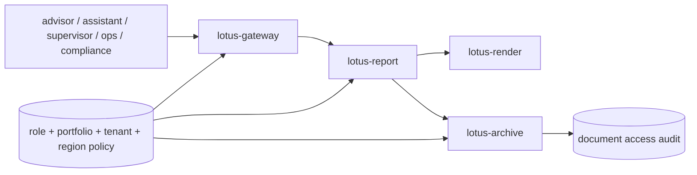

# RFC-0106: Reporting Security, Entitlements, And Region/Tenant Segregation

- Status: Proposed
- Date: 2026-04-23
- Owners:
  - lotus-platform security/governance
  - `lotus-gateway` owners
  - `lotus-report` owners
  - `lotus-render` owners
  - `lotus-archive` owners
- Target repositories:
  - `lotus-gateway`
  - `lotus-report`
  - `lotus-render`
  - `lotus-archive`
  - `lotus-workbench`
  - `lotus-platform`
- Depends on:
  - `RFC-0099-enterprise-reporting-and-document-archive-target-architecture.md`
  - `RFC-0100` through `RFC-0105`

## Summary

This RFC defines the security and entitlement model for enterprise reporting and generated document
retrieval. It covers who can request reports, who can access generated documents, tenant/region
segregation, encryption, service-to-service authorization, sensitive logging rules, and
certification tests.

## Problem

Generated private-banking reports contain sensitive client and portfolio information. Report
generation and document retrieval must be protected by layered authorization, not only UI controls.

## Target Scope

In scope:

1. role matrix,
2. portfolio entitlement checks,
3. report-type entitlement,
4. document retrieval entitlement,
5. tenant/region/booking-center segregation,
6. service-to-service authorization,
7. encryption expectations,
8. sensitive logging restrictions,
9. access audit requirements,
10. security certification tests.

Out of scope:

1. enterprise identity provider implementation,
2. customer authentication portal,
3. legal retention rules owned by RFC-0103,
4. broad application security outside reporting.

## Role Model

Initial roles:

1. `advisor`,
2. `advisor_assistant`,
3. `supervisor`,
4. `operations`,
5. `compliance`,
6. `system_batch`,
7. `platform_admin`.

Each role must declare allowed report types, portfolio scope, document actions, replay/rerender
permissions, legal-hold permissions, and purge permissions.

## Platform Governance And Mesh Requirements

1. Security controls must be enforced at gateway, report, render, and archive boundaries.
2. Access policy must align with RFC-0091 mesh access-policy concepts where reporting evidence
   products are published or consumed.
3. Region, tenant, and booking-center segregation must be part of metadata and authorization tests.
4. Swagger examples, logs, metrics, and wiki material must use synthetic data only.
5. Supported-features material must not claim customer document access until authorization and
   access-audit tests exist.

## Enforcement Layers

1. `lotus-gateway` enforces product-facing user/session entitlement.
2. `lotus-report` enforces report request and job entitlement.
3. `lotus-render` accepts only authorized service-to-service render packages.
4. `lotus-archive` enforces document-level metadata and binary retrieval entitlement.
5. `lotus-workbench` renders only gateway-backed permissions and does not invent access.

## Implementation Slices

### Slice 0: Cleanup And Structure

1. Review current report/document entitlement docs and remove stale wording.
2. Clarify gateway-first access in docs and wiki.
3. Prepare security matrix location and source-of-truth ownership.

### Slice 1: Role And Entitlement Matrix

1. Define role/action/report/document matrix.
2. Add contract tests for allowed and denied actions.
3. Document tenant/region/booking-center semantics.

### Slice 2: Gateway And Report Enforcement

1. Enforce report initiation and status access.
2. Ensure caller context is propagated and audited.
3. Add negative tests for unauthorized portfolio/report access.

### Slice 3: Archive Retrieval Enforcement

1. Enforce document metadata/download entitlement.
2. Record access audit.
3. Add tests for denied download, expired URL, and cross-tenant access.

### Slice 4: Service-To-Service And Sensitive Data Controls

1. Enforce report-to-render and report-to-archive service authorization.
2. Add sensitive logging rules and tests.
3. Verify encryption in transit and at rest posture is documented.

### Second-Last Slice: Hardening, Review, And Certification

1. Perform security-focused code review.
2. Verify API certification and platform governance.
3. Verify no sensitive payloads leak through logs, metrics, Swagger examples, or public docs.

### Final Slice: Closure

1. Update docs, wiki, context, supported-features, and skills/guidance.
2. Publish wiki after merge if changed.
3. Record residual security risks or governed deviations.

## Acceptance Criteria

1. Report generation and document retrieval are protected by layered authorization.
2. Role and action matrix is explicit and tested.
3. Tenant/region segregation is enforced or clearly governed as deferred.
4. Every document access is auditable.
5. Sensitive content is not exposed in logs, metrics, or public examples.

## Risks

| Risk | Mitigation |
| --- | --- |
| Gateway-only authorization is bypassed | Enforce in report and archive as well |
| Cross-tenant document leakage | Tenant/region keys in metadata and authorization tests |
| Sensitive examples leak into Swagger | Use synthetic examples and docs review |
| Support roles become overpowered | Explicit role/action matrix and audit |

## Validation

Required validation:

1. Authorization unit and integration tests.
2. Negative tests for cross-tenant, cross-region, and unauthorized portfolio access.
3. Sensitive logging and Swagger example review.
4. Security audit in PR merge gate.

## Supported Features

Security features must be documented as supported only after enforcement and negative tests exist.
