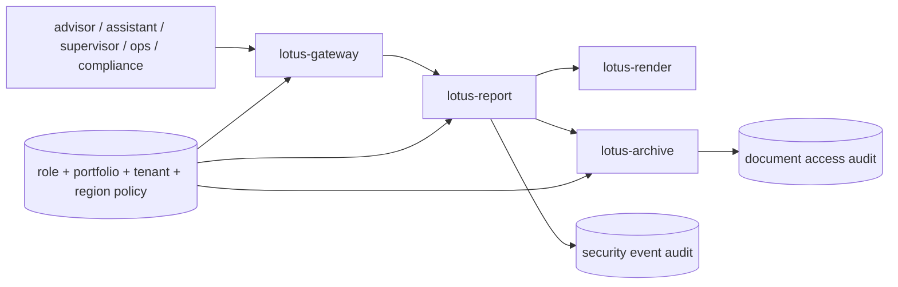

# RFC-0106: Reporting Security, Entitlements, And Region/Tenant Segregation

- Status: Gold-Pass Ready; Implementation Not Started
- Date: 2026-04-23
- Gold-pass hardened: 2026-04-26
- Owners:
  - `lotus-platform` security/governance
  - `lotus-gateway` owners
  - `lotus-report` owners
  - `lotus-render` owners
  - `lotus-archive` owners
  - `lotus-workbench` owners if a gateway-backed reporting surface is included
- Target repositories:
  - `lotus-gateway`
  - `lotus-report`
  - `lotus-render`
  - `lotus-archive`
  - `lotus-platform`
  - optionally `lotus-workbench` only for gateway-backed permission rendering
- Depends on:
  - `RFC-0099-enterprise-reporting-and-document-archive-target-architecture.md`
  - `RFC-0100-reporting-gateway-invocation-and-job-ledger-foundation.md`
  - `RFC-0101-report-data-snapshot-and-lineage-contracts.md`
  - `RFC-0102-render-package-template-registry-and-render-service.md`
  - `RFC-0103-document-archive-retrieval-retention-and-legal-hold.md`
  - `RFC-0104-batch-reporting-scheduler-concurrency-and-recovery.md` for any batch-controlled
    report or document action
  - `RFC-0105-reporting-observability-operations-and-replay-tooling.md` for operator actions,
    rerender, regenerate, replay, and diagnostics surfaces
- Follow-on RFC boundaries:
  - `RFC-0107-enterprise-reporting-production-certification.md` owns final release certification
    after RFC-0106 enforcement, tests, docs, and live proof are complete.

## Summary

This RFC defines the security and entitlement model for enterprise reporting and generated-document
retrieval. It covers who can request reports, who can inspect report status, who can retrieve
documents, which service-to-service calls are trusted, how tenant/region/booking-center segregation
is enforced, how access is audited, and how sensitive content is kept out of logs, metrics, traces,
Swagger examples, wiki pages, and operator diagnostics.

The implementation must make reporting security enforceable at every boundary, not only in the UI.
`lotus-gateway`, `lotus-report`, `lotus-render`, and `lotus-archive` must each reject requests that
are outside their trust contract. `lotus-workbench` may render only gateway-backed permissions and
must not invent reporting or document access.

## Critical Review Outcome

The original RFC-0106 draft identified the right security topic but was not strong enough for
implementation. The main gaps were:

1. no platform automation and scaffolding improvement slice,
2. no cleanup and structure slice,
3. no implementation-proof slice with live evidence,
4. no explicit second-last hardening/API-certification slice,
5. no final documentation/context/wiki/supported-features/branch-hygiene slice,
6. no source-backed role/action/report/document matrix,
7. no explicit tenant, region, and booking-center segregation contract,
8. no service-to-service authorization contract,
9. no document access audit contract,
10. no negative-path proof requirements,
11. no Swagger/API certification quality bar,
12. no supported-features promotion discipline.

This gold pass converts RFC-0106 into an implementation-ready execution guide. Implementation must
not begin until this RFC is accepted as the working security plan.

## Gold-Pass Readiness Assessment

| Review area | Gold-pass finding | Required implementation posture |
| --- | --- | --- |
| Scope clarity | RFC-0106 owns reporting authorization, document access authorization, tenant/region segregation, service-to-service trust, access audit, and sensitive-content controls. | Do not move production certification into this RFC; RFC-0107 owns release certification after RFC-0106 is proven. |
| Boundary enforcement | Gateway-only authorization is insufficient. Report, render, and archive boundaries must enforce their own trust contracts. | Add negative tests at every boundary; do not rely on Workbench controls. |
| Source backing | Entitlement decisions must come from source-backed caller, portfolio, tenant, region, booking-center, report-type, and document metadata. | Missing source contracts become explicit gaps; no invented entitlement fields. |
| API quality | Every new or changed API requires certified Swagger with examples, typed attributes, descriptions, and product-safe errors. | No endpoint is complete until OpenAPI quality and negative-path tests pass. |
| Auditability | Report initiation, document metadata lookup, download, purge, legal-hold, replay, rerender, regenerate, and operator security actions must be auditable where supported. | Every access decision must produce enough evidence for investigation without exposing sensitive content. |
| Data protection | Examples, logs, metrics, traces, dashboards, and docs must use synthetic data and avoid sensitive payloads. | Add tests or review gates that prove sensitive material is not emitted. |
| Closure | Second-last hardening and final closure slices follow the current RFC governance standard. | Close only after docs, wiki, supported-features, context/skills decisions, CI, live proof, and branch hygiene are complete. |

Gold-pass conclusion: RFC-0106 is implementation-ready as a security execution guide.
Implementation remains unstarted. Supported-features entries must remain planned or absent until
enforcement, tests, API contracts, docs, and live evidence are complete.

## Problem

Generated private-banking reports contain sensitive client, portfolio, performance, risk, advisory,
transaction, and document information. Report generation and document retrieval must be protected
by layered authorization, not only UI controls or trusted internal conventions.

Without a governed security model, the platform risks:

1. cross-tenant report generation,
2. cross-region or cross-booking-center document access,
3. advisors viewing portfolios outside their mandate,
4. assistants or operations users performing privileged actions without appropriate scope,
5. report status or diagnostic APIs leaking sensitive metadata,
6. service-to-service calls bypassing gateway entitlement checks,
7. document downloads without access audit,
8. Swagger, logs, metrics, traces, dashboards, or wiki examples exposing sensitive data,
9. supported-features claims exceeding proven authorization behavior.

## Business Outcome

After implementation, Lotus should be able to prove that:

1. only entitled users can request a report for a portfolio and report type,
2. only entitled users or services can inspect report status and diagnostics,
3. only entitled users or services can retrieve archived document metadata or binaries,
4. tenant, region, and booking-center boundaries are enforced consistently,
5. service-to-service calls are authenticated, authorized, and auditable,
6. privileged operations are limited by role and scope,
7. sensitive content does not leak through operational surfaces,
8. every supported security feature is implementation-backed and test-proven.

## Target Scope

In scope:

1. role/action/report/document entitlement matrix,
2. caller context contract and propagation,
3. portfolio entitlement checks,
4. report-type entitlement checks,
5. report request, job status, batch status, rerender, regenerate, replay, and operator action
   authorization where those capabilities are implemented,
6. archived document metadata and binary retrieval authorization,
7. purge and legal-hold authorization guardrails where RFC-0103 surfaces exist,
8. tenant, region, and booking-center segregation,
9. service-to-service authorization for report-to-render and report-to-archive flows,
10. sensitive logging, metrics, traces, dashboard, Swagger, and documentation controls,
11. access audit and security-event evidence,
12. API certification and Swagger quality for every new or changed endpoint,
13. supported-features updates only after implementation-backed proof.

Out of scope:

1. enterprise identity provider implementation,
2. customer authentication portal,
3. broad application security outside enterprise reporting and generated documents,
4. legal retention, purge scheduling, and legal-hold semantics owned by RFC-0103,
5. replay/rerender/regenerate mechanics owned by RFC-0105 except their authorization gates,
6. final production certification owned by RFC-0107,
7. Workbench-only entitlement invention,
8. raw database administration or direct object-storage access.

## Locked First-Wave Decisions

These decisions are fixed unless a committed RFC amendment changes them:

1. `lotus-gateway` is the product-facing authorization boundary.
2. `lotus-report` must independently enforce report request, report status, batch, rerender,
   regenerate, replay, and report-job access for APIs it owns.
3. `lotus-render` must accept render work only from authorized service callers and must not expose
   client-facing rendered content directly.
4. `lotus-archive` must independently enforce document metadata, binary retrieval, purge, and
   legal-hold access for APIs it owns.
5. `lotus-workbench` consumes gateway-backed permissions only.
6. Object storage is never exposed directly to Workbench or client-facing callers.
7. Synthetic examples are mandatory in Swagger, docs, tests, and wiki material.
8. Security supported-features entries require positive and negative tests plus live proof.

## Conditional Decisions

These decisions must be resolved in the slice that needs them:

1. first-wave source of user-to-portfolio entitlement truth,
2. first-wave source of role-to-action entitlement truth,
3. first-wave tenant, region, and booking-center source contracts,
4. whether service-to-service trust uses signed service headers, token exchange, mTLS posture, or a
   local-development substitute with production migration notes,
5. exact operator/compliance role permissions for rerender, regenerate, replay, purge, and legal
   hold,
6. whether first-wave archive downloads are service-streamed, signed-URL-backed, or both,
7. whether Workbench renders any new reporting permission state in this RFC,
8. whether RFC-0106 updates RFC-0084/RFC-0091 product declarations or remains scoped to reporting
   docs until RFC-0107.

Deferred decisions must name owner, reason, downstream impact, and supported-features posture.

## Architecture Direction

Core implementation rules:

1. Authorization decisions must be made from caller context plus source-backed portfolio/report or
   document metadata.
2. Every service boundary must fail closed when entitlement context is missing, malformed, expired,
   or inconsistent with source metadata.
3. Report status and operator diagnostics must redact sensitive data unless explicitly allowed by a
   support-safe contract.
4. Service-to-service trust must be explicit and testable.
5. Access audit must record subject, action, target, decision, reason category, correlation id, and
   timestamp without storing sensitive payloads.
6. Tenant, region, and booking-center keys must be part of both metadata and authorization tests.

## Entitlement Attribute Inventory

| Attribute | Business meaning | Source application | Source object / source contract | Status before implementation | Action required |
| --- | --- | --- | --- | --- | --- |
| `subject_id` | Acting user or service identity | Gateway/session or service credential | Caller context | Needs clarification | Define first-wave caller context and propagation. |
| `subject_role` | Role used for permission decisions | Gateway/session or policy source | Caller context / role policy | Needs clarification | Define role vocabulary and supported actions. |
| `tenant_id` | Tenant boundary | Gateway/session and domain metadata | Caller context, portfolio, report, document | Partially available | Enforce equality and test cross-tenant denial. |
| `region_id` | Region boundary | Gateway/session and domain metadata | Caller context, portfolio, report, document | Partially available | Enforce equality or documented regional access rules. |
| `booking_center_id` | Booking-center boundary | `lotus-core` / portfolio metadata | Portfolio metadata | Needs clarification | Confirm source contract or record source gap. |
| `portfolio_id` | Portfolio scope | `lotus-core` | Portfolio metadata and entitlement source | Available as identifier | Add entitlement source mapping and negative tests. |
| `report_type` | Report action scope | `lotus-report` | Report request/package metadata | Available | Map report type to role permissions. |
| `report_job_id` | Report status target | `lotus-report` | Report job ledger | Available | Enforce caller access to job scope. |
| `batch_id` | Batch status/control target | `lotus-report` | RFC-0104 batch ledger | Available for first-wave APIs | Enforce caller access to all materialized scope. |
| `document_id` | Archived document target | `lotus-archive` | Archive metadata | Available | Enforce metadata/download entitlement and audit access. |
| `legal_hold_status` | Whether purge is blocked | `lotus-archive` | Legal hold metadata | Available | Enforce privileged legal-hold actions. |
| `operator_action_id` | Audit identity for privileged action | `lotus-report` / `lotus-archive` | New or hardened audit model | Missing | Add audit source before promoting operator security features. |

## Role And Action Matrix Floor

The implementation may refine role names, but it must explicitly certify at least this matrix:

| Role | Report request | Status/diagnostics | Document metadata | Document download | Rerender/regenerate/replay | Purge/legal hold |
| --- | --- | --- | --- | --- | --- | --- |
| `advisor` | Own entitled portfolios only | Own entitled portfolios only | Own entitled portfolios only | Own entitled portfolios only | No by default | No |
| `advisor_assistant` | Delegated portfolios only | Delegated portfolios only | Delegated portfolios only | Delegated portfolios only | No by default | No |
| `supervisor` | Supervised portfolios only | Supervised portfolios only | Supervised portfolios only | Supervised portfolios only | Approval-gated if supported | No |
| `operations` | Operational scope only | Operational scope only | Operational scope only | No by default unless break-glass is approved | Operational replay only if RFC-0105 supports it | No |
| `compliance` | No by default | Compliance scope | Compliance scope | Compliance scope with audit | No by default | Legal-hold allowed if supported |
| `system_batch` | System-owned scheduled scope only | System-owned scope only | Service handoff only | No client download | No human operator actions | No |
| `platform_admin` | No client business access by default | Platform diagnostics only | No client document access by default | No client download | No client action by default | No |

Any broader permission must be justified, audited, documented, and tested as a deliberate business
decision.

## Implementation Slices

### Slice 0: Platform Automation And Scaffolding Improvement

Purpose: raise platform security scaffolding so future services start with stronger governance.

Required work:

1. identify security and entitlement gaps in `lotus-platform` scaffolding and validation,
2. improve default scaffolding for caller context, service metadata, product-safe errors, OpenAPI
   examples, synthetic sample data, auth test placeholders, structured logging redaction, health
   endpoints, CI defaults, docs, wiki, and governance hooks where repeatable,
3. add or update validators that catch missing security descriptions, unsafe examples, or
   unsupported public endpoints,
4. document no-change decisions for scaffold areas reviewed but not changed.

Acceptance criteria:

1. repeatable security gaps are fixed at platform level,
2. scaffolded services start with stronger authorization, Swagger, error, and test posture,
3. platform tests or validators prove the change,
4. future apps benefit without copying RFC-0106-specific code.

### Slice 1: Cleanup And Structure

Purpose: remove stale security wording and prepare clear module/doc ownership.

Required work:

1. remove dead or duplicate entitlement/security docs,
2. consolidate reporting security vocabulary and role/action/source mapping,
3. move durable operator/security guidance to repo-local wiki source where appropriate,
4. avoid duplicate documentation across repo and wiki,
5. ensure `lotus-gateway`, `lotus-report`, `lotus-render`, and `lotus-archive` have clear module
   boundaries for authorization, caller context, audit, and redaction.

Acceptance criteria:

1. docs and wiki source do not conflict,
2. no supported-features claim is promoted in this slice unless already implemented and proven,
3. future enforcement files have clear ownership boundaries.

### Slice 2: Caller Context And Entitlement Contract

Purpose: define the source-backed security context used across reporting services.

Required work:

1. define caller context fields, required provenance, and validation rules,
2. define service-caller context for report-to-render and report-to-archive calls,
3. map role, tenant, region, booking-center, portfolio, report type, and document metadata sources,
4. add contract tests for valid, missing, malformed, inconsistent, and expired context,
5. document source gaps and placement questions.

Acceptance criteria:

1. caller context is explicit, typed, documented, and test-protected,
2. missing or inconsistent context fails closed,
3. every entitlement attribute maps to a source or recorded source gap.

### Slice 3: Gateway And Report Enforcement

Purpose: enforce report initiation, report status, batch status/control, and operator reporting
actions.

Required work:

1. enforce report request authorization by role, portfolio, report type, tenant, region, and
   booking center where source data exists,
2. enforce report status/job lookup authorization,
3. enforce RFC-0104 batch status/control authorization where batch APIs are supported,
4. enforce RFC-0105 rerender/regenerate/replay authorization where those APIs are supported,
5. add positive and negative tests for unauthorized portfolio, tenant, region, report type, role,
   and batch access,
6. audit security-relevant report actions.

Acceptance criteria:

1. gateway and report boundaries both fail closed,
2. negative tests cover cross-tenant, cross-region, unauthorized portfolio, unauthorized role, and
   unsupported action,
3. errors are product-safe and do not disclose sensitive details.

### Slice 4: Archive Retrieval Enforcement

Purpose: enforce archived document metadata and binary retrieval security.

Required work:

1. enforce document metadata entitlement,
2. enforce binary download entitlement,
3. enforce legal-hold and purge permissions where supported,
4. record access audit for metadata lookup, download, denied access, purge, legal-hold action, and
   break-glass action if supported,
5. add tests for denied download, expired access, cross-tenant access, cross-region access,
   cross-booking-center access, object-key leakage, and document-not-found ambiguity.

Acceptance criteria:

1. archive APIs fail closed without valid entitlement context,
2. object storage is not directly exposed,
3. every document access decision is auditable,
4. errors do not reveal documents outside the caller's scope.

### Slice 5: Service-To-Service Trust And Sensitive Data Controls

Purpose: secure internal reporting service calls and operational surfaces.

Required work:

1. enforce authorized service-to-service calls from report to render,
2. enforce authorized service-to-service calls from report to archive,
3. verify render and archive reject unauthenticated or unauthorized service calls,
4. add sensitive logging, metrics, traces, dashboard, Swagger, and wiki/example controls,
5. test that secrets, tokens, signed URLs, raw payloads, rendered documents, and unrestricted client
   data are not emitted.

Acceptance criteria:

1. service boundaries reject invalid service identity,
2. synthetic examples are used everywhere,
3. no-sensitive-content tests or review gates protect logs, metrics, traces, Swagger, and docs.

### Slice 6: API Certification, Swagger, And Error Contract

Purpose: certify all changed security APIs and error behavior.

Required work:

1. certify every changed endpoint,
2. ensure Swagger is grouped correctly,
3. add clear what/when/how endpoint descriptions,
4. include full request and response examples,
5. ensure every attribute has description, type, and example value,
6. add full error examples for unauthorized, forbidden, cross-tenant, cross-region, expired access,
   invalid role, invalid service caller, and not found,
7. ensure errors are deterministic, product-safe, and tested.

Acceptance criteria:

1. OpenAPI quality gates pass,
2. examples use synthetic data only,
3. negative-path behavior is documented and tested.

### Slice 7: Implementation Proof

Purpose: prove RFC-0106 end to end before hardening and closure.

Required work:

1. bring up live `lotus-gateway`, `lotus-report`, `lotus-render`, and `lotus-archive` where
   included,
2. prove an entitled report request can be triggered, rendered, archived, and retrieved,
3. prove denied report request for unauthorized portfolio, tenant, region, and report type,
4. prove denied document metadata and download for unauthorized tenant, region, booking center, and
   role,
5. prove service-to-service render/archive calls reject invalid service identity,
6. prove access audit entries for allowed and denied document actions,
7. capture exact identifiers:
   - repository,
   - branch,
   - PR number,
   - commit SHA,
   - check name,
   - endpoint,
   - subject id or synthetic subject,
   - tenant id,
   - region id,
   - portfolio id,
   - report job id,
   - document id,
   - correlation id,
   - audit event id,
8. critically review evidence for gaps before moving to hardening.

Acceptance criteria:

1. live proof demonstrates actual behavior, not mocked-only success,
2. evidence includes both allow and deny paths,
3. discovered gaps are fixed or explicitly deferred before second-last hardening,
4. RFC proof ledger is updated with exact evidence.

### Second-Last Slice: Hardening, Review, And Certification

Purpose: perform final security and governance review before closure.

Required work:

1. perform a security-focused code review of the full implementation,
2. remove dead code and duplicate authorization logic,
3. verify API certification pattern compliance,
4. verify platform governance and enterprise data mesh standards are met,
5. ensure all APIs are properly certified,
6. ensure Swagger is complete and high quality:
   - grouped correctly,
   - clear what/when/how guidance for each endpoint,
   - full request and response examples,
   - every attribute has description, type, and example value,
7. ensure error handling is complete, correct, and properly tested,
8. verify audit evidence and no-sensitive-content controls,
9. make final quality improvements before closure.

Acceptance criteria:

1. no known P0/P1 security or segregation issue remains untriaged,
2. authorization logic is not duplicated or contradictory,
3. docs, APIs, tests, and supported-features claims are aligned,
4. CI and live proof are green.

### Final Slice: Closure

Purpose: close RFC-0106 with truthful product, operator, and security documentation.

Required work:

1. update documentation,
2. update agent context if operational truth changed,
3. update repo-local wiki source and publish after merge if changed,
4. update supported-features with implementation-backed rows only,
5. update RFC proof ledger and final gold-pass assessment,
6. review whether skills, guidance, documentation, or agent context should be improved for future
   security work,
7. record a deliberate keep/tighten/add/remove/no-change decision for relevant guidance,
8. complete branch hygiene and cleanup.

Acceptance criteria:

1. supported-features entries match shipped behavior only,
2. wiki source and published wiki are synchronized after merge,
3. guidance/skills decision is explicit,
4. branch and PR state are clean.

## API Certification Requirements

Every RFC-0106 API must satisfy:

1. canonical path and vocabulary review,
2. endpoint summary and description,
3. tags grouped by security/operator workflow,
4. clear what/when/how usage guidance,
5. full request examples,
6. full response examples,
7. response descriptions for success and failure,
8. every schema attribute has description, type, and example value,
9. product-safe error taxonomy,
10. authorization and audit behavior documented,
11. unit, integration, negative-path, and live proof where applicable.

## Supported Features Governance

RFC-0106 must maintain a clear supported-features list. Candidate feature keys include:

| Feature key | Planned surface | Promotion rule |
| --- | --- | --- |
| `lotus-report.reporting.security.caller_context.v1` | Caller and service context validation | Promote only after source mapping, tests, docs, and live proof. |
| `lotus-report.reporting.security.report_entitlement.v1` | Report request/status/batch/operator authorization | Promote only after positive/negative tests and API certification. |
| `lotus-archive.reporting.security.document_access.v1` | Document metadata/download entitlement | Promote only after cross-tenant/region denial, audit proof, and retrieval proof. |
| `lotus-render.reporting.security.service_trust.v1` | Authorized service-to-service render calls | Promote only after invalid-service denial and report-to-render proof. |
| `lotus-report.reporting.security.sensitive_surface_controls.v1` | Logs, metrics, traces, Swagger, docs redaction | Promote only after no-sensitive-content tests or review gates. |
| `lotus-report.reporting.security.audit_evidence.v1` | Access and privileged-action audit evidence | Promote only after audit entries are source-backed and live-proven. |

Rows must remain planned or absent until implementation-backed proof exists.

## Evidence Expectations

Every implementation PR must include:

1. changed repositories and branches,
2. local validation commands,
3. GitHub check status,
4. live proof commands where applicable,
5. exact security identifiers,
6. allow and deny API examples,
7. OpenAPI/Swagger evidence,
8. audit evidence,
9. no-sensitive-content validation evidence,
10. docs/wiki/supported-features changes,
11. explicit source gaps or deferred scope.

## Risks

| Risk | Mitigation |
| --- | --- |
| Gateway-only authorization is bypassed | Enforce in report, render, and archive boundaries with negative tests. |
| Cross-tenant document leakage | Tenant/region/booking-center keys in metadata and authorization tests. |
| Sensitive examples leak into Swagger | Synthetic examples, OpenAPI quality checks, and docs review. |
| Support roles become overpowered | Explicit role/action matrix, least privilege, and audit. |
| Service-to-service trust is implicit | Explicit service identity contract and invalid-caller tests. |
| Object storage key leaks | Service-stream or signed URL controls, redaction tests, and no direct object access. |
| Supported-features overclaim | Promotion requires code, tests, API contract, docs, and proof. |

## Validation Plan

Required validation includes:

1. platform scaffold/security-governance tests,
2. caller context unit and integration tests,
3. gateway/report authorization tests,
4. archive document access tests,
5. service-to-service trust tests,
6. cross-tenant, cross-region, cross-booking-center, unauthorized role, and unauthorized portfolio
   negative tests,
7. access audit tests,
8. sensitive logging/metrics/traces/Swagger/docs tests or review gates,
9. OpenAPI quality and endpoint certification tests,
10. live Docker or canonical environment proof across gateway, report, render, and archive where
    included,
11. GitHub CI evidence,
12. wiki synchronization check before merge and publication after merge where wiki changed.

## Implementation Proof Ledger

The proof ledger starts empty because implementation has not begun.

| Slice | Evidence source | Command/API/artifact | Result | Follow-up |
| --- | --- | --- | --- | --- |
| Pre-implementation gold pass | This RFC revision | RFC tightened before implementation | Ready for implementation planning | Do not promote supported features until implementation-backed proof exists. |

## Final Gold-Pass Assessment Placeholder

This section must be completed in the final closure slice. It must state:

1. what was truly completed,
2. what quality improvements were made,
3. what debt was removed,
4. what was proven through tests and live evidence,
5. which security features were promoted to implementation-backed,
6. which risks or gaps remain deferred and why,
7. whether the implementation reached the expected production standard.
