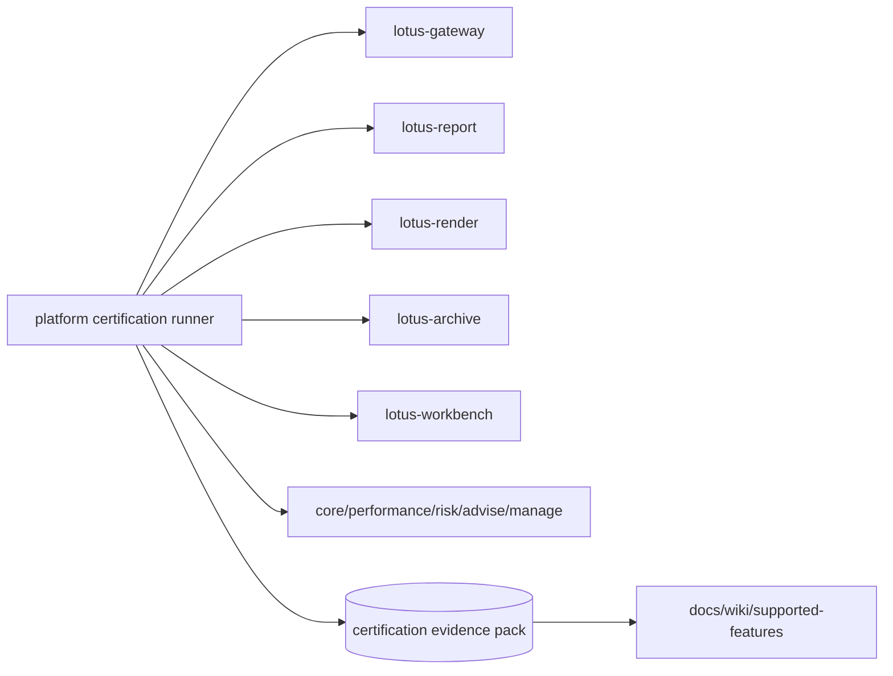

# RFC-0107: Enterprise Reporting Production Certification

- Status: Gold-Pass Ready; Implementation Not Started
- Date: 2026-04-23
- Gold-pass hardened: 2026-04-26
- Owners:
  - `lotus-platform` governance
  - `lotus-report` owners
  - `lotus-render` owners
  - `lotus-archive` owners
  - `lotus-gateway` owners
  - `lotus-workbench` owners
  - upstream domain service owners
- Target repositories:
  - `lotus-platform`
  - `lotus-report`
  - `lotus-render`
  - `lotus-archive`
  - `lotus-gateway`
  - `lotus-workbench`
  - `lotus-core`
  - `lotus-performance`
  - `lotus-risk`
  - `lotus-advise`
  - `lotus-manage`
- Depends on:
  - `RFC-0072-platform-wide-multi-lane-ci-validation-and-release-governance.md`
  - `RFC-0084-mesh-governance.md`
  - `RFC-0091-enterprise-data-mesh-maturity-and-production-readiness.md`
  - `RFC-0099-enterprise-reporting-and-document-archive-target-architecture.md`
  - `RFC-0100-reporting-gateway-invocation-and-job-ledger-foundation.md`
  - `RFC-0101-report-data-snapshot-and-lineage-contracts.md`
  - `RFC-0102-render-package-template-registry-and-render-service.md`
  - `RFC-0103-document-archive-retrieval-retention-and-legal-hold.md`
  - `RFC-0104-batch-reporting-scheduler-concurrency-and-recovery.md`
  - `RFC-0105-reporting-observability-operations-and-replay-tooling.md`
  - `RFC-0106-reporting-security-entitlements-and-region-tenant-segregation.md`

## Summary

This RFC defines the final production certification gate for the enterprise reporting
architecture. It does not introduce a new reporting feature by itself. It proves that the
implementation-backed capabilities delivered through RFC-0100 through RFC-0106 work together as a
single governed platform across gateway initiation, report ledger, data lineage, rendering,
archive, batch, observability, security, documentation, wiki, context, supported-features, and
operations posture.

Production readiness may be claimed only after this RFC captures source-backed evidence across the
actual services, APIs, jobs, generated artifacts, access decisions, CI lanes, and operator runbooks.
The goal is not a happy-path demo; it is release-grade certification.

## Critical Review Outcome

The original RFC-0107 draft had the right intent but was not strong enough for final certification.
The main gaps were:

1. no platform automation and certification-runner improvement slice,
2. no cleanup and structure slice,
3. no clear entry criteria from RFC-0100 through RFC-0106,
4. no explicit evidence-pack schema,
5. no canonical live-stack requirement,
6. no scenario-by-scenario acceptance criteria,
7. no negative-path and recovery evidence requirements,
8. no non-functional threshold model,
9. no API certification and Swagger review requirements,
10. no supported-features promotion/rollback discipline,
11. no second-last hardening slice,
12. no final closure slice for docs, wiki, context, skills, and branch hygiene.

This gold pass converts RFC-0107 into an implementation-ready certification guide.
Implementation must not begin until upstream RFCs have shipped the capabilities being certified or
the certification scope explicitly excludes missing capabilities.

## Gold-Pass Readiness Assessment

| Review area | Gold-pass finding | Required implementation posture |
| --- | --- | --- |
| Scope clarity | RFC-0107 certifies the complete enterprise reporting platform; it does not build missing RFC-0100 through RFC-0106 functionality except certification automation and proof artifacts. | Missing capabilities must be blocked, excluded, or sent back to the owning RFC. |
| Evidence quality | Final readiness requires executable evidence from live services plus GitHub CI and repo-native validation. | No production-ready claim from docs-only, mocked-only, or single happy-path proof. |
| Cross-repo governance | Certification spans platform, report, render, archive, gateway, Workbench, and upstream domain services. | Evidence must name repo, branch, PR, commit, check, endpoint, and operational identifiers. |
| Security and observability | RFC-0105 and RFC-0106 proof must be consumed, not bypassed. | Final certification must include observability, audit, authorization denial, and no-sensitive-content evidence. |
| Non-functional readiness | Latency, throughput, concurrency, recovery, and storage/retrieval behavior need explicit thresholds. | Thresholds must be recorded before performance proof is accepted. |
| Closure | Documentation, wiki, supported-features, context, skills/guidance, and branch hygiene are part of production readiness. | Final closure must leave product truth synchronized and implementation-backed. |

Gold-pass conclusion: RFC-0107 is implementation-ready as a final certification guide once the
capabilities being certified have landed. Implementation remains unstarted.

## Second Gold-Pass Additions

This final pre-implementation pass tightened the production certification guide in five areas that
are easy to under-specify late in a cross-repo release:

1. active branch and PR synchronization across every affected repository,
2. mandatory live-stack evidence review across APIs, logs, database state, object/artifact state,
   and GitHub checks,
3. blocker classification so certification cannot bury failed scenarios as warnings,
4. clean-state requirements before the next RFC starts,
5. merge and wiki-publication sequencing after certification succeeds.

These additions do not expand RFC-0107 into feature implementation. They make it clear that final
production readiness is a cross-repo evidence and branch-hygiene decision, not a local test pass.

## Pre-Certification Branch And PR Gates

Before running production certification, the implementer must inventory every active branch and PR
for:

1. `lotus-core`,
2. `lotus-report`,
3. `lotus-render`,
4. `lotus-archive`,
5. `lotus-gateway`,
6. `lotus-workbench` if product-surface proof is included,
7. `lotus-platform`.

The inventory must record repository, branch, PR number, commit SHA, CI status, merge state,
expected merge order, and whether the branch is required for RFC-0104 through RFC-0107 proof.

Production certification must not proceed with unknown branch state. If an active branch is not
required, it must be explicitly parked or excluded. If it is required, its checks must be monitored
and fixed-forward while certification continues.

## Live-Stack Evidence Review Requirements

Certification evidence must be captured from the live Docker or canonical stack that most closely
matches the production contract. For each scenario, evidence must include the relevant subset of:

1. API request and response,
2. service logs with correlation/trace identifiers,
3. database state for report job, snapshot, batch, batch item, archive metadata, audit, and
   entitlement records where applicable,
4. generated artifacts or hashes,
5. object-storage or archive adapter state where applicable,
6. metrics or trace output where RFC-0105 scope is included,
7. access audit and denial evidence where RFC-0106 scope is included,
8. GitHub check and local command evidence.

The evidence must be reviewed critically. A scenario is not certified until the observed runtime
state reconciles with API responses, logs, database records, archive metadata, and expected
supported-features wording.

## Blocker Classification

Every failed or incomplete certification scenario must be classified before closure:

| Class | Meaning | Required action |
| --- | --- | --- |
| P0 blocker | Security breach, data leak, cross-tenant/region access, corrupted lineage, duplicate archived document without supersession, or unsupported feature promoted as shipped | Stop certification and fix before merge. |
| P1 blocker | Supported happy path, deny path, archive handoff, batch reconciliation, or critical operator proof fails | Fix before production-ready claim. |
| P2 defect | Non-critical evidence gap or usability issue that does not invalidate certification | Fix or record with owner and no production-readiness impact. |
| Deferred scope | Capability is not implemented by owning RFC and is not claimed as supported | Exclude from certification with explicit supported-features impact. |

P0/P1 blockers cannot be papered over by documentation. They must be fixed in the owning
repository and re-proven.

## Clean-State And Merge Sequencing Requirements

After RFC-0104 implementation and proof complete, and before starting the next implementation RFC:

1. all affected application PRs required by RFC-0104 must be green,
2. required PRs for `lotus-core`, `lotus-report`, `lotus-render`, `lotus-archive`, and
   `lotus-platform` must be merged or deliberately closed/parked with rationale,
3. branches must be deleted or left explicitly tracked only if follow-up work remains,
4. repo-local wiki source must be published after merge where wiki changed,
5. local worktrees must be clean or have only explicitly parked unrelated work,
6. supported-features and RFC traceability must reflect only merged implementation-backed truth,
7. CI health must be checked after merge, not only before merge.

RFC-0107 final certification must consume clean merged baselines wherever possible. If certification
must run against open PR branches, the evidence pack must record that and the final closure slice
must verify the same evidence after merge.

## Problem

Even if each earlier RFC is individually implemented, enterprise reporting is not production-ready
until the complete flow is certified across repositories, services, failure modes, operator
support paths, data protection boundaries, and release governance. A report that can be triggered
locally is not enough; the platform must prove it can be operated, secured, recovered, audited, and
explained.

Without final certification, the platform risks:

1. individually green components failing in the integrated path,
2. rendered documents without trustworthy lineage,
3. archived documents without retrieval/audit proof,
4. batch behavior that works only in a unit-test adapter,
5. observability and security claims that are not source-backed,
6. Workbench or gateway surfacing unsupported behavior,
7. docs and supported-features overstating readiness,
8. production release decisions based on stale or incomplete evidence.

## Business Outcome

After implementation, Lotus should have a release-grade evidence pack proving:

1. ad hoc reporting works end to end,
2. batch reporting works for the supported scope,
3. generated documents have lineage, render evidence, archive metadata, and access audit,
4. rerender, regenerate, replay, correction, reissue, and supersession work where implemented,
5. failure and recovery paths are diagnosable and safe,
6. security and segregation controls deny unauthorized access,
7. observability and operator diagnostics are source-backed,
8. supported-features, docs, wiki, and context match the shipped behavior,
9. GitHub CI and repo-native gates are green.

## Target Scope

In scope:

1. final entry criteria for RFC-0100 through RFC-0106,
2. platform-owned certification harness and evidence-pack schema,
3. canonical live-stack bring-up for reporting services and required upstreams,
4. ad hoc JSON report certification,
5. ad hoc PDF report certification through render and archive,
6. document metadata and download certification,
7. supported batch certification,
8. rerender, regenerate, replay, correction, reissue, and supersession certification where those
   capabilities are implemented,
9. failure and recovery certification,
10. observability, metrics, logs, traces, and operator diagnostics certification,
11. security, entitlement, tenant, region, booking-center, and audit certification,
12. non-functional certification for latency, throughput, concurrency, back-pressure, storage, and
   recovery,
13. docs, wiki, context, supported-features, and branch hygiene closure.

Out of scope:

1. new business report types not delivered by earlier RFCs,
2. building missing RFC-0100 through RFC-0106 runtime behavior,
3. broad platform release certification unrelated to enterprise reporting,
4. production infrastructure provisioning beyond the certification environment/runbook,
5. customer identity-provider implementation.

## Entry Criteria

RFC-0107 implementation may start only after the implementer records:

1. which RFC-0100 through RFC-0106 capabilities are implemented and eligible for certification,
2. which capabilities remain explicitly out of scope,
3. active repositories, branches, and PRs,
4. live-stack topology and Docker/canonical environment commands,
5. seeded portfolios, tenants, regions, users, roles, and report packages,
6. evidence artifact destination,
7. CI lanes required before merge,
8. production-readiness thresholds for latency, throughput, concurrency, error rate, archive
   retrieval, and recovery.

If a required upstream capability is missing, RFC-0107 must stop or narrow scope. It must not fill
missing implementation locally and then call that certification.

## Certification Scenario Matrix

| Scenario | Required proof | Owning source |
| --- | --- | --- |
| Gateway ad hoc JSON report | Gateway request, report request/job, snapshot, response payload, status lookup | RFC-0100/RFC-0101 |
| Gateway ad hoc PDF report | Gateway request, report job, render job, archived document, download metadata | RFC-0100/RFC-0102/RFC-0103 |
| Portfolio-review package | Render package id/version, template registry, deterministic artifact evidence | RFC-0102 |
| Archive retrieval | Metadata lookup, binary retrieval, access audit, legal-hold/retention posture | RFC-0103/RFC-0106 |
| Explicit-list batch | Batch id, item ids, report jobs, status reconciliation, bounded execution | RFC-0104 |
| Scheduled batch if implemented | Schedule identity, materialized batch, execution evidence, recovery proof | RFC-0104 |
| Rerender from snapshot | Same snapshot id/hash, new render id, archive consequence, audit | RFC-0105 |
| Regenerate from upstream | New snapshot, new lineage, old/new relationship, archive consequence | RFC-0105 |
| Replay/retry/recovery | Failed or stuck state, eligible command, after state, audit | RFC-0104/RFC-0105 |
| Unauthorized report request | Denied response without sensitive disclosure | RFC-0106 |
| Unauthorized document retrieval | Denied metadata/download without existence leak, audit where supported | RFC-0106 |
| Cross-tenant/region denial | Denial proof for report and archive paths | RFC-0106 |
| Observability trace | Correlation id across gateway, report, render, archive, and operator lookup | RFC-0105 |
| No-sensitive-content posture | Logs, metrics, traces, Swagger, docs, wiki evidence | RFC-0105/RFC-0106 |
| Workbench surface if included | Workbench consumes gateway only and shows supported behavior only | RFC-0084/RFC-0091/RFC-0106 |

## Evidence Pack Contract

The certification harness must produce a durable evidence pack with:

1. run id,
2. run timestamp,
3. environment and topology,
4. repositories, branches, PR numbers, and commit SHAs,
5. GitHub check names and conclusions,
6. repo-native command results,
7. scenario results,
8. endpoint paths and status codes,
9. `correlation_id`,
10. `trace_id`,
11. `report_request_id`,
12. `report_job_id`,
13. `snapshot_id`,
14. `render_job_id`,
15. `document_id`,
16. `batch_id`,
17. `batch_item_id`,
18. `audit_event_id`,
19. generated artifact paths or hashes,
20. supported-features updates or no-change decision,
21. docs/wiki/context/skills updates or no-change decision,
22. residual gaps and owners.

Evidence may redact sensitive values, but identifiers needed for audit must be stable and
traceable.

## Architecture Direction

Core implementation rules:

1. Certification uses real service APIs and databases/object storage adapters matching the
   production contract as closely as local canonical infrastructure allows.
2. Certification scenarios must prefer PostgreSQL-backed and object-storage-backed paths over
   in-memory or file-only substitutes unless explicitly scoped as development adapters.
3. Workbench proof is optional unless a supported Workbench reporting surface exists; if included,
   it must be gateway-only.
4. Every scenario must distinguish supported behavior from planned/future behavior.
5. Failures discovered during certification must be fixed in the owning repository or recorded as
   blockers; certification must not paper over them.

## Implementation Slices

### Slice 0: Platform Automation And Certification Scaffolding Improvement

Purpose: create or harden platform-owned certification automation instead of ad hoc manual proof.

Required work:

1. identify gaps in `lotus-platform` automation discovered by RFC-0100 through RFC-0106,
2. improve certification runner/scaffolding for multi-service bring-up, seeded data, evidence
   capture, GitHub check lookup, wiki/doc checks, and supported-features verification,
3. improve app scaffolding automation if future services should inherit certification hooks,
4. add validators for evidence-pack schema and required identifiers,
5. document no-change decisions for platform automation reviewed but not changed.

Acceptance criteria:

1. certification evidence is generated by repeatable platform automation where practical,
2. evidence-pack schema is test-protected,
3. future apps benefit from reusable scaffolding or validators,
4. no product behavior is claimed by this slice.

### Slice 1: Cleanup And Structure

Purpose: remove documentation and evidence sprawl before certification.

Required work:

1. review reporting RFC docs, README content, wiki source, context, and supported-features material,
2. remove duplicate architecture/operator/security guidance,
3. move durable production operations material to wiki source,
4. ensure repo docs and wiki source do not conflict,
5. align RFC index and supported-features posture with current implementation reality.

Acceptance criteria:

1. long-lived truth has one clear home,
2. no duplicate or stale production-readiness claims remain,
3. wiki check has expected branch-local drift only where this branch changes authored wiki source.

### Slice 2: Certification Harness And Evidence Pack

Purpose: implement the harness and evidence artifact before running scenarios.

Required work:

1. add or harden platform certification runner,
2. define scenario fixture contract,
3. define evidence-pack schema,
4. collect repo/branch/PR/commit/check metadata,
5. collect endpoint and operational identifiers,
6. validate evidence pack in tests.

Acceptance criteria:

1. harness can run a minimal scenario and write valid evidence,
2. missing required identifiers fail validation unless explicitly marked not applicable,
3. evidence is deterministic enough for PR review and later audit.

### Slice 3: End-To-End Functional Certification

Purpose: certify supported happy-path reporting flows.

Required work:

1. certify ad hoc JSON report generation,
2. certify ad hoc PDF report generation through render and archive,
3. certify archive metadata and download,
4. certify supported portfolio-review render package behavior,
5. certify supported Workbench reporting surface only if included.

Acceptance criteria:

1. every generated document has lineage, render evidence, archive metadata, and retrieval proof,
2. report/package versions are captured,
3. Workbench proof, if included, is gateway-backed.

### Slice 4: Batch, Replay, Rerender, Regenerate, And Supersession Certification

Purpose: certify implemented multi-item and lifecycle operations.

Required work:

1. certify explicit-list batch scope,
2. certify scheduled batch only if RFC-0104 implementation supports it,
3. certify rerender from stored snapshot where RFC-0105 supports it,
4. certify regenerate from upstream data where RFC-0105 supports it,
5. certify replay/retry/recovery where RFC-0104/RFC-0105 support it,
6. certify corrected/reissued/superseded document relationships where supported.

Acceptance criteria:

1. unsupported operations are excluded rather than faked,
2. old/new lineage and archive consequences are explicit,
3. batch counts reconcile with item/report/document state.

### Slice 5: Failure And Recovery Certification

Purpose: prove diagnosability and recovery behavior.

Required work:

1. certify upstream failure behavior,
2. certify render failure behavior,
3. certify archive failure behavior,
4. certify retry/recovery paths where implemented,
5. certify stuck-state or SLA breach detection where RFC-0105 supports it,
6. verify errors are product-safe and operator-diagnostic.

Acceptance criteria:

1. failure paths have trace ids, safe errors, and operator evidence,
2. recovery does not duplicate report jobs or archived documents unless supersession is explicit,
3. unsupported recovery behavior remains documented as future scope.

### Slice 6: Security, Segregation, Audit, And Observability Certification

Purpose: certify RFC-0105 and RFC-0106 controls in the integrated stack.

Required work:

1. certify unauthorized report request denial,
2. certify unauthorized document metadata/download denial,
3. certify cross-tenant, cross-region, and cross-booking-center denial where source data exists,
4. certify access audit for allowed and denied document actions,
5. certify service-to-service trust denial for invalid callers,
6. certify trace/log/metric/operator API linkage,
7. certify no-sensitive-content posture for logs, metrics, traces, Swagger, docs, and wiki.

Acceptance criteria:

1. allow and deny paths are both proven,
2. no sensitive payload leaks through operational surfaces,
3. security and observability evidence is source-backed.

### Slice 7: Non-Functional Certification

Purpose: prove release-grade operational limits for supported scope.

Required work:

1. define first-wave thresholds for ad hoc latency, batch throughput, concurrency, back-pressure,
   render latency, archive latency, retrieval latency, error rate, and recovery time,
2. run certification against those thresholds,
3. capture capacity and limitation notes,
4. document anything that is development-environment-only or not production representative.

Acceptance criteria:

1. thresholds are explicit before results are judged,
2. results are recorded in the evidence pack,
3. failures become blockers or explicit deferred production limitations.

### Slice 8: Documentation, Wiki, Context, Supported-Features, And Release Posture

Purpose: align product and operator truth before hardening.

Required work:

1. update docs and supported-features with implementation-backed production claims only,
2. update repo-local wiki source,
3. update central context or repository context if operating truth changed,
4. update RFC index and production certification status,
5. record no-change decisions where no update is needed.

Acceptance criteria:

1. docs, wiki, context, and supported-features agree,
2. production-ready wording is backed by certification evidence,
3. planned/future behavior remains clearly excluded.

### Slice 9: Implementation Proof

Purpose: prove the certification implementation itself before hardening.

Required work:

1. run full certification harness against the live stack,
2. capture evidence pack,
3. inspect every scenario result critically,
4. open or fix blockers in owning repositories,
5. update proof ledger with exact evidence,
6. verify GitHub CI status for every involved PR.

Acceptance criteria:

1. evidence covers supported happy paths, denial paths, failure paths, and non-functional posture,
2. all blockers are fixed or explicitly deferred with owner and supported-features impact,
3. production-ready claim is still justified after review.

### Second-Last Slice: Hardening, Review, And Certification

Purpose: perform final review before closure.

Required work:

1. perform code review and evidence review of the full implementation,
2. remove dead code and duplicate certification logic,
3. verify API certification pattern compliance,
4. verify platform governance and enterprise data mesh standards,
5. ensure all APIs are properly certified,
6. ensure Swagger is complete and high quality:
   - grouped correctly,
   - clear what/when/how guidance for each endpoint,
   - full request and response examples,
   - every attribute has description, type, and example value,
7. ensure error handling is complete, correct, and tested,
8. verify security, observability, evidence-pack, docs, wiki, and supported-features alignment,
9. make final quality improvements before closure.

Acceptance criteria:

1. no known P0/P1 production-readiness blocker remains untriaged,
2. certification evidence is coherent and reproducible,
3. CI and local evidence are green,
4. product truth and operator truth are synchronized.

### Final Slice: Closure

Purpose: close the RFC sequence with truthful production-readiness posture.

Required work:

1. update documentation,
2. update agent context if operating truth changed,
3. update repo-local wiki source and publish after merge if changed,
4. update supported-features with implementation-backed production certification rows only,
5. update RFC proof ledger and final gold-pass assessment,
6. review whether skills, guidance, documentation, or agent context should be improved for future
   work,
7. record a deliberate keep/tighten/add/remove/no-change decision for relevant guidance,
8. complete branch hygiene and cleanup.

Acceptance criteria:

1. supported-features entries match production-certified behavior only,
2. wiki source and published wiki are synchronized after merge,
3. guidance/skills decision is explicit,
4. branch and PR state are clean.

## API Certification Requirements

RFC-0107 must verify that all enterprise reporting APIs included in production certification have:

1. canonical path and vocabulary review,
2. endpoint summary and description,
3. tags grouped by workflow,
4. clear what/when/how usage guidance,
5. full request examples,
6. full response examples,
7. response descriptions for success and failure,
8. every schema attribute has description, type, and example value,
9. product-safe error taxonomy,
10. authorization and audit behavior documented where relevant,
11. unit, integration, negative-path, and live proof where applicable.

## Supported Features Governance

RFC-0107 is the only RFC in this sequence allowed to promote the complete enterprise reporting
platform as production-certified. Candidate feature keys include:

| Feature key | Planned surface | Promotion rule |
| --- | --- | --- |
| `lotus-reporting.production.ad_hoc_json.v1` | Production-certified ad hoc JSON reports | Promote only after gateway/report/snapshot proof and supported-features alignment. |
| `lotus-reporting.production.ad_hoc_pdf_archive.v1` | Production-certified PDF render/archive path | Promote only after render/archive/retrieval/audit proof. |
| `lotus-reporting.production.batch.v1` | Production-certified supported batch scope | Promote only after batch item/report/document reconciliation and non-functional proof. |
| `lotus-reporting.production.operations.v1` | Production-certified observability/replay/operations | Promote only after RFC-0105 source-backed proof. |
| `lotus-reporting.production.security.v1` | Production-certified reporting security | Promote only after RFC-0106 allow/deny/audit proof. |
| `lotus-reporting.production.workbench.v1` | Production-certified Workbench reporting surface | Promote only if Workbench is gateway-backed and included in evidence. |

Rows must remain planned or absent until implementation-backed certification proof exists.

## Evidence Expectations

Every implementation PR must include:

1. changed repositories and branches,
2. local validation commands,
3. GitHub check status,
4. certification harness command,
5. evidence pack path,
6. exact operational identifiers,
7. API examples or OpenAPI evidence where APIs are certified,
8. security allow/deny evidence,
9. observability evidence,
10. non-functional evidence,
11. docs/wiki/supported-features/context changes,
12. explicit gaps or deferred scope.

## Risks

| Risk | Mitigation |
| --- | --- |
| Individual RFCs pass but end-to-end flow fails | Platform-owned certification scenarios and evidence pack. |
| Certification becomes a demo script | Schema-validated evidence, negative paths, non-functional thresholds, and CI gates. |
| Missing upstream capabilities are hidden | Entry criteria and scenario matrix must mark missing capability as blocker or out of scope. |
| Non-functional gaps appear late | Dedicated non-functional certification slice with thresholds. |
| Docs overstate readiness | Supported-features and wiki review in closure. |
| Cross-repo ownership is unclear | Evidence names repo, branch, PR, commit, check, endpoint, and owner. |
| Security or observability proof is skipped | Dedicated integrated certification slice consumes RFC-0105 and RFC-0106 evidence. |

## Validation Plan

Required validation includes:

1. platform certification runner tests,
2. evidence-pack schema tests,
3. repo-native gates for every touched repository,
4. full certification harness against live Docker/canonical stack,
5. ad hoc JSON/PDF functional proof,
6. archive retrieval proof,
7. batch proof where supported,
8. rerender/regenerate/replay proof where supported,
9. failure and recovery proof,
10. security allow/deny/audit proof,
11. observability trace/log/metric proof,
12. non-functional proof,
13. cross-repo GitHub check evidence,
14. wiki synchronization check before merge and publication after merge where wiki changed.

## Implementation Proof Ledger

The proof ledger starts empty because implementation has not begun.

| Slice | Evidence source | Command/API/artifact | Result | Follow-up |
| --- | --- | --- | --- | --- |
| Pre-implementation gold pass | This RFC revision | RFC tightened before implementation | Ready for certification planning after RFC-0100 through RFC-0106 eligible scope is implemented | Do not claim production readiness until certification evidence exists. |

## Final Gold-Pass Assessment Placeholder

This section must be completed in the final closure slice. It must state:

1. what was truly certified,
2. what quality improvements were made,
3. what debt was removed,
4. what was proven through tests, live evidence, and CI,
5. which features were promoted to production-certified,
6. which gaps remain deferred and why,
7. whether enterprise reporting reached the expected production standard.
