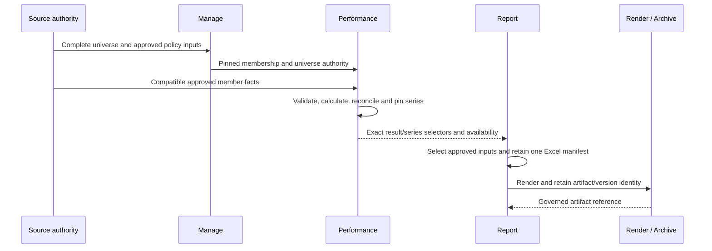
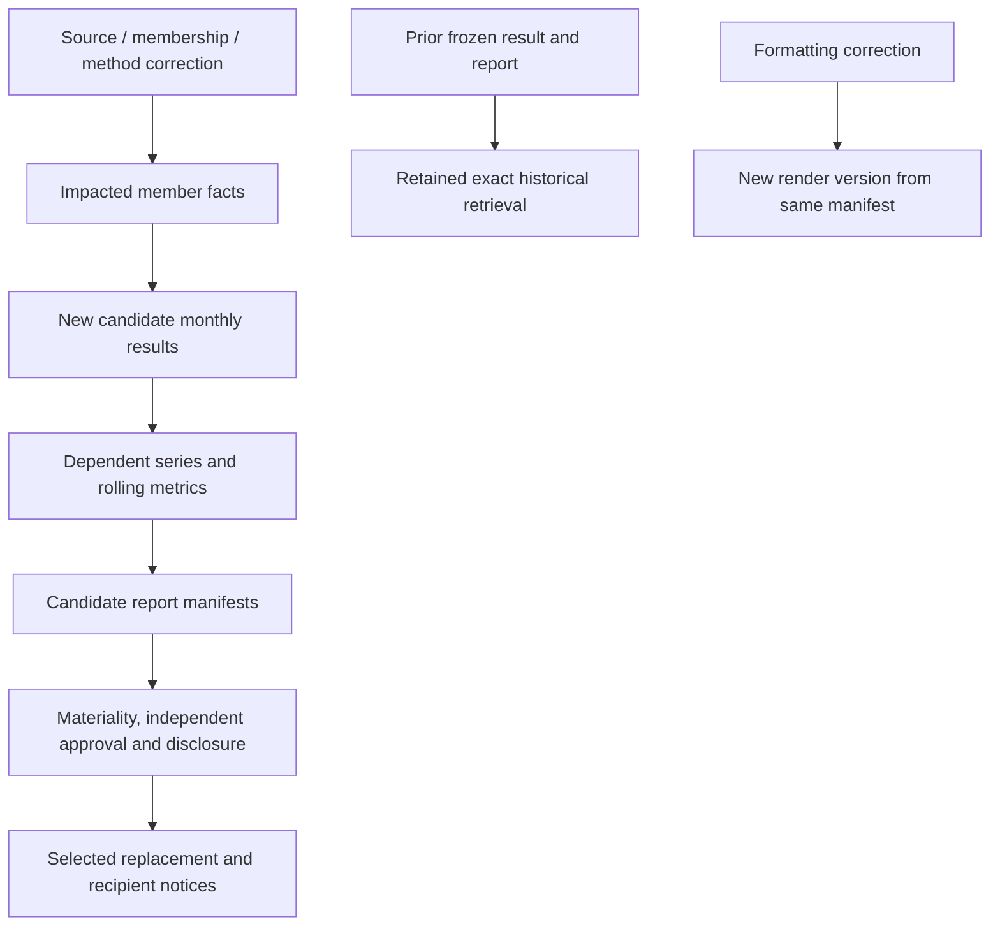

# RFC-0110: Composite performance product and delivery foundation

- Status: Proposed full product programme; documentation foundation under review
- Date: 4 October 2026
- Parent: [Platform #923](https://github.com/sgajbi/lotus-platform/issues/923)
- Foundation: [Platform #924](https://github.com/sgajbi/lotus-platform/issues/924)
- Requirements: [LOTUS-CMP-001 v2.0](../docs/composite-performance/requirements.md)
- Current capability and evidence: [single ledger](../docs/composite-performance/implementation-ledger.v1.json)

## Problem and intended result

Existing Manage composite authority and Performance calculation/materialization surfaces provide reusable starting points. They do not establish the complete configurable, external/Core/hybrid composite product. A complete investment workflow needs an independent expected population, approved policy, compatible member facts, correct financial methods, versioned series, understandable Excel output and reproducible publication history. This RFC connects the full target to existing owners without creating a composite repository or copying a financial engine.

This foundation retains all 321 requirements, all capability catalogues, 48 source rows and every acceptance/oracle/decision/SLO/workload entry. Foundation completion does not close #923 or certify domain support, live integration, GIPS compliance or capacity.

## Authority and current baseline

Platform `1315743b23048b58a7eb7cf3d473693130812d25` declares `CompositePerformanceAnalytics:v1`. Performance `4ffad93e7c57789d3521ace5205bf682a6513995` documents a retained-stateful-TWR materialization workflow. Manage `a83c2f93e31c36b78b12a85ce8e692ccf66867f3` exposes the composite authority router. These are bounded committed-source observations, not requirement-level or deployment certification. The ledger preserves their exact paths and scope; all requirement statuses are initially NOT_ASSESSED.

Existing [domain product declarations](../platform-contracts/domain-data-products/lotus-performance-products.v1.json), [domain vocabulary](../platform-contracts/domain-vocabulary/domain-data-product-semantics.v1.json), [data mesh standard](../docs/standards/Lotus%20Data%20Mesh%20Standard.md), [API vocabulary governance](RFC-0067-centralized-api-vocabulary-inventory-and-openapi-documentation-governance.md) and Report/Render/Archive RFC-0101–0107 remain authoritative. Logical entities in the target are proposed capabilities; they are not new supported API paths, DTOs or parallel product registries.

## Domain glossary and independent axes

| Term | Meaning and boundary |
| --- | --- |
| Composite | An effective-dated strategy population with approved inclusion and return methodology; an internal/research cohort has a separate purpose. |
| Expected universe | Eligible-to-assess population obtained independently of the present source rows; omissions do not silently become exclusions. |
| Membership revision | Exact monthly/daily policy evaluation and every applicable reason, with definition/universe/source-cut identities. |
| Member fact | Admitted return and weighting assets, fee/currency/date/method and source identity; externally sourced facts do not acquire fabricated Core identities. |
| Monthly result / series snapshot | Immutable period calculation and an ordered vector of selected result versions; later exclusions do not rewrite earlier approved periods. |
| Report manifest | One retained dataset/version vector, methods, disclosures and approval/publication identities for all requested formats. |
| Freeze / restatement | Protection of an exact authority scope versus a new approved replacement generation; old results and recipient history remain retained. |
| Eligibility / source readiness | Business decision versus technical data sufficiency; normal policy exclusions can coexist with a complete valid result. |
| Calculation / approval / publication | Separate execution, authorization and distribution axes; calculation success alone does not authorize official use. |
| Evidence depth | Raw-input replay, accepted member-fact replay or composite-only reproduction, stated honestly. |

## Ownership and logical contracts

```mermaid
flowchart LR
    Sources[Core or external authority] --> Manage[Manage: universe and membership]
    Sources --> Performance[Performance: member facts and financial methods]
    Manage --> Performance
    Performance --> Series[Pinned Performance series]
    Series --> Risk[Risk: approved analytical inputs]
    Series --> Report[Report: immutable Excel dataset and manifest]
    Risk --> Report
    Report --> Render[Render: deterministic formats]
    Render --> Archive[Archive: custody and retrieval]
    Series --> Gateway[Gateway: selector-preserving composition]
    Report --> Gateway
    Archive --> Gateway
    Gateway --> Workbench[Workbench: supported UI]
```

| Owner | Responsibility | Input/output dependency |
| --- | --- | --- |
| Core / external provider | Accounting facts or explicitly attested input families | Declared authority per firm/tenant/fact/date/purpose/fee/currency; approved ID mappings. |
| Manage | Definitions, expected universe, eligibility, membership and reasons | Independent source completeness and approved rules; versioned authority. |
| Performance | Return admission, portfolio/composite calculations, weighting, fee/FX/benchmark methods, result/series and financial correction authority | Exact membership/universe and compatible member facts; independent numerical tests. |
| Risk | Approved statistical/current-book methods and availability | Exact series or holdings versions with method-specific minima. |
| Report | Data assembly, report manifest, approved disclosure selection and delivery | Exact immutable financial inputs; first family is Excel under #417. |
| Render / Archive | Formatting and durable artifacts/custody | Stable manifest and retained format versions; no financial recalculation. |
| Gateway / Workbench | Selector-preserving orchestration and supported interaction | Registered downstream contracts; no invented calculation or authority. |
| Platform | Shared requirements, interoperability governance and traceability | One ledger and existing contract/vocabulary families; no domain engine. |

## First close journey and delivery order

1. Reuse [Manage #714](https://github.com/sgajbi/lotus-manage/issues/714) for governed definitions/membership; [#778](https://github.com/sgajbi/lotus-manage/issues/778) covers typed eligibility policy.
2. Correct Performance calculations and all required operations/support APIs first. Reuse [#540](https://github.com/sgajbi/lotus-performance/issues/540) retained-fact materialization and [#543](https://github.com/sgajbi/lotus-performance/issues/543) history qualification. Focused gaps: [#607](https://github.com/sgajbi/lotus-performance/issues/607) external admission, [#608](https://github.com/sgajbi/lotus-performance/issues/608) annual dispersion, [#609](https://github.com/sgajbi/lotus-performance/issues/609) model-net and [#610](https://github.com/sgajbi/lotus-performance/issues/610) official freeze/correction. These issue links are scoped work, not assertions of implementation.
3. Deliver authoritative Excel through [Report #417](https://github.com/sgajbi/lotus-report/issues/417). Correct calculation and retained datasets are prerequisites; UI and PDF are downstream formats, not prerequisites to the first Excel acceptance.
4. Preserve selectors through [Gateway #820](https://github.com/sgajbi/lotus-gateway/issues/820). Workbench follows registered supported backend functions.
5. Complete the remaining target with separately owned issues and evidence. The 40 analytics and 12 reports remain required; the first journey does not introduce release exclusions.

Each slice updates internal and external documentation, meaningful independent tests and explanatory worked examples alongside implementation. [Platform #925](https://github.com/sgajbi/lotus-platform/issues/925) governs reusable feature-label guidance separately; this RFC does not change that policy.

## Financial and operational semantics

The full [requirements](../docs/composite-performance/requirements.md) retain formulas and options. Performance's committed method/API documentation owns implemented behavior. Monetary inputs and exact ratios use declared decimal units; analytical/display rounding must remain separate. Weighting uses the approved assets/flow convention; daily versus monthly aggregation, arithmetic versus geometric relative return, time-series volatility versus full-year member dispersion and TWR versus MWR are separate methods. A configured method needs applicability, estimator, timing, unit, precision, rounding, minima and approval identity.

Source authority is selected per fact family/date/scope, never newest receipt time. External-only operation requires genuine external authority; composite-only history cannot supply authentic missing member contributions/dispersion. Core-only, external-only and hybrid journeys each require their own runtime proof. Migration maps legacy identities, reconciles economics, pins cutoff/seam and retains prior evidence; firm-to-firm track-record portability needs its own approved context.

Freeze protects selected result identities while later calculations and independently scoped candidate work continue. Source or membership corrections create a new candidate; impact review follows the dependency graph before approval/publication. Formatting-only rerender changes the artifact without financial restatement. Historical replay uses exact version selection, not a latest-record guess.

## Decisions and standards applicability

DEC-01–16 and SD-01–18 are unresolved institutional inputs, not implied default approvals. Mandatory unknown policy blocks official activation; synthetic tests and clearly labelled research may proceed where permitted. GIPS-aware controls require provision-level applicability, final/draft status, effective date, approved interpretation, evidence and qualified owner approval. This foundation neither establishes firm compliance nor replaces professional verification.

The [official firms hub](https://www.gipsstandards.org/standards/gips-standards-for-firms/) and [work-in-process register](https://www.gipsstandards.org/standards/work-in-process/) were checked on 4 October 2026: the trade-error guidance is listed as an exposure draft. Other source references remain pointers for methodology review; this is not a full provision-level review. Capacity profiles S/M/L/D/H and SLO-01–10 are targets requiring load/restore evidence; no local document test proves their performance.

## Evidence, compatibility and closure

The ledger keeps source assessment separate from unit, integration and target-environment evidence, with exact commit/path/test/run/scope references. A historical observation or independent specification oracle cannot become runtime proof. [Worked examples](../docs/composite-performance/worked-examples.md) bind each oracle to a named scenario and planned owning test; [endpoint parity](../docs/standards/Endpoint%20Example%20Parity%20Standard.md) governs actual API/serializer examples. Every new guard must pass valid content and fail representative bad content.

Domain owners assess schema/history/selector compatibility and migration before changing contracts. Generated API vocabulary remains generated from owning OpenAPI; shared contract deltas need an issue before implementation. No AGENTS, runtime, CI policy or financial engine changes belong to this foundation.

## Delivery slices and required closing slices

| Slice | Deliverable and acceptance |
| --- | --- |
| Foundation #924 | Full neutral target, one ledger, architecture, client/operator navigation and independent document guard tests; exact-main/wiki closure required. |
| Domain correctness and operating APIs | Manage/Performance/Risk owned issues; independent oracle, unavailable-input, identity, precision, membership and authority proof; docs/examples alongside. |
| Excel close journey | Report #417 with exact source/series selectors, retained manifest and real Excel result validation. |
| Remaining programme | All catalogue items, migration, approval, distribution, security, API/UX, scale and recovery evidence retained in #923. |
| Second-last: Code review and governance tightening | Review every owned diff; remove duplicate authority/dead handling; certify affected APIs, contracts, tests and negative guards; assess financial and compatibility impact. |
| Final: Documentation, context, skills, wiki and branch hygiene | Reconcile durable truth, update applicable docs/context/wiki, review guidance, validate exact main and publish verified wiki; record issue evidence before closing the scoped issue. |

The existing RFC and documentation skills suffice: conscious no-skill-change/no-routing-change decision. Shared ownership remains unchanged, so central context/contract registries require no speculative update; repository context adds only this discovery and validation route. All programme requirements remain open to evidence after foundation delivery.
