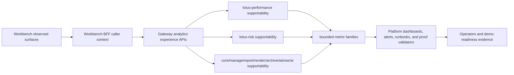

# Analytics UI Observability

This page summarizes the current RFC-0108 implementation-backed analytics UI observability posture
for operators, demo preparation, and engineering handoff. Deep technical truth remains in
[`rfcs/RFC-0108-front-office-analytics-ui-observability-and-operational-posture.md`](../rfcs/RFC-0108-front-office-analytics-ui-observability-and-operational-posture.md),
the platform contracts under [`context/contracts/`](../context/contracts/), and the
[Analytics UI Observability Runbook](../docs/operations/analytics-ui-observability-runbook.md).

## Current Supported Scope

| Layer | Implementation-backed status | Primary evidence |
| --- | --- | --- |
| Workbench browser and BFF | Supported Portfolio, Intake, Performance, Risk, reporting operator, archive metadata, legacy advisor Workbench, and Data Products reads emit bounded panel, hydration, API, attention, and supportability posture where implemented. | Workbench PRs #118 through #129, canonical proof for `PB_SG_GLOBAL_BAL_001`, and the governed Workbench runtime flow. |
| Gateway | Selected analytics fan-out paths, protected diagnostics, performance/risk source supportability, portfolio readiness, manage action-register, report evidence-surface, AI advisor-brief, advisory supportability, and advisor-brief caller-context/audit proof are preserved with bounded labels and no sensitive payload fields. | Gateway PRs #166 through #172, Gateway PRs #176 and #177, and protected diagnostics OpenAPI evidence. |
| Performance backend | TWR, MWR, contribution, and attribution supportability emit bounded source-owned supportability state; the RFC-0108 backend freshness metric is implemented; capability publication remains enabled when any implemented performance supportability operation is enabled. | lotus-performance PRs #138, #139, and #140. |
| Risk backend | Risk calculate, drawdown, rolling metrics, historical attribution, and concentration supportability emit bounded source-owned supportability state and the RFC-0108 backend freshness metric. | lotus-risk PRs #107 and #108. |
| Platform observability | Dashboard, alert rules, runbook anchors, ecosystem proof, hardening certification, final closure, and wiki publication requirements are machine-reviewed. | `analytics-ui-observability-contract.json`, ecosystem completion/proof/hardening/final-closure contracts, and platform validators. |

## Runtime Flow

## Residual Boundary

RFC-0108 is closed for current implementation-backed claims, not for every possible future
front-office surface. Full RFC-0079 risk/evidence scope and complete Workbench all-supported-surface
promotion remain planned until separately implemented and certified. Do not use
`lotus-platform/platform-stack` as product-surface proof; canonical demo screenshots and populated
front-office validation must use the governed `lotus-workbench` runtime.

The caller-context entitlement certification contract now records implementation evidence for the
certified Workbench read paths. Gateway PR #159 proves bounded selected analytics read allow/deny
audit records for performance and risk summary paths; Workbench PR #131 proves BFF caller-context
defaults; Gateway PR #174 proves performance-summary caller-context enforcement, PR #175 proves
risk-summary caller-context enforcement, PR #176 proves advisor-brief caller-context rejection on
read and review-action routes, and PR #177 proves bounded advisor-brief read allow/deny audit
records. The overall certification feature remains planned until every certified read path has
Gateway, Core, and Workbench allow, deny, caller-context, and permission-blocked UI proof.

## Operator Use

Use this page to orient the current supported observability posture, then move to:

- [Operations Runbook](Operations-Runbook) for alert triage and caller-context certification rules.
- [RFC Index](RFC-Index) for RFC ordering, residual boundaries, and linked implementation history.
- [Validation and CI](Validation-and-CI) for platform check lanes and wiki publication gates.
