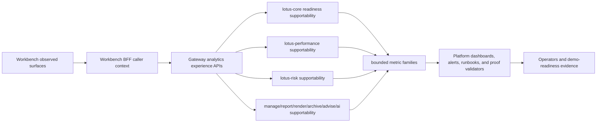
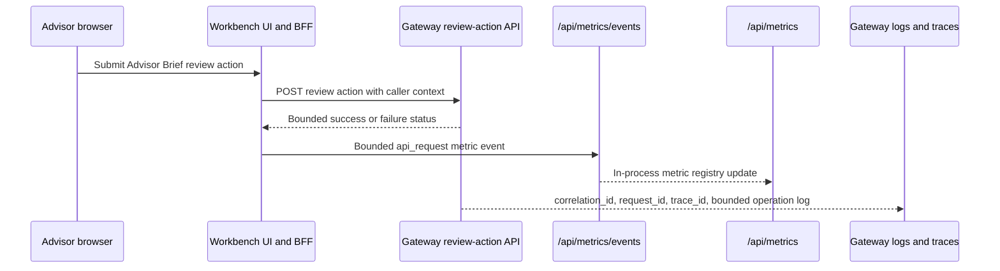

# Analytics UI Observability

This page summarizes the current RFC-0108 implementation-backed analytics UI observability posture
for operators, demo preparation, and engineering handoff. Deep technical truth remains in
[`rfcs/RFC-0108-front-office-analytics-ui-observability-and-operational-posture.md`](../rfcs/RFC-0108-front-office-analytics-ui-observability-and-operational-posture.md),
the platform contracts under [`context/contracts/`](../context/contracts/), and the
[Analytics UI Observability Runbook](../docs/operations/analytics-ui-observability-runbook.md).

## Current Supported Scope

| Layer | Implementation-backed status | Primary evidence |
| --- | --- | --- |
| Workbench browser and BFF | Supported Portfolio, Intake, Performance, Risk, reporting operator, archive metadata, legacy advisor Workbench, and Data Products reads emit bounded panel, hydration, API, attention, and supportability posture where implemented. | Workbench PRs #118 through #129, canonical proof for `PB_SG_GLOBAL_BAL_001`, and the governed Workbench runtime flow. |
| Gateway | Selected analytics fan-out paths, protected diagnostics, performance/risk source supportability, portfolio readiness, manage action-register, report evidence-surface, AI advisor-brief, advisory supportability, and advisor-brief caller-context/audit proof are preserved with bounded labels and no sensitive payload fields. | Gateway PRs #166 through #172, Gateway PRs #176 and #177, and protected diagnostics OpenAPI evidence. |
| Core portfolio readiness | Portfolio readiness exposes source-owned supportability posture and explicit metric-label truth. The `lotus_core_portfolio_supportability_total` metric is bounded to `state`, `reason`, and `freshness_bucket`; portfolio, client, correlation, trace, security, request-body, and response-body values are proven absent from metric labels. | lotus-core PR #329, Gateway PR #167, Workbench PR #120, and published core wiki source. |
| Performance backend | TWR, MWR, contribution, and attribution supportability emit bounded source-owned supportability state; the RFC-0108 backend freshness metric is implemented; capability publication remains enabled when any implemented performance supportability operation is enabled; responses publish explicit `metric_labels`, and Prometheus proof rejects sensitive identifiers or payload fields as labels. | lotus-performance PRs #138, #139, #140, and #141. |
| Risk backend | Risk calculate, drawdown, rolling metrics, historical attribution, and concentration supportability emit bounded source-owned supportability state, explicit `metric_labels`, no-sensitive Prometheus label proof, and the RFC-0108 backend freshness metric. | lotus-risk PRs #107, #108, and #109. |
| Advisory backend | Advisory capability supportability emits source-owned supportability state, explicit `supportability.metric_labels`, and no-sensitive Prometheus label proof for `lotus_advise_advisory_supportability_total`. | lotus-advise PR #109, Gateway PR #172, and Workbench PR #125. |
| AI surface supportability | Advisor brief, TWR inspection support brief, and workspace rationale AI surface supportability is source-backed by workflow-pack runtime, provider operations, and safety runtime; bounded `supportability_reason` and explicit `metric_labels` proof prevent sensitive diagnostics from becoming operator telemetry. | lotus-ai PR #57, Gateway PR #170, and Workbench PR #123. |
| Platform observability | Dashboard, alert rules, runbook anchors, ecosystem proof, hardening certification, final closure, and wiki publication requirements are machine-reviewed. | `analytics-ui-observability-contract.json`, ecosystem completion/proof/hardening/final-closure contracts, and platform validators. |

## Runtime Flow

## Advisor Brief Review Action Observability

Workbench PR #134 adds implementation-backed observability for the Advisor Brief review-action
mutation. The browser still sends the mutation through the Workbench BFF and Gateway; Workbench
records the mutation as the bounded `performance-advisor-brief-review-action` observed surface with
operation `performance.workspace.advisor-brief.review-action`. Browser-originated metric events are
accepted only by the same-origin Workbench `/api/metrics/events` route and are exported through
`/api/metrics`.

The proof excludes portfolio, client, advisor, correlation, free-form reason, request-body, and
response-body values from metric labels. Mutation failures are surfaced through bounded Workbench
API errors instead of raw Gateway response bodies. Workbench PR #136 then hardened the
mutation-observation boundary: state-changing Workbench actions record API request and panel-state
evidence but do not increment panel hydration metrics. Live proof against the rebuilt canonical
Workbench stack returned `reviewActionStatus=200`, `reviewActionLineCount=11`,
`hydrationReviewActionLineCount=0`, `hasApiRequestMetric=true`, `hasPanelStateMetric=true`, and
`leakedForbidden=[]`. The Workbench wiki source was published for that boundary as commit
`2864f2c`.

Operator rule: use `lotus_workbench_panel_hydration_duration_seconds` for route and panel load
latency only. Use `lotus_workbench_api_request_duration_seconds` and
`lotus_workbench_panel_state_total` when investigating Advisor Brief review actions or other
state-changing Workbench commands.

## Portfolio Readiness Metric Labels

`lotus-core` PR #329 hardens portfolio readiness supportability as an implementation-backed source
contract instead of only a narrative operator claim. The readiness DTO publishes `metric_labels`,
and the Prometheus metric uses the same shared label tuple:

| Metric | Allowed labels | Forbidden label classes |
| --- | --- | --- |
| `lotus_core_portfolio_supportability_total` | `state`, `reason`, `freshness_bucket` | portfolio/account/client identifiers, correlation or trace identifiers, transaction/security identifiers, request bodies, and response bodies |

The proof is source-level and runtime-shaped: unit tests inspect the real Prometheus exposition and
assert that only the bounded labels are emitted, integration tests assert the readiness API carries
`metric_labels`, and OpenAPI tests assert that callers can see the label contract. The core wiki now
documents the feature state, upstream/downstream integration flow, supportability runbook posture,
and operator/business interpretation for portfolio readiness.

## Risk Supportability Metric Labels

`lotus-risk` PR #109 applies the same implementation-backed pattern to the risk analytics family.
Risk responses publish `metadata.calculation_supportability.metric_labels`, and the two Prometheus
metric families use shared bounded label tuples:

| Metric | Allowed labels | Forbidden label classes |
| --- | --- | --- |
| `lotus_risk_calculation_supportability_total` | `operation`, `supportability_state`, `reason`, `freshness_bucket` | portfolio/account/client identifiers, correlation or trace identifiers, transaction/security identifiers, request bodies, and response bodies |
| `lotus_analytics_freshness_bucket_total` | `service`, `operation`, `freshness_bucket`, `supportability_state` | portfolio/account/client identifiers, correlation or trace identifiers, transaction/security identifiers, request bodies, and response bodies |

The proof inspects real Prometheus exposition, asserts the API/OpenAPI label contract, regenerates
the risk API vocabulary, and publishes the risk wiki runbook with the operator flow from endpoint
supportability metadata through Gateway source supportability, dashboards, alerts, and Workbench
risk panel state.

## Advisory Supportability Metric Labels

`lotus-advise` PR #109 applies the same source-contract pattern to advisory supportability.
`GET /platform/capabilities` publishes `supportability.metric_labels`, and the Prometheus metric
uses the same shared bounded label tuple:

| Metric | Allowed labels | Forbidden label classes |
| --- | --- | --- |
| `lotus_advise_advisory_supportability_total` | `state`, `reason`, `freshness_bucket` | portfolio/account/client/advisor identifiers, proposal/workspace identifiers, correlation/request/trace identifiers, transaction/security identifiers, request bodies, and response bodies |

The proof inspects real Prometheus exposition, asserts the API/OpenAPI label contract, regenerates
the advisory API vocabulary, and publishes the advise wiki API surface and operations runbook. This
keeps Gateway and Workbench advisory supportability reconciliation grounded in source-owned
advisory runtime posture rather than stale manage/DPM proposal assumptions.

## Gateway Proposal And Manage Boundary

Gateway PR #179 hardens the downstream ownership boundary between advisory workflows and
portfolio-management operations.

| Downstream | Gateway currently calls | Boundary |
| --- | --- | --- |
| `lotus-advise` | `POST /advisory/proposals/simulate`, `POST /advisory/proposals`, `GET /advisory/proposals`, proposal detail, version, transition, approval, workflow-event, and lineage paths under `/advisory/proposals*` | Proposal simulation, creation, listing, detail, versioning, workflow, approval, and lineage are advisory concerns. |
| `lotus-manage` | `GET /api/v1/rebalance/runs`, `GET /api/v1/rebalance/supportability/summary`, `GET /api/v1/platform/capabilities` | Gateway uses manage only for strategic run lookup, supportability summary, and capability posture until a separately implemented execution use case exists. |

The proof is implementation-backed: `DpmClient` now contains only strategic manage methods,
proposal methods live on the advise client boundary, Gateway proposal routes and service contracts
describe `lotus-advise`, stale `manage_split_enabled` handling was removed, and regression tests
prove stale manage proposal paths and unversioned `/rebalance/*` calls are not used. Gateway wiki
source was published after the merge as commit `94ca9c7`.

## Gold-Pass Evidence

The 2026-05-01 gold-pass canonical run passed for `PB_SG_GLOBAL_BAL_001` with benchmark
`BMK_PB_GLOBAL_BALANCED_60_40`. The platform evidence bundle is
`output/front-office-qa/canonical-front-office-qa-20260501-140359.json`; the runtime transcript is
`output/front-office-qa/canonical-front-office-qa-20260501-140359.log`; screenshots are under
`output/rfc-0108-gold-pass-transcript-qa/`.

The run proved DNS, Gateway readiness, Workbench portfolio/performance routes, manage/report/
archive/render readiness, integration capabilities, Gateway workspace/capabilities/overview,
performance summary, risk summary, advisor brief, and browser screenshots for seven panels. The
evidence panel is intentionally `truthfully_degraded` because full RFC-0079 evidence scope remains
outside the current implemented RFC-0108 claim.

Canonical QA now writes `output/front-office-qa/latest.log` alongside `latest.json` and
`latest.md`. Use the transcript during demo preparation and production-readiness review to confirm
seed readiness progression, retry warnings, and teardown behavior instead of relying only on the
structured summary.

Critical screenshot review found one product-presentation follow-up: the performance summary driver
content could clip horizontally in the desktop capture. That follow-up is now implementation-backed
by Workbench PR #132, merged at `4285d5c00910e8347f47976a4aec73a45c422724`, with Workbench wiki
publication commit `764f778`. The follow-up hardened the Summary layout, labeled compact Horizon
support values, added truthful partial states for ready-with-empty attribution/contribution detail
contracts, and passed live canonical Workbench validation for `PB_SG_GLOBAL_BAL_001` with refreshed
screenshots under `lotus-workbench/output/rfc-0108-performance-layout-hardening-qa/`.

The certified read-path entitlement gap is now closed for the current RFC-0108 certified paths.
Workbench PR #133, merged at `90a3d54e81a92e6b2bad8584edb25122cf3c2a81`, proves bounded
permission-blocked UI states for performance Summary, Risk Review, and Advisor Brief. The live
proof passed canonical Workbench validation and platform QA on 2026-05-01 with evidence manifest
`output/front-office-qa/canonical-front-office-qa-20260501-155832.md`; Gateway and Performance logs
were inspected for bounded audit/correlation posture. Workbench wiki publication commit `f523dbb`
records the operator-facing permission-blocked analytics proof rules.

## Residual Boundary

RFC-0108 is closed for current implementation-backed claims, not for every possible future
front-office surface. Full RFC-0079 risk/evidence scope and complete Workbench all-supported-surface
promotion remain planned until separately implemented and certified. Do not use
`lotus-platform/platform-stack` as product-surface proof; canonical demo screenshots and populated
front-office validation must use the governed `lotus-workbench` runtime.

The caller-context entitlement certification contract now records implementation evidence for the
current certified Workbench read paths. Gateway PR #159 proves bounded selected analytics
read allow/deny audit records for performance and risk summary paths; Workbench PR #131 proves BFF
caller-context defaults; Gateway PR #174 proves performance-summary caller-context enforcement,
PR #175 proves risk-summary caller-context enforcement, PR #176 proves advisor-brief caller-context
rejection on read and review-action routes, PR #177 proves bounded advisor-brief read allow/deny
audit records, and Workbench PR #133 proves permission-blocked UI behavior. Future new certified
read paths must provide the same implementation-backed proof before promotion.

## Operator Use

Use this page to orient the current supported observability posture, then move to:

- [Operations Runbook](Operations-Runbook) for alert triage and caller-context certification rules.
- [RFC Index](RFC-Index) for RFC ordering, residual boundaries, and linked implementation history.
- [Validation and CI](Validation-and-CI) for platform check lanes and wiki publication gates.
