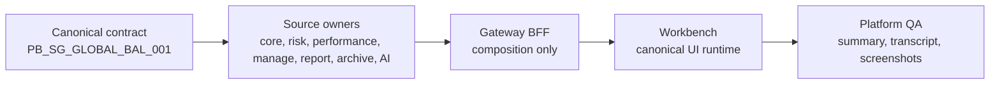

# Canonical DPM Demo Story

This page is the audience-ready entry point for the current implementation-backed discretionary
portfolio management demo. Deep technical details live in
`docs/demo/canonical-dpm-demo-story.md`; this wiki page keeps the demo story easy to use for
business, operations, engineering, sales, pre-sales, and client-facing preparation.

## What The Demo Proves

| Area | Implementation-backed proof |
| --- | --- |
| Canonical portfolio | `PB_SG_GLOBAL_BAL_001`, Singapore booking center, USD reference currency, global balanced mandate, and benchmark `BMK_PB_GLOBAL_BALANCED_60_40` are governed by the canonical demo-data contract. |
| DPM command center | The platform seed persists the canonical mandate, runs monitoring, validates Manage and Gateway reads, and Workbench renders `dpm.command_center`. |
| Portfolio memory | Workbench renders Gateway/manage timeline truth for `dpm.portfolio_memory`; report and AI source-event families are recorded only where owning apps implemented them. |
| Proof packs and waves | Workbench renders Gateway/manage truth for `dpm.proof_pack` and `dpm.wave_command_center` without local proof-pack construction, hash generation, or wave readiness calculation. RFC-0041 live validation includes the governed `RFC41_MULTI_PORTFOLIO_EXPLICIT_LIST_CANONICAL` multi-portfolio explicit-list preview and the source-backed campaign candidate review over `lotus-core:DpmPortfolioUniverseCandidate:v1`, including source-owned selection-basis evidence from the canonical contract. |
| Outcome review | `dpm.outcome_review` product support, report materialization, archive lifecycle, and governed AI narrative request posture are implemented for first-wave scope. |
| Analytics | Performance and risk panels render from owning analytics services through Gateway and Workbench. |
| Runtime evidence | Demo screenshots are governed by canonical API, calculation, panel, and browser validation; pre-validation captures must be diagnostic only. |

## Demo Flow



## Talk Track

1. Start with the portfolio and mandate identity: one governed canonical book, not a UI-only mock.
2. Show the command center as the operating cockpit: health, source readiness, attention queue, and
   supportability are explicit.
3. Move to portfolio memory: the decision trail is source-backed and does not fabricate downstream
   events that have no owner.
4. Show proof packs and waves as governed action evidence, including report and AI posture where
   those owning services have implemented support.
5. Close with outcome review: expected-versus-realized evidence is now part of the first-wave
   front-office loop.
6. State the current boundaries clearly: no external OMS execution, PM scoring,
   client-communication source-event lineage, or autonomous AI decisioning is claimed.

## Preparation Command

```powershell
powershell -ExecutionPolicy Bypass -File automation\Invoke-Canonical-FrontOffice-QA.ps1 -BringUp -LotusAiEnvFile .env.example -SeedWaitSeconds 1200
```

Use `-ScreenshotDirectory <path>` for a caller-directed screenshot pack. Use demo-ready screenshots
only after validation passes.

## Audience Use

| Audience | Use this page for |
| --- | --- |
| Business users | Understanding the current DPM operating flow and where supportability is visible. |
| Operations | Preparing validated evidence, locating QA output, and explaining degraded or empty states. |
| Engineering | Finding contracts, panel registry truth, automation, and owner boundaries. |
| Sales and pre-sales | Explaining implementation-backed value without overclaiming target-state features. |
| Client demos | Showing a governed, evidence-backed product story tied to the canonical portfolio. |

## Do Not Claim Yet

- external OMS execution or acknowledgements
- PM quality scoring or behavioral analytics
- client-communication source-event lineage
- degraded or blocked command-center seed fixtures
- raw prompt, generated AI output, or source payload exposure
- local Workbench recomputation of source-owned facts

## Source Of Truth

- [Deep demo story](../docs/demo/canonical-dpm-demo-story.md)
- [Canonical demo-data contract](../context/contracts/canonical-front-office-demo-data-contract.json)
- [Canonical invariants contract](../context/contracts/canonical-front-office-demo-data-invariants.json)
- [Workbench panel registry](../context/contracts/workbench-panel-registry.json)
- [Platform QA wrapper](../automation/Invoke-Canonical-FrontOffice-QA.ps1)
