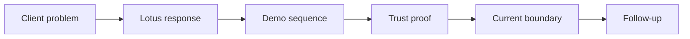

# Client Demo Brief Template

Use this page when turning Lotus implementation evidence into a client-facing one-page brief. The
brief should explain what Lotus is doing in business language while preserving proof anchors for
engineering, operations, security, sales, and pre-sales follow-up.

## Brief Flow

## One-Page Structure

| Section | What the client should understand |
| --- | --- |
| Client problem | The private-banking workflow, decision challenge, control weakness, or operational friction. |
| Lotus response | The current Lotus capability in business language. |
| What they will see | The exact screens, workflows, reports, dashboards, or evidence packs. |
| Why it is trustworthy | Owning apps, deterministic data, validation command, run ID, and evidence pack. |
| Current boundary | What is implementation-backed, bounded preview, planned, diagnostic only, or unsupported. |
| Follow-up path | Named owners for commercial, product, engineering, operations, security, and marketing questions. |

## Client-Safe Explanation

> Lotus connects private-banking workflows across portfolio data, mandate oversight, performance,
> risk, advisory review, reporting, archive, and governed AI assistance. Each capability keeps its
> domain facts with the owning service, publishes evidence for supported claims, and presents the
> workflow through a governed Workbench and Gateway. The demo shows the business workflow, the
> implementation evidence behind it, and the current boundaries without hiding lineage, controls, or
> supportability posture.

## Required Controls

| Control | Required posture |
| --- | --- |
| Claim discipline | Every claim is classified before the pack is client-ready. |
| Evidence tie-out | Implementation-backed claims link to owner, command, run ID, and proof artifact. |
| Data safety | No real client data, secrets, raw payloads, raw prompts, or sensitive identifiers. |
| Runtime proof | Screenshots and live proof are captured only after validation passes. |
| Boundary visibility | Preview, roadmap, diagnostic-only, and unsupported items are visible. |

## Source Of Truth

- [Full client demo brief template](../docs/demo/client-demo-brief-template.md)
- [Client Demo Pack Template](Client-Demo-Pack-Template)
- [Full client demo pack template](../docs/demo/client-demo-pack-template.md)
- [Client Demo Operating Process](Client-Demo-Operating-Process)
- [Client Demo Certification](Client-Demo-Certification)
- [Lotus Client Demo Certification Standard](../docs/standards/Lotus%20Client%20Demo%20Certification%20Standard.md)
- [Canonical DPM Demo Story](Canonical-DPM-Demo-Story)
