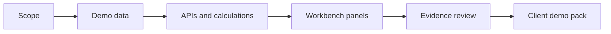

# Client Demo Certification

Lotus demos must show real, implementation-backed product capability. A demo is not certified
because a screenshot exists; it is certified when the story, data, APIs, calculations, UI panels,
observability, and evidence have all been validated.

## Demo Claim States

| State | Meaning | Client-demo handling |
| --- | --- | --- |
| Implementation-backed | Code, tests, runtime proof, docs, and evidence exist. | Can be shown as current capability. |
| Bounded preview | Real implementation exists with explicit scope limits. | Can be shown with boundaries. |
| Diagnostic | Captured to investigate an issue. | Keep out of client packs. |
| Planned | RFC, roadmap, scaffold, or design exists without runtime proof. | Mention only as roadmap. |
| Unsupported | No governed implementation or owner. | Do not claim. |

## Certification Flow



## What A Demo Pack Must Include

- audience and objective
- story sequence
- implementation-backed claims
- current boundaries and "do not claim" list
- validation command and run id
- evidence manifest or output path
- screenshot pack location
- owner and escalation contact for each critical surface

## Client-Ready Acceptance

Before a demo pack can be used externally, confirm:

| Acceptance item | Required posture |
| --- | --- |
| Story clarity | A non-technical client can understand the workflow, value, controls, and current boundary. |
| Claim discipline | Every claim has a certification state and owner. |
| Evidence tie-out | Implementation-backed claims link to the owning app, command, run ID, and evidence artifact. |
| Data safety | The pack uses only synthetic or approved demo data and excludes sensitive material. |
| Runtime proof | Screenshots or live proof were captured only after relevant validation passed. |
| Follow-up ownership | Product, engineering, operations, security, commercial, and marketing owners are named. |

## Canonical Front-Office Demo

The governed front-office demo is anchored on `PB_SG_GLOBAL_BAL_001`, the canonical demo-data
contract, canonical invariants, the Workbench panel registry, and the platform QA wrapper.

Demo-ready screenshots are valid only after canonical API, calculation, panel, and browser
validation pass. Pre-validation screenshots are diagnostic only.

## Commands

```powershell
powershell -ExecutionPolicy Bypass -File automation\Invoke-Canonical-FrontOffice-QA.ps1 -BringUp -LotusAiEnvFile .env.example -SeedWaitSeconds 1200
powershell -ExecutionPolicy Bypass -File automation\Invoke-PlatformDemoReadinessCertification.ps1 -ScenarioMode fresh_seed
```

## Source Of Truth

- [Lotus Client Demo Certification Standard](../docs/standards/Lotus%20Client%20Demo%20Certification%20Standard.md)
- [Client Demo Operating Process](Client-Demo-Operating-Process)
- [Lotus Client Demo Operating Process](../docs/demo/client-demo-operating-process.md)
- [Canonical DPM Demo Story](Canonical-DPM-Demo-Story)
- [Canonical demo-data contract](../context/contracts/canonical-front-office-demo-data-contract.json)
- [Canonical invariants contract](../context/contracts/canonical-front-office-demo-data-invariants.json)
- [Workbench panel registry](../context/contracts/workbench-panel-registry.json)
