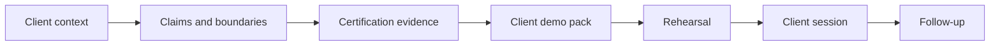

# Client Demo Operating Process

Lotus client demos must be understandable to clients and backed by implementation evidence. This
page summarizes the platform process for preparing, rehearsing, delivering, and following up on
client-facing demonstrations.

## Operating Model



## What Clients Should Understand

| Topic | Client-facing explanation |
| --- | --- |
| Product role | Lotus is a governed private-banking operating layer across portfolio data, advisory, risk, performance, reporting, archive, and AI-assisted workflow. |
| Source authority | Domain facts stay with the owning Lotus application and are not recomputed by the UI. |
| Evidence | Demo claims are tied to data contracts, APIs, calculations, screenshots, supported-feature truth, logs, and run IDs. |
| Boundaries | Preview, roadmap, diagnostic, and unsupported items are separated from current capability. |
| Supportability | Runtime evidence includes health, observability, degraded-state posture, and escalation ownership where relevant. |

## Demo Preparation Checklist

1. Identify the audience, buying question, use case, and sensitivity level.
2. Classify every claim as implementation-backed, bounded preview, planned, diagnostic, or unsupported.
3. Run the relevant certification command and review evidence before preparing screenshots.
4. Create a concise demo pack with story, sequence, claims, boundaries, evidence, and follow-up owners.
5. Rehearse the talk track, evidence links, fallback plan, and Q&A ownership.
6. Use only validated screenshots or live runtime proof in the client pack.
7. Track defects, weak proof, or follow-up questions as durable issues or RFC work.

## Demo Pack Contents

Use [Client Demo Pack Template](Client-Demo-Pack-Template) as the full pack structure. The pack
keeps the client story, claims, boundaries, evidence, rehearsal posture, and follow-up ownership in
one governed artifact.

| Section | What it provides |
| --- | --- |
| Audience and objective | Why this demo exists and what decision it supports. |
| Business story | The private-banking workflow in client language. |
| Demo sequence | The ordered screens, APIs, reports, and workflows. |
| Claim table | Current capability, owner, support state, and evidence anchor. |
| Boundaries | What is roadmap, preview, diagnostic only, or unsupported. |
| Evidence manifest | Command, run ID, screenshot pack, contracts, and proof files. |
| Follow-up | Questions, owners, and next actions. |

## One-Page Client Brief

Every external demo pack should start with a short client-facing brief:

Use [Client Demo Brief Template](Client-Demo-Brief-Template) as the reusable wiki entry point for
the one-page client brief. It translates implementation evidence into business language while
preserving owner, command, run ID, evidence, and boundary anchors.

| Brief section | What clients should get |
| --- | --- |
| Client problem | The private-banking workflow, operational friction, control weakness, or decision challenge being addressed. |
| Lotus response | The current Lotus capability in business language. |
| What they will see | The exact screens, reports, workflows, or operating evidence in sequence. |
| Why it is trustworthy | Owning applications, data contract, validation run, and evidence-pack anchor. |
| Current boundary | Preview, roadmap, diagnostic-only, or unsupported items that must not be mistaken for current support. |
| Follow-up path | Owners for commercial, product, engineering, operations, and security questions. |

## Client-Ready Acceptance

Do not mark a pack client-ready until these checks pass:

| Check | Required posture |
| --- | --- |
| Story clarity | A non-technical client can understand what Lotus is doing and why it matters. |
| Claim discipline | Every claim has a certification state and owner. |
| Evidence tie-out | Each supported claim links to a command, run ID, and evidence artifact. |
| Data safety | No real client data, secrets, raw payloads, raw prompts, or sensitive identifiers. |
| Runtime proof | Screenshots or live paths were captured only after validation passed. |
| Boundaries | The pack includes a visible "do not claim" list. |
| Follow-up ownership | Product, engineering, operations, security, commercial, and marketing owners are named. |

## Commands

```powershell
powershell -ExecutionPolicy Bypass -File automation\Invoke-Canonical-FrontOffice-QA.ps1 -BringUp -LotusAiEnvFile .env.example -SeedWaitSeconds 1200
powershell -ExecutionPolicy Bypass -File automation\Invoke-PlatformDemoReadinessCertification.ps1 -ScenarioMode fresh_seed
```

## Source Of Truth

- [Client Demo Pack Template](Client-Demo-Pack-Template)
- [Client Demo Brief Template](Client-Demo-Brief-Template)
- [Client Demo Certification](Client-Demo-Certification)
- [Canonical DPM Demo Story](Canonical-DPM-Demo-Story)
- [Lotus Client Demo Pack Template](https://github.com/sgajbi/lotus-platform/blob/main/docs/demo/client-demo-pack-template.md)
- [Lotus Client Demo Brief Template](https://github.com/sgajbi/lotus-platform/blob/main/docs/demo/client-demo-brief-template.md)
- [Lotus Client Demo Operating Process](https://github.com/sgajbi/lotus-platform/blob/main/docs/demo/client-demo-operating-process.md)
- [Lotus Client Demo Certification Standard](https://github.com/sgajbi/lotus-platform/blob/main/docs/standards/Lotus%20Client%20Demo%20Certification%20Standard.md)
- [Canonical demo-data contract](https://github.com/sgajbi/lotus-platform/blob/main/context/contracts/canonical-front-office-demo-data-contract.json)
- [Workbench panel registry](https://github.com/sgajbi/lotus-platform/blob/main/context/contracts/workbench-panel-registry.json)
