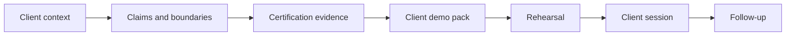

# Client Demo Operating Process

Lotus client demos must be understandable to clients and backed by implementation evidence. This
page summarizes the platform process for preparing, rehearsing, delivering, and following up on
client-facing demonstrations.

## Operating Model



## What Clients Should Understand

| Topic | Client-facing explanation |
| --- | --- |
| Product role | Lotus is a governed private-banking operating layer across portfolio data, advisory, risk, performance, reporting, archive, and AI-assisted workflow. |
| Source authority | Domain facts stay with the owning Lotus application and are not recomputed by the UI. |
| Evidence | Demo claims are tied to data contracts, APIs, calculations, screenshots, supported-feature truth, logs, and run IDs. |
| Boundaries | Preview, roadmap, diagnostic, and unsupported items are separated from current capability. |
| Supportability | Runtime evidence includes health, observability, degraded-state posture, and escalation ownership where relevant. |

## Demo Preparation Checklist

1. Identify the audience, buying question, use case, and sensitivity level.
2. Classify every claim as implementation-backed, bounded preview, planned, diagnostic, or unsupported.
3. Run the relevant certification command and review evidence before preparing screenshots.
4. Create a concise demo pack with story, sequence, claims, boundaries, evidence, and follow-up owners.
5. Rehearse the talk track, evidence links, fallback plan, and Q&A ownership.
6. Use only validated screenshots or live runtime proof in the client pack.
7. Track defects, weak proof, or follow-up questions as durable issues or RFC work.

## Demo Pack Contents

| Section | What it provides |
| --- | --- |
| Audience and objective | Why this demo exists and what decision it supports. |
| Business story | The private-banking workflow in client language. |
| Demo sequence | The ordered screens, APIs, reports, and workflows. |
| Claim table | Current capability, owner, support state, and evidence anchor. |
| Boundaries | What is roadmap, preview, diagnostic only, or unsupported. |
| Evidence manifest | Command, run ID, screenshot pack, contracts, and proof files. |
| Follow-up | Questions, owners, and next actions. |

## Commands

```powershell
powershell -ExecutionPolicy Bypass -File automation\Invoke-Canonical-FrontOffice-QA.ps1 -BringUp -LotusAiEnvFile .env.example -SeedWaitSeconds 1200
powershell -ExecutionPolicy Bypass -File automation\Invoke-PlatformDemoReadinessCertification.ps1 -ScenarioMode fresh_seed
```

## Source Of Truth

- [Client Demo Certification](Client-Demo-Certification)
- [Canonical DPM Demo Story](Canonical-DPM-Demo-Story)
- [Lotus Client Demo Operating Process](../docs/demo/client-demo-operating-process.md)
- [Lotus Client Demo Certification Standard](../docs/standards/Lotus%20Client%20Demo%20Certification%20Standard.md)
- [Canonical demo-data contract](../context/contracts/canonical-front-office-demo-data-contract.json)
- [Workbench panel registry](../context/contracts/workbench-panel-registry.json)
