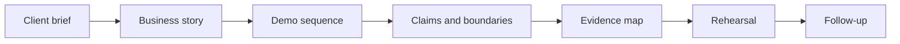

# Client Demo Pack Template

Use this page when preparing a full Lotus client-demo pack. The pack helps clients understand what
Lotus is doing while preserving implementation evidence, claim boundaries, and follow-up ownership.

## Pack Flow

## What The Pack Explains

| Topic | Client-safe explanation |
| --- | --- |
| What Lotus does | Connects private-banking workflows across portfolio data, mandate oversight, performance, risk, advisory review, reporting, archive, opportunity intelligence, and governed AI assistance. |
| Why it is trustworthy | Demonstrated claims are tied to owning apps, deterministic data, real APIs, calculation checks, supported-feature truth, observability, and reviewed evidence. |
| What remains bounded | Preview, planned, diagnostic-only, and unsupported items are separated from current capability. |
| Who owns follow-up | Commercial, product, engineering, operations, security, and marketing owners are named before the client session. |

## Required Sections

| Section | Purpose |
| --- | --- |
| One-page client brief | Opens the client conversation in business language. |
| Business story | Explains the workflow, decision context, controls, and value. |
| Demo sequence | Lists screens, APIs, workflows, reports, and proof points in order. |
| Claim table | Maps each claim to state, owner, proof anchor, and client wording. |
| Evidence map | Records command, run id, contracts, screenshots, logs, and redaction posture. |
| Boundary register | Makes unsupported autonomy, execution, publication, and source-completeness claims explicit. |
| Rehearsal plan | Confirms talk track, runtime path, fallback path, and Q&A ownership. |
| Follow-up register | Tracks client questions, owners, due dates, and evidence or issue links. |

## Claim Table

| Claim | State | Owner | Proof anchor | Client wording | Do not claim |
| --- | --- | --- | --- | --- | --- |
| Governed DPM portfolio review | Implementation-backed | `lotus-workbench`, `lotus-gateway`, source services | Canonical QA run and screenshot pack | "The review uses governed portfolio, performance, and risk services through Workbench." | Do not imply autonomous trading or external OMS execution. |
| Opportunity explanation | Bounded preview | `lotus-idea`, `lotus-ai` | RFC proof, lineage proof, workflow-pack certification when available | "The explanation layer is evidence-aware and governed." | Do not claim autonomous suitability approval or client-ready publication. |

## Evidence Map

| Evidence family | Required anchor | Client-safe posture |
| --- | --- | --- |
| Scope and claims | Intake, claim table, boundary register | Shareable summary. |
| Demo data | Data contract, seed, invariants | Shareable summary only. |
| API and calculations | Certification command and run id | Redacted evidence anchor. |
| UI evidence | Validated screenshots or browser transcript | Client-safe screenshots only. |
| Observability | Logs, metrics, health, supportability | Internal unless redacted. |
| Security review | Sensitive-content checklist | Shareable pass/fail result only. |

## Client-Ready Exit Criteria

Do not use the pack externally until:

1. every claim has state, owner, proof, and client-safe wording,
2. implementation-backed claims cite a command, run id, and evidence artifact,
3. screenshots and live paths were captured only after validation passed,
4. unsupported claims are visible in the boundary register,
5. the one-page brief is readable by a non-technical client sponsor,
6. sensitive-content review passed,
7. follow-up owners are assigned.

## Source Of Truth

- [Full client demo pack template](../docs/demo/client-demo-pack-template.md)
- [Client Demo Brief Template](Client-Demo-Brief-Template)
- [Client Demo Operating Process](Client-Demo-Operating-Process)
- [Client Demo Certification](Client-Demo-Certification)
- [Lotus Client Demo Certification Standard](../docs/standards/Lotus%20Client%20Demo%20Certification%20Standard.md)
- [Canonical DPM Demo Story](Canonical-DPM-Demo-Story)
