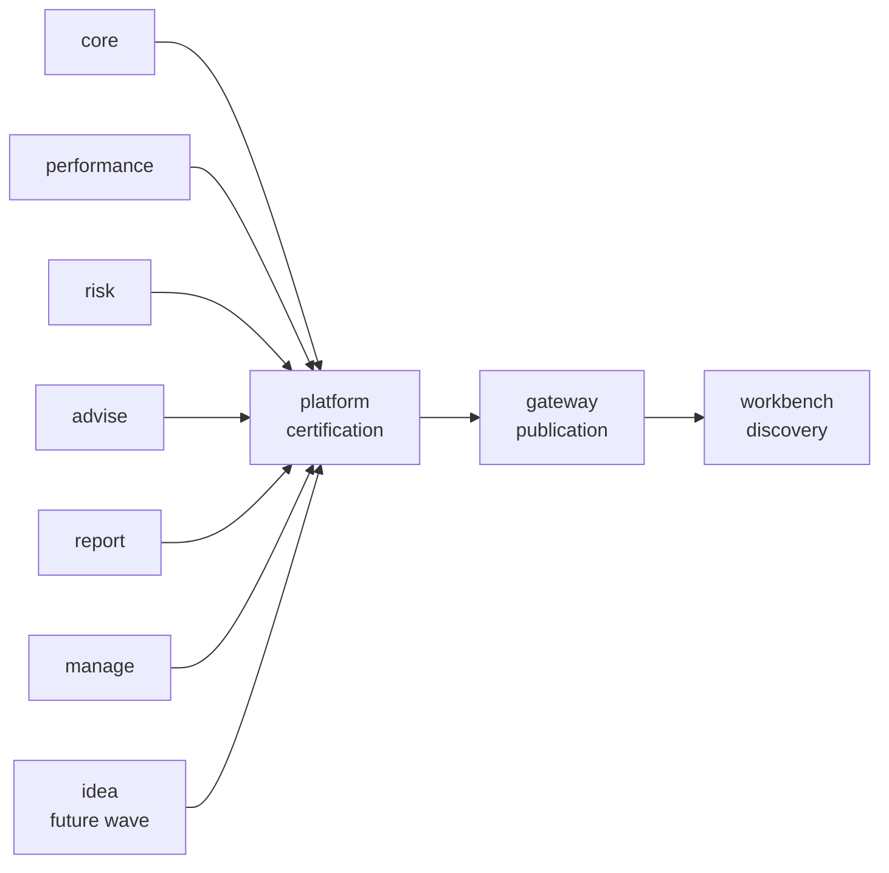

# Data Mesh Standard

Lotus data mesh means domain-owned, platform-certified data products. Product truth stays in the
owning service; `lotus-platform` generates the catalog, dependency graph, trust certification,
maturity matrix, and operating report; `lotus-gateway` publishes read-only discovery APIs; and
`lotus-workbench` presents self-serve discovery through Gateway/BFF.

## What Clients And Operators Can Trust

| Topic | Current standard |
| --- | --- |
| Product ownership | Domain services own product declarations, runtime trust, and supportability evidence. |
| Platform role | The platform certifies and publishes derived evidence; it does not become the product authority. |
| Gateway role | Gateway exposes read-only product discovery and trust APIs from generated artifacts. |
| Workbench role | Workbench shows discovery, lifecycle, dependency, and trust posture through Gateway/BFF. |
| Certification | Catalog inclusion is not certification. Certification requires runtime trust telemetry, policies, Gateway publication, Workbench discovery, evidence packs, and CI proof. |

## Ecosystem Map



## Current Product Wave

| Repository | Mesh posture |
| --- | --- |
| `lotus-core` | First-wave producer plus DPM source-readiness expansion. |
| `lotus-performance` | First-wave performance product producer. |
| `lotus-risk` | First-wave risk product producer. |
| `lotus-advise` | First-wave advisory product producer. |
| `lotus-report` | Enterprise maturity participant for client-report evidence. |
| `lotus-manage` | Enterprise maturity participant for portfolio action register. |
| `lotus-idea` | Catalog-visible future-wave opportunity-intelligence onboarding, not certified. |

## Certification Checklist

- repo-native producer or consumer declaration
- platform source manifest inclusion
- generated catalog and dependency graph freshness
- runtime trust telemetry
- live trust certification
- SLO, access, and evidence policies
- Gateway read-only publication
- Workbench discovery through Gateway/BFF
- supported-feature promotion only after implementation proof
- README, docs, wiki, repo context, and central context updated when truth changes

## Proof Commands

```powershell
python automation/generate_domain_product_discovery.py --check --generated-at-utc 2026-06-24T00:00:00Z
python automation/generate_enterprise_mesh_maturity_matrix.py --check --generated-at-utc 2026-06-24T00:00:00Z
python automation/mesh_certification_gate.py --mode blocking --generated-at-utc 2026-06-24T00:00:00Z --require-sibling-repos
```

## Source Of Truth

- [Lotus Data Mesh Standard](../docs/standards/Lotus%20Data%20Mesh%20Standard.md)
- [Enterprise Mesh Status](Enterprise-Mesh-Status)
- [Mesh Certification Gate Runbook](../docs/operations/mesh-certification-gate-runbook.md)
- [Domain Data Product Contracts](../platform-contracts/domain-data-products/README.md)

